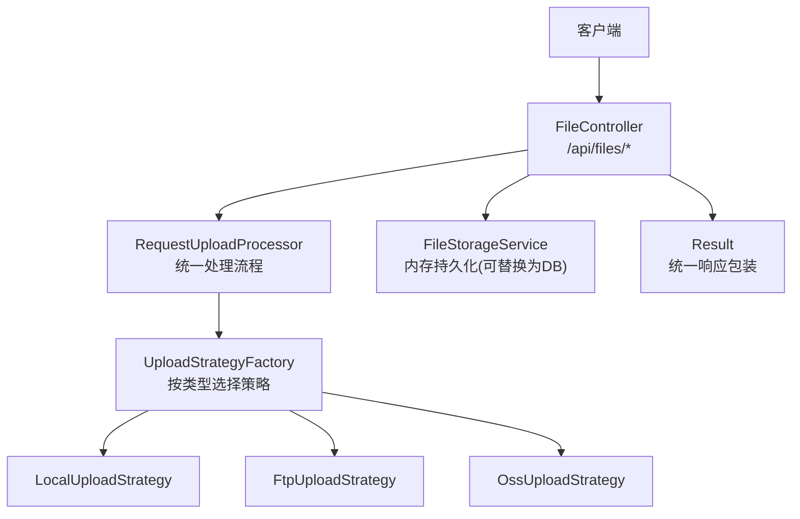
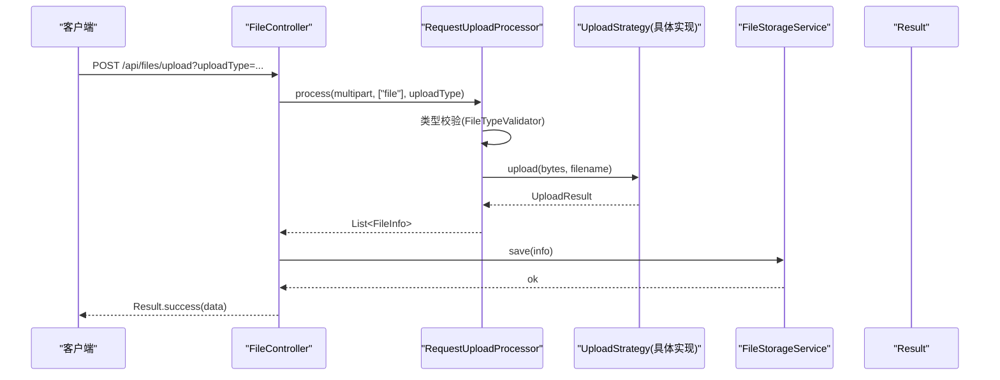
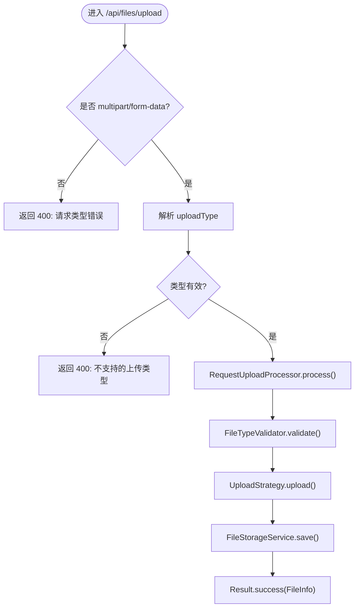
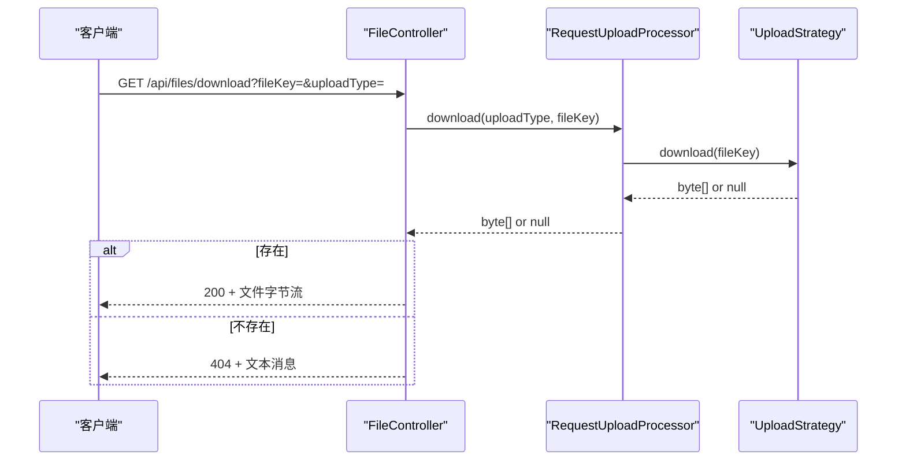
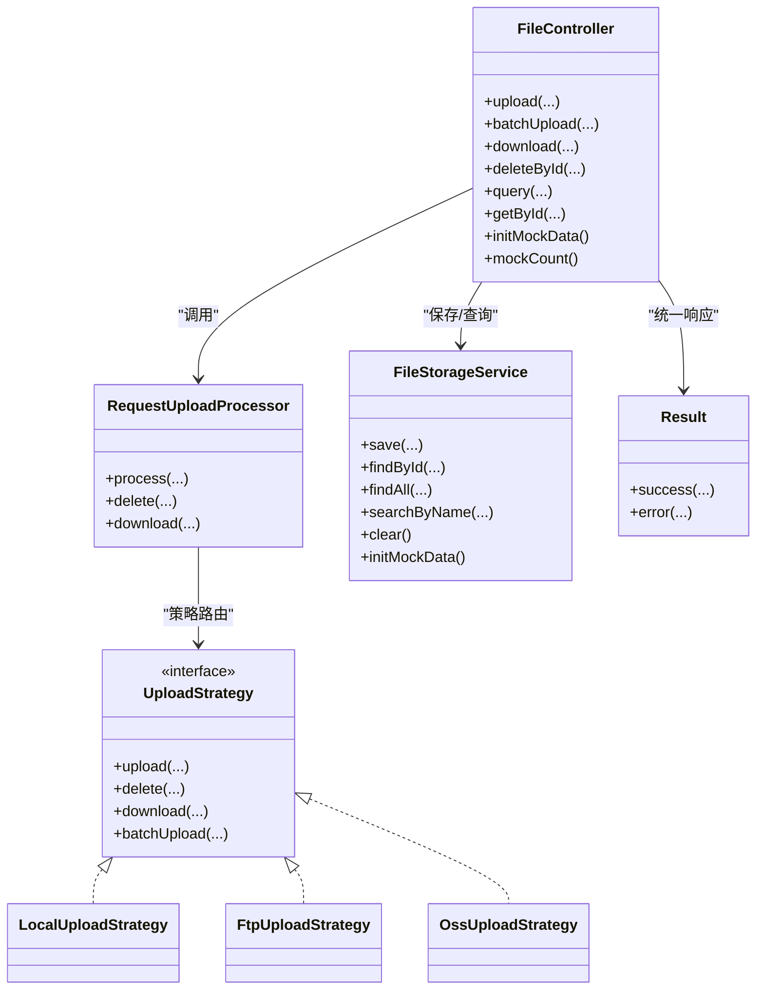

# API接口参考

<cite>
**本文引用的文件**
- [FileController.java](file://src/main/java/com/example/fileupload/controller/FileController.java)
- [Result.java](file://src/main/java/com/example/fileupload/model/Result.java)
- [FileInfo.java](file://src/main/java/com/example/fileupload/model/FileInfo.java)
- [UploadResult.java](file://src/main/java/com/example/fileupload/model/UploadResult.java)
- [RequestUploadProcessor.java](file://src/main/java/com/example/fileupload/service/RequestUploadProcessor.java)
- [FileStorageService.java](file://src/main/java/com/example/fileupload/service/FileStorageService.java)
- [FileTypeValidator.java](file://src/main/java/com/example/fileupload/util/FileTypeValidator.java)
- [UploadType.java](file://src/main/java/com/example/fileupload/enums/UploadType.java)
- [LocalUploadStrategy.java](file://src/main/java/com/example/fileupload/strategy/LocalUploadStrategy.java)
- [FtpUploadStrategy.java](file://src/main/java/com/example/fileupload/strategy/FtpUploadStrategy.java)
- [OssUploadStrategy.java](file://src/main/java/com/example/fileupload/strategy/OssUploadStrategy.java)
- [application.yml](file://src/main/resources/application.yml)
- [pom.xml](file://pom.xml)
</cite>

## 目录
1. [简介](#简介)
2. [项目结构](#项目结构)
3. [核心组件](#核心组件)
4. [架构总览](#架构总览)
5. [详细组件分析](#详细组件分析)
6. [依赖关系分析](#依赖关系分析)
7. [性能与容量](#性能与容量)
8. [故障排查指南](#故障排查指南)
9. [结论](#结论)
10. [附录：API规范与示例](#附录api规范与示例)

## 简介
本参考文档面向SpringBootFileUpload项目的RESTful API，覆盖文件上传（单文件、批量）、下载、删除、查询以及Mock数据初始化等端点。文档包含HTTP方法、URL模式、请求参数、响应格式、错误码、认证机制说明、数据验证规则、错误处理策略、版本管理与向后兼容性说明，并提供客户端集成指南与常见场景调用示例。统一响应包装器Result的使用方式与扩展方法也在文中给出。

## 项目结构
本项目采用分层+策略模式组织：
- Controller层：暴露REST接口，负责参数校验、路由到处理器与服务层。
- Service层：封装业务逻辑（如请求上传统一处理、内存存储）。
- Strategy层：不同存储后端（本地磁盘、FTP、对象存储）的上传/下载/删除实现。
- Model层：统一返回体Result、文件信息模型FileInfo、上传结果模型UploadResult。
- Util层：文件类型校验工具。
- 配置：application.yml定义端口、Multipart大小限制、本地/FTP/OSS连接参数。

图表来源
- [FileController.java:31-33](file://src/main/java/com/example/fileupload/controller/FileController.java#L31-L33)
- [RequestUploadProcessor.java:25-26](file://src/main/java/com/example/fileupload/service/RequestUploadProcessor.java#L25-L26)
- [LocalUploadStrategy.java:26-27](file://src/main/java/com/example/fileupload/strategy/LocalUploadStrategy.java#L26-L27)
- [FtpUploadStrategy.java:36-37](file://src/main/java/com/example/fileupload/strategy/FtpUploadStrategy.java#L36-L37)
- [OssUploadStrategy.java:29-30](file://src/main/java/com/example/fileupload/strategy/OssUploadStrategy.java#L29-L30)
- [FileStorageService.java:19-20](file://src/main/java/com/example/fileupload/service/FileStorageService.java#L19-L20)
- [Result.java:6-10](file://src/main/java/com/example/fileupload/model/Result.java#L6-L10)

章节来源
- [FileController.java:26-48](file://src/main/java/com/example/fileupload/controller/FileController.java#L26-L48)
- [application.yml:1-33](file://src/main/resources/application.yml#L1-L33)

## 核心组件
- FileController：提供所有REST端点，统一使用Result包装响应。
- RequestUploadProcessor：封装“解析multipart → 类型校验 → 策略路由 → 组装FileInfo”的流程。
- UploadStrategy接口及实现：Local/Ftp/Oss三种存储后端的上传/下载/删除能力。
- FileStorageService：内存中的文件元数据存储（支持CRUD、搜索、Mock数据）。
- FileTypeValidator：后缀白名单+魔数校验，防止非法文件类型。
- Result：统一响应体，包含code、message、data。

章节来源
- [FileController.java:50-317](file://src/main/java/com/example/fileupload/controller/FileController.java#L50-L317)
- [RequestUploadProcessor.java:36-152](file://src/main/java/com/example/fileupload/service/RequestUploadProcessor.java#L36-L152)
- [UploadStrategy.java:13-73](file://src/main/java/com/example/fileupload/strategy/UploadStrategy.java#L13-L73)
- [FileStorageService.java:27-107](file://src/main/java/com/example/fileupload/service/FileStorageService.java#L27-L107)
- [FileTypeValidator.java:16-85](file://src/main/java/com/example/fileupload/util/FileTypeValidator.java#L16-L85)
- [Result.java:6-46](file://src/main/java/com/example/fileupload/model/Result.java#L6-L46)

## 架构总览
下图展示了从请求到存储的完整链路，包括策略选择、数据校验、元数据持久化与统一响应。

图表来源
- [FileController.java:58-84](file://src/main/java/com/example/fileupload/controller/FileController.java#L58-L84)
- [RequestUploadProcessor.java:46-87](file://src/main/java/com/example/fileupload/service/RequestUploadProcessor.java#L46-L87)
- [FileTypeValidator.java:47-85](file://src/main/java/com/example/fileupload/util/FileTypeValidator.java#L47-L85)
- [LocalUploadStrategy.java:68-84](file://src/main/java/com/example/fileupload/strategy/LocalUploadStrategy.java#L68-L84)
- [FileStorageService.java:32-39](file://src/main/java/com/example/fileupload/service/FileStorageService.java#L32-L39)
- [Result.java:20-38](file://src/main/java/com/example/fileupload/model/Result.java#L20-L38)

## 详细组件分析

### 控制器端点总览
- 基础路径：/api/files
- 统一响应：Result<T>，字段code/message/data
- 认证：当前未内置认证；可在网关或拦截器层接入JWT/OAuth2
- 版本管理：当前无显式版本前缀；建议通过URL前缀或Header进行版本控制

章节来源
- [FileController.java:31-33](file://src/main/java/com/example/fileupload/controller/FileController.java#L31-L33)
- [Result.java:6-46](file://src/main/java/com/example/fileupload/model/Result.java#L6-L46)

### 上传接口（单文件）
- 方法：POST
- URL：/api/files/upload
- 查询参数：
  - uploadType：必填，枚举值 local/ftp/oss
  - uploadedBy：可选，默认system
- 表单字段：file（MultipartFile）
- 成功响应：Result.success(FileInfo)
- 失败场景：
  - 非multipart/form-data：400
  - 不支持的uploadType：400
  - 文件为空或类型不合法：400
  - 其他异常：500

图表来源
- [FileController.java:58-84](file://src/main/java/com/example/fileupload/controller/FileController.java#L58-L84)
- [RequestUploadProcessor.java:46-87](file://src/main/java/com/example/fileupload/service/RequestUploadProcessor.java#L46-L87)
- [FileTypeValidator.java:47-85](file://src/main/java/com/example/fileupload/util/FileTypeValidator.java#L47-L85)

章节来源
- [FileController.java:58-84](file://src/main/java/com/example/fileupload/controller/FileController.java#L58-L84)
- [FileTypeValidator.java:16-85](file://src/main/java/com/example/fileupload/util/FileTypeValidator.java#L16-L85)

### 批量上传接口（FTP/OSS）
- 方法：POST
- URL：/api/files/upload/batch
- 查询参数：
  - uploadType：必填，枚举值 ftp/oss（local通常走单文件）
  - uploadedBy：可选，默认system
- 表单字段：files（多个MultipartFile）
- 行为：
  - 复用同一连接（FTP）或优化批量写入（OSS）
  - 任一文件失败会抛出异常，整体回滚语义由上层决定
- 成功响应：Result.success(List<FileInfo>)
- 失败场景：
  - 非multipart/form-data：400
  - 未找到有效文件：400
  - 不支持的uploadType：400
  - 底层上传失败：500

章节来源
- [FileController.java:93-133](file://src/main/java/com/example/fileupload/controller/FileController.java#L93-L133)
- [FtpUploadStrategy.java:126-186](file://src/main/java/com/example/fileupload/strategy/FtpUploadStrategy.java#L126-L186)

### 下载接口
- 方法：GET
- URL：/api/files/download
- 查询参数：
  - fileKey：必填，文件唯一标识
  - uploadType：必填，枚举值 local/ftp/oss
- 成功响应：二进制流，Content-Type: application/octet-stream，带附件头
- 失败场景：
  - 文件不存在：404
  - 其他异常：500

图表来源
- [FileController.java:163-194](file://src/main/java/com/example/fileupload/controller/FileController.java#L163-L194)
- [RequestUploadProcessor.java:117-130](file://src/main/java/com/example/fileupload/service/RequestUploadProcessor.java#L117-L130)

章节来源
- [FileController.java:163-194](file://src/main/java/com/example/fileupload/controller/FileController.java#L163-L194)

### 删除接口
- 方法：DELETE
- URL：/api/files/{id}
- 路径参数：id（文件记录主键）
- 查询参数：
  - uploadType：必填，枚举值 local/ftp/oss
- 行为：先删除底层存储，再删除元数据
- 成功响应：Result.success("删除成功")
- 失败场景：
  - 文件不存在：404
  - 底层删除失败：500
  - IO异常：500

章节来源
- [FileController.java:203-227](file://src/main/java/com/example/fileupload/controller/FileController.java#L203-L227)

### 查询接口
- 列表查询
  - 方法：GET
  - URL：/api/files
  - 查询参数：
    - page：默认1
    - size：默认20
    - keyword：可选，模糊匹配文件名
    - storageType：可选，过滤存储类型
    - suffix：可选，过滤后缀
  - 成功响应：Result.success({total, page, size, list})
- 单条查询
  - 方法：GET
  - URL：/api/files/{id}
  - 成功响应：Result.success(FileInfo)
  - 失败：404

章节来源
- [FileController.java:236-292](file://src/main/java/com/example/fileupload/controller/FileController.java#L236-L292)

### Mock数据初始化接口
- 重新初始化Mock数据
  - 方法：POST
  - URL：/api/files/mock/init
  - 响应：Result.success("Mock 数据已重新初始化: N 条记录")
- 查看Mock数量
  - 方法：GET
  - URL：/api/files/mock/count
  - 响应：Result.success(Integer)

章节来源
- [FileController.java:302-317](file://src/main/java/com/example/fileupload/controller/FileController.java#L302-L317)

## 依赖关系分析
- Controller依赖：
  - RequestUploadProcessor：统一处理上传/下载/删除
  - FileStorageService：元数据持久化（内存）
  - UploadStrategyFactory：根据uploadType选择策略
- 策略实现：
  - LocalUploadStrategy：本地磁盘读写、MD5计算
  - FtpUploadStrategy：Apache Commons Net FTPClient，支持批量复用连接
  - OssUploadStrategy：MinIO SDK，自动创建bucket，URL拼接
- 工具：
  - FileTypeValidator：后缀白名单+魔数校验
- 配置：
  - application.yml：端口、Multipart大小、本地/FTP/OSS连接参数

图表来源
- [FileController.java:31-48](file://src/main/java/com/example/fileupload/controller/FileController.java#L31-L48)
- [RequestUploadProcessor.java:25-34](file://src/main/java/com/example/fileupload/service/RequestUploadProcessor.java#L25-L34)
- [UploadStrategy.java:13-73](file://src/main/java/com/example/fileupload/strategy/UploadStrategy.java#L13-L73)
- [LocalUploadStrategy.java:26-27](file://src/main/java/com/example/fileupload/strategy/LocalUploadStrategy.java#L26-L27)
- [FtpUploadStrategy.java:36-37](file://src/main/java/com/example/fileupload/strategy/FtpUploadStrategy.java#L36-L37)
- [OssUploadStrategy.java:29-30](file://src/main/java/com/example/fileupload/strategy/OssUploadStrategy.java#L29-L30)
- [FileStorageService.java:19-20](file://src/main/java/com/example/fileupload/service/FileStorageService.java#L19-L20)
- [Result.java:6-46](file://src/main/java/com/example/fileupload/model/Result.java#L6-L46)

章节来源
- [pom.xml:24-71](file://pom.xml#L24-L71)
- [application.yml:1-33](file://src/main/resources/application.yml#L1-L33)

## 性能与容量
- Multipart限制：最大文件大小与请求大小均为50MB（可通过application.yml调整）
- 本地存储：
  - 文件名去重：UUID_原始文件名，碰撞时追加序号
  - MD5计算：基于文件内容
- FTP：
  - 批量上传复用TCP连接，减少握手开销
  - 被动模式、UTF-8编码、二进制传输，避免乱码与兼容性问题
- 对象存储（MinIO）：
  - 启动时自动创建bucket
  - URL前缀可配置为反向代理地址，便于外部访问
- 内存存储：
  - 使用ConcurrentHashMap，适合演示与轻量场景；生产环境建议替换为数据库

章节来源
- [application.yml:4-10](file://src/main/resources/application.yml#L4-L10)
- [LocalUploadStrategy.java:170-188](file://src/main/java/com/example/fileupload/strategy/LocalUploadStrategy.java#L170-L188)
- [FtpUploadStrategy.java:116-186](file://src/main/java/com/example/fileupload/strategy/FtpUploadStrategy.java#L116-L186)
- [OssUploadStrategy.java:54-70](file://src/main/java/com/example/fileupload/strategy/OssUploadStrategy.java#L54-L70)
- [FileStorageService.java:24-25](file://src/main/java/com/example/fileupload/service/FileStorageService.java#L24-L25)

## 故障排查指南
- 上传失败
  - 检查是否为multipart/form-data
  - 检查uploadType是否合法
  - 检查FileTypeValidator是否放行该后缀与魔数
  - 查看日志中策略实现抛出的异常信息
- 下载失败
  - 确认fileKey与uploadType正确
  - 若返回404，检查底层存储是否存在该文件
- 删除失败
  - 确认文件记录存在
  - 检查底层存储权限与路径
- FTP问题
  - 检查host/port/username/password/basePath配置
  - 关注被动模式与防火墙设置
  - 查看FTP回复码分类的错误提示
- MinIO问题
  - 检查endpoint/access-key/secret-key/bucket-name/url-prefix
  - 确认bucket存在且网络可达

章节来源
- [FileController.java:78-83](file://src/main/java/com/example/fileupload/controller/FileController.java#L78-L83)
- [FileController.java:190-193](file://src/main/java/com/example/fileupload/controller/FileController.java#L190-L193)
- [FileController.java:221-226](file://src/main/java/com/example/fileupload/controller/FileController.java#L221-L226)
- [FtpUploadStrategy.java:206-236](file://src/main/java/com/example/fileupload/strategy/FtpUploadStrategy.java#L206-L236)
- [OssUploadStrategy.java:54-70](file://src/main/java/com/example/fileupload/strategy/OssUploadStrategy.java#L54-L70)

## 结论
本项目提供了完整的文件上传/下载/删除/查询API，并通过策略模式灵活对接多种存储后端。统一响应Result简化了客户端处理。当前未内置认证，建议在网关或拦截器层接入。生产环境建议将内存存储替换为数据库，并完善监控与限流策略。

## 附录：API规范与示例

### 统一响应包装器 Result
- 结构：
  - code：整数状态码（业务层面），例如200表示成功，400/404/500表示错误
  - message：描述信息
  - data：业务数据（可为null）
- 常用方法：
  - success() / success(data) / success(message, data)
  - error(message) / error(code, message)
- 扩展建议：
  - 增加分页对象、traceId、时间戳等通用字段
  - 在拦截器中统一填充traceId与耗时

章节来源
- [Result.java:6-46](file://src/main/java/com/example/fileupload/model/Result.java#L6-L46)

### 认证机制
- 当前未内置认证
- 推荐方案：
  - 网关层鉴权（JWT/OAuth2）
  - Spring Security过滤器链
  - 基于IP白名单或签名校验

[本节为概念性说明，不直接分析具体文件]

### 数据验证规则
- 文件类型：
  - 后缀白名单：图片、文档、压缩包等
  - 魔数校验：读取前若干字节比对真实格式
- 文件大小：
  - 通过spring.servlet.multipart.max-file-size/max-request-size限制
- 参数校验：
  - uploadType必须为枚举值之一
  - 必要参数缺失返回400

章节来源
- [FileTypeValidator.java:16-85](file://src/main/java/com/example/fileupload/util/FileTypeValidator.java#L16-L85)
- [application.yml:4-10](file://src/main/resources/application.yml#L4-L10)
- [UploadType.java:23-33](file://src/main/java/com/example/fileupload/enums/UploadType.java#L23-L33)

### 错误处理策略
- 控制器层捕获异常并转换为Result.error(code, message)
- 常见错误码：
  - 400：参数错误或类型不合法
  - 404：资源不存在
  - 500：服务器内部错误
- 日志：
  - 关键步骤记录INFO/WARN/ERROR日志，便于定位

章节来源
- [FileController.java:78-83](file://src/main/java/com/example/fileupload/controller/FileController.java#L78-L83)
- [FileController.java:190-193](file://src/main/java/com/example/fileupload/controller/FileController.java#L190-L193)
- [FileController.java:221-226](file://src/main/java/com/example/fileupload/controller/FileController.java#L221-L226)

### API版本管理与向后兼容
- 当前无显式版本前缀
- 建议：
  - URL前缀：/api/v1/files
  - Header：X-API-Version
  - 保持Result结构稳定，新增字段向后兼容
  - 废弃字段标记deprecated并保留一段时间

[本节为概念性说明，不直接分析具体文件]

### 客户端集成指南
- 上传（单文件）
  - 方法：POST
  - URL：/api/files/upload
  - Content-Type：multipart/form-data
  - 字段：file
  - 参数：uploadType, uploadedBy（可选）
- 批量上传
  - 方法：POST
  - URL：/api/files/upload/batch
  - 字段：files（多文件）
  - 参数：uploadType, uploadedBy（可选）
- 下载
  - 方法：GET
  - URL：/api/files/download
  - 参数：fileKey, uploadType
  - 响应：二进制流
- 删除
  - 方法：DELETE
  - URL：/api/files/{id}
  - 参数：uploadType
- 查询
  - 列表：GET /api/files?page=&size=&keyword=&storageType=&suffix=
  - 单条：GET /api/files/{id}

章节来源
- [FileController.java:58-317](file://src/main/java/com/example/fileupload/controller/FileController.java#L58-L317)

### 常见使用场景与示例

- 单文件上传（本地）
  - 请求：
    - POST /api/files/upload?uploadType=local&uploadedBy=userA
    - 表单字段：file
  - 成功响应：
    - {code: 200, message: "success", data: FileInfo}
  - 失败响应：
    - {code: 400, message: "请求必须是 multipart/form-data 类型"}
    - {code: 400, message: "不支持的上传类型: xxx"}
    - {code: 400, message: "不允许上传的后缀: .exe，允许的 suffix: ..."}
    - {code: 500, message: "上传失败: ..."}

- 批量上传（FTP）
  - 请求：
    - POST /api/files/upload/batch?uploadType=ftp&uploadedBy=userB
    - 表单字段：files（多个）
  - 成功响应：
    - {code: 200, message: "success", data: [FileInfo, ...]}
  - 失败响应：
    - {code: 400, message: "未找到有效文件"}
    - {code: 500, message: "批量上传失败: ..."}

- 下载文件
  - 请求：
    - GET /api/files/download?fileKey=xxx&uploadType=local
  - 成功响应：
    - 200 + 文件字节流
  - 失败响应：
    - 404 + "File not found: xxx"
    - 500 + "Download failed: ..."

- 删除文件
  - 请求：
    - DELETE /api/files/{id}?uploadType=local
  - 成功响应：
    - {code: 200, message: "success", data: "删除成功"}
  - 失败响应：
    - {code: 404, message: "文件不存在: id"}
    - {code: 500, message: "删除失败: ..."}

- 查询文件列表
  - 请求：
    - GET /api/files?page=1&size=10&keyword=banner&storageType=local&suffix=.png
  - 成功响应：
    - {code: 200, message: "success", data: {total: N, page: 1, size: 10, list: [FileInfo, ...]}}

- 查询单条文件
  - 请求：
    - GET /api/files/{id}
  - 成功响应：
    - {code: 200, message: "success", data: FileInfo}
  - 失败响应：
    - {code: 404, message: "文件不存在: id"}

- Mock数据初始化
  - 请求：
    - POST /api/files/mock/init
  - 响应：
    - {code: 200, message: "success", data: "Mock 数据已重新初始化: N 条记录"}

- Mock数据计数
  - 请求：
    - GET /api/files/mock/count
  - 响应：
    - {code: 200, message: "success", data: Integer}

章节来源
- [FileController.java:58-317](file://src/main/java/com/example/fileupload/controller/FileController.java#L58-L317)
- [Result.java:20-38](file://src/main/java/com/example/fileupload/model/Result.java#L20-L38)

### 配置项说明
- server.port：服务端口
- spring.servlet.multipart.*：Multipart大小限制
- file.upload.base-path：本地存储根路径
- file.ftp.*：FTP主机、端口、用户名、密码、基础路径
- file.oss.*：MinIO endpoint、access-key、secret-key、bucket-name、base-path、url-prefix

章节来源
- [application.yml:1-33](file://src/main/resources/application.yml#L1-L33)