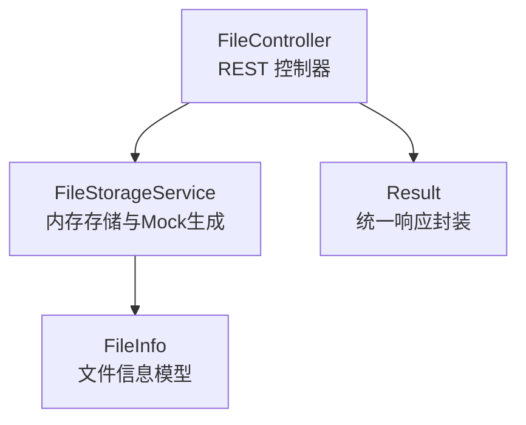
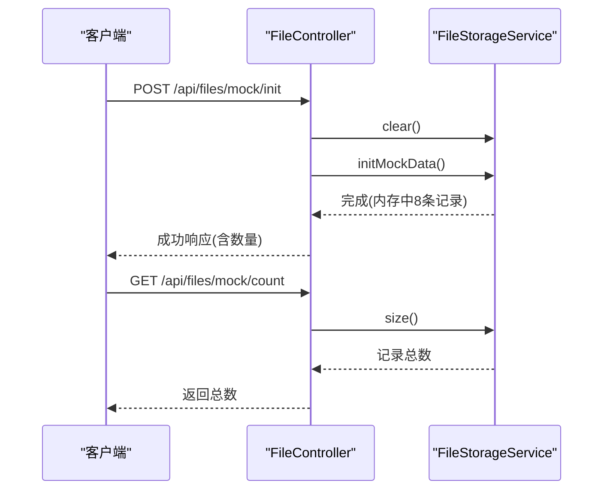
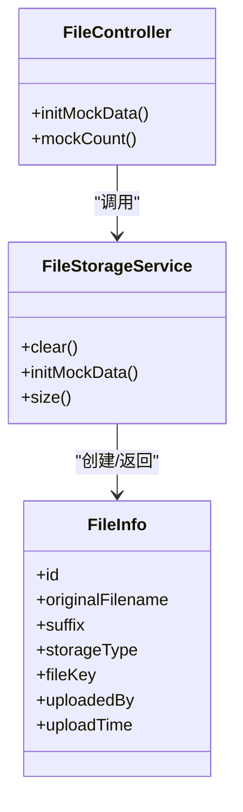

# Mock数据接口

<cite>
**本文引用的文件**
- [FileController.java](file://src/main/java/com/example/fileupload/controller/FileController.java)
- [FileStorageService.java](file://src/main/java/com/example/fileupload/service/FileStorageService.java)
- [FileInfo.java](file://src/main/java/com/example/fileupload/model/FileInfo.java)
- [application.yml](file://src/main/resources/application.yml)
- [pom.xml](file://pom.xml)
- [FileControllerIntegrationTest.java](file://src/test/java/com/example/fileupload/FileControllerIntegrationTest.java)
</cite>

## 目录
1. [简介](#简介)
2. [项目结构](#项目结构)
3. [核心组件](#核心组件)
4. [架构总览](#架构总览)
5. [详细组件分析](#详细组件分析)
6. [依赖关系分析](#依赖关系分析)
7. [性能与容量特性](#性能与容量特性)
8. [故障排查指南](#故障排查指南)
9. [结论](#结论)
10. [附录：API定义与使用示例](#附录api定义与使用示例)

## 简介
本文件为“Mock数据功能”的专用API文档，聚焦开发环境下的快速填充测试数据能力。提供两个端点：
- POST /api/files/mock/init：重新初始化内存中的Mock数据（默认生成8条记录）
- GET /api/files/mock/count：查询当前Mock数据总量

同时说明Mock数据的生成规则、数据结构、配置项（禁用自动初始化）、测试场景用法以及与真实数据的区别与建议。

## 项目结构
该模块基于Spring Boot Web，采用控制器-服务-模型的分层组织。Mock数据由控制器暴露REST接口，服务层在内存中维护并生成样例数据，模型对象承载文件元信息。

图表来源
- [FileController.java:26-33](file://src/main/java/com/example/fileupload/controller/FileController.java#L26-L33)
- [FileStorageService.java:13-20](file://src/main/java/com/example/fileupload/service/FileStorageService.java#L13-L20)
- [FileInfo.java:5-29](file://src/main/java/com/example/fileupload/model/FileInfo.java#L5-L29)

章节来源
- [FileController.java:26-33](file://src/main/java/com/example/fileupload/controller/FileController.java#L26-L33)
- [FileStorageService.java:13-20](file://src/main/java/com/example/fileupload/service/FileStorageService.java#L13-L20)
- [FileInfo.java:5-29](file://src/main/java/com/example/fileupload/model/FileInfo.java#L5-L29)

## 核心组件
- FileController：对外暴露 /api/files 系列接口，包含Mock初始化和计数接口。
- FileStorageService：内存Map存储，提供CRUD、搜索过滤、以及Mock数据初始化逻辑。
- FileInfo：文件元数据载体，包含原始文件名、后缀、大小、MIME类型、存储类型、路径、MD5、上传者、上传时间等字段。
- Result：统一响应包装（用于返回code/data结构）。

章节来源
- [FileController.java:294-318](file://src/main/java/com/example/fileupload/controller/FileController.java#L294-L318)
- [FileStorageService.java:24-107](file://src/main/java/com/example/fileupload/service/FileStorageService.java#L24-L107)
- [FileInfo.java:5-76](file://src/main/java/com/example/fileupload/model/FileInfo.java#L5-L76)

## 架构总览
Mock数据流程：客户端调用POST /api/files/mock/init后，控制器清空并触发服务层的初始化方法；服务层在内存中构造8条不同存储类型和文件类型的样例记录。GET /api/files/mock/count直接返回当前内存记录数。

图表来源
- [FileController.java:294-318](file://src/main/java/com/example/fileupload/controller/FileController.java#L294-L318)
- [FileStorageService.java:109-131](file://src/main/java/com/example/fileupload/service/FileStorageService.java#L109-L131)

## 详细组件分析

### Mock初始化接口 POST /api/files/mock/init
- 作用：清空现有内存数据并重新生成Mock数据（默认8条），便于快速填充测试环境。
- 行为：
  - 调用服务层clear()清空内存
  - 调用服务层initMockData()生成样例数据
  - 返回成功消息，包含当前记录数
- 适用场景：启动后或测试前快速准备数据；CI流水线中作为前置步骤。

章节来源
- [FileController.java:294-307](file://src/main/java/com/example/fileupload/controller/FileController.java#L294-L307)
- [FileStorageService.java:98-131](file://src/main/java/com/example/fileupload/service/FileStorageService.java#L98-L131)

### Mock计数接口 GET /api/files/mock/count
- 作用：返回当前内存中Mock数据总量。
- 行为：直接读取服务层size()并返回。

章节来源
- [FileController.java:309-317](file://src/main/java/com/example/fileupload/controller/FileController.java#L309-L317)
- [FileStorageService.java:105-107](file://src/main/java/com/example/fileupload/service/FileStorageService.java#L105-L107)

### Mock数据生成规则
- 数据量：默认8条记录。
- 覆盖范围：
  - 存储类型：local、ftp、oss 三种均有覆盖
  - 文件类型：pdf、png、jpg、xlsx、docx、zip、bmp 等常见格式
- 字段生成策略：
  - id：随机生成（避免重复）
  - originalFilename/pureFilename/suffix：从文件名解析
  - originalSize/storedSize：随机大小（模拟不同体积）
  - contentType：根据后缀映射MIME类型
  - storageType/fileKey/fullPath/relativePath：按存储类型设置合理路径或标识
  - md5：随机字符串（仅占位）
  - uploadedBy：从预设用户集合中随机选取
  - uploadTime：随机近30天内时间
- 注意：本地存储(fullPath/relativePath)会结合应用配置的base-path进行拼接；其他存储类型仅保留相对路径或标识。

章节来源
- [FileStorageService.java:111-157](file://src/main/java/com/example/fileupload/service/FileStorageService.java#L111-L157)
- [application.yml:12-16](file://src/main/resources/application.yml#L12-L16)

### 数据结构（FileInfo）
- 关键字段：
  - 原始信息：originalFilename、pureFilename、suffix、originalSize、contentType
  - 存储信息：storageType、fileKey、fullPath、relativePath、storedSize、md5
  - 元数据：id、uploadedBy、uploadTime
- 用途：贯穿上传、下载、删除、查询及Mock数据展示的全链路。

章节来源
- [FileInfo.java:5-76](file://src/main/java/com/example/fileupload/model/FileInfo.java#L5-L76)

### 配置：禁用自动初始化
- 说明：控制器注释指出可通过 application.yml 的 file.mock.enabled=false 禁用自动初始化。
- 现状：当前代码未实现该配置开关的读取与判断逻辑；如需生效，需在服务层增加配置注入并在初始化前判断。
- 建议：
  - 在 FileStorageService 中注入 @Value("${file.mock.enabled:true}") 布尔值
  - 在 initMockData() 开头判断该值，为false时跳过初始化
  - 在 application.yml 中添加 file.mock.enabled 配置项

章节来源
- [FileController.java:296-301](file://src/main/java/com/example/fileupload/controller/FileController.java#L296-L301)
- [application.yml:12-16](file://src/main/resources/application.yml#L12-L16)

### 与真实数据的区别和使用建议
- 区别：
  - Mock数据存储在内存中，重启即丢失；真实数据应持久化到数据库或对象存储
  - Mock数据不产生实际文件内容，仅填充元数据；真实上传会产生实际文件字节
  - Mock数据适合开发联调与演示；生产环境应替换为真实存储与持久化
- 建议：
  - 开发阶段：通过 /mock/init 快速准备数据，配合查询接口验证功能
  - 测试阶段：在测试用例中调用 /mock/init 保证数据一致性
  - 生产阶段：关闭Mock初始化，启用真实存储与持久化

[本节为概念性说明，无需列出具体文件来源]

## 依赖关系分析
- 控制器依赖服务层进行数据操作
- 服务层依赖模型对象构建数据
- 应用通过Spring容器管理Bean生命周期，服务层在启动时执行初始化

图表来源
- [FileController.java:294-318](file://src/main/java/com/example/fileupload/controller/FileController.java#L294-L318)
- [FileStorageService.java:109-157](file://src/main/java/com/example/fileupload/service/FileStorageService.java#L109-L157)
- [FileInfo.java:5-76](file://src/main/java/com/example/fileupload/model/FileInfo.java#L5-L76)

章节来源
- [FileController.java:294-318](file://src/main/java/com/example/fileupload/controller/FileController.java#L294-L318)
- [FileStorageService.java:109-157](file://src/main/java/com/example/fileupload/service/FileStorageService.java#L109-L157)
- [FileInfo.java:5-76](file://src/main/java/com/example/fileupload/model/FileInfo.java#L5-L76)

## 性能与容量特性
- 存储介质：ConcurrentHashMap 内存存储，读写O(1)，适合小规模数据
- 数据规模：默认8条，适合开发与演示；不建议在生产环境使用
- 并发安全：服务层使用并发容器，基本线程安全
- 扩展性：可替换为数据库或缓存以支持更大规模与持久化

[本节为通用性能讨论，无需列出具体文件来源]

## 故障排查指南
- 问题：调用 /mock/init 后数量仍为0
  - 检查是否已调用 clear() 与 initMockData()
  - 确认服务层未被外部逻辑提前清空
- 问题：Mock数据未自动生成
  - 若启用了 file.mock.enabled=false，需确保服务层正确跳过初始化
  - 当前代码未实现该开关，需自行补充配置与判断逻辑
- 问题：查询不到Mock数据
  - 先调用 /mock/init 初始化
  - 再调用 /mock/count 确认数量
  - 使用 /api/files 分页查询列表验证

章节来源
- [FileController.java:294-318](file://src/main/java/com/example/fileupload/controller/FileController.java#L294-L318)
- [FileStorageService.java:109-131](file://src/main/java/com/example/fileupload/service/FileStorageService.java#L109-L131)

## 结论
Mock数据接口为开发环境提供了便捷的测试数据准备能力。通过两个简单端点即可快速填充8条覆盖多种存储类型与文件类型的样例数据，便于联调与演示。建议在开发/测试环境中使用，生产环境切换至真实存储与持久化方案，并根据需要实现配置开关以控制自动初始化。

[本节为总结性内容，无需列出具体文件来源]

## 附录：API定义与使用示例

### API定义
- POST /api/files/mock/init
  - 功能：重新初始化Mock数据（默认8条）
  - 请求体：无
  - 响应：统一响应结构，data为提示信息，包含记录数
- GET /api/files/mock/count
  - 功能：查询当前Mock数据总量
  - 请求参数：无
  - 响应：统一响应结构，data为整数（记录数）

章节来源
- [FileController.java:294-318](file://src/main/java/com/example/fileupload/controller/FileController.java#L294-L318)

### 使用示例（curl）
- 初始化Mock数据
  - curl -X POST http://localhost:8080/api/files/mock/init
- 查询Mock数据总量
  - curl http://localhost:8080/api/files/mock/count

[本节为通用示例，无需列出具体文件来源]

### 自动化测试集成示例
- 在集成测试中，先调用 /api/files/mock/init 初始化数据，再调用 /api/files/mock/count 断言数量为8
- 参考测试用例路径：FileControllerIntegrationTest 中对应Mock数据接口测试片段

章节来源
- [FileControllerIntegrationTest.java:265-278](file://src/test/java/com/example/fileupload/FileControllerIntegrationTest.java#L265-L278)

### 与真实数据的对比与迁移建议
- 开发阶段：使用Mock快速验证接口与前端交互
- 测试阶段：在测试套件中初始化Mock数据，保证用例稳定性
- 生产阶段：移除Mock初始化，接入真实存储与持久化，并实现配置开关控制

[本节为概念性说明，无需列出具体文件来源]