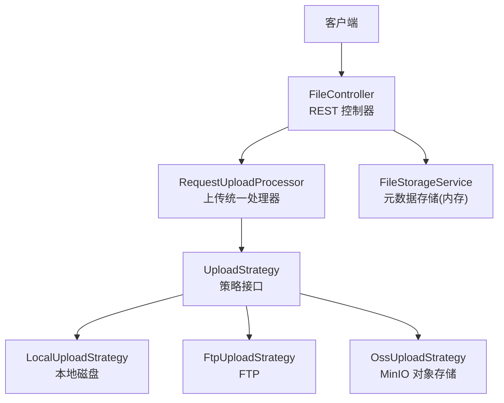
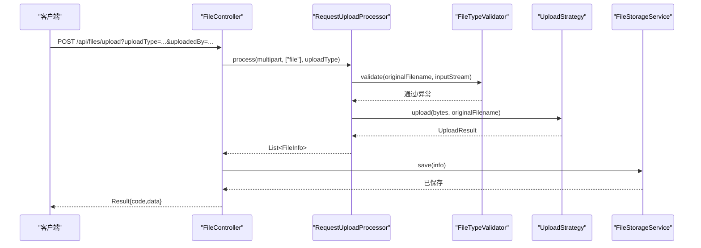
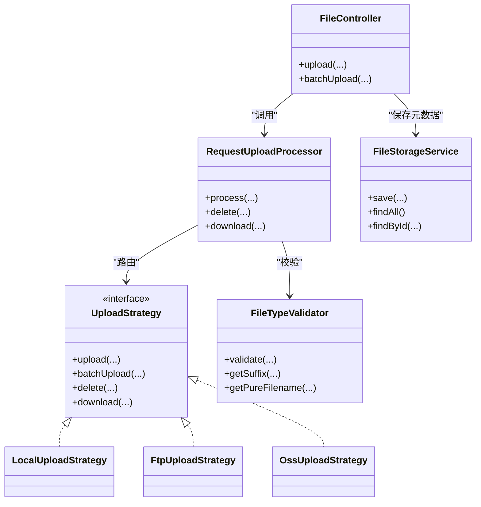

# 文件上传接口

<cite>
**本文引用的文件**
- [FileController.java](file://src/main/java/com/example/fileupload/controller/FileController.java)
- [RequestUploadProcessor.java](file://src/main/java/com/example/fileupload/service/RequestUploadProcessor.java)
- [FileTypeValidator.java](file://src/main/java/com/example/fileupload/util/FileTypeValidator.java)
- [UploadStrategy.java](file://src/main/java/com/example/fileupload/strategy/UploadStrategy.java)
- [LocalUploadStrategy.java](file://src/main/java/com/example/fileupload/strategy/LocalUploadStrategy.java)
- [FtpUploadStrategy.java](file://src/main/java/com/example/fileupload/strategy/FtpUploadStrategy.java)
- [OssUploadStrategy.java](file://src/main/java/com/example/fileupload/strategy/OssUploadStrategy.java)
- [FileInfo.java](file://src/main/java/com/example/fileupload/model/FileInfo.java)
- [UploadResult.java](file://src/main/java/com/example/fileupload/model/UploadResult.java)
- [Result.java](file://src/main/java/com/example/fileupload/model/Result.java)
- [application.yml](file://src/main/resources/application.yml)
- [FileControllerIntegrationTest.java](file://src/test/java/com/example/fileupload/FileControllerIntegrationTest.java)
</cite>

## 目录
1. [简介](#简介)
2. [项目结构](#项目结构)
3. [核心组件](#核心组件)
4. [架构总览](#架构总览)
5. [详细组件分析](#详细组件分析)
6. [依赖关系分析](#依赖关系分析)
7. [性能与限制](#性能与限制)
8. [故障排查指南](#故障排查指南)
9. [结论](#结论)
10. [附录：API 规范与示例](#附录api-规范与示例)

## 简介
本文件为“文件上传”功能的完整 API 文档，覆盖单文件上传 POST /api/files/upload 与批量上传 POST /api/files/upload/batch。文档包含请求参数、支持的存储类型（local、ftp、oss）、文件大小限制、文件类型验证规则、成功与失败响应示例、上传流程、错误处理与重试建议、客户端集成要点及常见问题解决方案。

## 项目结构
本项目基于 Spring Boot，采用策略模式实现多存储后端（本地磁盘、FTP、对象存储 MinIO），并通过统一处理器封装校验、路由与结果组装。控制器暴露 REST 接口，服务层负责元数据持久化（内存模拟）。

图表来源
- [FileController.java:31-133](file://src/main/java/com/example/fileupload/controller/FileController.java#L31-L133)
- [RequestUploadProcessor.java:46-87](file://src/main/java/com/example/fileupload/service/RequestUploadProcessor.java#L46-L87)
- [UploadStrategy.java:13-73](file://src/main/java/com/example/fileupload/strategy/UploadStrategy.java#L13-L73)
- [LocalUploadStrategy.java:27-118](file://src/main/java/com/example/fileupload/strategy/LocalUploadStrategy.java#L27-L118)
- [FtpUploadStrategy.java:37-186](file://src/main/java/com/example/fileupload/strategy/FtpUploadStrategy.java#L37-L186)
- [OssUploadStrategy.java:29-159](file://src/main/java/com/example/fileupload/strategy/OssUploadStrategy.java#L29-L159)
- [FileStorageService.java:19-107](file://src/main/java/com/example/fileupload/service/FileStorageService.java#L19-L107)

章节来源
- [FileController.java:31-133](file://src/main/java/com/example/fileupload/controller/FileController.java#L31-L133)
- [application.yml:4-10](file://src/main/resources/application.yml#L4-L10)

## 核心组件
- FileController：定义 REST 端点，解析 multipart/form-data，调用处理器与存储服务。
- RequestUploadProcessor：统一处理上传流程（读取字节、类型校验、策略路由、结果组装）。
- UploadStrategy 及其实现：封装不同存储后端的上传/下载/删除逻辑。
- FileTypeValidator：后缀白名单 + 魔数校验，防止非法或伪装文件。
- FileStorageService：内存中保存 FileInfo 元数据，支持查询与 Mock 初始化。
- Result：统一返回体，包含 code、message、data。

章节来源
- [FileController.java:50-133](file://src/main/java/com/example/fileupload/controller/FileController.java#L50-L133)
- [RequestUploadProcessor.java:46-87](file://src/main/java/com/example/fileupload/service/RequestUploadProcessor.java#L46-L87)
- [FileTypeValidator.java:16-85](file://src/main/java/com/example/fileupload/util/FileTypeValidator.java#L16-L85)
- [FileStorageService.java:29-107](file://src/main/java/com/example/fileupload/service/FileStorageService.java#L29-L107)
- [Result.java:6-47](file://src/main/java/com/example/fileupload/model/Result.java#L6-L47)

## 架构总览
上传时序（单文件）：

图表来源
- [FileController.java:58-84](file://src/main/java/com/example/fileupload/controller/FileController.java#L58-L84)
- [RequestUploadProcessor.java:46-87](file://src/main/java/com/example/fileupload/service/RequestUploadProcessor.java#L46-L87)
- [FileTypeValidator.java:47-85](file://src/main/java/com/example/fileupload/util/FileTypeValidator.java#L47-L85)
- [UploadStrategy.java:13-73](file://src/main/java/com/example/fileupload/strategy/UploadStrategy.java#L13-L73)
- [FileStorageService.java:29-39](file://src/main/java/com/example/fileupload/service/FileStorageService.java#L29-L39)

## 详细组件分析

### 单文件上传接口 POST /api/files/upload
- 路径：/api/files/upload
- 方法：POST
- Content-Type：multipart/form-data
- 表单字段
  - file：MultipartFile（必填）
  - uploadType：String（必填，枚举值 local、ftp、oss）
  - uploadedBy：String（可选，默认 system）
- 行为
  - 校验请求是否为 multipart/form-data
  - 解析 file 字段，执行 FileTypeValidator 校验（后缀白名单 + 魔数）
  - 根据 uploadType 选择策略执行上传
  - 将 FileInfo 写入 FileStorageService 并返回
- 成功响应：HTTP 200，Result.code=200，data 为 FileInfo
- 失败场景
  - 非 multipart/form-data：400
  - 未提供有效文件：400
  - 不支持的 uploadType：400
  - 文件类型校验失败：400
  - 其他异常：500

章节来源
- [FileController.java:58-84](file://src/main/java/com/example/fileupload/controller/FileController.java#L58-L84)
- [RequestUploadProcessor.java:46-87](file://src/main/java/com/example/fileupload/service/RequestUploadProcessor.java#L46-L87)
- [FileTypeValidator.java:47-85](file://src/main/java/com/example/fileupload/util/FileTypeValidator.java#L47-L85)

### 批量上传接口 POST /api/files/upload/batch
- 路径：/api/files/upload/batch
- 方法：POST
- Content-Type：multipart/form-data
- 表单字段
  - files：List<MultipartFile>（至少一个有效文件）
  - uploadType：String（必填，枚举值 local、ftp、oss）
  - uploadedBy：String（可选，默认 system）
- 行为
  - 校验 multipart/form-data
  - 取 files 字段列表，为空则报错
  - 通过 UploadStrategy.batchUpload 批量上传（FTP 会复用连接优化）
  - 将每个文件的 UploadResult 转为 FileInfo 并持久化
- 成功响应：HTTP 200，Result.code=200，data 为 List<FileInfo>
- 失败场景
  - 非 multipart/form-data：400
  - 未找到有效文件：400
  - 不支持的 uploadType：400
  - 任一文件上传失败：抛出异常，最终返回 500（由控制器捕获）

章节来源
- [FileController.java:93-133](file://src/main/java/com/example/fileupload/controller/FileController.java#L93-L133)
- [UploadStrategy.java:56-73](file://src/main/java/com/example/fileupload/strategy/UploadStrategy.java#L56-L73)
- [FtpUploadStrategy.java:126-186](file://src/main/java/com/example/fileupload/strategy/FtpUploadStrategy.java#L126-L186)

### 存储类型与策略
- local：本地磁盘存储，生成唯一文件名并落盘，计算 MD5，记录 fullPath/relativePath
- ftp：使用 Apache Commons Net FTPClient，配置 UTF-8、被动模式、二进制传输；批量上传复用同一连接
- oss：使用 MinIO SDK，自动创建 bucket（若不存在），生成 objectKey 与可访问 URL

章节来源
- [LocalUploadStrategy.java:64-137](file://src/main/java/com/example/fileupload/strategy/LocalUploadStrategy.java#L64-L137)
- [FtpUploadStrategy.java:58-114](file://src/main/java/com/example/fileupload/strategy/FtpUploadStrategy.java#L58-L114)
- [OssUploadStrategy.java:78-159](file://src/main/java/com/example/fileupload/strategy/OssUploadStrategy.java#L78-L159)

### 文件类型验证规则
- 后缀白名单：jpg/jpeg/png/gif/bmp/webp/pdf/doc/docx/xls/xlsx/txt/csv/zip/rar/7z
- 魔数校验：对部分类型（如 jpg、png、gif、bmp、pdf、zip、rar）进行文件头前 N 字节比对
- 不合法后缀或魔数不匹配将抛出异常，接口返回 400

章节来源
- [FileTypeValidator.java:16-85](file://src/main/java/com/example/fileupload/util/FileTypeValidator.java#L16-L85)

### 文件大小限制
- 单文件最大大小：50MB
- 单次请求最大大小：50MB
- 说明：Spring Multipart 全局限制，超出将导致解析失败

章节来源
- [application.yml:4-10](file://src/main/resources/application.yml#L4-L10)

### 错误处理机制
- 控制器层捕获 IllegalArgumentException 返回 400，捕获通用 Exception 返回 500 并记录日志
- FTP 层对常见回复码进行分类，给出用户友好的错误信息
- OSS 层在客户端未初始化时抛出异常提示配置缺失
- 本地磁盘策略在文件不存在或删除失败时返回 false 或空结果

章节来源
- [FileController.java:78-83](file://src/main/java/com/example/fileupload/controller/FileController.java#L78-L83)
- [FileController.java:127-132](file://src/main/java/com/example/fileupload/controller/FileController.java#L127-L132)
- [FtpUploadStrategy.java:335-352](file://src/main/java/com/example/fileupload/strategy/FtpUploadStrategy.java#L335-L352)
- [OssUploadStrategy.java:163-167](file://src/main/java/com/example/fileupload/strategy/OssUploadStrategy.java#L163-L167)

### 重试策略建议
- 网络类错误（FTP 连接超时、OSS 网络异常）：建议客户端实施指数退避重试（例如 1s、2s、4s），最多 3 次
- 幂等性：以 fileKey 作为幂等键，避免重复提交造成重复文件
- 批量上传：建议分片重试失败的条目，而非整批重传
- 限流：在高并发场景下结合网关或服务端限流保护后端

[本节为通用建议，不直接分析具体文件]

## 依赖关系分析

图表来源
- [FileController.java:31-133](file://src/main/java/com/example/fileupload/controller/FileController.java#L31-L133)
- [RequestUploadProcessor.java:25-154](file://src/main/java/com/example/fileupload/service/RequestUploadProcessor.java#L25-L154)
- [UploadStrategy.java:13-73](file://src/main/java/com/example/fileupload/strategy/UploadStrategy.java#L13-L73)
- [LocalUploadStrategy.java:27-118](file://src/main/java/com/example/fileupload/strategy/LocalUploadStrategy.java#L27-L118)
- [FtpUploadStrategy.java:37-186](file://src/main/java/com/example/fileupload/strategy/FtpUploadStrategy.java#L37-L186)
- [OssUploadStrategy.java:29-159](file://src/main/java/com/example/fileupload/strategy/OssUploadStrategy.java#L29-L159)
- [FileStorageService.java:19-107](file://src/main/java/com/example/fileupload/service/FileStorageService.java#L19-L107)
- [FileTypeValidator.java:16-109](file://src/main/java/com/example/fileupload/util/FileTypeValidator.java#L16-L109)

## 性能与限制
- 批量上传优化：FTP 批量上传复用单一连接，减少握手开销
- 临时文件规避：处理器直接读取字节数组，避免 Windows/Tomcat 临时文件锁定问题
- 大小限制：单文件与请求上限均为 50MB，需确保客户端与服务端一致
- 存储路径：本地存储 base-path 支持相对/绝对路径，注意权限与磁盘空间

章节来源
- [FtpUploadStrategy.java:126-186](file://src/main/java/com/example/fileupload/strategy/FtpUploadStrategy.java#L126-L186)
- [RequestUploadProcessor.java:61-76](file://src/main/java/com/example/fileupload/service/RequestUploadProcessor.java#L61-L76)
- [application.yml:4-10](file://src/main/resources/application.yml#L4-L10)
- [LocalUploadStrategy.java:40-61](file://src/main/java/com/example/fileupload/strategy/LocalUploadStrategy.java#L40-L61)

## 故障排查指南
- 400 错误
  - 检查是否使用 multipart/form-data
  - 检查 uploadType 是否为 local/ftp/oss
  - 检查文件后缀是否在白名单且魔数匹配
- 404 错误
  - 下载/删除时 fileKey 或 ID 不存在
- 500 错误
  - FTP：检查 host/port/用户名/密码/防火墙/被动模式
  - OSS：检查 endpoint/access-key/secret-key/bucket-name/url-prefix
  - 本地：检查 base-path 是否存在且可写
- 日志定位
  - 查看控制器与策略层的日志输出，关注错误分类与堆栈

章节来源
- [FileController.java:78-83](file://src/main/java/com/example/fileupload/controller/FileController.java#L78-L83)
- [FileController.java:127-132](file://src/main/java/com/example/fileupload/controller/FileController.java#L127-L132)
- [FtpUploadStrategy.java:335-352](file://src/main/java/com/example/fileupload/strategy/FtpUploadStrategy.java#L335-L352)
- [OssUploadStrategy.java:163-167](file://src/main/java/com/example/fileupload/strategy/OssUploadStrategy.java#L163-L167)

## 结论
本文件上传 API 通过统一的控制器与处理器，结合策略模式支持多种存储后端，并提供严格的文件类型校验与清晰的错误处理。批量上传针对 FTP 做了连接复用优化。建议客户端遵循大小限制、实施重试与幂等控制，并依据错误码快速定位问题。

[本节为总结性内容，不直接分析具体文件]

## 附录：API 规范与示例

### 公共模型
- Result<T>
  - code：int（200 成功，其他为错误码）
  - message：String（描述）
  - data：T（业务数据）
- FileInfo
  - id、originalFilename、pureFilename、suffix、originalSize、contentType
  - storageType、fileKey、fullPath、relativePath、storedSize、md5
  - uploadedBy、uploadTime

章节来源
- [Result.java:6-47](file://src/main/java/com/example/fileupload/model/Result.java#L6-L47)
- [FileInfo.java:8-75](file://src/main/java/com/example/fileupload/model/FileInfo.java#L8-L75)

### 单文件上传 POST /api/files/upload
- 请求
  - Content-Type：multipart/form-data
  - 字段
    - file：MultipartFile
    - uploadType：local|ftp|oss
    - uploadedBy：可选，默认 system
- 成功响应示例（JSON）
  - {
      "code": 200,
      "message": "success",
      "data": {
        "id": "...",
        "originalFilename": "example.png",
        "pureFilename": "example",
        "suffix": ".png",
        "originalSize": 12345,
        "contentType": "image/png",
        "storageType": "local",
        "fileKey": "uuid_example.png",
        "fullPath": "/file-upload-storage/uuid_example.png",
        "relativePath": "file-upload-storage/uuid_example.png",
        "storedSize": 12345,
        "md5": "abc123...",
        "uploadedBy": "system",
        "uploadTime": "2024-01-01T00:00:00Z"
      }
    }
- 失败响应示例（JSON）
  - 非法后缀：{ "code": 400, "message": "不允许上传的后缀: .exe，允许的 suffix: ...", "data": null }
  - 未知 uploadType：{ "code": 400, "message": "不支持的上传类型: s3", "data": null }
  - 非 multipart/form-data：{ "code": 400, "message": "请求必须是 multipart/form-data 类型", "data": null }

章节来源
- [FileController.java:58-84](file://src/main/java/com/example/fileupload/controller/FileController.java#L58-L84)
- [FileTypeValidator.java:47-85](file://src/main/java/com/example/fileupload/util/FileTypeValidator.java#L47-L85)
- [FileControllerIntegrationTest.java:42-96](file://src/test/java/com/example/fileupload/FileControllerIntegrationTest.java#L42-L96)

### 批量上传 POST /api/files/upload/batch
- 请求
  - Content-Type：multipart/form-data
  - 字段
    - files：MultipartFile[]（至少一个）
    - uploadType：local|ftp|oss
    - uploadedBy：可选，默认 system
- 成功响应示例（JSON）
  - {
      "code": 200,
      "message": "success",
      "data": [
        {
          "id": "...",
          "originalFilename": "a.png",
          "storageType": "ftp",
          "fileKey": "uuid_a.png",
          "md5": "...",
          "uploadedBy": "system"
        },
        {
          "id": "...",
          "originalFilename": "b.pdf",
          "storageType": "ftp",
          "fileKey": "uuid_b.pdf",
          "md5": "...",
          "uploadedBy": "system"
        }
      ]
    }
- 失败响应示例（JSON）
  - 无有效文件：{ "code": 400, "message": "未找到有效文件", "data": null }
  - 任意文件上传失败：{ "code": 500, "message": "批量上传失败: ...", "data": null }

章节来源
- [FileController.java:93-133](file://src/main/java/com/example/fileupload/controller/FileController.java#L93-L133)
- [FtpUploadStrategy.java:126-186](file://src/main/java/com/example/fileupload/strategy/FtpUploadStrategy.java#L126-L186)

### 客户端集成要点
- 使用 multipart/form-data 发送 file/files 字段
- 设置 uploadType 为 local/ftp/oss
- 处理 Result.code 判断成功与否，读取 data 中的 fileKey 用于后续下载/删除
- 大文件上传注意网络稳定性，建议启用断点续传或分片上传（由客户端实现）
- 重试策略：对 5xx 或网络异常进行指数退避重试，结合 fileKey 保证幂等

[本节为通用指导，不直接分析具体文件]

### 常见问题与解决
- 上传被拒绝（400）
  - 检查后缀是否在白名单，确认魔数匹配
  - 检查请求是否为 multipart/form-data
- 无法连接 FTP（500）
  - 检查 application.yml 中 ftp.host/port/username/password/basePath
  - 检查防火墙与被动模式配置
- MinIO 不可用（500）
  - 检查 endpoint/access-key/secret-key/bucket-name/url-prefix
  - 确认 bucket 存在或允许自动创建
- 本地路径无权限
  - 检查 file.upload.base-path 指向的目录是否存在且可写

章节来源
- [application.yml:13-28](file://src/main/resources/application.yml#L13-L28)
- [FtpUploadStrategy.java:206-236](file://src/main/java/com/example/fileupload/strategy/FtpUploadStrategy.java#L206-L236)
- [OssUploadStrategy.java:54-70](file://src/main/java/com/example/fileupload/strategy/OssUploadStrategy.java#L54-L70)
- [LocalUploadStrategy.java:40-61](file://src/main/java/com/example/fileupload/strategy/LocalUploadStrategy.java#L40-L61)