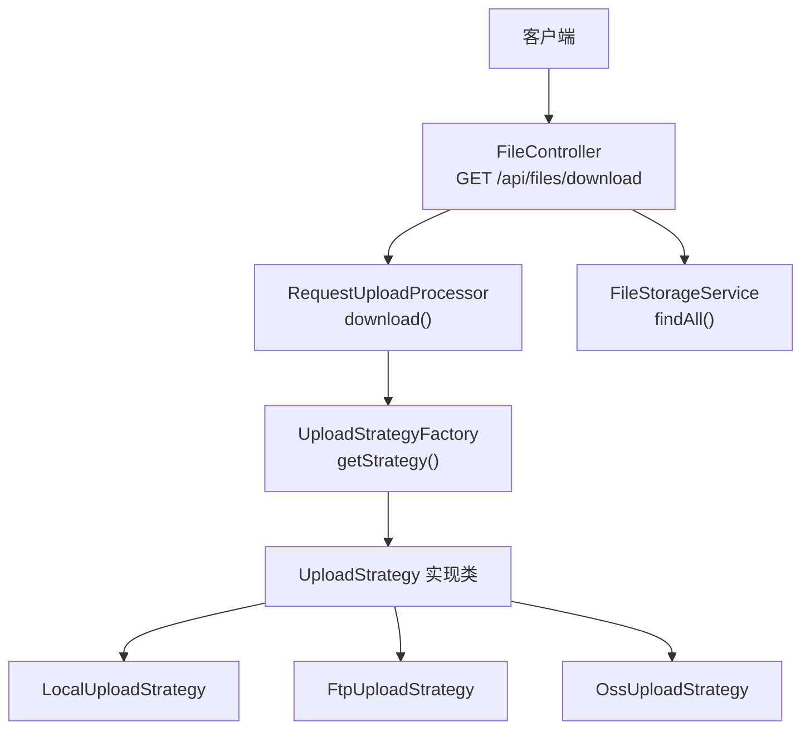
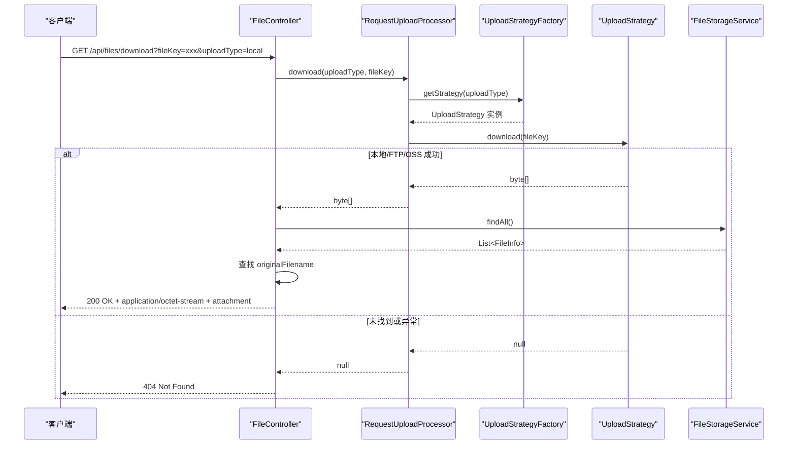
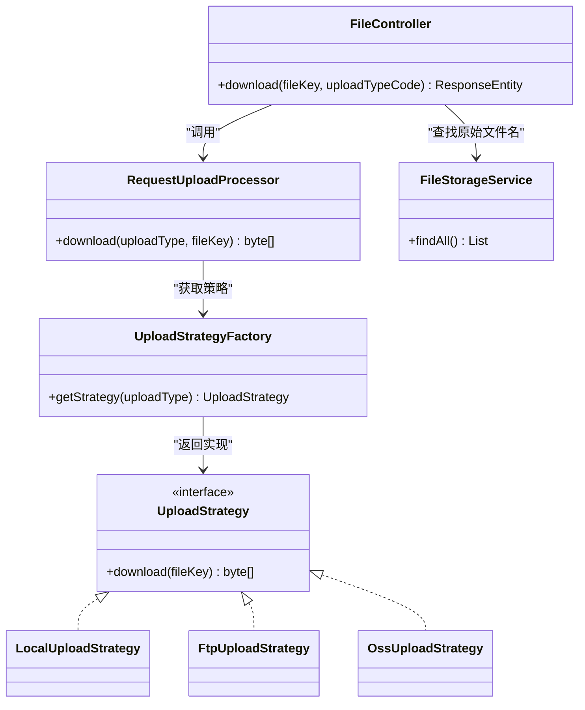

# 文件下载接口

<cite>
**本文引用的文件**
- [FileController.java](file://src/main/java/com/example/fileupload/controller/FileController.java)
- [UploadType.java](file://src/main/java/com/example/fileupload/enums/UploadType.java)
- [RequestUploadProcessor.java](file://src/main/java/com/example/fileupload/service/RequestUploadProcessor.java)
- [UploadStrategyFactory.java](file://src/main/java/com/example/fileupload/strategy/UploadStrategyFactory.java)
- [UploadStrategy.java](file://src/main/java/com/example/fileupload/strategy/UploadStrategy.java)
- [LocalUploadStrategy.java](file://src/main/java/com/example/fileupload/strategy/LocalUploadStrategy.java)
- [FtpUploadStrategy.java](file://src/main/java/com/example/fileupload/strategy/FtpUploadStrategy.java)
- [OssUploadStrategy.java](file://src/main/java/com/example/fileupload/strategy/OssUploadStrategy.java)
- [FileStorageService.java](file://src/main/java/com/example/fileupload/service/FileStorageService.java)
- [FileInfo.java](file://src/main/java/com/example/fileupload/model/FileInfo.java)
- [application.yml](file://src/main/resources/application.yml)
</cite>

## 目录
1. [简介](#简介)
2. [项目结构](#项目结构)
3. [核心组件](#核心组件)
4. [架构总览](#架构总览)
5. [详细组件分析](#详细组件分析)
6. [依赖关系分析](#依赖关系分析)
7. [性能注意事项](#性能注意事项)
8. [故障排查指南](#故障排查指南)
9. [结论](#结论)
10. [附录：客户端调用示例](#附录客户端调用示例)

## 简介
本章节面向需要调用“文件下载”接口的开发者，提供 GET /api/files/download 的完整使用说明。该接口通过 fileKey 与 uploadType 定位并返回二进制文件流，同时设置合适的 Content-Type 与 Content-Disposition 响应头，便于浏览器或客户端直接保存为文件。

## 项目结构
本项目采用分层与策略模式组织代码：
- Controller 层：暴露 REST API（包含下载端点）
- Service 层：统一处理请求流程（路由到具体存储策略）
- Strategy 层：不同存储后端的具体实现（本地磁盘、FTP、对象存储）
- Model/Enum：数据模型与枚举（如 UploadType）
- 配置：application.yml 中定义存储参数

图表来源
- [FileController.java:156-194](file://src/main/java/com/example/fileupload/controller/FileController.java#L156-L194)
- [RequestUploadProcessor.java:116-130](file://src/main/java/com/example/fileupload/service/RequestUploadProcessor.java#L116-L130)
- [UploadStrategyFactory.java:28-55](file://src/main/java/com/example/fileupload/strategy/UploadStrategyFactory.java#L28-L55)
- [LocalUploadStrategy.java:100-113](file://src/main/java/com/example/fileupload/strategy/LocalUploadStrategy.java#L100-L113)
- [FtpUploadStrategy.java:95-114](file://src/main/java/com/example/fileupload/strategy/FtpUploadStrategy.java#L95-L114)
- [OssUploadStrategy.java:132-154](file://src/main/java/com/example/fileupload/strategy/OssUploadStrategy.java#L132-L154)
- [FileStorageService.java:55-60](file://src/main/java/com/example/fileupload/service/FileStorageService.java#L55-L60)

章节来源
- [FileController.java:156-194](file://src/main/java/com/example/fileupload/controller/FileController.java#L156-L194)
- [application.yml:1-33](file://src/main/resources/application.yml#L1-L33)

## 核心组件
- FileController：定义 /api/files/download 端点，负责参数校验、调用处理器、组装响应头与状态码。
- RequestUploadProcessor：根据 uploadType 选择对应策略并执行 download(fileKey)，返回字节数组或 null。
- UploadStrategyFactory：维护策略映射，按 UploadType 返回具体策略实例。
- UploadStrategy 及其实现：LocalUploadStrategy（本地磁盘）、FtpUploadStrategy（FTP）、OssUploadStrategy（MinIO）。
- FileStorageService：内存元数据存储，用于在响应头中还原原始文件名。

章节来源
- [FileController.java:156-194](file://src/main/java/com/example/fileupload/controller/FileController.java#L156-L194)
- [RequestUploadProcessor.java:116-130](file://src/main/java/com/example/fileupload/service/RequestUploadProcessor.java#L116-L130)
- [UploadStrategyFactory.java:28-55](file://src/main/java/com/example/fileupload/strategy/UploadStrategyFactory.java#L28-L55)
- [UploadStrategy.java:48-54](file://src/main/java/com/example/fileupload/strategy/UploadStrategy.java#L48-L54)
- [LocalUploadStrategy.java:100-113](file://src/main/java/com/example/fileupload/strategy/LocalUploadStrategy.java#L100-L113)
- [FtpUploadStrategy.java:95-114](file://src/main/java/com/example/fileupload/strategy/FtpUploadStrategy.java#L95-L114)
- [OssUploadStrategy.java:132-154](file://src/main/java/com/example/fileupload/strategy/OssUploadStrategy.java#L132-L154)
- [FileStorageService.java:55-60](file://src/main/java/com/example/fileupload/service/FileStorageService.java#L55-L60)

## 架构总览
下载流程从控制器开始，经处理器路由到具体存储策略读取文件字节，再回到控制器设置响应头并返回二进制流。若未找到文件或异常，将返回相应错误响应。

图表来源
- [FileController.java:163-194](file://src/main/java/com/example/fileupload/controller/FileController.java#L163-L194)
- [RequestUploadProcessor.java:123-130](file://src/main/java/com/example/fileupload/service/RequestUploadProcessor.java#L123-L130)
- [UploadStrategyFactory.java:48-55](file://src/main/java/com/example/fileupload/strategy/UploadStrategyFactory.java#L48-L55)
- [LocalUploadStrategy.java:100-113](file://src/main/java/com/example/fileupload/strategy/LocalUploadStrategy.java#L100-L113)
- [FtpUploadStrategy.java:95-114](file://src/main/java/com/example/fileupload/strategy/FtpUploadStrategy.java#L95-L114)
- [OssUploadStrategy.java:132-154](file://src/main/java/com/example/fileupload/strategy/OssUploadStrategy.java#L132-L154)
- [FileStorageService.java:55-60](file://src/main/java/com/example/fileupload/service/FileStorageService.java#L55-L60)

## 详细组件分析

### 接口定义与参数规范
- 方法：GET
- 路径：/api/files/download
- 查询参数：
  - fileKey（必需）：文件唯一标识，由上传后返回或元数据记录中获得。
  - uploadType（必需）：存储类型，取值范围：
    - local：本地磁盘存储
    - ftp：FTP 服务器
    - oss：对象存储（MinIO）
- 响应体：二进制文件流
- 响应头：
  - Content-Type: application/octet-stream
  - Content-Disposition: attachment; filename="<originalFilename>"
  - Content-Length: 文件大小（字节）
- 状态码：
  - 200：成功返回文件流
  - 404：未找到文件（当处理器返回空或长度为 0）
  - 500：服务端异常（内部错误）

章节来源
- [FileController.java:156-194](file://src/main/java/com/example/fileupload/controller/FileController.java#L156-L194)
- [UploadType.java:6-33](file://src/main/java/com/example/fileupload/enums/UploadType.java#L6-L33)

### 文件查找逻辑
- 控制器接收 fileKey 与 uploadType，解析 uploadType 枚举。
- 通过 RequestUploadProcessor.download 路由到具体策略的 download(fileKey)。
- 各策略实现：
  - 本地：根据 base-path 拼接文件路径并读取字节。
  - FTP：连接服务器并 retrieveFile 获取字节。
  - 对象存储：使用 MinIO SDK getObject 获取字节。
- 若策略返回 null 或字节数组为空，控制器返回 404。

章节来源
- [RequestUploadProcessor.java:123-130](file://src/main/java/com/example/fileupload/service/RequestUploadProcessor.java#L123-L130)
- [LocalUploadStrategy.java:100-113](file://src/main/java/com/example/fileupload/strategy/LocalUploadStrategy.java#L100-L113)
- [FtpUploadStrategy.java:95-114](file://src/main/java/com/example/fileupload/strategy/FtpUploadStrategy.java#L95-L114)
- [OssUploadStrategy.java:132-154](file://src/main/java/com/example/fileupload/strategy/OssUploadStrategy.java#L132-L154)

### 权限验证机制
- 当前下载接口未实现访问控制（鉴权），任何知道 fileKey 和 uploadType 的请求均可下载。
- 建议在生产环境增加鉴权中间件或网关限制，例如基于 Token 或 IP 白名单。

[本节为通用安全建议，不直接分析具体文件]

### 错误处理机制
- 非法 uploadType：抛出 IllegalArgumentException，控制器捕获后返回 400。
- 文件不存在：策略返回 null，控制器返回 404。
- 其他异常：控制器捕获并返回 500，附带错误信息。

章节来源
- [UploadType.java:23-33](file://src/main/java/com/example/fileupload/enums/UploadType.java#L23-L33)
- [FileController.java:163-194](file://src/main/java/com/example/fileupload/controller/FileController.java#L163-L194)

### 响应头与内容类型
- Content-Type 固定为 application/octet-stream，确保浏览器以附件形式下载。
- Content-Disposition 设置为 attachment，并使用原始文件名（从元数据中查找）。
- Content-Length 设置为字节数组长度。

章节来源
- [FileController.java:174-189](file://src/main/java/com/example/fileupload/controller/FileController.java#L174-L189)

### 不同存储策略的下载实现
- 本地磁盘：检查文件存在性并以字节数组形式读取。
- FTP：建立连接、retrieveFile 并关闭连接。
- 对象存储：通过 MinIO SDK 读取对象并转换为字节数组。

章节来源
- [LocalUploadStrategy.java:100-113](file://src/main/java/com/example/fileupload/strategy/LocalUploadStrategy.java#L100-L113)
- [FtpUploadStrategy.java:95-114](file://src/main/java/com/example/fileupload/strategy/FtpUploadStrategy.java#L95-L114)
- [OssUploadStrategy.java:132-154](file://src/main/java/com/example/fileupload/strategy/OssUploadStrategy.java#L132-L154)

## 依赖关系分析
- FileController 依赖 RequestUploadProcessor 与 FileStorageService。
- RequestUploadProcessor 依赖 UploadStrategyFactory。
- UploadStrategyFactory 依赖所有 UploadStrategy 实现。
- 各策略实现分别依赖底层存储（文件系统、FTP 客户端、MinIO 客户端）。

图表来源
- [FileController.java:156-194](file://src/main/java/com/example/fileupload/controller/FileController.java#L156-L194)
- [RequestUploadProcessor.java:116-130](file://src/main/java/com/example/fileupload/service/RequestUploadProcessor.java#L116-L130)
- [UploadStrategyFactory.java:28-55](file://src/main/java/com/example/fileupload/strategy/UploadStrategyFactory.java#L28-L55)
- [UploadStrategy.java:48-54](file://src/main/java/com/example/fileupload/strategy/UploadStrategy.java#L48-L54)
- [LocalUploadStrategy.java:100-113](file://src/main/java/com/example/fileupload/strategy/LocalUploadStrategy.java#L100-L113)
- [FtpUploadStrategy.java:95-114](file://src/main/java/com/example/fileupload/strategy/FtpUploadStrategy.java#L95-L114)
- [OssUploadStrategy.java:132-154](file://src/main/java/com/example/fileupload/strategy/OssUploadStrategy.java#L132-L154)
- [FileStorageService.java:55-60](file://src/main/java/com/example/fileupload/service/FileStorageService.java#L55-L60)

章节来源
- [FileController.java:156-194](file://src/main/java/com/example/fileupload/controller/FileController.java#L156-L194)
- [UploadStrategyFactory.java:28-55](file://src/main/java/com/example/fileupload/strategy/UploadStrategyFactory.java#L28-L55)

## 性能注意事项
- 大文件下载会将整个文件加载到内存（byte[]），在高并发场景下可能占用较多堆内存。建议结合分片下载或流式传输优化。
- FTP 每次下载都会新建连接，频繁请求时建议复用连接或引入连接池。
- 对象存储下载受网络带宽与 SDK 缓冲策略影响，注意合理设置缓冲区大小。

[本节为通用性能建议，不直接分析具体文件]

## 故障排查指南
- 400 错误：检查 uploadType 是否为 local/ftp/oss 之一。
- 404 错误：确认 fileKey 正确且与 uploadType 匹配；检查对应存储后端是否可访问。
- 500 错误：查看日志中的异常堆栈，常见原因包括：
  - 本地路径不可写或文件不存在
  - FTP 连接失败、认证失败或权限不足
  - 对象存储客户端未初始化或网络不可达

章节来源
- [FileController.java:163-194](file://src/main/java/com/example/fileupload/controller/FileController.java#L163-L194)
- [FtpUploadStrategy.java:206-236](file://src/main/java/com/example/fileupload/strategy/FtpUploadStrategy.java#L206-L236)
- [OssUploadStrategy.java:54-70](file://src/main/java/com/example/fileupload/strategy/OssUploadStrategy.java#L54-L70)

## 结论
GET /api/files/download 提供了统一的文件下载入口，通过 fileKey 与 uploadType 路由到不同存储后端，返回二进制流并设置标准响应头。当前实现简洁易用，适合快速集成；生产环境建议补充鉴权、限流与大文件流式下载能力。

[本节为总结性内容，不直接分析具体文件]

## 附录：客户端调用示例
以下为常见客户端语言的调用方式与保存步骤说明（不包含具体代码内容）：

- cURL
  - 构造 URL：http://host:port/api/files/download?fileKey=xxx&uploadType=local
  - 使用 -o 指定输出文件路径，自动根据响应头保存为附件。

- Java（HttpURLConnection）
  - 发起 GET 请求，读取 InputStream 写入本地文件。
  - 根据响应头的 Content-Disposition 提取文件名（若存在）。

- Java（OkHttp）
  - 构建 Request，执行 Call，将 ResponseBody 的 InputStream 写入文件。
  - 注意处理超时与重试。

- Python（requests）
  - requests.get(url, stream=True)，逐块写入本地文件。
  - 使用 response.headers['Content-Disposition'] 解析文件名。

- JavaScript（浏览器 fetch）
  - fetch(url) 获取 Blob，创建 Object URL，触发 <a> 标签下载。
  - 或使用 XMLHttpRequest 处理二进制流。

- Node.js（axios）
  - axios.get(url, { responseType: 'arraybuffer' })，写入 fs.writeFileSync。
  - 或流式写入避免一次性加载大文件。

[本节为通用客户端示例指导，不直接分析具体文件]