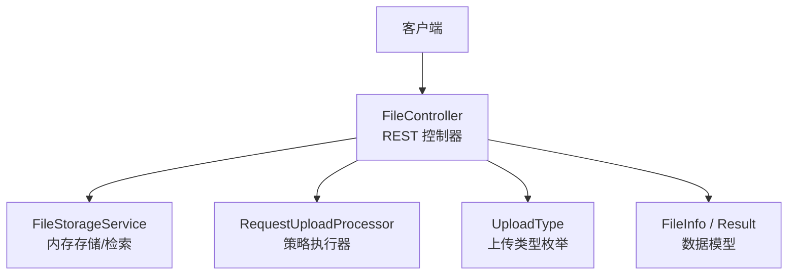
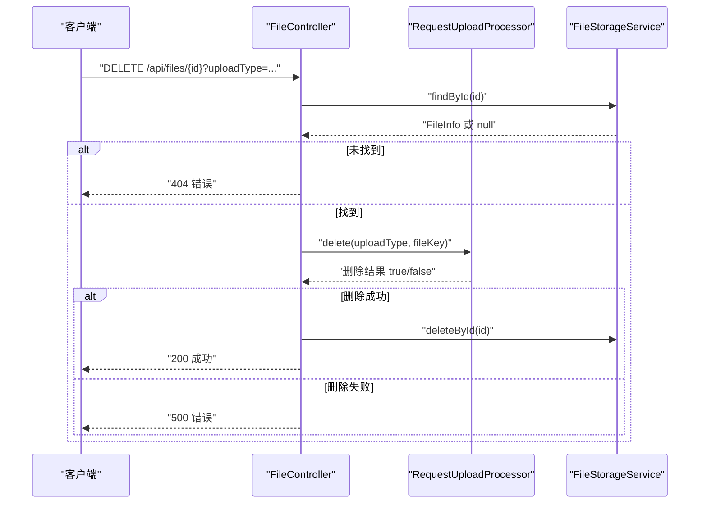
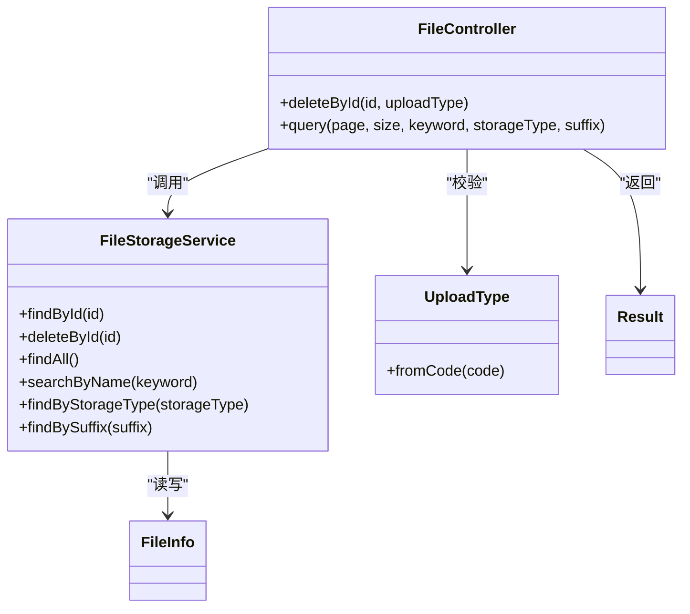

# 文件管理接口

<cite>
**本文引用的文件**
- [FileController.java](file://src/main/java/com/example/fileupload/controller/FileController.java)
- [FileStorageService.java](file://src/main/java/com/example/fileupload/service/FileStorageService.java)
- [FileInfo.java](file://src/main/java/com/example/fileupload/model/FileInfo.java)
- [Result.java](file://src/main/java/com/example/fileupload/model/Result.java)
- [UploadType.java](file://src/main/java/com/example/fileupload/enums/UploadType.java)
- [application.yml](file://src/main/resources/application.yml)
- [FileControllerIntegrationTest.java](file://src/test/java/com/example/fileupload/FileControllerIntegrationTest.java)
</cite>

## 目录
1. [简介](#简介)
2. [项目结构](#项目结构)
3. [核心组件](#核心组件)
4. [架构总览](#架构总览)
5. [详细组件分析](#详细组件分析)
6. [依赖关系分析](#依赖关系分析)
7. [性能注意事项](#性能注意事项)
8. [故障排查指南](#故障排查指南)
9. [结论](#结论)
10. [附录：API 规范与示例](#附录api-规范与示例)

## 简介
本文件为“文件管理”模块的 API 文档，聚焦以下两个端点：
- DELETE /api/files/{id}：删除指定文件（路径参数 id，查询参数 uploadType）
- GET /api/files：分页查询文件列表（支持 keyword、storageType、suffix 组合过滤）

文档涵盖请求/响应格式、参数说明、事务性与原子性说明、分页结果结构、性能优化建议及常见问题排查。

## 项目结构
该功能由控制器层、服务层、数据模型与枚举组成：
- 控制器：FileController 暴露 REST 端点
- 服务：FileStorageService 提供内存式元数据存储与检索能力
- 模型：FileInfo、Result 定义数据与统一返回结构
- 枚举：UploadType 限定上传类型（local/ftp/oss）
- 配置：application.yml 定义本地存储根路径等

图表来源
- [FileController.java:31-48](file://src/main/java/com/example/fileupload/controller/FileController.java#L31-L48)
- [FileStorageService.java:19-25](file://src/main/java/com/example/fileupload/service/FileStorageService.java#L19-L25)
- [UploadType.java:6-34](file://src/main/java/com/example/fileupload/enums/UploadType.java#L6-L34)

章节来源
- [FileController.java:26-48](file://src/main/java/com/example/fileupload/controller/FileController.java#L26-L48)
- [application.yml:1-33](file://src/main/resources/application.yml#L1-L33)

## 核心组件
- FileController：实现文件上传、下载、删除、查询、Mock 初始化等端点；其中删除与查询逻辑在本文档重点展开
- FileStorageService：基于 ConcurrentHashMap 的内存存储，提供 save/findById/deleteById/findAll/searchByName 等方法
- FileInfo：文件元信息载体，包含文件名、后缀、大小、存储类型、fileKey、md5、上传者、上传时间等
- Result：统一返回体，包含 code、message、data
- UploadType：限制 uploadType 参数取值（local/ftp/oss），非法值抛出异常

章节来源
- [FileController.java:196-292](file://src/main/java/com/example/fileupload/controller/FileController.java#L196-L292)
- [FileStorageService.java:29-107](file://src/main/java/com/example/fileupload/service/FileStorageService.java#L29-L107)
- [FileInfo.java:8-75](file://src/main/java/com/example/fileupload/model/FileInfo.java#L8-L75)
- [Result.java:6-46](file://src/main/java/com/example/fileupload/model/Result.java#L6-L46)
- [UploadType.java:6-34](file://src/main/java/com/example/fileupload/enums/UploadType.java#L6-L34)

## 架构总览
删除与查询在控制器中编排业务流：
- 删除：解析 uploadType -> 查找元数据 -> 调用底层存储删除 -> 成功后删除元数据
- 查询：根据 keyword 走名称搜索或全量加载后按 storageType/suffix 过滤 -> 内存分页 -> 组装分页结果

图表来源
- [FileController.java:196-227](file://src/main/java/com/example/fileupload/controller/FileController.java#L196-L227)
- [FileStorageService.java:44-53](file://src/main/java/com/example/fileupload/service/FileStorageService.java#L44-L53)

## 详细组件分析

### 删除接口：DELETE /api/files/{id}
- 路径参数
  - id：文件记录主键（字符串）
- 查询参数
  - uploadType：必填，取值为 local/ftp/oss（不区分大小写），用于路由到对应存储策略执行删除
- 行为说明
  - 先通过 id 查询元数据，不存在则返回 404
  - 使用 uploadType 将删除操作委派给底层存储（本地磁盘/FTP/OSS）
  - 若底层删除成功，再删除元数据并返回成功
  - 若底层删除失败，返回 500 错误
- 事务性与原子性
  - 当前实现为两步操作：先删底层存储，再删元数据。若第二步失败，可能出现“底层已删除但元数据仍存在”的不一致状态
  - 代码未使用 Spring 事务注解包裹该流程，因此不提供跨资源的事务回滚保证
  - 建议：在生产环境引入分布式事务或补偿机制（如消息队列重试、定时对账清理），确保最终一致性
- 错误码
  - 404：文件不存在
  - 400：uploadType 非法
  - 500：底层删除失败或 IO 异常
- 请求示例
  - 方法：DELETE
  - URL：/api/files/mock-001?uploadType=local
- 响应示例
  - 成功：code=200，data="删除成功"
  - 失败：code=404/400/500，message 描述原因

章节来源
- [FileController.java:196-227](file://src/main/java/com/example/fileupload/controller/FileController.java#L196-L227)
- [UploadType.java:23-33](file://src/main/java/com/example/fileupload/enums/UploadType.java#L23-L33)
- [FileStorageService.java:44-53](file://src/main/java/com/example/fileupload/service/FileStorageService.java#L44-L53)

### 查询接口：GET /api/files
- 查询参数
  - page：页码，默认 1
  - size：每页条数，默认 20
  - keyword：可选，模糊匹配 originalFilename 与 pureFilename（不区分大小写）
  - storageType：可选，按存储类型过滤（local/ftp/oss，不区分大小写）
  - suffix：可选，按文件后缀过滤（如 .png，不区分大小写）
- 组合查询逻辑
  - 若提供 keyword：优先走名称搜索（searchByName），返回匹配结果集
  - 否则：先获取全部记录，再依次应用 storageType 与 suffix 过滤
  - 最后进行内存分页：计算 start/end，截取子列表
- 分页结果结构
  - data.total：过滤后的总条数
  - data.page：当前页码
  - data.size：每页大小
  - data.list：当前页数据项（FileInfo 列表）
- 请求示例
  - 列出所有：GET /api/files?page=1&size=10
  - 关键词搜索：GET /api/files?keyword=banner
  - 按类型过滤：GET /api/files?storageType=local
  - 按后缀过滤：GET /api/files?suffix=.png
  - 组合条件：GET /api/files?page=1&size=5&keyword=report&storageType=local&suffix=.pdf
- 响应示例
  - 成功：code=200，data 包含 total/page/size/list
  - 失败：code=500，message 描述错误
- 边界情况
  - 当 start >= total 时，返回空列表
  - 过滤条件为空时等价于不过滤

章节来源
- [FileController.java:229-280](file://src/main/java/com/example/fileupload/controller/FileController.java#L229-L280)
- [FileStorageService.java:58-96](file://src/main/java/com/example/fileupload/service/FileStorageService.java#L58-L96)

### 数据模型与返回体
- FileInfo：包含文件原始信息、存储后信息、元数据字段，作为 list 中的元素
- Result：统一封装 code/message/data，便于前端统一处理

章节来源
- [FileInfo.java:8-75](file://src/main/java/com/example/fileupload/model/FileInfo.java#L8-L75)
- [Result.java:6-46](file://src/main/java/com/example/fileupload/model/Result.java#L6-L46)

## 依赖关系分析
- FileController 依赖：
  - RequestUploadProcessor：负责具体存储策略的删除/下载等操作
  - FileStorageService：负责元数据的增删改查
  - UploadType：校验并转换 uploadType 参数
- FileStorageService 内部：
  - 使用 ConcurrentHashMap 维护 id -> FileInfo 映射
  - 提供 searchByName/findByStorageType/findBySuffix 等过滤能力
- 配置 application.yml：
  - 设置本地存储 base-path 以及 FTP/OSS 连接参数（与删除/查询无直接耦合，但影响底层删除行为）

图表来源
- [FileController.java:31-48](file://src/main/java/com/example/fileupload/controller/FileController.java#L31-L48)
- [FileStorageService.java:19-107](file://src/main/java/com/example/fileupload/service/FileStorageService.java#L19-L107)
- [UploadType.java:6-34](file://src/main/java/com/example/fileupload/enums/UploadType.java#L6-L34)

章节来源
- [FileController.java:31-48](file://src/main/java/com/example/fileupload/controller/FileController.java#L31-L48)
- [FileStorageService.java:19-107](file://src/main/java/com/example/fileupload/service/FileStorageService.java#L19-L107)
- [application.yml:12-28](file://src/main/resources/application.yml#L12-L28)

## 性能注意事项
- 查询性能
  - 当前查询在未命中 keyword 时会先加载全部记录再进行内存过滤与分页，数据量大时将导致内存占用高、响应慢
  - 建议：
    - 引入数据库索引（originalFilename、pureFilename、storageType、suffix）
    - 在服务层实现服务端分页与条件查询，避免全表扫描
    - 对高频过滤维度建立二级索引或倒排索引
- 大数据量处理
  - 控制默认 page/size，限制最大 size 防止过大响应
  - 增加超时与限流保护
  - 对 keyword 搜索考虑全文检索引擎（如 Elasticsearch）
- 删除性能
  - 底层存储删除可能受网络/权限影响，建议增加重试与幂等设计
  - 结合监控与告警，及时感知删除失败率

[本节为通用性能建议，不直接引用具体代码]

## 故障排查指南
- 删除失败
  - 检查 uploadType 是否合法（local/ftp/oss）
  - 确认底层存储可达且具备删除权限
  - 查看日志中 IOException 与错误信息
- 查询结果为空
  - 检查 keyword/storageType/suffix 拼写与大小写
  - 确认数据是否已初始化或上传成功
- 常见错误码
  - 404：文件不存在
  - 400：参数非法（如 uploadType 不支持）
  - 500：系统错误或底层 IO 异常

章节来源
- [FileController.java:196-227](file://src/main/java/com/example/fileupload/controller/FileController.java#L196-L227)
- [FileController.java:229-280](file://src/main/java/com/example/fileupload/controller/FileController.java#L229-L280)
- [FileControllerIntegrationTest.java:156-188](file://src/test/java/com/example/fileupload/FileControllerIntegrationTest.java#L156-L188)
- [FileControllerIntegrationTest.java:190-245](file://src/test/java/com/example/fileupload/FileControllerIntegrationTest.java#L190-L245)

## 结论
- 删除接口通过 uploadType 路由到具体存储策略，先删底层再删元数据；当前未提供跨资源事务保障，需在生产环境补充补偿机制以确保一致性
- 查询接口支持 keyword、storageType、suffix 的组合过滤与内存分页；在大数据场景下应升级为服务端分页与索引优化
- 统一返回体 Result 简化了前后端交互；建议在后续版本中细化错误码与错误信息结构

[本节为总结性内容，不直接引用具体代码]

## 附录：API 规范与示例

### 删除接口：DELETE /api/files/{id}
- 路径参数
  - id：字符串，文件主键
- 查询参数
  - uploadType：字符串，必填，取值 local/ftp/oss（不区分大小写）
- 成功响应
  - code=200，data="删除成功"
- 失败响应
  - 404：文件不存在
  - 400：uploadType 非法
  - 500：底层删除失败或 IO 异常
- 请求示例
  - DELETE /api/files/mock-001?uploadType=local
- 响应示例
  - {"code":200,"message":"success","data":"删除成功"}

章节来源
- [FileController.java:196-227](file://src/main/java/com/example/fileupload/controller/FileController.java#L196-L227)
- [FileControllerIntegrationTest.java:156-188](file://src/test/java/com/example/fileupload/FileControllerIntegrationTest.java#L156-L188)

### 查询接口：GET /api/files
- 查询参数
  - page：整数，默认 1
  - size：整数，默认 20
  - keyword：字符串，可选，模糊匹配文件名（originalFilename/pureFilename）
  - storageType：字符串，可选，取值 local/ftp/oss（不区分大小写）
  - suffix：字符串，可选，文件后缀（如 .png，不区分大小写）
- 成功响应
  - code=200
  - data：
    - total：过滤后总数
    - page：当前页
    - size：每页大小
    - list：FileInfo 列表
- 失败响应
  - 500：查询异常
- 请求示例
  - GET /api/files?page=1&size=10
  - GET /api/files?keyword=report&storageType=local&suffix=.pdf
- 响应示例
  - {"code":200,"message":"success","data":{"total":10,"page":1,"size":10,"list":[...]}}

章节来源
- [FileController.java:229-280](file://src/main/java/com/example/fileupload/controller/FileController.java#L229-L280)
- [FileControllerIntegrationTest.java:190-245](file://src/test/java/com/example/fileupload/FileControllerIntegrationTest.java#L190-L245)

### 数据模型参考
- FileInfo 关键字段
  - id、originalFilename、pureFilename、suffix、originalSize、contentType
  - storageType、fileKey、fullPath、relativePath、storedSize、md5
  - uploadedBy、uploadTime
- Result 关键字段
  - code、message、data

章节来源
- [FileInfo.java:8-75](file://src/main/java/com/example/fileupload/model/FileInfo.java#L8-L75)
- [Result.java:6-46](file://src/main/java/com/example/fileupload/model/Result.java#L6-L46)