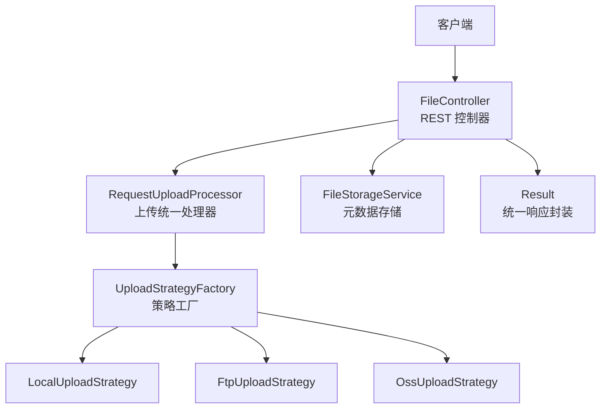
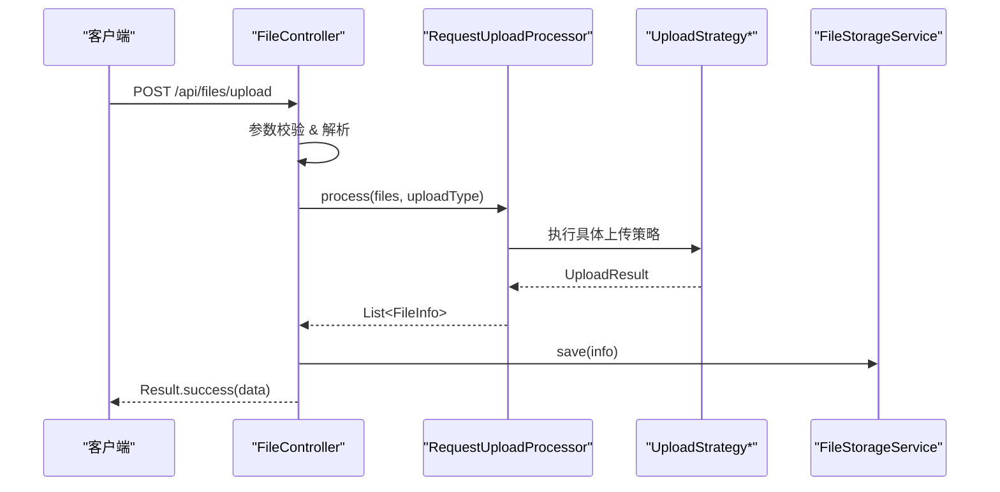
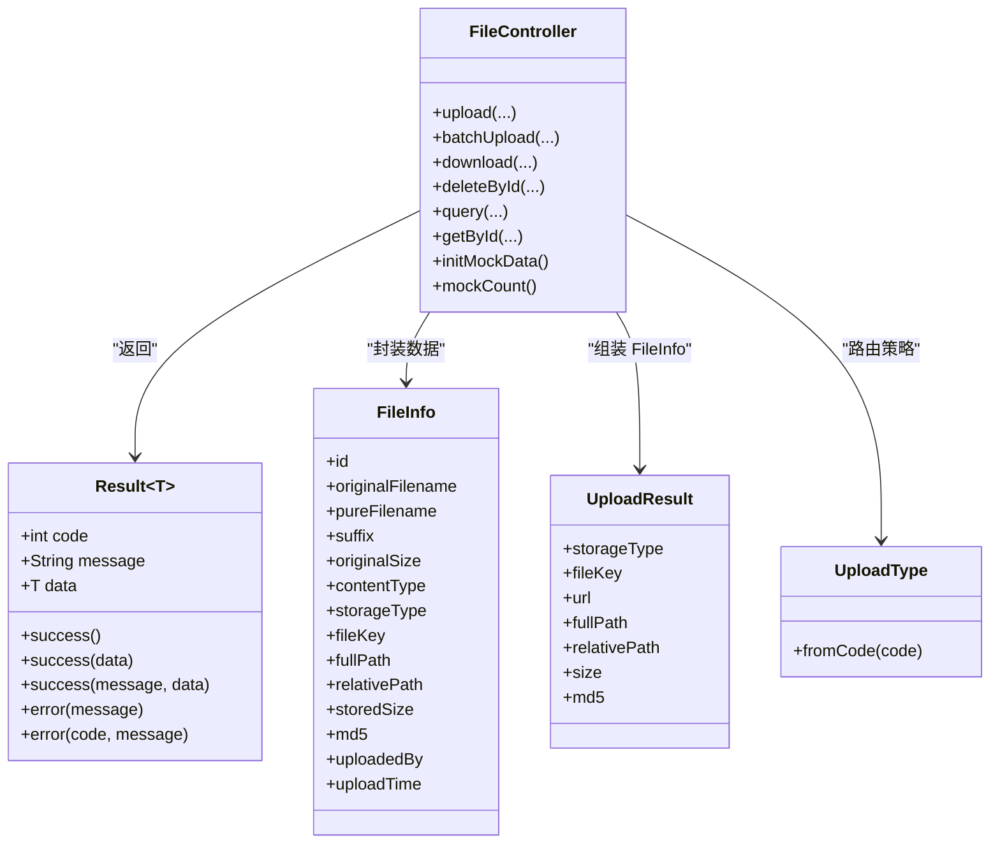

# 统一响应格式

<cite>
**本文引用的文件**
- [Result.java](file://src/main/java/com/example/fileupload/model/Result.java)
- [FileController.java](file://src/main/java/com/example/fileupload/controller/FileController.java)
- [FileInfo.java](file://src/main/java/com/example/fileupload/model/FileInfo.java)
- [UploadResult.java](file://src/main/java/com/example/fileupload/model/UploadResult.java)
- [UploadType.java](file://src/main/java/com/example/fileupload/enums/UploadType.java)
- [application.yml](file://src/main/resources/application.yml)
- [pom.xml](file://pom.xml)
</cite>

## 目录
1. [简介](#简介)
2. [项目结构](#项目结构)
3. [核心组件](#核心组件)
4. [架构总览](#架构总览)
5. [详细组件分析](#详细组件分析)
6. [依赖关系分析](#依赖关系分析)
7. [性能考虑](#性能考虑)
8. [故障排查指南](#故障排查指南)
9. [结论](#结论)
10. [附录](#附录)

## 简介
本参考文档围绕 API 的统一响应格式展开，重点说明 Result 包装器的结构与字段规范、HTTP 状态码与业务状态码的映射、标准错误码定义、成功与错误响应的 JSON 示例、自定义扩展字段的方法与最佳实践、前端集成处理策略，以及响应数据的序列化与版本兼容性考虑。该规范适用于本项目所有 REST 接口，确保前后端交互一致、可维护、可扩展。

## 项目结构
本项目基于 Spring Boot 构建，采用控制器-服务-策略的分层设计。统一响应由 Result 模型提供，控制器在各接口中返回 Result 实例；数据模型包括 FileInfo、UploadResult 等枚举 UploadType 用于标识存储类型；应用配置在 application.yml 中管理。

图表来源
- [FileController.java:31-48](file://src/main/java/com/example/fileupload/controller/FileController.java#L31-L48)
- [Result.java:6-46](file://src/main/java/com/example/fileupload/model/Result.java#L6-L46)

章节来源
- [FileController.java:31-48](file://src/main/java/com/example/fileupload/controller/FileController.java#L31-L48)
- [application.yml:1-32](file://src/main/resources/application.yml#L1-L32)
- [pom.xml:1-82](file://pom.xml#L1-L82)

## 核心组件
- Result 统一响应体：包含 code（业务状态码）、message（提示信息）、data（业务数据）。提供 success/error 静态方法快速构造响应。
- 控制器 FileController：所有接口均返回 Result，并在异常时返回统一的错误响应。
- 数据模型 FileInfo、UploadResult：作为 data 的具体承载对象或中间结果。
- 枚举 UploadType：用于路由不同上传策略，非法值会抛出异常并被控制器捕获为 400 错误。

章节来源
- [Result.java:6-46](file://src/main/java/com/example/fileupload/model/Result.java#L6-L46)
- [FileController.java:50-317](file://src/main/java/com/example/fileupload/controller/FileController.java#L50-L317)
- [FileInfo.java:8-75](file://src/main/java/com/example/fileupload/model/FileInfo.java#L8-L75)
- [UploadResult.java:6-38](file://src/main/java/com/example/fileupload/model/UploadResult.java#L6-L38)
- [UploadType.java:6-34](file://src/main/java/com/example/fileupload/enums/UploadType.java#L6-L34)

## 架构总览
下图展示了典型请求到响应的流程，突出统一响应 Result 的使用方式。

图表来源
- [FileController.java:58-84](file://src/main/java/com/example/fileupload/controller/FileController.java#L58-L84)
- [FileController.java:138-154](file://src/main/java/com/example/fileupload/controller/FileController.java#L138-L154)

## 详细组件分析

### Result 统一响应体
- 字段说明
  - code：业务状态码。约定 200 表示成功，其他为非成功状态（如 400、404、500）。
  - message：人类可读的提示信息，用于描述成功或失败原因。
  - data：业务数据，可为任意类型 T；成功时可省略或为空；失败时通常为 null。
- 构造方式
  - 成功：success()、success(data)、success(message, data)
  - 错误：error(message)、error(code, message)
- 使用建议
  - 所有接口统一返回 Result，便于前端统一解析。
  - 业务错误优先通过 code 表达，message 仅用于提示。
  - 避免在 message 中携带敏感信息。

章节来源
- [Result.java:6-46](file://src/main/java/com/example/fileupload/model/Result.java#L6-L46)

### 控制器中的响应模式
- 成功响应
  - 单对象：Result.success(data)
  - 列表：Result.success(list)
  - 无数据：Result.success()
- 错误响应
  - 参数错误：Result.error(400, "xxx")
  - 资源不存在：Result.error(404, "xxx")
  - 系统异常：Result.error(500, "xxx")
- 特殊场景
  - 下载接口直接返回 ResponseEntity<byte[]>，不走 Result；前端需按 HTTP 状态码判断。

章节来源
- [FileController.java:58-84](file://src/main/java/com/example/fileupload/controller/FileController.java#L58-L84)
- [FileController.java:93-133](file://src/main/java/com/example/fileupload/controller/FileController.java#L93-L133)
- [FileController.java:163-194](file://src/main/java/com/example/fileupload/controller/FileController.java#L163-L194)
- [FileController.java:203-227](file://src/main/java/com/example/fileupload/controller/FileController.java#L203-L227)
- [FileController.java:236-280](file://src/main/java/com/example/fileupload/controller/FileController.java#L236-L280)
- [FileController.java:287-292](file://src/main/java/com/example/fileupload/controller/FileController.java#L287-L292)
- [FileController.java:302-317](file://src/main/java/com/example/fileupload/controller/FileController.java#L302-L317)

### 数据模型与封装
- FileInfo：文件元数据，包含原始文件名、大小、MIME、存储类型、路径、MD5、上传者、时间等。
- UploadResult：上传策略返回的通用结果，供控制器组装 FileInfo。
- 分页查询：返回 Map 结构，包含 total、page、size、list 四个键。

章节来源
- [FileInfo.java:8-75](file://src/main/java/com/example/fileupload/model/FileInfo.java#L8-L75)
- [UploadResult.java:6-38](file://src/main/java/com/example/fileupload/model/UploadResult.java#L6-L38)
- [FileController.java:236-280](file://src/main/java/com/example/fileupload/controller/FileController.java#L236-L280)

### 错误处理与状态码映射
- 业务状态码
  - 200：成功
  - 400：参数错误或非法输入（如不支持的 uploadType）
  - 404：资源不存在（如删除/查询时文件不存在）
  - 500：服务器内部错误（如上传/删除失败）
- HTTP 状态码
  - 大多数接口返回 HTTP 200，业务错误通过 Result.code 表达。
  - 下载接口根据情况返回 200 或 404（未找到），错误返回 500。
- 异常来源
  - 枚举转换异常：IllegalArgumentException 被捕获并转为 400。
  - IO 异常：IOException 被捕获并转为 500。

章节来源
- [FileController.java:62-84](file://src/main/java/com/example/fileupload/controller/FileController.java#L62-L84)
- [FileController.java:97-133](file://src/main/java/com/example/fileupload/controller/FileController.java#L97-L133)
- [FileController.java:163-194](file://src/main/java/com/example/fileupload/controller/FileController.java#L163-L194)
- [FileController.java:203-227](file://src/main/java/com/example/fileupload/controller/FileController.java#L203-L227)
- [UploadType.java:23-34](file://src/main/java/com/example/fileupload/enums/UploadType.java#L23-L34)

### 成功与错误响应示例
- 成功响应（单对象）
  - 结构：{ "code": 200, "message": "success", "data": { ... } }
  - 数据来源：Result.success(data)
- 成功响应（列表）
  - 结构：{ "code": 200, "message": "success", "data": [ ... ] }
  - 数据来源：Result.success(list)
- 成功响应（分页）
  - 结构：{ "code": 200, "message": "success", "data": { "total": N, "page": P, "size": S, "list": [...] } }
  - 数据来源：Result.success(map)
- 错误响应（参数错误）
  - 结构：{ "code": 400, "message": "xxx", "data": null }
  - 数据来源：Result.error(400, "xxx")
- 错误响应（资源不存在）
  - 结构：{ "code": 404, "message": "xxx", "data": null }
  - 数据来源：Result.error(404, "xxx")
- 错误响应（系统异常）
  - 结构：{ "code": 500, "message": "xxx", "data": null }
  - 数据来源：Result.error(500, "xxx")

注意：以上示例为结构示意，实际字段取值遵循 Result 与控制器实现。

章节来源
- [Result.java:20-38](file://src/main/java/com/example/fileupload/model/Result.java#L20-L38)
- [FileController.java:58-84](file://src/main/java/com/example/fileupload/controller/FileController.java#L58-L84)
- [FileController.java:93-133](file://src/main/java/com/example/fileupload/controller/FileController.java#L93-L133)
- [FileController.java:236-280](file://src/main/java/com/example/fileupload/controller/FileController.java#L236-L280)

### 自定义扩展字段的方法与最佳实践
- 推荐做法
  - 在 Result.data 中扩展业务对象，保持 Result 结构稳定。
  - 新增字段时保持向后兼容：新增可选字段，不修改已有字段语义。
  - 对敏感字段进行脱敏或按需返回。
- 不推荐做法
  - 直接在 Result 中添加大量业务字段，导致耦合度高、难以演进。
  - 在 message 中传递结构化数据，不利于前端解析。
- 版本控制
  - 如需破坏性变更，可通过新增接口版本或增加 version 字段区分。
  - 对旧字段保留兼容期，逐步废弃。

章节来源
- [Result.java:6-46](file://src/main/java/com/example/fileupload/model/Result.java#L6-L46)
- [FileInfo.java:8-75](file://src/main/java/com/example/fileupload/model/FileInfo.java#L8-L75)

### 前端集成处理示例与错误处理策略
- 统一解析
  - 检查 httpStatus 是否为 200。
  - 若为 200，读取 body.code：
    - 200：从 body.data 获取业务数据。
    - 非 200：根据 body.message 展示错误。
- 下载接口
  - 若返回二进制流且 httpStatus 为 200，则视为成功下载。
  - 若返回 404/500，则提示用户重试或联系支持。
- 错误分类
  - 400：提示用户修正输入（如文件格式、必填项）。
  - 404：提示资源不存在或链接失效。
  - 500：提示系统繁忙，稍后重试。
- 重试与降级
  - 对网络超时或 5xx 错误实施指数退避重试。
  - 对关键操作提供降级方案（如缓存上次成功结果）。

章节来源
- [FileController.java:58-84](file://src/main/java/com/example/fileupload/controller/FileController.java#L58-L84)
- [FileController.java:163-194](file://src/main/java/com/example/fileupload/controller/FileController.java#L163-L194)

### 响应数据的序列化与版本兼容性
- 序列化框架
  - 项目基于 Spring Boot Web，默认使用 Jackson 进行 JSON 序列化。
- 兼容性建议
  - 新增字段默认允许前端忽略，避免破坏旧客户端。
  - 移除或重命名字段需评估影响，必要时提供过渡期双字段。
  - 对日期字段统一格式（如 ISO-8601），避免时区问题。
- 配置位置
  - 应用配置位于 application.yml，可在需要时调整序列化相关全局设置。

章节来源
- [pom.xml:24-71](file://pom.xml#L24-L71)
- [application.yml:1-32](file://src/main/resources/application.yml#L1-L32)

## 依赖关系分析
- 控制器依赖
  - RequestUploadProcessor：统一处理上传流程。
  - FileStorageService：持久化文件元数据。
  - UploadStrategyFactory：根据 UploadType 选择具体策略。
- 策略层
  - Local/Ftp/Oss 三种上传策略，分别实现本地、FTP、对象存储。
- 响应体
  - Result 作为所有接口的统一返回结构。

图表来源
- [FileController.java:31-317](file://src/main/java/com/example/fileupload/controller/FileController.java#L31-L317)
- [Result.java:6-46](file://src/main/java/com/example/fileupload/model/Result.java#L6-L46)
- [FileInfo.java:8-75](file://src/main/java/com/example/fileupload/model/FileInfo.java#L8-L75)
- [UploadResult.java:6-38](file://src/main/java/com/example/fileupload/model/UploadResult.java#L6-L38)
- [UploadType.java:6-34](file://src/main/java/com/example/fileupload/enums/UploadType.java#L6-L34)

章节来源
- [FileController.java:31-317](file://src/main/java/com/example/fileupload/controller/FileController.java#L31-L317)
- [Result.java:6-46](file://src/main/java/com/example/fileupload/model/Result.java#L6-L46)
- [FileInfo.java:8-75](file://src/main/java/com/example/fileupload/model/FileInfo.java#L8-L75)
- [UploadResult.java:6-38](file://src/main/java/com/example/fileupload/model/UploadResult.java#L6-L38)
- [UploadType.java:6-34](file://src/main/java/com/example/fileupload/enums/UploadType.java#L6-L34)

## 性能考虑
- 批量上传
  - 复用连接减少开销（如 FTP 批量上传）。
- 分页查询
  - 合理设置 page/size，避免一次性返回过多数据。
- 大文件下载
  - 使用流式传输，避免内存溢出。
- 日志与监控
  - 记录关键步骤耗时与错误，便于定位瓶颈。

[本节为通用指导，无需特定文件引用]

## 故障排查指南
- 常见问题
  - 上传失败：检查 uploadType 是否合法、文件类型是否被允许、存储后端是否可达。
  - 下载失败：确认 fileKey 是否存在、权限是否正确、网络连通性。
  - 删除失败：确认底层存储中文件是否存在、权限是否足够。
- 定位方法
  - 查看控制器日志输出，关注异常堆栈。
  - 检查 application.yml 中存储配置是否正确。
  - 对 FTP/OSS 策略，核对 endpoint、bucket、路径前缀等配置。

章节来源
- [FileController.java:62-84](file://src/main/java/com/example/fileupload/controller/FileController.java#L62-L84)
- [FileController.java:163-194](file://src/main/java/com/example/fileupload/controller/FileController.java#L163-L194)
- [FileController.java:203-227](file://src/main/java/com/example/fileupload/controller/FileController.java#L203-L227)
- [application.yml:12-28](file://src/main/resources/application.yml#L12-L28)

## 结论
本项目通过 Result 统一响应体实现了稳定的 API 契约，结合明确的业务状态码与错误消息，使前后端协作更加顺畅。建议在后续迭代中持续完善错误码字典、增强前端错误处理与重试机制，并对响应数据进行版本化管理，确保长期可维护性与兼容性。

[本节为总结，无需特定文件引用]

## 附录
- 常用接口与返回结构
  - 上传：POST /api/files/upload → Result<List<FileInfo>|FileInfo>
  - 批量上传：POST /api/files/upload/batch → Result<List<FileInfo>>
  - 下载：GET /api/files/download → byte[]（HTTP 200/404/500）
  - 删除：DELETE /api/files/{id} → Result<String>
  - 查询：GET /api/files → Result<Map>
  - 按 ID 查询：GET /api/files/{id} → Result<FileInfo>
  - Mock 初始化：POST /api/files/mock/init → Result<String>
  - Mock 计数：GET /api/files/mock/count → Result<Integer>

章节来源
- [FileController.java:58-317](file://src/main/java/com/example/fileupload/controller/FileController.java#L58-L317)