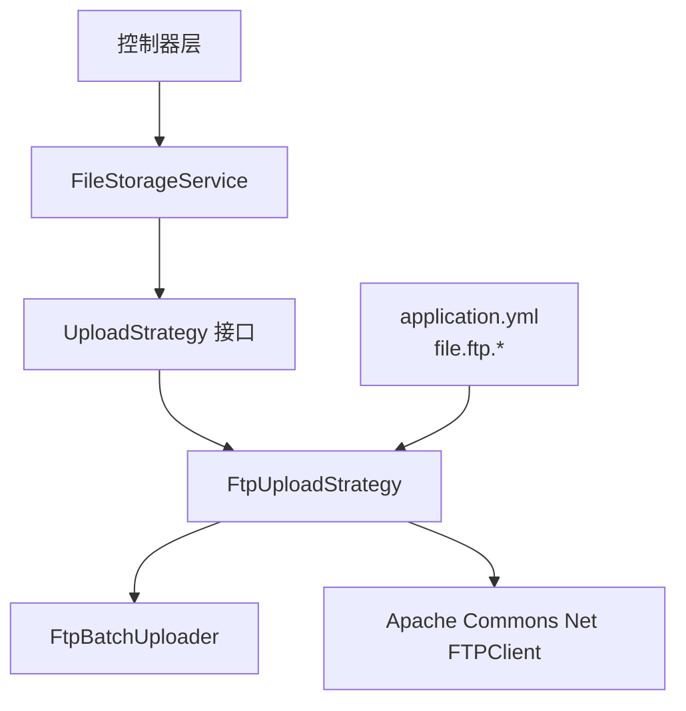
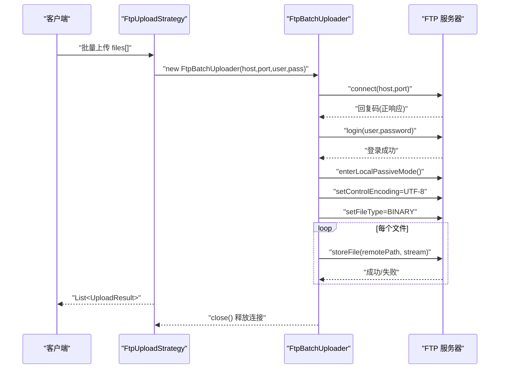
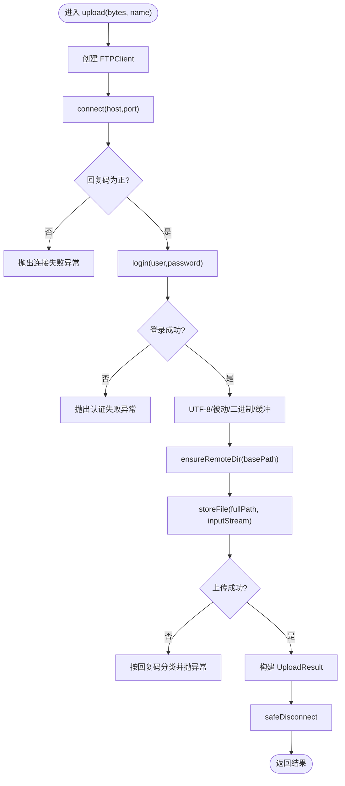
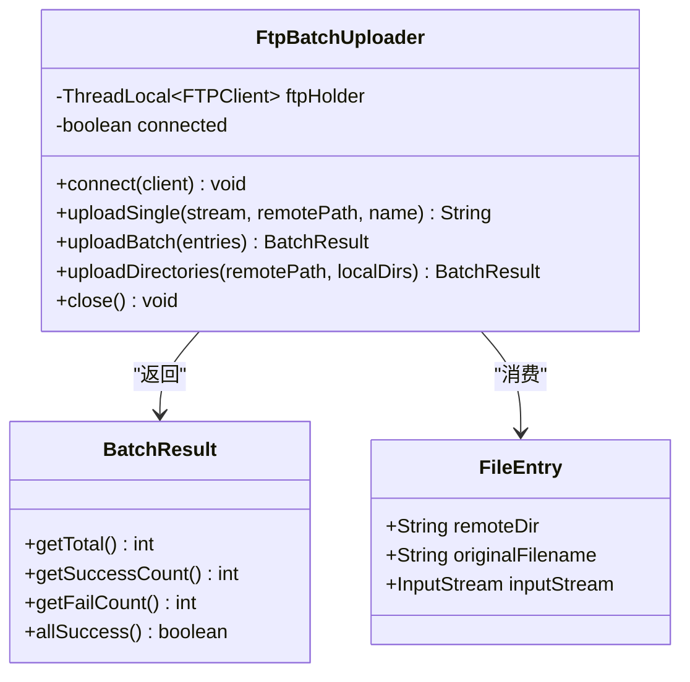
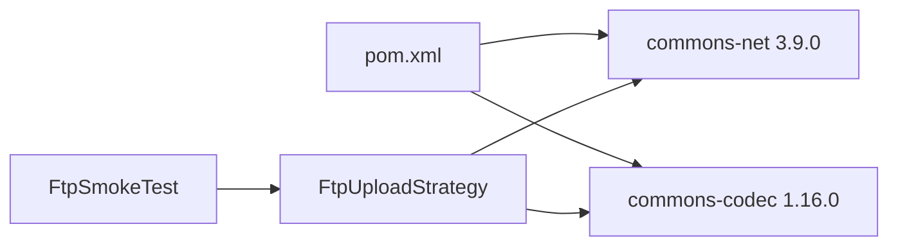

# FTP服务器存储策略

<cite>
**本文引用的文件**
- [FtpUploadStrategy.java](file://src/main/java/com/example/fileupload/strategy/FtpUploadStrategy.java)
- [FtpBatchUploader.java](file://src/main/java/com/example/fileupload/service/FtpBatchUploader.java)
- [application.yml](file://src/main/resources/application.yml)
- [UploadStrategy.java](file://src/main/java/com/example/fileupload/strategy/UploadStrategy.java)
- [UploadResult.java](file://src/main/java/com/example/fileupload/model/UploadResult.java)
- [UploadType.java](file://src/main/java/com/example/fileupload/enums/UploadType.java)
- [pom.xml](file://pom.xml)
- [FtpSmokeTest.java](file://src/test/java/com/example/fileupload/FtpSmokeTest.java)
</cite>

## 目录
1. [简介](#简介)
2. [项目结构](#项目结构)
3. [核心组件](#核心组件)
4. [架构总览](#架构总览)
5. [详细组件分析](#详细组件分析)
6. [依赖关系分析](#依赖关系分析)
7. [性能与连接复用](#性能与连接复用)
8. [安全配置建议](#安全配置建议)
9. [常见FTP服务器配置示例](#常见ftp服务器配置示例)
10. [故障排查指南](#故障排查指南)
11. [结论](#结论)

## 简介
本文件围绕 FtpUploadStrategy 实现，系统化说明基于 Apache Commons Net 的 FTP 文件传输方案。内容涵盖：
- 连接建立、认证机制、数据传输模式（主动/被动）与会话管理
- FTP 服务器配置参数（主机、端口、用户名、密码、基础路径等）
- 批量上传的连接复用优化
- 安全加固建议（FTPS、防火墙、超时）
- 常见 FTP 服务器配置与排错要点

## 项目结构
本项目采用策略模式组织不同存储后端，FTP 作为其中一种策略实现；并通过独立的批量上传工具类提升吞吐与稳定性。

图表来源
- [FtpUploadStrategy.java:36-55](file://src/main/java/com/example/fileupload/strategy/FtpUploadStrategy.java#L36-L55)
- [FtpBatchUploader.java:23-81](file://src/main/java/com/example/fileupload/service/FtpBatchUploader.java#L23-L81)
- [application.yml:12-27](file://src/main/resources/application.yml#L12-L27)

章节来源
- [application.yml:12-27](file://src/main/resources/application.yml#L12-L27)
- [UploadStrategy.java:10-74](file://src/main/java/com/example/fileupload/strategy/UploadStrategy.java#L10-L74)

## 核心组件
- FtpUploadStrategy：实现 UploadStrategy 接口的 FTP 策略，提供单文件上传/下载/删除与批量上传能力，封装连接创建、认证、编码与模式设置、错误分类与资源释放。
- FtpBatchUploader：线程内连接复用器，使用 ThreadLocal 绑定 FTPClient，减少握手开销，支持单文件与批量上传、目录扫描上传。
- UploadResult / UploadType：统一返回结果与类型枚举，便于上层聚合与展示。
- application.yml：集中配置 FTP 主机、端口、凭据、基础路径等。

章节来源
- [FtpUploadStrategy.java:36-193](file://src/main/java/com/example/fileupload/strategy/FtpUploadStrategy.java#L36-L193)
- [FtpBatchUploader.java:23-124](file://src/main/java/com/example/fileupload/service/FtpBatchUploader.java#L23-L124)
- [UploadResult.java:1-39](file://src/main/java/com/example/fileupload/model/UploadResult.java#L1-L39)
- [UploadType.java:1-35](file://src/main/java/com/example/fileupload/enums/UploadType.java#L1-L35)
- [application.yml:12-27](file://src/main/resources/application.yml#L12-L27)

## 架构总览
下图展示了从请求到 FTP 服务器的完整调用链，包括连接建立、认证、数据通道与资源释放。

图表来源
- [FtpUploadStrategy.java:126-186](file://src/main/java/com/example/fileupload/strategy/FtpUploadStrategy.java#L126-L186)
- [FtpBatchUploader.java:47-81](file://src/main/java/com/example/fileupload/service/FtpBatchUploader.java#L47-L81)
- [FtpBatchUploader.java:103-124](file://src/main/java/com/example/fileupload/service/FtpBatchUploader.java#L103-L124)

## 详细组件分析

### FtpUploadStrategy 组件
职责
- 暴露统一的上传/下载/删除/批量上传接口
- 单文件场景：每次操作创建独立 FTPClient，完成后安全断开
- 批量场景：委托 FtpBatchUploader 复用同一连接完成多次 storeFile
- 统一错误分类与日志记录，保证可观测性

关键流程
- 连接建立：connect(host, port)，校验回复码
- 认证：login(username, password)
- 传输模式：UTF-8 控制编码、被动模式、二进制类型、缓冲区大小
- 路径处理：规范化 base path，拼接保存名（UUID_原文件名）
- 目录创建：逐级 mkdir -p 语义，捕获权限/路径非法等错误并抛出友好异常
- 资源释放：finally 中 logout + disconnect

图表来源
- [FtpUploadStrategy.java:63-74](file://src/main/java/com/example/fileupload/strategy/FtpUploadStrategy.java#L63-L74)
- [FtpUploadStrategy.java:206-236](file://src/main/java/com/example/fileupload/strategy/FtpUploadStrategy.java#L206-L236)
- [FtpUploadStrategy.java:238-263](file://src/main/java/com/example/fileupload/strategy/FtpUploadStrategy.java#L238-L263)
- [FtpUploadStrategy.java:287-325](file://src/main/java/com/example/fileupload/strategy/FtpUploadStrategy.java#L287-L325)
- [FtpUploadStrategy.java:335-352](file://src/main/java/com/example/fileupload/strategy/FtpUploadStrategy.java#L335-L352)
- [FtpUploadStrategy.java:354-359](file://src/main/java/com/example/fileupload/strategy/FtpUploadStrategy.java#L354-L359)

章节来源
- [FtpUploadStrategy.java:36-193](file://src/main/java/com/example/fileupload/strategy/FtpUploadStrategy.java#L36-L193)
- [FtpUploadStrategy.java:206-359](file://src/main/java/com/example/fileupload/strategy/FtpUploadStrategy.java#L206-L359)

### FtpBatchUploader 组件
职责
- 通过 ThreadLocal 在同一线程内复用 FTPClient，避免重复握手
- 提供单文件与批量上传、目录递归上传能力
- 统一错误分类与目录创建逻辑

设计要点
- getFtpClient() 懒连接：首次或断线时 connect()
- uploadBatch() 循环 storeFile，异常逐条记录，最终汇总
- createRemoteDirs() 逐层创建目录，区分权限/路径非法等错误
- close() 确保 logout/disconnect 并清理 ThreadLocal

图表来源
- [FtpBatchUploader.java:23-81](file://src/main/java/com/example/fileupload/service/FtpBatchUploader.java#L23-L81)
- [FtpBatchUploader.java:103-124](file://src/main/java/com/example/fileupload/service/FtpBatchUploader.java#L103-L124)
- [FtpBatchUploader.java:272-313](file://src/main/java/com/example/fileupload/service/FtpBatchUploader.java#L272-L313)

章节来源
- [FtpBatchUploader.java:23-124](file://src/main/java/com/example/fileupload/service/FtpBatchUploader.java#L23-L124)
- [FtpBatchUploader.java:167-255](file://src/main/java/com/example/fileupload/service/FtpBatchUploader.java#L167-L255)
- [FtpBatchUploader.java:345-370](file://src/main/java/com/example/fileupload/service/FtpBatchUploader.java#L345-L370)

### 数据模型与类型
- UploadResult：包含 storageType、fileKey、url、size、md5 等字段，用于统一返回信息
- UploadType：枚举 LOCAL/FTP/OSS，标识存储后端

章节来源
- [UploadResult.java:1-39](file://src/main/java/com/example/fileupload/model/UploadResult.java#L1-L39)
- [UploadType.java:1-35](file://src/main/java/com/example/fileupload/enums/UploadType.java#L1-L35)

## 依赖关系分析
- 运行时依赖：Apache Commons Net（FTP 客户端）、Commons Codec（MD5）
- Spring 注入：@Value 读取 application.yml 中的 file.ftp.* 配置
- 测试覆盖：FtpSmokeTest 覆盖单文件/批量/下载/删除/错误处理全链路

图表来源
- [pom.xml:51-70](file://pom.xml#L51-L70)
- [FtpUploadStrategy.java:3-15](file://src/main/java/com/example/fileupload/strategy/FtpUploadStrategy.java#L3-L15)
- [FtpSmokeTest.java:68-71](file://src/test/java/com/example/fileupload/FtpSmokeTest.java#L68-L71)

章节来源
- [pom.xml:51-70](file://pom.xml#L51-L70)
- [FtpUploadStrategy.java:3-15](file://src/main/java/com/example/fileupload/strategy/FtpUploadStrategy.java#L3-L15)
- [FtpSmokeTest.java:68-71](file://src/test/java/com/example/fileupload/FtpSmokeTest.java#L68-L71)

## 性能与连接复用
- 单文件上传：每次新建 FTPClient，适合低频或小文件场景
- 批量上传：通过 FtpBatchUploader 在单线程内复用同一连接，显著降低 TCP/TLS 握手与认证开销
- 传输优化：
  - 控制命令 UTF-8 编码，避免中文乱码
  - 被动模式穿透 NAT/防火墙
  - 二进制模式避免文本模式转换
  - 缓冲区大小调优（默认 8192）
- 目录创建：逐级 mkdir -p 语义，减少往返次数

章节来源
- [FtpUploadStrategy.java:116-186](file://src/main/java/com/example/fileupload/strategy/FtpUploadStrategy.java#L116-L186)
- [FtpBatchUploader.java:27-81](file://src/main/java/com/example/fileupload/service/FtpBatchUploader.java#L27-L81)
- [FtpBatchUploader.java:103-124](file://src/main/java/com/example/fileupload/service/FtpBatchUploader.java#L103-L124)

## 安全配置建议
- 加密传输（FTPS）
  - 当前实现为明文 FTP；如需加密，应在网络层或代理层启用 TLS（如反向代理/网关），或在服务端启用 FTPS 并在客户端侧切换为 SSL 模式（需扩展客户端配置）
- 防火墙与端口
  - 开放控制端口（默认 21）与被动模式数据端口范围
  - 若启用被动模式，确保服务器被动端口范围对应用网段放行
- 超时与重试
  - 建议在网关/代理层配置连接与读写超时
  - 业务层可根据错误码进行有限次重试（如 421/425/426）
- 最小权限原则
  - 为应用分配只读/写入分离账户，限制目录范围
  - 禁用危险命令（如 shell 访问）
- 审计与监控
  - 开启 FTP 服务日志，结合应用日志定位问题
  - 对失败率、延迟、带宽进行监控告警

[本节为通用安全建议，不直接分析具体代码文件]

## 常见FTP服务器配置示例
以下示例聚焦于“被动模式”和“用户目录隔离”，请根据实际环境调整端口与路径。

- vsftpd（Linux）
  - 启用被动模式：设置 passive_min_port/passive_max_port，并确保防火墙放行该范围
  - 用户隔离：chroot_local_user=YES，配合 user_sub_token 映射家目录
  - 字符集：启用 utf8_filesystem 或使用支持 UTF-8 的客户端
- ProFTPD（Linux）
  - PassivePorts 指定被动端口范围
  - DefaultRoot 将用户锁定到家目录
  - TransferLog 输出传输日志便于排障
- Windows IIS FTP
  - 站点绑定端口 21，启用“被动模式”并配置 IP 范围
  - 用户隔离至虚拟目录，限制写权限
- 云托管 FTP（如对象存储网关）
  - 通常以桶/前缀模拟目录，注意命名规范与大小写敏感

[本节为概念性指导，不直接分析具体代码文件]

## 故障排查指南
常见问题与定位步骤

- 连接失败（421/拒绝）
  - 检查 host/port 是否正确，网络可达性
  - 查看服务器是否运行、防火墙是否放行
  - 参考：连接建立与回复码检查
- 认证失败
  - 核对 username/password，确认账户状态与权限
  - 参考：登录流程与错误提示
- 被动模式数据连接失败（425）
  - 确认被动端口范围已开放
  - 检查 NAT/防火墙/负载均衡器的端口转发
  - 参考：被动模式与缓冲区设置
- 权限不足（550）
  - 检查用户对目标目录的写权限
  - 参考：目录创建与权限错误分类
- 路径无效或文件名不允许（553）
  - 检查路径合法性、特殊字符、保留名
  - 参考：路径解析与错误分类
- 磁盘空间不足（552）
  - 检查服务器剩余空间与配额
- 传输中断（426）
  - 检查网络稳定性、MTU、代理超时
  - 适当增大缓冲区或分块传输（可在上层实现）

章节来源
- [FtpUploadStrategy.java:206-236](file://src/main/java/com/example/fileupload/strategy/FtpUploadStrategy.java#L206-L236)
- [FtpUploadStrategy.java:287-325](file://src/main/java/com/example/fileupload/strategy/FtpUploadStrategy.java#L287-L325)
- [FtpUploadStrategy.java:335-352](file://src/main/java/com/example/fileupload/strategy/FtpUploadStrategy.java#L335-L352)
- [FtpBatchUploader.java:167-255](file://src/main/java/com/example/fileupload/service/FtpBatchUploader.java#L167-L255)

## 结论
FtpUploadStrategy 提供了稳定、可观测且易于扩展的 FTP 存储策略实现。通过单文件直连与批量连接复用的组合，兼顾了简单性与高性能。结合合理的网络与安全配置、完善的错误分类与日志，可在生产环境中可靠地支撑文件上传/下载与批量处理需求。对于需要加密的场景，建议在网络层或代理层引入 TLS，并结合最小权限与审计策略保障数据安全。