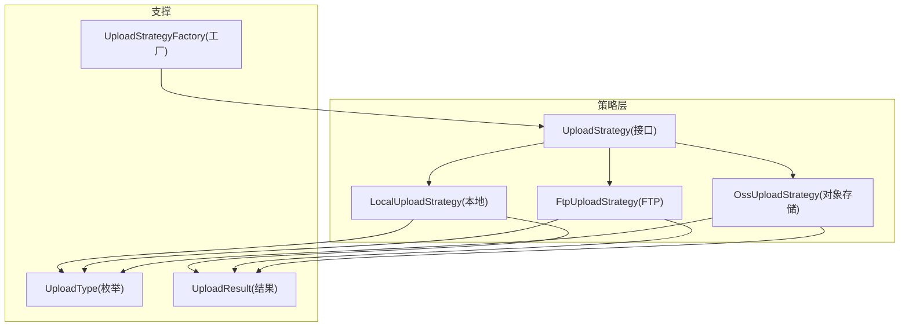
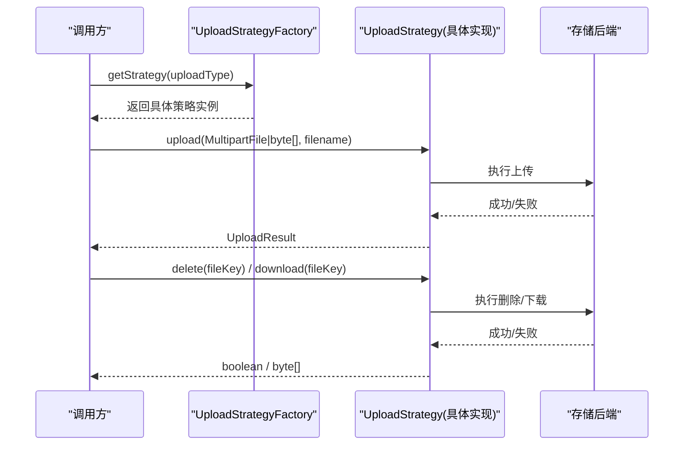
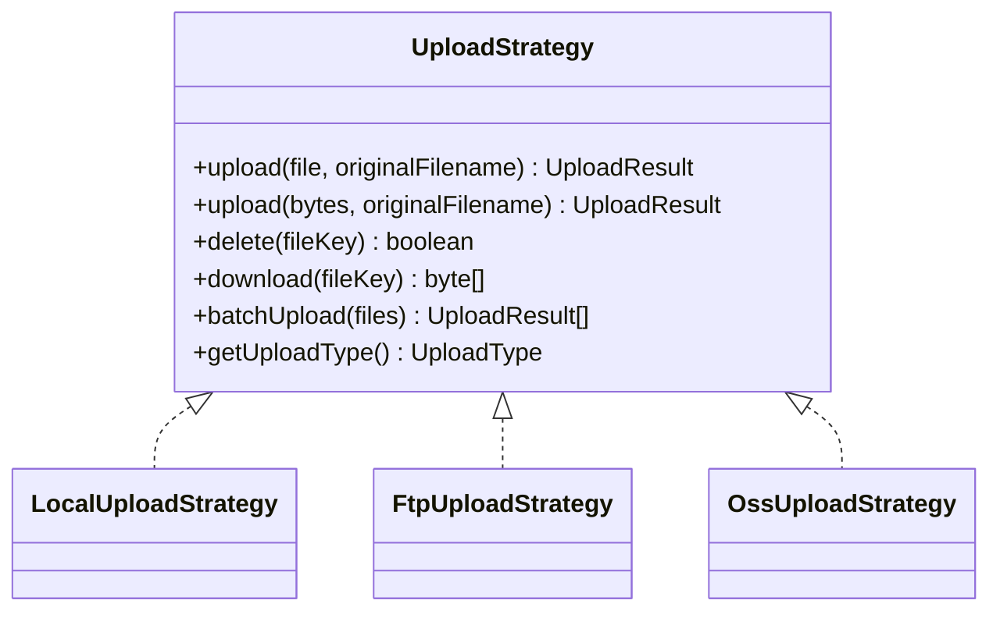
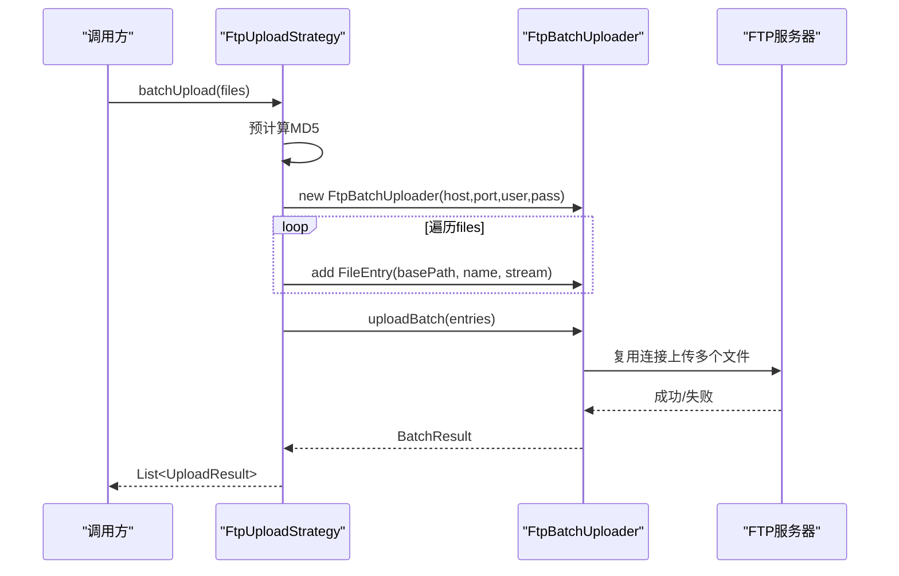
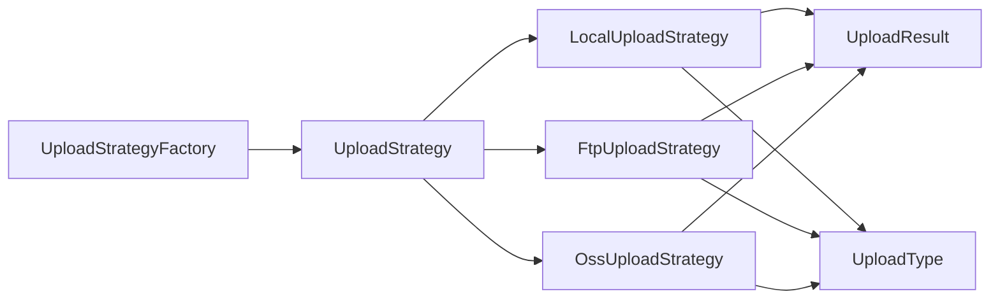

# UploadStrategy接口设计

<cite>
**本文引用的文件**
- [UploadStrategy.java](file://src/main/java/com/example/fileupload/strategy/UploadStrategy.java)
- [LocalUploadStrategy.java](file://src/main/java/com/example/fileupload/strategy/LocalUploadStrategy.java)
- [FtpUploadStrategy.java](file://src/main/java/com/example/fileupload/strategy/FtpUploadStrategy.java)
- [OssUploadStrategy.java](file://src/main/java/com/example/fileupload/strategy/OssUploadStrategy.java)
- [UploadType.java](file://src/main/java/com/example/fileupload/enums/UploadType.java)
- [UploadResult.java](file://src/main/java/com/example/fileupload/model/UploadResult.java)
- [UploadStrategyFactory.java](file://src/main/java/com/example/fileupload/strategy/UploadStrategyFactory.java)
</cite>

## 目录
1. [简介](#简介)
2. [项目结构](#项目结构)
3. [核心组件](#核心组件)
4. [架构总览](#架构总览)
5. [详细组件分析](#详细组件分析)
6. [依赖关系分析](#依赖关系分析)
7. [性能考量](#性能考量)
8. [故障排查指南](#故障排查指南)
9. [结论](#结论)
10. [附录：使用示例与最佳实践](#附录使用示例与最佳实践)

## 简介
本文件围绕 UploadStrategy 接口进行系统化文档化，解释策略模式在文件上传场景中的统一抽象。该接口定义了统一的上传、删除、下载、批量上传以及类型识别能力，并通过多种实现（本地磁盘、FTP、对象存储）屏蔽底层差异，使上层业务可以以一致的方式调用不同存储后端。同时提供工厂类自动注册并路由到具体策略，便于扩展新的存储方式。

## 项目结构
- 策略接口与实现位于 strategy 包，包含统一接口与三种典型实现。
- 枚举 UploadType 标识支持的存储类型，供工厂路由与结果标记。
- 模型 UploadResult 承载上传后的通用元数据。
- 工厂 UploadStrategyFactory 负责收集所有策略并按类型分发。

图表来源
- [UploadStrategy.java:1-74](file://src/main/java/com/example/fileupload/strategy/UploadStrategy.java#L1-L74)
- [LocalUploadStrategy.java:1-190](file://src/main/java/com/example/fileupload/strategy/LocalUploadStrategy.java#L1-L190)
- [FtpUploadStrategy.java:1-361](file://src/main/java/com/example/fileupload/strategy/FtpUploadStrategy.java#L1-L361)
- [OssUploadStrategy.java:1-217](file://src/main/java/com/example/fileupload/strategy/OssUploadStrategy.java#L1-L217)
- [UploadType.java:1-35](file://src/main/java/com/example/fileupload/enums/UploadType.java#L1-L35)
- [UploadResult.java:1-39](file://src/main/java/com/example/fileupload/model/UploadResult.java#L1-L39)
- [UploadStrategyFactory.java:1-57](file://src/main/java/com/example/fileupload/strategy/UploadStrategyFactory.java#L1-L57)

章节来源
- [UploadStrategy.java:1-74](file://src/main/java/com/example/fileupload/strategy/UploadStrategy.java#L1-L74)
- [UploadType.java:1-35](file://src/main/java/com/example/fileupload/enums/UploadType.java#L1-L35)
- [UploadResult.java:1-39](file://src/main/java/com/example/fileupload/model/UploadResult.java#L1-L39)
- [UploadStrategyFactory.java:1-57](file://src/main/java/com/example/fileupload/strategy/UploadStrategyFactory.java#L1-L57)

## 核心组件
- UploadStrategy：定义统一能力契约，包括单文件上传（MultipartFile 与字节数组）、删除、下载、批量上传、类型识别。
- LocalUploadStrategy：本地磁盘实现，生成唯一文件名、写入文件系统、计算相对路径与 MD5。
- FtpUploadStrategy：FTP 实现，支持连接复用、被动模式、UTF-8 控制编码、二进制传输、错误码分类。
- OssUploadStrategy：MinIO 对象存储实现，客户端生命周期管理、Bucket 自动创建、URL 前缀拼接。
- UploadType：枚举标识 local、ftp、oss。
- UploadResult：上传结果载体，包含存储类型、文件键、URL、完整/相对路径、大小、MD5。
- UploadStrategyFactory：自动收集所有策略实现，按 UploadType 路由。

章节来源
- [UploadStrategy.java:1-74](file://src/main/java/com/example/fileupload/strategy/UploadStrategy.java#L1-L74)
- [LocalUploadStrategy.java:1-190](file://src/main/java/com/example/fileupload/strategy/LocalUploadStrategy.java#L1-L190)
- [FtpUploadStrategy.java:1-361](file://src/main/java/com/example/fileupload/strategy/FtpUploadStrategy.java#L1-L361)
- [OssUploadStrategy.java:1-217](file://src/main/java/com/example/fileupload/strategy/OssUploadStrategy.java#L1-L217)
- [UploadType.java:1-35](file://src/main/java/com/example/fileupload/enums/UploadType.java#L1-L35)
- [UploadResult.java:1-39](file://src/main/java/com/example/fileupload/model/UploadResult.java#L1-L39)
- [UploadStrategyFactory.java:1-57](file://src/main/java/com/example/fileupload/strategy/UploadStrategyFactory.java#L1-L57)

## 架构总览
UploadStrategy 作为策略接口，将不同存储后端的差异封装为统一方法；工厂根据 UploadType 选择具体实现；各实现返回统一的 UploadResult，便于上层聚合与展示。

图表来源
- [UploadStrategyFactory.java:24-55](file://src/main/java/com/example/fileupload/strategy/UploadStrategyFactory.java#L24-L55)
- [UploadStrategy.java:15-72](file://src/main/java/com/example/fileupload/strategy/UploadStrategy.java#L15-L72)
- [LocalUploadStrategy.java:63-118](file://src/main/java/com/example/fileupload/strategy/LocalUploadStrategy.java#L63-L118)
- [FtpUploadStrategy.java:58-114](file://src/main/java/com/example/fileupload/strategy/FtpUploadStrategy.java#L58-L114)
- [OssUploadStrategy.java:78-159](file://src/main/java/com/example/fileupload/strategy/OssUploadStrategy.java#L78-L159)

## 详细组件分析

### UploadStrategy 接口
- 方法概览
  - upload(MultipartFile, String): 上传单个文件，抛出 IOException。
  - upload(byte[], String): 默认实现抛出“未实现”异常，由具体策略覆盖以优化（避免重复读取临时文件）。
  - delete(String): 删除文件，抛出 IOException。
  - download(String): 按 fileKey 下载为字节数组，不存在返回 null，抛出 IOException。
  - batchUpload(List<MultipartFile>): 默认逐个调用字节数组上传；可被覆盖以复用连接提升性能。
  - getUploadType(): 返回 UploadType，用于工厂路由。
- 设计要点
  - 通过两种 upload 重载兼顾便捷性与性能。
  - 默认 batchUpload 提供兜底行为，允许特定策略（如 FTP）覆盖以实现连接复用。
  - 统一异常约定：I/O 相关操作抛出 IOException；非法参数或空值在各实现中做防御性处理。

章节来源
- [UploadStrategy.java:15-72](file://src/main/java/com/example/fileupload/strategy/UploadStrategy.java#L15-L72)

#### 类图（接口与实现）

图表来源
- [UploadStrategy.java:13-72](file://src/main/java/com/example/fileupload/strategy/UploadStrategy.java#L13-L72)
- [LocalUploadStrategy.java:27-118](file://src/main/java/com/example/fileupload/strategy/LocalUploadStrategy.java#L27-L118)
- [FtpUploadStrategy.java:37-193](file://src/main/java/com/example/fileupload/strategy/FtpUploadStrategy.java#L37-L193)
- [OssUploadStrategy.java:30-159](file://src/main/java/com/example/fileupload/strategy/OssUploadStrategy.java#L30-L159)

### LocalUploadStrategy（本地磁盘）
- 关键行为
  - 初始化时解析 base-path，支持根相对路径与工作目录相对路径。
  - 生成唯一文件名（UUID+原始名），必要时追加序号避免冲突。
  - 确保目标目录存在后写入文件，构建 UploadResult（含 storageType、fileKey、fullPath、relativePath、size、md5）。
  - 删除：检查文件存在后删除。
  - 下载：读取文件为字节数组，不存在返回 null。
  - 类型：返回 LOCAL。
- 复杂度与性能
  - 生成唯一名循环次数取决于碰撞概率，通常极低。
  - 读写基于 NIO 与 Commons IO，适合中小文件；大文件建议流式处理。
- 异常处理
  - 目录创建失败、权限不足等会向上抛出异常。
  - 下载失败记录日志并返回 null。

章节来源
- [LocalUploadStrategy.java:40-118](file://src/main/java/com/example/fileupload/strategy/LocalUploadStrategy.java#L40-L118)
- [LocalUploadStrategy.java:120-188](file://src/main/java/com/example/fileupload/strategy/LocalUploadStrategy.java#L120-L188)

### FtpUploadStrategy（FTP）
- 关键行为
  - 单文件上传/删除/下载：每次新建 FTPClient，配置 UTF-8 控制编码、被动模式、二进制类型，完成后安全断开。
  - 批量上传：使用 FtpBatchUploader 复用同一连接，减少握手开销；预计算 MD5，组装 UploadResult。
  - 远程目录创建：逐级 mkdir，捕获常见错误码并转换为友好异常信息。
  - 类型：返回 FTP。
- 异常与错误分类
  - 对常见 FTP 回复码进行分类（权限、路径无效、连接超时、数据连接失败、中断、空间不足等），包装为 IOException。
- 性能特性
  - 批量上传显著降低连接建立成本；单次上传仍为独立连接。

章节来源
- [FtpUploadStrategy.java:58-114](file://src/main/java/com/example/fileupload/strategy/FtpUploadStrategy.java#L58-L114)
- [FtpUploadStrategy.java:126-186](file://src/main/java/com/example/fileupload/strategy/FtpUploadStrategy.java#L126-L186)
- [FtpUploadStrategy.java:206-359](file://src/main/java/com/example/fileupload/strategy/FtpUploadStrategy.java#L206-L359)

#### 序列图（FTP 批量上传）

图表来源
- [FtpUploadStrategy.java:126-186](file://src/main/java/com/example/fileupload/strategy/FtpUploadStrategy.java#L126-L186)

### OssUploadStrategy（MinIO 对象存储）
- 关键行为
  - 启动时根据 access-key/secret-key 初始化 MinioClient，若缺失则跳过初始化并警告。
  - 启动时检查并自动创建 bucket。
  - 上传：生成唯一 objectKey（规范化 basePath），流式 putObject，计算 MD5，构造 URL（urlPrefix + objectKey）。
  - 删除/下载：按 objectKey 调用 removeObject/getObject，失败记录日志并返回 false/null。
  - 类型：返回 OSS。
- 注意事项
  - urlPrefix 建议配置为反向代理地址以便外部访问。
  - 客户端随 JVM 回收，无需显式关闭。

章节来源
- [OssUploadStrategy.java:54-76](file://src/main/java/com/example/fileupload/strategy/OssUploadStrategy.java#L54-L76)
- [OssUploadStrategy.java:78-159](file://src/main/java/com/example/fileupload/strategy/OssUploadStrategy.java#L78-L159)
- [OssUploadStrategy.java:163-215](file://src/main/java/com/example/fileupload/strategy/OssUploadStrategy.java#L163-L215)

### UploadType 枚举
- 作用：标识 local、ftp、oss 三种存储类型，并提供 fromCode 查找。
- 与策略的关系：每个策略实现 getUploadType 返回对应枚举值，供工厂路由。

章节来源
- [UploadType.java:1-35](file://src/main/java/com/example/fileupload/enums/UploadType.java#L1-L35)

### UploadResult 模型
- 字段：storageType、fileKey、url、fullPath、relativePath、size、md5。
- 用途：统一承载上传结果，便于上层组装 FileInfo 或对外响应。

章节来源
- [UploadResult.java:1-39](file://src/main/java/com/example/fileupload/model/UploadResult.java#L1-L39)

### UploadStrategyFactory 工厂
- 自动收集所有 UploadStrategy 实现，构建 Map<UploadType, UploadStrategy>。
- 提供 getStrategy(UploadType) 获取具体策略，找不到时抛出非法参数异常。
- 启动时记录已注册策略数量与类型集合。

章节来源
- [UploadStrategyFactory.java:14-55](file://src/main/java/com/example/fileupload/strategy/UploadStrategyFactory.java#L14-L55)

## 依赖关系分析
- 耦合度
  - 接口与实现松耦合：上层仅依赖 UploadStrategy 接口。
  - 工厂集中管理策略注册与路由，新增策略只需实现接口并声明为组件即可自动注册。
- 外部依赖
  - 本地：文件系统、Commons IO、DigestUtils。
  - FTP：Apache Commons Net（FTPClient）。
  - 对象存储：MinIO Java SDK。
- 潜在循环依赖
  - 当前无循环依赖；策略之间相互独立。

图表来源
- [UploadStrategyFactory.java:21-39](file://src/main/java/com/example/fileupload/strategy/UploadStrategyFactory.java#L21-L39)
- [UploadStrategy.java:13-72](file://src/main/java/com/example/fileupload/strategy/UploadStrategy.java#L13-L72)
- [LocalUploadStrategy.java:27-118](file://src/main/java/com/example/fileupload/strategy/LocalUploadStrategy.java#L27-L118)
- [FtpUploadStrategy.java:37-193](file://src/main/java/com/example/fileupload/strategy/FtpUploadStrategy.java#L37-L193)
- [OssUploadStrategy.java:30-159](file://src/main/java/com/example/fileupload/strategy/OssUploadStrategy.java#L30-L159)

章节来源
- [UploadStrategyFactory.java:21-39](file://src/main/java/com/example/fileupload/strategy/UploadStrategyFactory.java#L21-L39)
- [UploadStrategy.java:13-72](file://src/main/java/com/example/fileupload/strategy/UploadStrategy.java#L13-L72)

## 性能考量
- 批量上传
  - 默认实现逐个调用字节数组上传；FTP 实现覆盖 batchUpload 复用连接，显著减少握手开销。
- 内存占用
  - 下载与上传均可能加载到内存，超大文件建议使用流式处理并限制并发。
- I/O 与网络
  - FTP 启用被动模式与二进制传输，减少乱码与传输问题。
  - 本地磁盘写入前确保目录存在，避免额外系统调用。
- 缓存与复用
  - 策略内部不维护长连接（除 FTP 批量场景），避免资源泄漏；需要时可引入连接池。

[本节为通用指导，不直接分析具体文件]

## 故障排查指南
- 本地存储
  - 路径解析异常：检查 base-path 配置是否以根或相对路径形式正确书写。
  - 权限问题：确保应用有写入目标目录的权限。
- FTP
  - 连接失败：检查 host/port、用户名密码、防火墙与被动模式配置。
  - 乱码：确认控制编码为 UTF-8，传输类型为二进制。
  - 目录创建失败：查看错误码（如 550/553）并调整权限或路径。
- 对象存储（MinIO）
  - 客户端未初始化：检查 access-key/secret-key 配置。
  - Bucket 不存在：启动时会尝试创建，若失败需检查服务端状态与权限。
  - URL 不可访问：确认 urlPrefix 指向可公开访问的反向代理地址。

章节来源
- [LocalUploadStrategy.java:40-61](file://src/main/java/com/example/fileupload/strategy/LocalUploadStrategy.java#L40-L61)
- [FtpUploadStrategy.java:206-359](file://src/main/java/com/example/fileupload/strategy/FtpUploadStrategy.java#L206-L359)
- [OssUploadStrategy.java:54-76](file://src/main/java/com/example/fileupload/strategy/OssUploadStrategy.java#L54-L76)

## 结论
UploadStrategy 通过策略模式将多存储后端的差异抽象为统一接口，配合工厂自动注册与路由，实现了高内聚、低耦合的文件上传体系。各实现分别针对本地、FTP、对象存储进行了针对性优化（如 FTP 的连接复用、MinIO 的客户端生命周期管理），并通过统一的 UploadResult 输出，便于上层整合与扩展。

[本节为总结性内容，不直接分析具体文件]

## 附录：使用示例与最佳实践

### 基本用法流程
- 通过工厂获取策略：根据业务选择的 UploadType 从工厂获取具体策略。
- 单文件上传：调用 upload(MultipartFile, filename) 或 upload(byte[], filename)。
- 批量上传：优先调用 batchUpload(List<MultipartFile>)，以获得连接复用等优化。
- 删除与下载：使用 delete(fileKey) 与 download(fileKey)。
- 结果处理：根据 UploadResult 中的 storageType、fileKey、url、size、md5 等字段进行后续处理。

章节来源
- [UploadStrategyFactory.java:41-55](file://src/main/java/com/example/fileupload/strategy/UploadStrategyFactory.java#L41-L55)
- [UploadStrategy.java:15-72](file://src/main/java/com/example/fileupload/strategy/UploadStrategy.java#L15-L72)

### 最佳实践
- 始终使用字节数组上传接口以避免重复读取临时文件。
- 批量上传优先使用覆盖实现的 batchUpload，以获得更好的性能。
- 对大文件采用流式处理，避免一次性加载到内存。
- 合理配置 FTP 的编码与模式，确保跨平台兼容性。
- 对象存储的 urlPrefix 应指向可访问的代理地址，保证前端可直接访问。
- 在工厂中新增策略时，确保 getUploadType 返回值唯一且与 UploadType 一致。

[本节为通用指导，不直接分析具体文件]