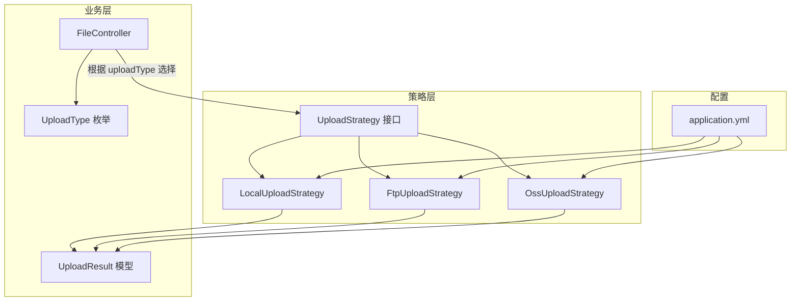
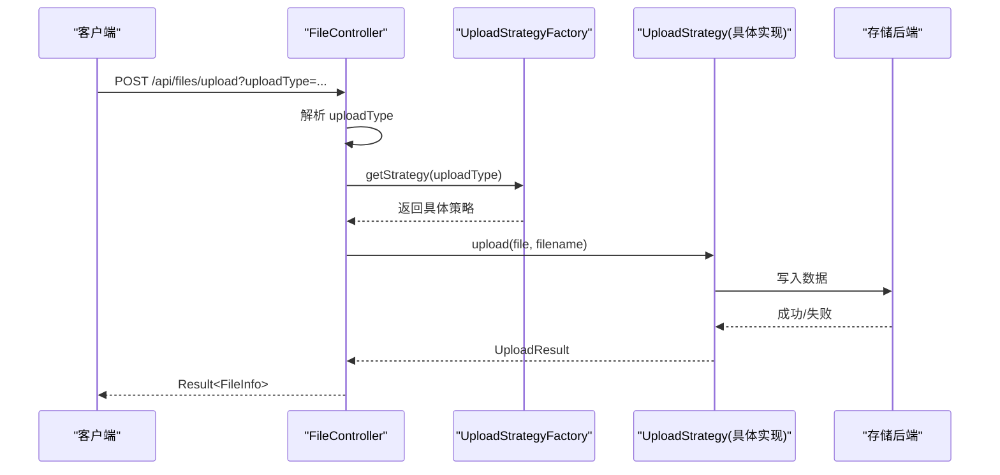
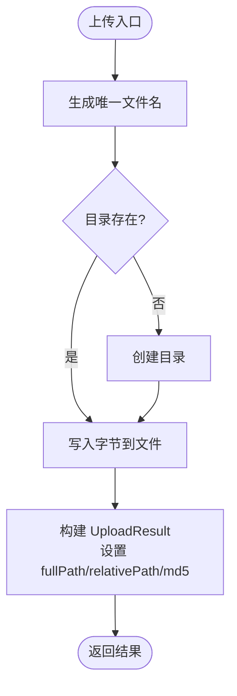
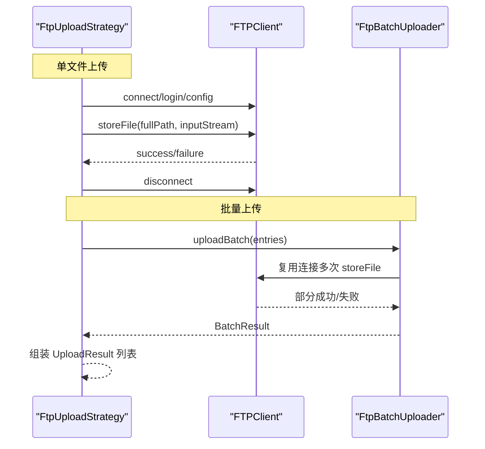
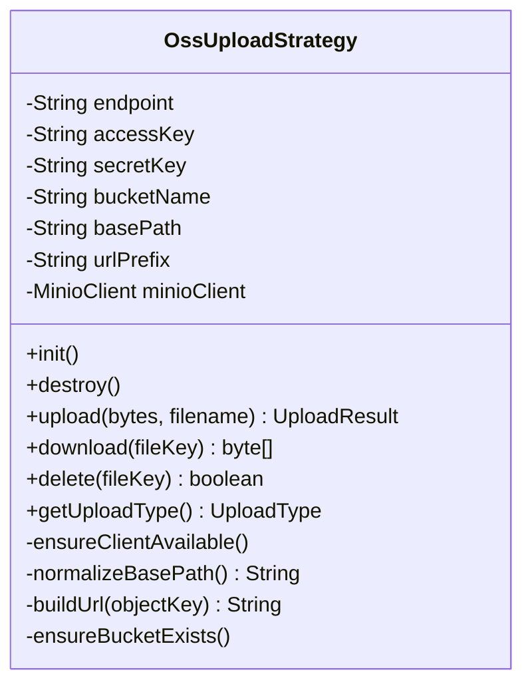
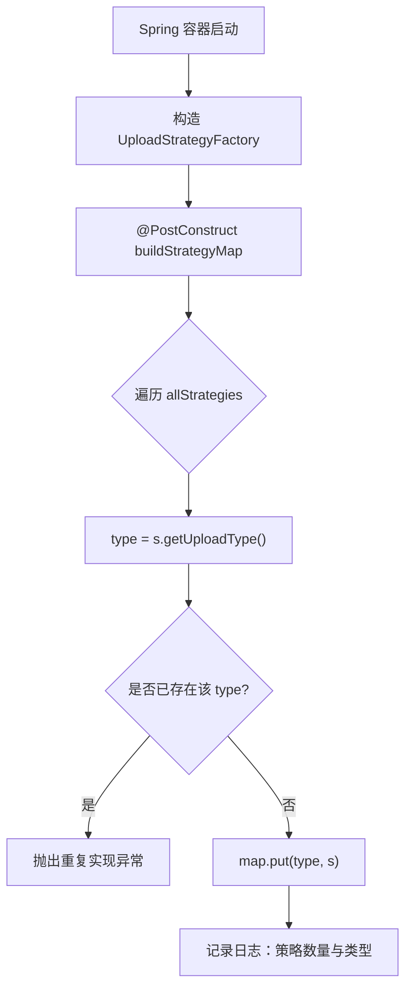
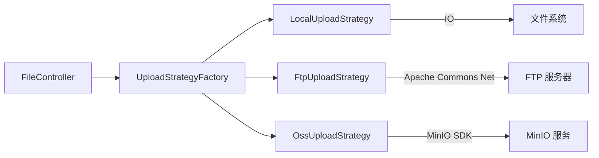

# 存储策略实现

<cite>
**本文引用的文件**
- [UploadStrategy.java](file://src/main/java/com/example/fileupload/strategy/UploadStrategy.java)
- [LocalUploadStrategy.java](file://src/main/java/com/example/fileupload/strategy/LocalUploadStrategy.java)
- [FtpUploadStrategy.java](file://src/main/java/com/example/fileupload/strategy/FtpUploadStrategy.java)
- [OssUploadStrategy.java](file://src/main/java/com/example/fileupload/strategy/OssUploadStrategy.java)
- [UploadStrategyFactory.java](file://src/main/java/com/example/fileupload/strategy/UploadStrategyFactory.java)
- [UploadType.java](file://src/main/java/com/example/fileupload/enums/UploadType.java)
- [UploadResult.java](file://src/main/java/com/example/fileupload/model/UploadResult.java)
- [application.yml](file://src/main/resources/application.yml)
- [FileController.java](file://src/main/java/com/example/fileupload/controller/FileController.java)
- [StrategyIntegrationTest.java](file://src/test/java/com/example/fileupload/StrategyIntegrationTest.java)
</cite>

## 目录
1. [简介](#简介)
2. [项目结构](#项目结构)
3. [核心组件](#核心组件)
4. [架构总览](#架构总览)
5. [详细组件分析](#详细组件分析)
6. [依赖关系分析](#依赖关系分析)
7. [性能考量](#性能考量)
8. [故障排查指南](#故障排查指南)
9. [结论](#结论)
10. [附录：新增自定义存储策略指南](#附录新增自定义存储策略指南)

## 简介
本文件围绕 SpringBootFileUpload 项目的“存储策略”实现进行系统化文档说明，重点解释策略模式在文件上传场景中的应用。项目通过统一的 UploadStrategy 接口抽象不同后端存储（本地磁盘、FTP、MinIO），并由 UploadStrategyFactory 自动注册与路由选择。本文涵盖各策略的配置参数、连接方式、性能特性、适用场景、工厂自动注册机制、扩展指南以及最佳实践与优化建议。

## 项目结构
- 策略层位于 strategy 包，定义统一接口与三种具体实现；
- 枚举 UploadType 标识存储类型；
- 模型 UploadResult 承载上传结果信息；
- 控制器 FileController 暴露 REST 接口，基于工厂选择策略执行；
- 配置文件 application.yml 集中管理各存储后端参数；
- 集成测试 StrategyIntegrationTest 覆盖三种策略的上传/下载/删除流程。

图表来源
- [UploadStrategy.java:10-73](file://src/main/java/com/example/fileupload/strategy/UploadStrategy.java#L10-L73)
- [LocalUploadStrategy.java:16-118](file://src/main/java/com/example/fileupload/strategy/LocalUploadStrategy.java#L16-L118)
- [FtpUploadStrategy.java:24-193](file://src/main/java/com/example/fileupload/strategy/FtpUploadStrategy.java#L24-L193)
- [OssUploadStrategy.java:20-159](file://src/main/java/com/example/fileupload/strategy/OssUploadStrategy.java#L20-L159)
- [UploadType.java:6-33](file://src/main/java/com/example/fileupload/enums/UploadType.java#L6-L33)
- [UploadResult.java:6-38](file://src/main/java/com/example/fileupload/model/UploadResult.java#L6-L38)
- [application.yml:13-28](file://src/main/resources/application.yml#L13-L28)

章节来源
- [FileController.java:50-133](file://src/main/java/com/example/fileupload/controller/FileController.java#L50-L133)
- [application.yml:1-33](file://src/main/resources/application.yml#L1-L33)

## 核心组件
- UploadStrategy：定义上传、下载、删除、批量上传及类型识别的统一契约；
- LocalUploadStrategy：本地磁盘存储，支持唯一文件名生成、相对路径计算、MD5 校验；
- FtpUploadStrategy：FTP 存储，包含连接复用、被动模式、UTF-8 编码、错误分类等；
- OssUploadStrategy：MinIO 对象存储，客户端生命周期管理、Bucket 自动创建、URL 前缀处理；
- UploadStrategyFactory：自动收集所有策略实现并构建映射，按 UploadType 路由；
- UploadType：枚举 local/ftp/oss，提供 fromCode 查找；
- UploadResult：上传结果载体，包含 storageType、fileKey、url/fullPath/relativePath、size、md5。

章节来源
- [UploadStrategy.java:10-73](file://src/main/java/com/example/fileupload/strategy/UploadStrategy.java#L10-L73)
- [UploadType.java:6-33](file://src/main/java/com/example/fileupload/enums/UploadType.java#L6-L33)
- [UploadResult.java:6-38](file://src/main/java/com/example/fileupload/model/UploadResult.java#L6-L38)

## 架构总览
策略模式将“如何存储”从“何时存储”中解耦。控制器接收请求后，解析 uploadType 并通过工厂获取对应策略实例，调用其 upload/download/delete/batchUpload 方法完成操作。

图表来源
- [FileController.java:50-84](file://src/main/java/com/example/fileupload/controller/FileController.java#L50-L84)
- [UploadStrategyFactory.java:28-55](file://src/main/java/com/example/fileupload/strategy/UploadStrategyFactory.java#L28-L55)
- [UploadStrategy.java:15-72](file://src/main/java/com/example/fileupload/strategy/UploadStrategy.java#L15-L72)

## 详细组件分析

### UploadStrategy 接口设计
- 单文件上传：upload(MultipartFile, originalFilename) 与 upload(byte[], originalFilename)；
- 删除：delete(fileKey)；
- 下载：download(fileKey)；
- 类型识别：getUploadType()；
- 批量上传：batchUpload(List<MultipartFile>) 默认逐个调用字节数组上传，便于各策略优化（如 FTP 复用连接）。

章节来源
- [UploadStrategy.java:15-72](file://src/main/java/com/example/fileupload/strategy/UploadStrategy.java#L15-L72)

### LocalUploadStrategy（本地磁盘存储）
- 配置项：file.upload.base-path，支持根相对路径、Spring 资源前缀、工作目录相对路径；
- 启动初始化：@PostConstruct 解析 base-path 为绝对路径，记录日志；
- 上传：生成唯一文件名（UUID + 原始名，碰撞时追加序号），确保目录存在，写入字节；
- 删除：检查文件存在后删除；
- 下载：读取文件到字节数组；
- 结果：设置 storageType、fileKey、fullPath、relativePath、size、md5；
- 适用场景：开发调试、小文件、低并发、无需跨进程共享的场景。

图表来源
- [LocalUploadStrategy.java:63-84](file://src/main/java/com/example/fileupload/strategy/LocalUploadStrategy.java#L63-L84)
- [LocalUploadStrategy.java:120-137](file://src/main/java/com/example/fileupload/strategy/LocalUploadStrategy.java#L120-L137)
- [LocalUploadStrategy.java:170-188](file://src/main/java/com/example/fileupload/strategy/LocalUploadStrategy.java#L170-L188)

章节来源
- [LocalUploadStrategy.java:16-118](file://src/main/java/com/example/fileupload/strategy/LocalUploadStrategy.java#L16-L118)
- [LocalUploadStrategy.java:120-188](file://src/main/java/com/example/fileupload/strategy/LocalUploadStrategy.java#L120-L188)

### FtpUploadStrategy（FTP服务器存储）
- 配置项：file.ftp.host/port/username/password/basePath；
- 连接与安全：UTF-8 控制编码、被动模式、二进制传输、缓冲区大小、关闭远程验证；
- 单文件上传/下载/删除：每次新建 FTPClient，finally 安全断开；
- 批量上传：使用 FtpBatchUploader 复用同一连接，预计算 MD5，一次性发送多个文件；
- 目录创建：逐级 mkdir -p 语义，权限/路径错误分类提示；
- 错误分类：根据 FTP 回复码给出用户友好错误消息；
- 适用场景：局域网或跨主机共享文件系统、需要传统 FTP 协议对接的系统。

图表来源
- [FtpUploadStrategy.java:58-114](file://src/main/java/com/example/fileupload/strategy/FtpUploadStrategy.java#L58-L114)
- [FtpUploadStrategy.java:126-186](file://src/main/java/com/example/fileupload/strategy/FtpUploadStrategy.java#L126-L186)
- [FtpUploadStrategy.java:206-236](file://src/main/java/com/example/fileupload/strategy/FtpUploadStrategy.java#L206-L236)
- [FtpUploadStrategy.java:287-325](file://src/main/java/com/example/fileupload/strategy/FtpUploadStrategy.java#L287-L325)
- [FtpUploadStrategy.java:335-352](file://src/main/java/com/example/fileupload/strategy/FtpUploadStrategy.java#L335-L352)

章节来源
- [FtpUploadStrategy.java:24-193](file://src/main/java/com/example/fileupload/strategy/FtpUploadStrategy.java#L24-L193)
- [FtpUploadStrategy.java:206-359](file://src/main/java/com/example/fileupload/strategy/FtpUploadStrategy.java#L206-L359)

### OssUploadStrategy（MinIO对象存储）
- 配置项：file.oss.endpoint/access-key/secret-key/bucket-name/base-path/url-prefix；
- 客户端生命周期：@PostConstruct 初始化 MinioClient，@PreDestroy 清理；
- Bucket 管理：启动时检查并自动创建 bucket；
- 上传：生成唯一 objectKey（basePath + UUID_原文件名），流式 putObject；
- 下载：getObject 流式读取至字节数组；
- 删除：removeObject；
- URL 构建：urlPrefix + objectKey，不含 bucketName，便于反向代理；
- 适用场景：云原生、高可用、海量非结构化数据存储。

图表来源
- [OssUploadStrategy.java:32-76](file://src/main/java/com/example/fileupload/strategy/OssUploadStrategy.java#L32-L76)
- [OssUploadStrategy.java:78-159](file://src/main/java/com/example/fileupload/strategy/OssUploadStrategy.java#L78-L159)
- [OssUploadStrategy.java:163-215](file://src/main/java/com/example/fileupload/strategy/OssUploadStrategy.java#L163-L215)

章节来源
- [OssUploadStrategy.java:20-159](file://src/main/java/com/example/fileupload/strategy/OssUploadStrategy.java#L20-L159)
- [OssUploadStrategy.java:163-215](file://src/main/java/com/example/fileupload/strategy/OssUploadStrategy.java#L163-L215)

### UploadStrategyFactory（自动注册与路由）
- 自动装配：构造函数注入 List<UploadStrategy>，@PostConstruct 遍历构建 Map<UploadType, UploadStrategy>；
- 重复检测：若同一 UploadType 有多个实现则抛出异常；
- 路由：getStrategy(uploadType) 返回对应策略，未找到抛异常；
- 日志：初始化时输出已注册策略数量与类型集合。

图表来源
- [UploadStrategyFactory.java:24-39](file://src/main/java/com/example/fileupload/strategy/UploadStrategyFactory.java#L24-L39)
- [UploadStrategyFactory.java:48-55](file://src/main/java/com/example/fileupload/strategy/UploadStrategyFactory.java#L48-L55)

章节来源
- [UploadStrategyFactory.java:13-55](file://src/main/java/com/example/fileupload/strategy/UploadStrategyFactory.java#L13-L55)

## 依赖关系分析
- 控制器依赖工厂与处理器，通过枚举值选择策略；
- 各策略依赖各自后端 SDK（本地 IO、Apache Commons Net、MinIO Java SDK）；
- 配置集中在 application.yml，通过 @Value 注入；
- 测试结果覆盖三种策略的基本生命周期。

图表来源
- [FileController.java:37-48](file://src/main/java/com/example/fileupload/controller/FileController.java#L37-L48)
- [UploadStrategyFactory.java:24-39](file://src/main/java/com/example/fileupload/strategy/UploadStrategyFactory.java#L24-L39)
- [LocalUploadStrategy.java:63-84](file://src/main/java/com/example/fileupload/strategy/LocalUploadStrategy.java#L63-L84)
- [FtpUploadStrategy.java:206-236](file://src/main/java/com/example/fileupload/strategy/FtpUploadStrategy.java#L206-L236)
- [OssUploadStrategy.java:54-70](file://src/main/java/com/example/fileupload/strategy/OssUploadStrategy.java#L54-L70)

章节来源
- [FileController.java:50-133](file://src/main/java/com/example/fileupload/controller/FileController.java#L50-L133)
- [StrategyIntegrationTest.java:23-117](file://src/test/java/com/example/fileupload/StrategyIntegrationTest.java#L23-L117)

## 性能考量
- 本地磁盘：适合小规模与开发环境；注意磁盘 I/O 瓶颈与并发写锁；大文件建议分片或异步落盘；
- FTP：批量上传复用连接显著降低握手开销；被动模式穿透 NAT；二进制模式避免文本转换；合理缓冲大小提升吞吐；
- MinIO：对象存储具备高可用与水平扩展能力；流式上传减少内存占用；URL 前缀可配合 CDN/反向代理加速访问；
- 通用优化：
  - 预计算 MD5 避免重复读取；
  - 批量接口优先使用 batchUpload；
  - 合理设置 multipart 大小限制；
  - 对网络型后端增加超时与重试策略；
  - 监控关键指标（成功率、延迟、带宽）。

[本节为通用指导，不直接分析具体文件]

## 故障排查指南
- 本地策略：
  - 路径解析异常：检查 file.upload.base-path 格式与系统盘符；
  - 文件不存在：download/delete 对空 key 返回 null/false；
- FTP 策略：
  - 连接失败：检查 host/port/用户名密码；查看 FTPReply 码；
  - 乱码：确认 UTF-8 控制编码与二进制模式；
  - 权限/路径错误：根据 550/553 等回复码定位；
  - 数据连接失败：检查防火墙/被动模式；
- MinIO 策略：
  - 客户端未初始化：检查 access-key/secret-key 配置；
  - Bucket 不存在：启动时自动创建，若失败需检查服务端状态；
  - 下载失败：objectKey 是否正确、网络连通性；
- 工厂路由：
  - 重复策略实现：同 UploadType 仅允许一个实现；
  - 未找到策略：检查枚举值与实现类是否被扫描注册。

章节来源
- [LocalUploadStrategy.java:86-113](file://src/main/java/com/example/fileupload/strategy/LocalUploadStrategy.java#L86-L113)
- [FtpUploadStrategy.java:206-236](file://src/main/java/com/example/fileupload/strategy/FtpUploadStrategy.java#L206-L236)
- [FtpUploadStrategy.java:287-352](file://src/main/java/com/example/fileupload/strategy/FtpUploadStrategy.java#L287-L352)
- [OssUploadStrategy.java:54-76](file://src/main/java/com/example/fileupload/strategy/OssUploadStrategy.java#L54-L76)
- [OssUploadStrategy.java:163-167](file://src/main/java/com/example/fileupload/strategy/OssUploadStrategy.java#L163-L167)
- [UploadStrategyFactory.java:28-55](file://src/main/java/com/example/fileupload/strategy/UploadStrategyFactory.java#L28-L55)

## 结论
本项目通过策略模式清晰分离了不同存储后端的实现细节，提供了本地、FTP、MinIO 三种常用方案，并以工厂模式实现自动注册与路由。结合合理的配置与批量优化，能够满足从开发调试到生产部署的多层次需求。后续可按需扩展更多存储后端，保持接口一致性与配置可维护性。

[本节为总结，不直接分析具体文件]

## 附录：新增自定义存储策略指南
- 步骤一：实现 UploadStrategy 接口
  - 实现 upload(byte[], originalFilename)、delete(fileKey)、download(fileKey)、getUploadType()；
  - 如需批量优化，重写 batchUpload(List<MultipartFile>)；
- 步骤二：声明为 Spring 组件
  - 添加 @Component，使工厂能自动发现并注册；
- 步骤三：定义并注册 UploadType
  - 在 UploadType 枚举中添加新类型（code/desc），并在 getUploadType() 返回该类型；
- 步骤四：配置参数
  - 在 application.yml 中添加相应 file.* 配置项，使用 @Value 注入；
- 步骤五：编写测试
  - 参考 StrategyIntegrationTest，编写单元测试与集成测试，覆盖上传/下载/删除与错误场景；
- 步骤六：验证工厂路由
  - 通过 FileController 的上传接口传入新 uploadType，验证策略选择与执行；
- 最佳实践：
  - 保证幂等与健壮的错误处理；
  - 对网络型后端实现连接池/重试/超时；
  - 提供批量接口以优化连接复用；
  - 记录关键日志便于排障；
  - 对敏感配置使用环境变量或密钥管理服务。

章节来源
- [UploadStrategy.java:15-72](file://src/main/java/com/example/fileupload/strategy/UploadStrategy.java#L15-L72)
- [UploadType.java:6-33](file://src/main/java/com/example/fileupload/enums/UploadType.java#L6-L33)
- [application.yml:13-28](file://src/main/resources/application.yml#L13-L28)
- [StrategyIntegrationTest.java:23-117](file://src/test/java/com/example/fileupload/StrategyIntegrationTest.java#L23-L117)