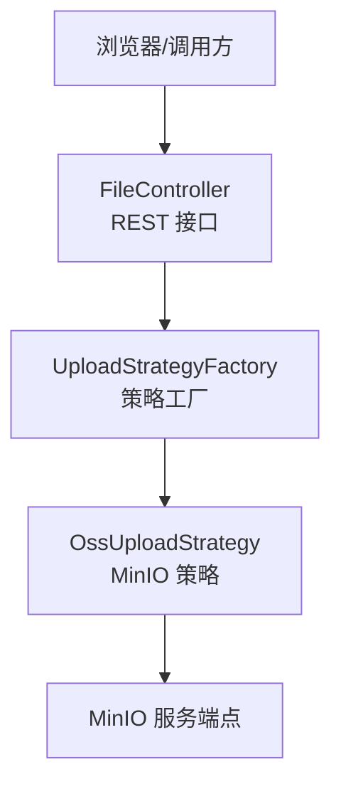
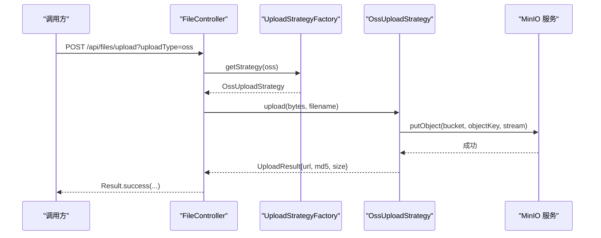
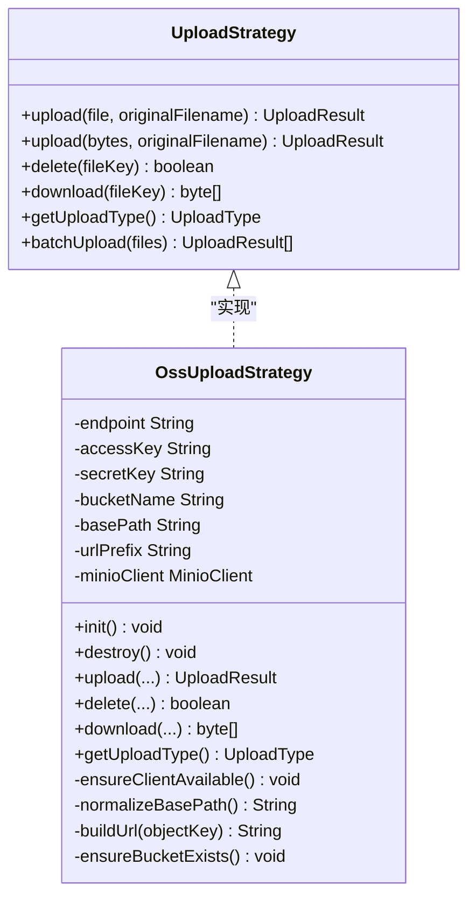
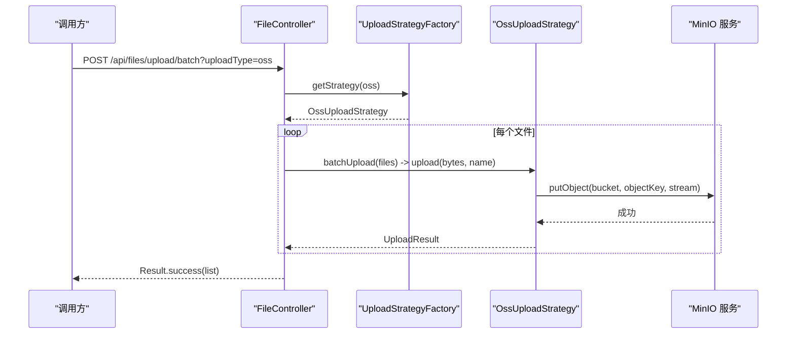
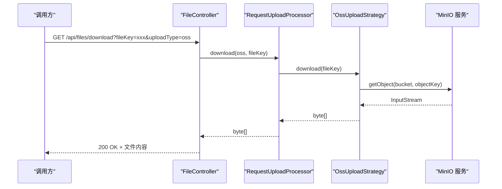
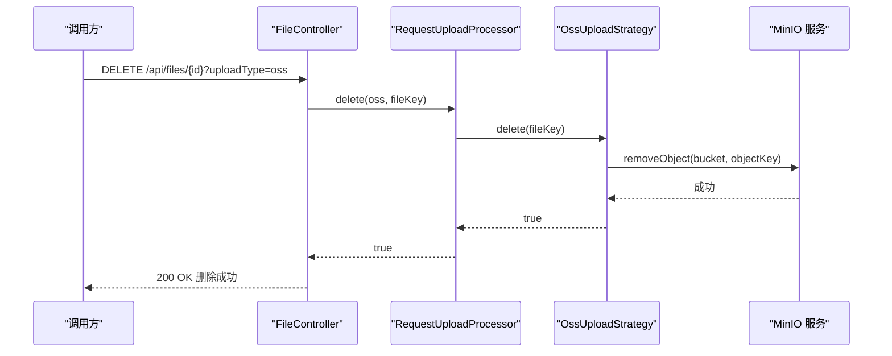
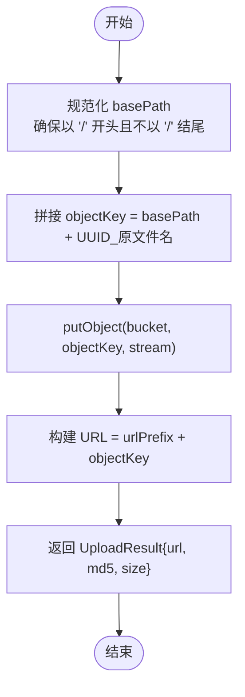
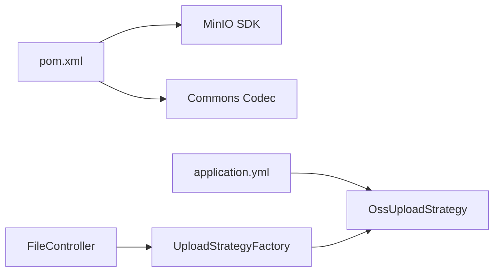

# 对象存储策略

<cite>
**本文引用的文件**
- [OssUploadStrategy.java](file://src/main/java/com/example/fileupload/strategy/OssUploadStrategy.java)
- [UploadStrategy.java](file://src/main/java/com/example/fileupload/strategy/UploadStrategy.java)
- [UploadStrategyFactory.java](file://src/main/java/com/example/fileupload/strategy/UploadStrategyFactory.java)
- [application.yml](file://src/main/resources/application.yml)
- [pom.xml](file://pom.xml)
- [FileController.java](file://src/main/java/com/example/fileupload/controller/FileController.java)
- [UploadType.java](file://src/main/java/com/example/fileupload/enums/UploadType.java)
- [UploadResult.java](file://src/main/java/com/example/fileupload/model/UploadResult.java)
</cite>

## 目录
1. [简介](#简介)
2. [项目结构](#项目结构)
3. [核心组件](#核心组件)
4. [架构总览](#架构总览)
5. [详细组件分析](#详细组件分析)
6. [依赖关系分析](#依赖关系分析)
7. [性能考虑](#性能考虑)
8. [故障排查指南](#故障排查指南)
9. [结论](#结论)
10. [附录](#附录)

## 简介
本文件围绕 OssUploadStrategy（MinIO 对象存储策略）进行系统化文档化，涵盖客户端初始化、桶管理、对象读写与删除、访问 URL 构建、配置项说明、以及在生产环境中的安全与性能建议。同时提供不同云服务商（AWS S3、阿里云 OSS、腾讯云 COS）的接入思路与配置要点，帮助快速落地与扩展。

## 项目结构
本项目采用“策略模式”组织多种上传后端（本地、FTP、OSS），通过工厂按类型路由到具体实现。OssUploadStrategy 基于 MinIO Java SDK 实现对 S3 兼容的对象存储进行上传、下载、删除等操作，并在启动时自动确保桶存在。

图表来源
- [FileController.java:50-133](file://src/main/java/com/example/fileupload/controller/FileController.java#L50-L133)
- [UploadStrategyFactory.java:24-55](file://src/main/java/com/example/fileupload/strategy/UploadStrategyFactory.java#L24-L55)
- [OssUploadStrategy.java:54-109](file://src/main/java/com/example/fileupload/strategy/OssUploadStrategy.java#L54-L109)

章节来源
- [FileController.java:50-133](file://src/main/java/com/example/fileupload/controller/FileController.java#L50-L133)
- [UploadStrategyFactory.java:24-55](file://src/main/java/com/example/fileupload/strategy/UploadStrategyFactory.java#L24-L55)
- [OssUploadStrategy.java:54-109](file://src/main/java/com/example/fileupload/strategy/OssUploadStrategy.java#L54-L109)

## 核心组件
- UploadStrategy：定义统一的上传、下载、删除、批量上传等能力契约。
- OssUploadStrategy：实现 MinIO 对象存储的具体策略，负责客户端生命周期管理、桶检查与创建、对象读写、URL 生成。
- UploadStrategyFactory：自动发现并注册所有 UploadStrategy 实现，根据 UploadType 路由到对应策略。
- application.yml：集中配置 MinIO 端点、密钥、桶名、基础路径、访问前缀等。
- pom.xml：引入 MinIO SDK 与 MD5 计算依赖。

章节来源
- [UploadStrategy.java:10-73](file://src/main/java/com/example/fileupload/strategy/UploadStrategy.java#L10-L73)
- [OssUploadStrategy.java:29-159](file://src/main/java/com/example/fileupload/strategy/OssUploadStrategy.java#L29-L159)
- [UploadStrategyFactory.java:13-55](file://src/main/java/com/example/fileupload/strategy/UploadStrategyFactory.java#L13-L55)
- [application.yml:22-28](file://src/main/resources/application.yml#L22-L28)
- [pom.xml:58-70](file://pom.xml#L58-L70)

## 架构总览
整体流程：控制器接收请求，解析 uploadType，通过工厂获取具体策略；OssUploadStrategy 使用 MinIO 客户端执行对象操作，返回统一结果模型。

图表来源
- [FileController.java:58-84](file://src/main/java/com/example/fileupload/controller/FileController.java#L58-L84)
- [UploadStrategyFactory.java:41-55](file://src/main/java/com/example/fileupload/strategy/UploadStrategyFactory.java#L41-L55)
- [OssUploadStrategy.java:83-109](file://src/main/java/com/example/fileupload/strategy/OssUploadStrategy.java#L83-L109)

## 详细组件分析

### OssUploadStrategy 组件分析
- 客户端初始化：在 Spring 容器启动时通过 @PostConstruct 构建 MinioClient，若未配置 access-key/secret-key 则跳过初始化并记录告警。
- 桶管理：启动时检查 bucket 是否存在，不存在则自动创建，便于开发环境快速可用。
- 对象上传：将字节数组转为输入流，调用 putObject 写入；生成唯一文件名（UUID_原文件名），拼接规范化后的 basePath 作为 objectKey。
- 对象下载：按 fileKey 构造 objectKey，读取流并缓存为字节数组返回。
- 对象删除：按 fileKey 构造 objectKey，调用 removeObject 删除。
- URL 构建：返回 urlPrefix + objectKey，不含 bucketName，便于通过反向代理或 CDN 暴露。
- 日志与异常：关键路径均记录日志；失败时抛出或返回空值，便于上层统一处理。

图表来源
- [UploadStrategy.java:10-73](file://src/main/java/com/example/fileupload/strategy/UploadStrategy.java#L10-L73)
- [OssUploadStrategy.java:29-159](file://src/main/java/com/example/fileupload/strategy/OssUploadStrategy.java#L29-L159)

章节来源
- [OssUploadStrategy.java:54-109](file://src/main/java/com/example/fileupload/strategy/OssUploadStrategy.java#L54-L109)
- [OssUploadStrategy.java:112-159](file://src/main/java/com/example/fileupload/strategy/OssUploadStrategy.java#L112-L159)
- [OssUploadStrategy.java:163-215](file://src/main/java/com/example/fileupload/strategy/OssUploadStrategy.java#L163-L215)

### 上传流程时序（含批量）

图表来源
- [FileController.java:93-133](file://src/main/java/com/example/fileupload/controller/FileController.java#L93-L133)
- [UploadStrategyFactory.java:41-55](file://src/main/java/com/example/fileupload/strategy/UploadStrategyFactory.java#L41-L55)
- [OssUploadStrategy.java:83-109](file://src/main/java/com/example/fileupload/strategy/OssUploadStrategy.java#L83-L109)

### 下载流程时序

图表来源
- [FileController.java:163-194](file://src/main/java/com/example/fileupload/controller/FileController.java#L163-L194)
- [OssUploadStrategy.java:132-154](file://src/main/java/com/example/fileupload/strategy/OssUploadStrategy.java#L132-L154)

### 删除流程时序

图表来源
- [FileController.java:203-227](file://src/main/java/com/example/fileupload/controller/FileController.java#L203-L227)
- [OssUploadStrategy.java:112-130](file://src/main/java/com/example/fileupload/strategy/OssUploadStrategy.java#L112-L130)

### 复杂逻辑流程图（对象键与 URL 构建）

图表来源
- [OssUploadStrategy.java:169-189](file://src/main/java/com/example/fileupload/strategy/OssUploadStrategy.java#L169-L189)
- [OssUploadStrategy.java:83-109](file://src/main/java/com/example/fileupload/strategy/OssUploadStrategy.java#L83-L109)

## 依赖关系分析
- 运行时依赖：MinIO Java SDK（io.minio:minio）、Apache Commons Codec（用于 MD5）。
- 配置依赖：application.yml 中 file.oss.* 配置项注入到 OssUploadStrategy。
- 组件耦合：控制器通过工厂解耦具体策略；策略内部仅依赖 MinIO SDK 与日志。

图表来源
- [pom.xml:58-70](file://pom.xml#L58-L70)
- [application.yml:22-28](file://src/main/resources/application.yml#L22-L28)
- [FileController.java:58-133](file://src/main/java/com/example/fileupload/controller/FileController.java#L58-L133)
- [UploadStrategyFactory.java:24-55](file://src/main/java/com/example/fileupload/strategy/UploadStrategyFactory.java#L24-L55)

章节来源
- [pom.xml:58-70](file://pom.xml#L58-L70)
- [application.yml:22-28](file://src/main/resources/application.yml#L22-L28)

## 性能考虑
当前实现为单连接直传直读，适合中小规模场景。生产环境可结合以下优化：
- 连接池与并发
  - 调整 MinIO 客户端底层 HTTP 连接池大小（如 OkHttp 连接数、超时时间），提升并发吞吐。
  - 对大文件采用分块上传（multipart upload）与并发分片，降低单次传输失败影响。
- 重试机制
  - 为网络不稳定场景增加指数退避重试，针对幂等操作（如上传）可设置最大重试次数。
- 缓存策略
  - 热点文件可通过 CDN 缓存静态资源，减少回源压力。
  - 应用侧可对小文件做内存/本地缓存，注意失效策略与一致性。
- I/O 优化
  - 避免将大文件完整加载到内存，优先使用流式处理。
  - 合理设置缓冲区大小，平衡内存占用与吞吐。

[本节为通用性能建议，不直接分析具体代码文件]

## 故障排查指南
- 客户端未初始化
  - 现象：调用时报错提示 MinioClient 未初始化。
  - 原因：未配置 access-key/secret-key。
  - 处理：在 application.yml 中补充 file.oss.access-key 与 file.oss.secret-key。
- 桶不存在或权限不足
  - 现象：启动时无法创建桶或上传/删除失败。
  - 原因：MinIO 服务不可用、网络不通、或账号无相应权限。
  - 处理：检查 endpoint 可达性、确认账号具备 makeBucket/putObject/getObject/removeObject 权限。
- 下载为空
  - 现象：download 返回 null。
  - 原因：objectKey 错误或权限不足。
  - 处理：核对 fileKey 与 basePath 拼接是否正确，确认 bucket 与对象存在。
- 批量上传部分失败
  - 现象：部分文件上传失败。
  - 原因：网络抖动或目标对象已存在。
  - 处理：增加重试与幂等校验，必要时清理重复对象。

章节来源
- [OssUploadStrategy.java:54-76](file://src/main/java/com/example/fileupload/strategy/OssUploadStrategy.java#L54-L76)
- [OssUploadStrategy.java:112-154](file://src/main/java/com/example/fileupload/strategy/OssUploadStrategy.java#L112-L154)
- [OssUploadStrategy.java:191-215](file://src/main/java/com/example/fileupload/strategy/OssUploadStrategy.java#L191-L215)

## 结论
OssUploadStrategy 提供了简洁可靠的 MinIO 对象存储集成方案，覆盖客户端初始化、桶管理、对象读写与删除、URL 构建等核心能力。配合策略工厂与控制器，形成可扩展的文件上传体系。生产环境建议结合连接池、分块上传、重试与 CDN 缓存等优化手段，并遵循最小权限与安全最佳实践。

[本节为总结性内容，不直接分析具体代码文件]

## 附录

### OSS 服务配置说明（MinIO）
- 服务端点 endpoint：MinIO 服务地址（默认 http://127.0.0.1:9000）。
- 访问密钥 access-key/secret-key：用于鉴权，必须配置。
- 桶名称 bucket-name：对象存放的桶。
- 基础路径 base-path：对象键前缀，用于隔离不同业务或环境。
- 访问前缀 url-prefix：对外暴露的 URL 前缀，通常指向反向代理或 CDN 入口。

章节来源
- [application.yml:22-28](file://src/main/resources/application.yml#L22-L28)
- [OssUploadStrategy.java:34-50](file://src/main/java/com/example/fileupload/strategy/OssUploadStrategy.java#L34-L50)

### 不同云服务商配置示例（S3 兼容）
- AWS S3
  - endpoint：https://s3.<region>.amazonaws.com
  - region：在客户端或环境变量中指定（SDK 支持 region 参数）。
  - 其他：access-key/secret-key 由 IAM 用户或角色提供。
- 阿里云 OSS
  - endpoint：形如 https://oss-cn-hangzhou.aliyuncs.com
  - region：与 endpoint 区域一致。
  - 其他：建议使用 RAM 子账号与最小权限策略。
- 腾讯云 COS
  - endpoint：形如 https://cos.ap-guangzhou.myqcloud.com
  - region：与 endpoint 区域一致。
  - 其他：SecretId/SecretKey 由 CAM 提供。

说明：以上为通用接入要点，实际需参考各厂商 SDK 文档与版本兼容性。

[本节为概念性指导，不直接分析具体代码文件]

### 高级特性建议
- 分块上传与断点续传
  - 对大文件启用分块上传，记录分块状态以实现断点续传。
  - 利用对象存储的分片列表查询与合并能力，提高可靠性。
- 并发控制
  - 限制并发分片数量，避免打满带宽或触发限流。
  - 结合队列或限速器控制全局并发度。
- CDN 加速
  - 将 url-prefix 指向 CDN 域名，开启缓存与压缩。
  - 对动态内容设置合适的缓存策略与回源规则。

[本节为概念性指导，不直接分析具体代码文件]

### 安全最佳实践
- 最小权限原则
  - 为应用分配仅包含必要操作的 IAM/RAM/CAM 策略（如只允许特定桶的读写）。
- 加密传输
  - 强制 HTTPS（TLS），确保数据在传输过程中加密。
- 访问日志审计
  - 开启对象存储访问日志，结合 SIEM 或日志平台进行审计与告警。
- 密钥管理
  - 使用环境变量或密钥管理服务注入敏感信息，避免硬编码。

[本节为概念性指导，不直接分析具体代码文件]