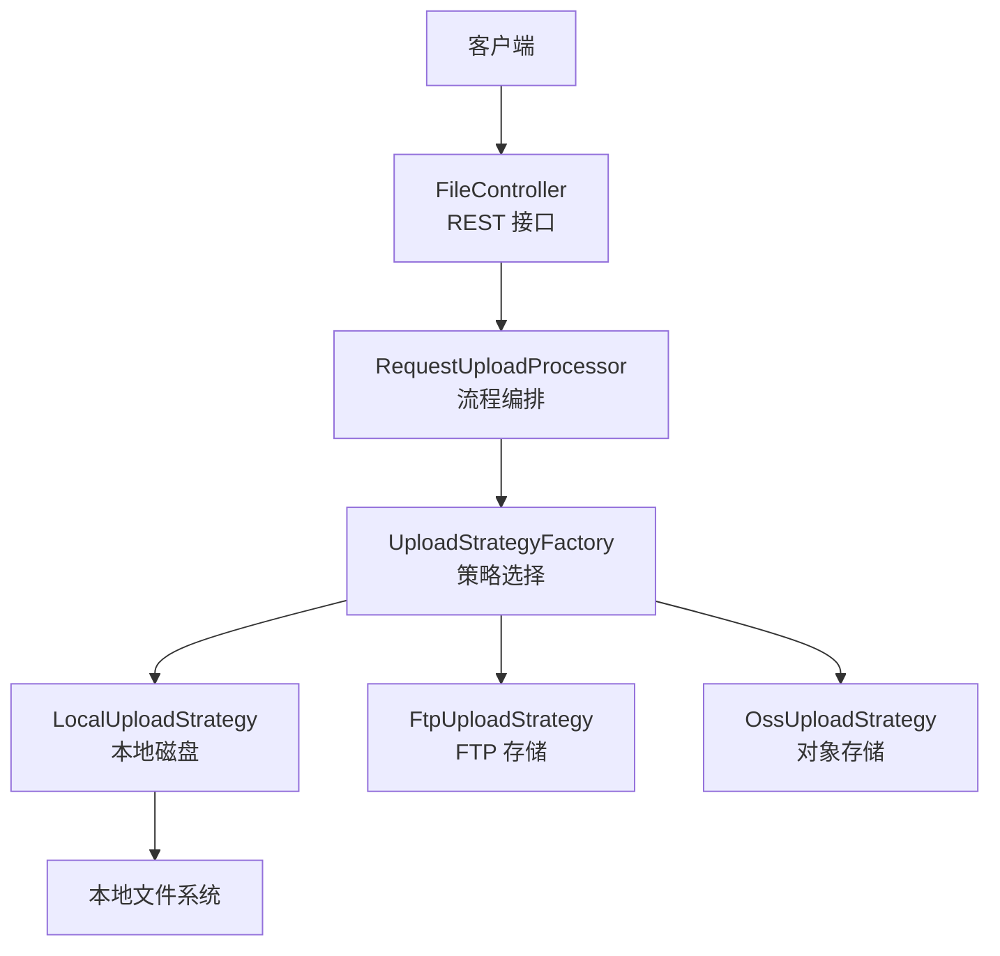
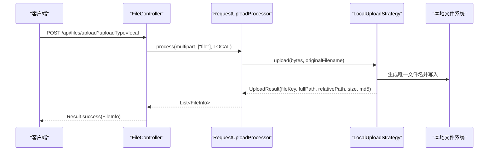
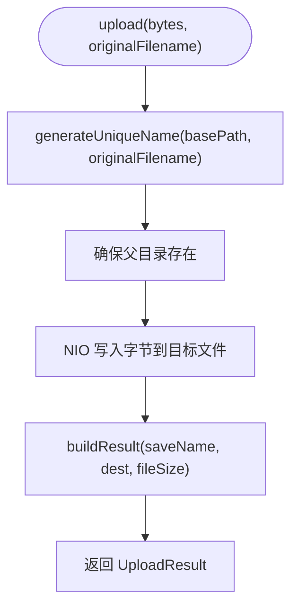
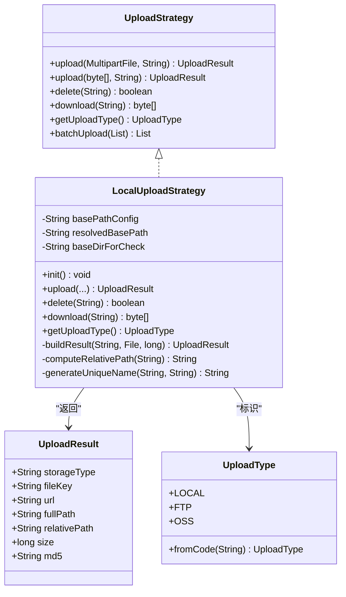

# 本地磁盘存储策略

<cite>
**本文引用的文件**
- [LocalUploadStrategy.java](file://src/main/java/com/example/fileupload/strategy/LocalUploadStrategy.java)
- [UploadStrategy.java](file://src/main/java/com/example/fileupload/strategy/UploadStrategy.java)
- [application.yml](file://src/main/resources/application.yml)
- [FileTypeValidator.java](file://src/main/java/com/example/fileupload/util/FileTypeValidator.java)
- [FileController.java](file://src/main/java/com/example/fileupload/controller/FileController.java)
- [UploadResult.java](file://src/main/java/com/example/fileupload/model/UploadResult.java)
- [UploadType.java](file://src/main/java/com/example/fileupload/enums/UploadType.java)
- [StrategyIntegrationTest.java](file://src/test/java/com/example/fileupload/StrategyIntegrationTest.java)
</cite>

## 目录
1. [简介](#简介)
2. [项目结构](#项目结构)
3. [核心组件](#核心组件)
4. [架构总览](#架构总览)
5. [详细组件分析](#详细组件分析)
6. [依赖关系分析](#依赖关系分析)
7. [性能考量](#性能考量)
8. [故障处理指南](#故障处理指南)
9. [结论](#结论)
10. [附录](#附录)

## 简介
本文件围绕 LocalUploadStrategy（本地磁盘存储策略）进行系统化文档化，重点解释本地文件系统存储实现、路径与命名规则、目录组织、权限与安全考虑、配置参数、使用场景与优化建议，以及常见问题的排查与解决。该策略通过 Spring Boot 的 @Component 注入，配合 application.yml 中的 file.upload.base-path 完成根目录解析，并以“UUID + 原始文件名”的方式生成唯一保存名，支持上传、下载、删除等基础操作。

## 项目结构
本项目采用分层与策略模式结合的组织方式：
- 控制器层：提供 REST API，统一入口接收上传、下载、删除、查询请求
- 服务层：封装业务逻辑与元数据管理
- 策略层：不同存储后端（本地、FTP、OSS）实现统一的 UploadStrategy 接口
- 工具层：文件类型校验、通用工具方法
- 模型与枚举：统一的数据结构与类型标识

图表来源
- [FileController.java:50-133](file://src/main/java/com/example/fileupload/controller/FileController.java#L50-L133)
- [UploadStrategy.java:10-74](file://src/main/java/com/example/fileupload/strategy/UploadStrategy.java#L10-L74)
- [LocalUploadStrategy.java:26-118](file://src/main/java/com/example/fileupload/strategy/LocalUploadStrategy.java#L26-L118)

章节来源
- [FileController.java:50-133](file://src/main/java/com/example/fileupload/controller/FileController.java#L50-L133)
- [UploadStrategy.java:10-74](file://src/main/java/com/example/fileupload/strategy/UploadStrategy.java#L10-L74)

## 核心组件
- LocalUploadStrategy：本地磁盘存储的具体实现，负责路径解析、唯一文件名生成、读写删、结果组装
- UploadStrategy：定义上传、下载、删除、批量上传的统一接口
- FileTypeValidator：文件类型白名单与魔数校验，用于上传前安全验证
- FileController：对外暴露上传、下载、删除、查询等 REST 接口
- UploadResult：上传策略返回的统一结果模型，包含 storageType、fileKey、fullPath、relativePath、size、md5 等字段
- UploadType：存储类型枚举（local、ftp、oss），用于路由与标识

章节来源
- [LocalUploadStrategy.java:26-118](file://src/main/java/com/example/fileupload/strategy/LocalUploadStrategy.java#L26-L118)
- [UploadStrategy.java:10-74](file://src/main/java/com/example/fileupload/strategy/UploadStrategy.java#L10-L74)
- [FileTypeValidator.java:12-109](file://src/main/java/com/example/fileupload/util/FileTypeValidator.java#L12-L109)
- [FileController.java:50-194](file://src/main/java/com/example/fileupload/controller/FileController.java#L50-L194)
- [UploadResult.java:6-39](file://src/main/java/com/example/fileupload/model/UploadResult.java#L6-L39)
- [UploadType.java:6-35](file://src/main/java/com/example/fileupload/enums/UploadType.java#L6-L35)

## 架构总览
LocalUploadStrategy 作为策略模式的本地实现，遵循以下流程：
- 启动时解析 base-path，将相对或根路径转换为实际可用路径
- 上传时将字节写入目标目录，生成唯一文件名并计算 MD5
- 下载时按 fileKey 读取文件字节
- 删除时按 fileKey 删除文件
- 结果对象包含完整路径与相对路径，便于上层构建 FileInfo

图表来源
- [FileController.java:50-84](file://src/main/java/com/example/fileupload/controller/FileController.java#L50-L84)
- [LocalUploadStrategy.java:64-84](file://src/main/java/com/example/fileupload/strategy/LocalUploadStrategy.java#L64-L84)

## 详细组件分析

### LocalUploadStrategy 实现要点
- 路径解析与初始化
  - 支持以“/”或“\”开头的根目录相对路径，自动拼接系统盘符根目录
  - 支持 Spring 资源前缀（如 file:、classpath:），交由资源处理器解析
  - 其他情况视为相对当前工作目录或普通绝对路径
  - 初始化日志记录配置值与解析后的绝对路径，便于排查
- 唯一文件名生成
  - 使用 UUID 去除连字符后拼接原始文件名
  - 若发生碰撞（极低概率），追加序号直到唯一
  - 基于 basePath 提取基础目录，构造 File 对象进行存在性检查
- 目录与文件操作
  - 写入前确保父目录存在，不存在则创建多级目录
  - 使用 NIO Files.write 写入字节数组
  - 下载通过读取文件为字节数组
  - 删除按 fileKey 定位并调用 delete()
- 结果组装
  - 设置 storageType 为 local
  - 计算 fullPath（含盘符的绝对路径）与 relativePath（不含盘符，保留 base-path 目录名）
  - 计算文件大小与 MD5 校验值

图表来源
- [LocalUploadStrategy.java:64-84](file://src/main/java/com/example/fileupload/strategy/LocalUploadStrategy.java#L64-L84)
- [LocalUploadStrategy.java:120-137](file://src/main/java/com/example/fileupload/strategy/LocalUploadStrategy.java#L120-L137)
- [LocalUploadStrategy.java:170-188](file://src/main/java/com/example/fileupload/strategy/LocalUploadStrategy.java#L170-L188)

章节来源
- [LocalUploadStrategy.java:40-61](file://src/main/java/com/example/fileupload/strategy/LocalUploadStrategy.java#L40-L61)
- [LocalUploadStrategy.java:64-118](file://src/main/java/com/example/fileupload/strategy/LocalUploadStrategy.java#L64-L118)
- [LocalUploadStrategy.java:120-188](file://src/main/java/com/example/fileupload/strategy/LocalUploadStrategy.java#L120-L188)

### 文件路径生成规则与目录结构管理
- 根路径解析
  - 以“/”或“\”开头：去掉前导斜杠后拼接系统盘符根目录，形成绝对路径
  - 以“file:”或“classpath:”开头：保持原样，交由资源处理器解析
  - 其他：视为相对当前工作目录或普通绝对路径
- 子目录组织
  - 写入前自动创建父目录，无需预先手动准备
  - 相对路径计算会保留 base-path 的目录名，例如 “file-upload-storage/UUID_filename.ext”
- 文件命名策略
  - 唯一性：UUID（去连字符）+ 可选序号 + 下划线 + 原始文件名
  - 碰撞检测：在基础目录下循环检查是否存在同名文件，直至唯一
  - 安全性：不直接使用用户输入的路径片段，避免路径穿越

章节来源
- [LocalUploadStrategy.java:40-61](file://src/main/java/com/example/fileupload/strategy/LocalUploadStrategy.java#L40-L61)
- [LocalUploadStrategy.java:139-168](file://src/main/java/com/example/fileupload/strategy/LocalUploadStrategy.java#L139-L168)
- [LocalUploadStrategy.java:170-188](file://src/main/java/com/example/fileupload/strategy/LocalUploadStrategy.java#L170-L188)

### 权限控制与访问限制
- 运行期权限
  - 应用进程需对 base-path 所在目录具备写权限（上传）、读权限（下载）、删除权限（删除）
  - 若目录不存在，策略会自动创建；但需要操作系统级权限允许创建多级目录
- 访问控制建议
  - 生产环境建议将 base-path 置于独立分区或受限目录
  - 结合反向代理或网关限制直接访问底层路径，仅通过 API 暴露受控访问
  - 可结合操作系统 ACL 或容器卷权限进一步收紧

章节来源
- [LocalUploadStrategy.java:74-79](file://src/main/java/com/example/fileupload/strategy/LocalUploadStrategy.java#L74-L79)
- [LocalUploadStrategy.java:87-113](file://src/main/java/com/example/fileupload/strategy/LocalUploadStrategy.java#L87-L113)

### 配置参数说明
- 文件上传大小限制
  - spring.servlet.multipart.max-file-size：单个文件大小上限
  - spring.servlet.multipart.max-request-size：单次请求总大小上限
- 本地存储根路径
  - file.upload.base-path：本地存储根路径，支持根相对、相对工作目录、Spring 资源前缀
- FTP/OSS 配置（与本策略无关，供其他策略使用）
  - file.ftp.*、file.oss.*

章节来源
- [application.yml:4-10](file://src/main/resources/application.yml#L4-L10)
- [application.yml:12-28](file://src/main/resources/application.yml#L12-L28)

### 安全性考虑
- 路径遍历攻击防护
  - 文件名由 UUID 与原始文件名组合生成，不直接使用用户输入的路径片段
  - 写入目标基于已解析的 resolvedBasePath，避免从外部传入任意路径
- 文件类型验证
  - 建议使用 FileTypeValidator 进行后缀白名单与魔数校验，防止伪装文件类型
  - 未配置魔数的复杂格式（如 .docx/.xlsx/.doc）放行，需结合业务风险权衡
- 存储空间监控
  - 建议在部署侧监控 base-path 所在分区的剩余空间
  - 可在上传前估算空间需求并在不足时提前拒绝请求

章节来源
- [LocalUploadStrategy.java:170-188](file://src/main/java/com/example/fileupload/strategy/LocalUploadStrategy.java#L170-L188)
- [FileTypeValidator.java:16-85](file://src/main/java/com/example/fileupload/util/FileTypeValidator.java#L16-L85)

### 使用场景与集成示例
- 单文件上传
  - 通过 /api/files/upload?uploadType=local 提交 multipart/form-data，字段名为 file
  - 成功后返回 FileInfo，包含 fileKey、fullPath、relativePath、size、md5 等
- 批量上传
  - 通过 /api/files/upload/batch?uploadType=local 提交 files 字段的多文件
  - 各策略可复用连接或优化批量处理（本地策略默认逐个上传）
- 下载与删除
  - 下载：/api/files/download?fileKey=xxx&uploadType=local
  - 删除：DELETE /api/files/{id}?uploadType=local

章节来源
- [FileController.java:50-133](file://src/main/java/com/example/fileupload/controller/FileController.java#L50-L133)
- [FileController.java:156-227](file://src/main/java/com/example/fileupload/controller/FileController.java#L156-L227)
- [StrategyIntegrationTest.java:41-67](file://src/test/java/com/example/fileupload/StrategyIntegrationTest.java#L41-L67)

## 依赖关系分析
- LocalUploadStrategy 依赖
  - 日志：SLF4J
  - 加密摘要：Apache Commons Codec DigestUtils（MD5）
  - 文件 IO：Apache Commons IO FileUtils（读取为字节数组）
  - Spring：@Value 注入配置、@PostConstruct 初始化、MultipartFile 处理
- 与上层组件的关系
  - FileController 通过 RequestUploadProcessor 与 UploadStrategyFactory 路由到具体策略
  - UploadResult 作为策略返回的统一结果，被控制器转为 FileInfo 持久化

图表来源
- [UploadStrategy.java:10-74](file://src/main/java/com/example/fileupload/strategy/UploadStrategy.java#L10-L74)
- [LocalUploadStrategy.java:26-118](file://src/main/java/com/example/fileupload/strategy/LocalUploadStrategy.java#L26-L118)
- [UploadResult.java:6-39](file://src/main/java/com/example/fileupload/model/UploadResult.java#L6-L39)
- [UploadType.java:6-35](file://src/main/java/com/example/fileupload/enums/UploadType.java#L6-L35)

章节来源
- [UploadStrategy.java:10-74](file://src/main/java/com/example/fileupload/strategy/UploadStrategy.java#L10-L74)
- [LocalUploadStrategy.java:26-118](file://src/main/java/com/example/fileupload/strategy/LocalUploadStrategy.java#L26-L118)
- [UploadResult.java:6-39](file://src/main/java/com/example/fileupload/model/UploadResult.java#L6-L39)
- [UploadType.java:6-35](file://src/main/java/com/example/fileupload/enums/UploadType.java#L6-L35)

## 性能考量
- I/O 路径
  - 使用 NIO Files.write 写入字节数组，减少中间缓冲开销
  - 下载通过一次性读取为字节数组，适合中小文件；大文件建议流式传输以降低内存占用
- 唯一文件名生成
  - UUID 碰撞概率极低；若出现碰撞会循环追加序号，极端情况下可能影响性能
- MD5 计算
  - 上传完成后再次读取文件计算 MD5，增加一次磁盘读取；可考虑在写入时同步计算哈希以减少额外 I/O
- 并发与锁
  - 多实例部署时需确保 base-path 共享存储（如网络盘）或采用分布式对象存储以避免文件冲突
- 批处理
  - 本地策略默认逐个上传；如需优化可重写 batchUpload 实现并行或合并写入

章节来源
- [LocalUploadStrategy.java:64-84](file://src/main/java/com/example/fileupload/strategy/LocalUploadStrategy.java#L64-L84)
- [LocalUploadStrategy.java:120-137](file://src/main/java/com/example/fileupload/strategy/LocalUploadStrategy.java#L120-L137)
- [UploadStrategy.java:56-74](file://src/main/java/com/example/fileupload/strategy/UploadStrategy.java#L56-L74)

## 故障处理指南
- 磁盘空间不足
  - 现象：写入失败或抛出 IO 异常
  - 处理：在上传前检查可用空间；配置告警监控；必要时拒绝新上传并提示扩容
- 权限问题
  - 现象：无法创建目录或写入文件
  - 处理：确认应用进程对 base-path 有写权限；检查 SELinux/ACL；容器环境下挂载卷权限正确
- 路径解析异常
  - 现象：base-path 解析后路径不符合预期
  - 处理：检查 application.yml 中 file.upload.base-path 配置；确认是否以“/”开头表示根相对路径
- 文件类型不符
  - 现象：上传被拒绝
  - 处理：使用 FileTypeValidator 进行后缀白名单与魔数校验；调整白名单或修复源文件
- 删除失败
  - 现象：删除返回 false 或抛出异常
  - 处理：检查文件是否存在、权限是否足够；确认 fileKey 是否正确

章节来源
- [LocalUploadStrategy.java:74-113](file://src/main/java/com/example/fileupload/strategy/LocalUploadStrategy.java#L74-L113)
- [FileTypeValidator.java:47-85](file://src/main/java/com/example/fileupload/util/FileTypeValidator.java#L47-L85)
- [application.yml:4-10](file://src/main/resources/application.yml#L4-L10)

## 结论
LocalUploadStrategy 提供了简洁可靠的本地磁盘存储实现，具备路径解析灵活、唯一文件名生成稳健、读写删操作完整等特点。通过合理的配置与安全校验，可满足大多数本地文件存储场景。在生产环境中，建议结合权限控制、空间监控与类型校验，进一步提升稳定性与安全性。对于高并发与大文件场景，可进一步优化 I/O 路径与批处理策略。

## 附录
- 配置示例
  - 本地存储根路径：file.upload.base-path=/file-upload-storage/
  - 上传大小限制：spring.servlet.multipart.max-file-size=50MB、max-request-size=50MB
- 使用步骤
  - 上传：POST /api/files/upload?uploadType=local，multipart/form-data 字段 file
  - 下载：GET /api/files/download?fileKey=xxx&uploadType=local
  - 删除：DELETE /api/files/{id}?uploadType=local
- 测试参考
  - 集成测试覆盖上传→下载→删除全链路，验证 fileKey、fullPath、relativePath、size、md5 等字段

章节来源
- [application.yml:4-10](file://src/main/resources/application.yml#L4-L10)
- [application.yml:12-16](file://src/main/resources/application.yml#L12-L16)
- [FileController.java:50-194](file://src/main/java/com/example/fileupload/controller/FileController.java#L50-L194)
- [StrategyIntegrationTest.java:41-67](file://src/test/java/com/example/fileupload/StrategyIntegrationTest.java#L41-L67)