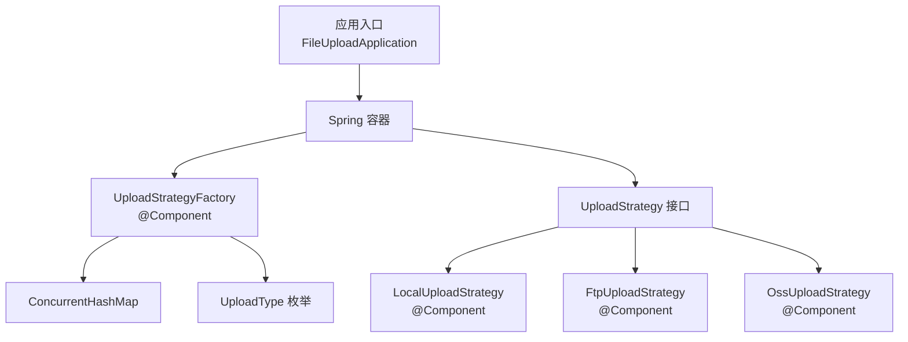
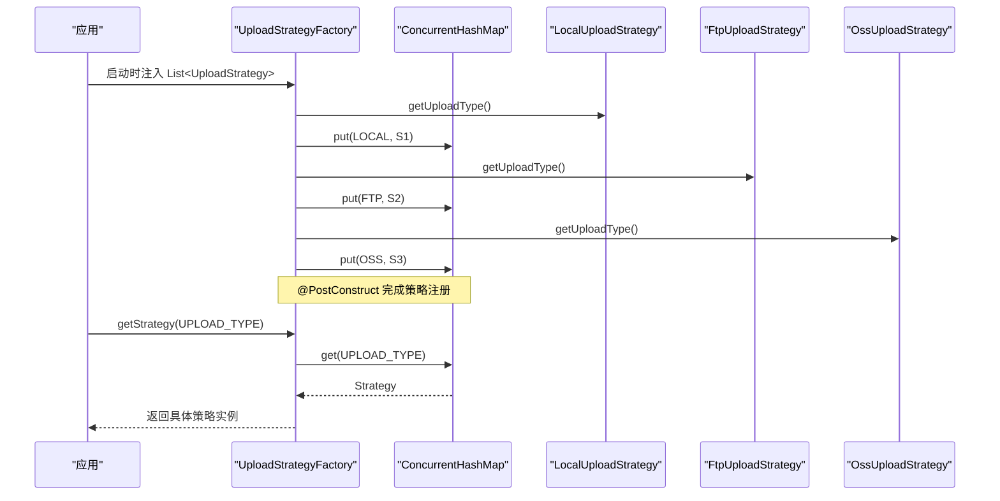
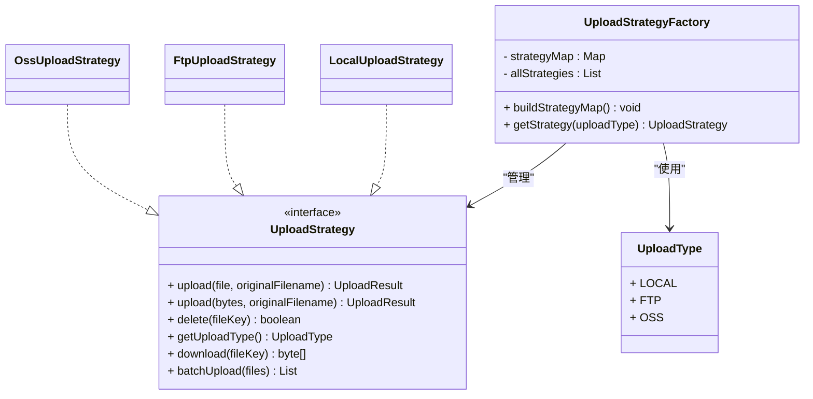
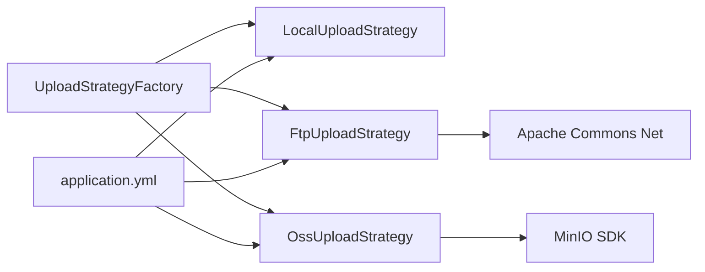

# 策略工厂与自动注册

<cite>
**本文引用的文件**
- [UploadStrategyFactory.java](file://src/main/java/com/example/fileupload/strategy/UploadStrategyFactory.java)
- [UploadStrategy.java](file://src/main/java/com/example/fileupload/strategy/UploadStrategy.java)
- [LocalUploadStrategy.java](file://src/main/java/com/example/fileupload/strategy/LocalUploadStrategy.java)
- [FtpUploadStrategy.java](file://src/main/java/com/example/fileupload/strategy/FtpUploadStrategy.java)
- [OssUploadStrategy.java](file://src/main/java/com/example/fileupload/strategy/OssUploadStrategy.java)
- [UploadType.java](file://src/main/java/com/example/fileupload/enums/UploadType.java)
- [UploadResult.java](file://src/main/java/com/example/fileupload/model/UploadResult.java)
- [FileStorageService.java](file://src/main/java/com/example/fileupload/service/FileStorageService.java)
- [application.yml](file://src/main/resources/application.yml)
- [StrategyIntegrationTest.java](file://src/test/java/com/example/fileupload/StrategyIntegrationTest.java)
</cite>

## 目录
1. [简介](#简介)
2. [项目结构](#项目结构)
3. [核心组件](#核心组件)
4. [架构总览](#架构总览)
5. [详细组件分析](#详细组件分析)
6. [依赖关系分析](#依赖关系分析)
7. [性能考量](#性能考量)
8. [故障排查指南](#故障排查指南)
9. [结论](#结论)
10. [附录：自定义策略开发指南](#附录自定义策略开发指南)

## 简介
本文件围绕 UploadStrategyFactory 策略工厂，系统性阐述 Spring Boot 中基于策略模式的多存储上传实现。重点包括：
- @PostConstruct 驱动的自动注册机制
- ConcurrentHashMap 的策略映射管理与线程安全获取
- 策略生命周期管理（Bean 发现、实例化、缓存）
- 通过 Spring IoC 容器自动发现和注册新策略
- 策略选择逻辑与错误处理
- 自定义策略的完整开发与测试方法

## 项目结构
该模块采用“接口 + 多实现 + 工厂”的分层组织方式：
- 策略接口定义统一能力（上传、下载、删除、类型标识、批量上传）
- 多种具体策略实现本地磁盘、FTP、对象存储
- 工厂负责在启动时扫描并缓存所有策略，运行时按枚举类型路由到具体实现
- 配置集中在 application.yml，便于环境切换

图表来源
- [UploadStrategyFactory.java:16-39](file://src/main/java/com/example/fileupload/strategy/UploadStrategyFactory.java#L16-L39)
- [UploadStrategy.java:13-74](file://src/main/java/com/example/fileupload/strategy/UploadStrategy.java#L13-L74)
- [LocalUploadStrategy.java:26-118](file://src/main/java/com/example/fileupload/strategy/LocalUploadStrategy.java#L26-L118)
- [FtpUploadStrategy.java:36-193](file://src/main/java/com/example/fileupload/strategy/FtpUploadStrategy.java#L36-L193)
- [OssUploadStrategy.java:29-159](file://src/main/java/com/example/fileupload/strategy/OssUploadStrategy.java#L29-L159)
- [UploadType.java:6-35](file://src/main/java/com/example/fileupload/enums/UploadType.java#L6-L35)

章节来源
- [application.yml:1-33](file://src/main/resources/application.yml#L1-L33)

## 核心组件
- UploadStrategyFactory：策略工厂，负责收集所有 UploadStrategy 实现，构建并发安全的映射表，并提供按 UploadType 获取策略的能力。
- UploadStrategy：策略接口，定义上传、下载、删除、类型标识和批量上传等能力。
- LocalUploadStrategy / FtpUploadStrategy / OssUploadStrategy：三种具体策略实现，分别对应本地磁盘、FTP、对象存储。
- UploadType：上传类型枚举，作为策略选择的键。
- UploadResult：统一的上传结果模型，包含存储类型、文件键、URL、路径、大小、MD5 等。

章节来源
- [UploadStrategyFactory.java:16-56](file://src/main/java/com/example/fileupload/strategy/UploadStrategyFactory.java#L16-L56)
- [UploadStrategy.java:13-74](file://src/main/java/com/example/fileupload/strategy/UploadStrategy.java#L13-L74)
- [LocalUploadStrategy.java:26-118](file://src/main/java/com/example/fileupload/strategy/LocalUploadStrategy.java#L26-L118)
- [FtpUploadStrategy.java:36-193](file://src/main/java/com/example/fileupload/strategy/FtpUploadStrategy.java#L36-L193)
- [OssUploadStrategy.java:29-159](file://src/main/java/com/example/fileupload/strategy/OssUploadStrategy.java#L29-L159)
- [UploadType.java:6-35](file://src/main/java/com/example/fileupload/enums/UploadType.java#L6-L35)
- [UploadResult.java:6-39](file://src/main/java/com/example/fileupload/model/UploadResult.java#L6-L39)

## 架构总览
策略模式在 Spring Boot 中的落地流程如下：
- 启动阶段：Spring 容器扫描并实例化所有标注为 @Component 的策略实现；UploadStrategyFactory 通过构造器注入 List<UploadStrategy>，并在 @PostConstruct 中遍历构建策略映射。
- 运行阶段：调用方根据业务传入的 UploadType，从工厂获取对应策略执行上传/下载/删除等操作。
- 扩展性：新增策略只需实现 UploadStrategy 并标注 @Component，无需修改工厂代码。

图表来源
- [UploadStrategyFactory.java:24-39](file://src/main/java/com/example/fileupload/strategy/UploadStrategyFactory.java#L24-L39)
- [UploadStrategy.java:43-46](file://src/main/java/com/example/fileupload/strategy/UploadStrategy.java#L43-L46)
- [LocalUploadStrategy.java:115-118](file://src/main/java/com/example/fileupload/strategy/LocalUploadStrategy.java#L115-L118)
- [FtpUploadStrategy.java:190-193](file://src/main/java/com/example/fileupload/strategy/FtpUploadStrategy.java#L190-L193)
- [OssUploadStrategy.java:156-159](file://src/main/java/com/example/fileupload/strategy/OssUploadStrategy.java#L156-L159)

## 详细组件分析

### UploadStrategyFactory 策略工厂
- 职责：集中管理所有策略实现，提供按 UploadType 获取策略的方法。
- 自动注册：通过构造器注入 List<UploadStrategy>，由 Spring 自动发现所有实现类；@PostConstruct 中遍历构建策略映射。
- 线程安全：使用 ConcurrentHashMap 存储策略映射，保证多线程环境下并发读取与写入的安全。
- 冲突检测：若同一 UploadType 存在多个实现，抛出非法状态异常，避免覆盖。
- 策略获取：getStrategy 方法在找不到对应策略时抛出参数非法异常，便于上层快速定位问题。

图表来源
- [UploadStrategyFactory.java:16-56](file://src/main/java/com/example/fileupload/strategy/UploadStrategyFactory.java#L16-L56)
- [UploadStrategy.java:13-74](file://src/main/java/com/example/fileupload/strategy/UploadStrategy.java#L13-L74)
- [LocalUploadStrategy.java:26-118](file://src/main/java/com/example/fileupload/strategy/LocalUploadStrategy.java#L26-L118)
- [FtpUploadStrategy.java:36-193](file://src/main/java/com/example/fileupload/strategy/FtpUploadStrategy.java#L36-L193)
- [OssUploadStrategy.java:29-159](file://src/main/java/com/example/fileupload/strategy/OssUploadStrategy.java#L29-L159)
- [UploadType.java:6-35](file://src/main/java/com/example/fileupload/enums/UploadType.java#L6-L35)

章节来源
- [UploadStrategyFactory.java:16-56](file://src/main/java/com/example/fileupload/strategy/UploadStrategyFactory.java#L16-L56)

### UploadStrategy 接口与默认行为
- 单文件上传：upload(MultipartFile, String) 与 upload(byte[], String) 两种重载，后者用于避免重复读取临时文件。
- 删除：delete(String) 返回是否成功。
- 类型标识：getUploadType() 返回策略支持的 UploadType。
- 下载：download(String) 返回字节数组，不存在时返回 null。
- 批量上传：batchUpload(List<MultipartFile>) 默认逐个调用单文件上传，各策略可重写以优化连接复用（如 FTP）。

章节来源
- [UploadStrategy.java:13-74](file://src/main/java/com/example/fileupload/strategy/UploadStrategy.java#L13-L74)

### LocalUploadStrategy 本地磁盘策略
- 初始化：@PostConstruct 解析 base-path，支持根相对路径、资源前缀与普通绝对路径，记录日志便于排查。
- 上传：生成唯一文件名（UUID + 原始文件名），确保目录存在后写入文件，计算 MD5，组装 UploadResult。
- 删除：检查文件是否存在并删除，返回布尔值。
- 下载：读取文件字节数组，失败返回 null。
- 类型标识：返回 UploadType.LOCAL。

章节来源
- [LocalUploadStrategy.java:26-118](file://src/main/java/com/example/fileupload/strategy/LocalUploadStrategy.java#L26-L118)
- [LocalUploadStrategy.java:120-188](file://src/main/java/com/example/fileupload/strategy/LocalUploadStrategy.java#L120-L188)

### FtpUploadStrategy FTP 策略
- 连接与认证：创建 FTPClient，设置 UTF-8 控制编码、被动模式、二进制传输类型，提升兼容性与稳定性。
- 单文件上传/下载/删除：每次操作新建并关闭连接，确保资源释放。
- 批量上传：批处理器复用同一连接，减少握手开销；预计算 MD5，失败时抛出异常并记录详细信息。
- 错误分类：根据 FTP 回复码分类错误信息，便于用户理解与排错。
- 类型标识：返回 UploadType.FTP。

章节来源
- [FtpUploadStrategy.java:36-193](file://src/main/java/com/example/fileupload/strategy/FtpUploadStrategy.java#L36-L193)
- [FtpUploadStrategy.java:202-359](file://src/main/java/com/example/fileupload/strategy/FtpUploadStrategy.java#L202-L359)

### OssUploadStrategy 对象存储策略（MinIO）
- 客户端初始化：@PostConstruct 构建 MinioClient，启动时检查并自动创建 bucket。
- 上传/下载/删除：封装 MinIO SDK 调用，规范化 basePath，构建访问 URL。
- 可用性校验：ensureClientAvailable 在未初始化时抛出非法状态异常，提示配置缺失。
- 类型标识：返回 UploadType.OSS。

章节来源
- [OssUploadStrategy.java:29-159](file://src/main/java/com/example/fileupload/strategy/OssUploadStrategy.java#L29-L159)
- [OssUploadStrategy.java:161-215](file://src/main/java/com/example/fileupload/strategy/OssUploadStrategy.java#L161-L215)

### UploadType 枚举
- 定义本地、FTP、对象存储三种类型，提供 code 与 desc 字段。
- fromCode 方法根据字符串查找枚举，找不到则抛出参数非法异常。

章节来源
- [UploadType.java:6-35](file://src/main/java/com/example/fileupload/enums/UploadType.java#L6-L35)

### UploadResult 结果模型
- 字段：storageType、fileKey、url、fullPath、relativePath、size、md5。
- 用途：统一封装不同存储策略的上传结果，供上层服务组装 FileInfo。

章节来源
- [UploadResult.java:6-39](file://src/main/java/com/example/fileupload/model/UploadResult.java#L6-L39)

## 依赖关系分析
- 工厂与策略：工厂依赖所有 UploadStrategy 实现，通过构造器注入列表，并在启动时构建映射。
- 策略与外部系统：FTP 策略依赖 Apache Commons Net；OSS 策略依赖 MinIO SDK；本地策略依赖文件系统。
- 配置依赖：application.yml 提供各策略所需参数（路径、主机、端口、密钥等）。
- 测试依赖：集成测试验证三种策略的上传→下载→删除全链路。

图表来源
- [UploadStrategyFactory.java:16-39](file://src/main/java/com/example/fileupload/strategy/UploadStrategyFactory.java#L16-L39)
- [FtpUploadStrategy.java:36-193](file://src/main/java/com/example/fileupload/strategy/FtpUploadStrategy.java#L36-L193)
- [OssUploadStrategy.java:29-159](file://src/main/java/com/example/fileupload/strategy/OssUploadStrategy.java#L29-L159)
- [application.yml:13-28](file://src/main/resources/application.yml#L13-L28)

章节来源
- [application.yml:13-28](file://src/main/resources/application.yml#L13-L28)
- [StrategyIntegrationTest.java:23-132](file://src/test/java/com/example/fileupload/StrategyIntegrationTest.java#L23-L132)

## 性能考量
- 连接复用：FTP 批量上传在同一连接内发送多个文件，减少 TCP/TLS 握手开销。
- 内存占用：下载与批量上传过程中注意流式处理，避免一次性加载大文件导致内存峰值。
- 并发安全：策略映射使用 ConcurrentHashMap，保证高并发下的读取与写入安全。
- 配置调优：合理设置 multipart 最大文件大小与请求大小，避免过大请求影响性能。

[本节为通用指导，不直接分析具体文件]

## 故障排查指南
- 未找到策略：getStrategy 抛出参数非法异常，检查 UploadType 是否正确或是否已实现对应策略。
- 重复策略：@PostConstruct 构建映射时发现重复类型会抛出非法状态异常，需确保每个 UploadType 仅有一个实现。
- FTP 连接失败：检查 host、port、用户名、密码及防火墙/被动模式配置；查看错误分类日志。
- MinIO 未初始化：ensureClientAvailable 抛出非法状态异常，检查 access-key、secret-key 配置。
- 本地路径问题：确认 base-path 解析正确，目录权限充足。

章节来源
- [UploadStrategyFactory.java:28-55](file://src/main/java/com/example/fileupload/strategy/UploadStrategyFactory.java#L28-L55)
- [FtpUploadStrategy.java:202-359](file://src/main/java/com/example/fileupload/strategy/FtpUploadStrategy.java#L202-L359)
- [OssUploadStrategy.java:161-167](file://src/main/java/com/example/fileupload/strategy/OssUploadStrategy.java#L161-L167)
- [LocalUploadStrategy.java:40-61](file://src/main/java/com/example/fileupload/strategy/LocalUploadStrategy.java#L40-L61)

## 结论
UploadStrategyFactory 结合 Spring IoC 与策略模式，实现了可扩展、线程安全、易于维护的文件上传方案。通过 @PostConstruct 自动注册与 ConcurrentHashMap 管理，新增策略仅需实现接口并标注组件注解即可无缝接入。配合清晰的错误处理与配置管理，可在多种存储后端间灵活切换。

[本节为总结性内容，不直接分析具体文件]

## 附录：自定义策略开发指南

### 步骤一：实现 UploadStrategy 接口
- 实现 upload、delete、download、getUploadType 等方法。
- 如需优化批量上传，重写 batchUpload 以复用连接或进行批处理优化。

章节来源
- [UploadStrategy.java:13-74](file://src/main/java/com/example/fileupload/strategy/UploadStrategy.java#L13-L74)

### 步骤二：标注 @Component 并指定 UploadType
- 将实现类标注为 Spring 组件，以便被容器自动发现。
- 在 getUploadType 中返回唯一的 UploadType，避免与现有策略冲突。

章节来源
- [LocalUploadStrategy.java:26-118](file://src/main/java/com/example/fileupload/strategy/LocalUploadStrategy.java#L26-L118)
- [FtpUploadStrategy.java:36-193](file://src/main/java/com/example/fileupload/strategy/FtpUploadStrategy.java#L36-L193)
- [OssUploadStrategy.java:29-159](file://src/main/java/com/example/fileupload/strategy/OssUploadStrategy.java#L29-L159)

### 步骤三：添加配置项（如需要）
- 在 application.yml 中添加策略所需的配置项（如主机、端口、密钥、路径等）。
- 使用 @Value 注入配置，确保在不同环境中可灵活切换。

章节来源
- [application.yml:13-28](file://src/main/resources/application.yml#L13-L28)

### 步骤四：编写单元测试与集成测试
- 单元测试：验证策略的基本行为（上传、下载、删除、错误场景）。
- 集成测试：模拟真实环境（如 FTP、MinIO），验证端到端流程。

章节来源
- [StrategyIntegrationTest.java:23-132](file://src/test/java/com/example/fileupload/StrategyIntegrationTest.java#L23-L132)

### 步骤五：验证自动注册与路由
- 启动应用后，检查工厂日志输出，确认新策略已被注册。
- 通过 UploadType 调用工厂获取策略，验证路由正确性。

章节来源
- [UploadStrategyFactory.java:28-39](file://src/main/java/com/example/fileupload/strategy/UploadStrategyFactory.java#L28-L39)