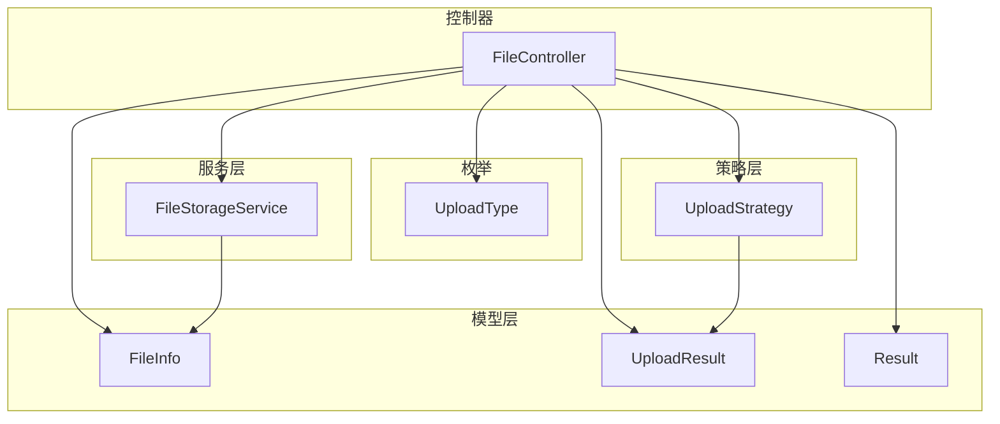
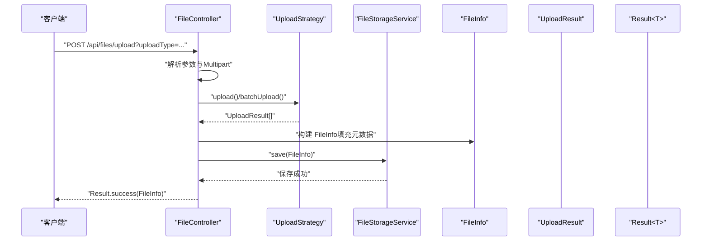
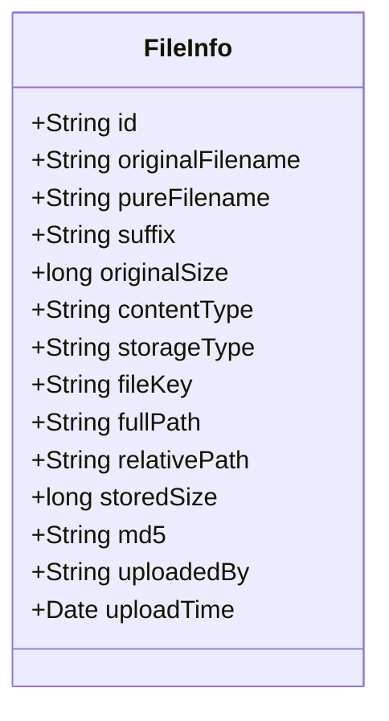
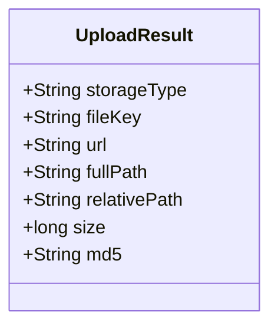
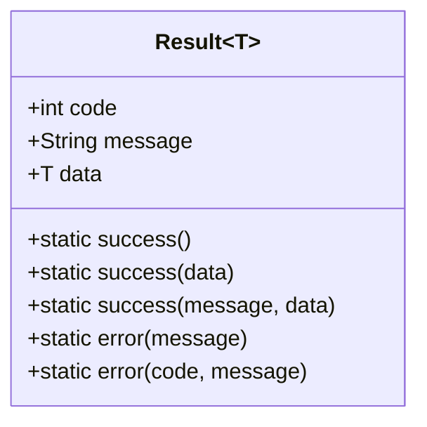
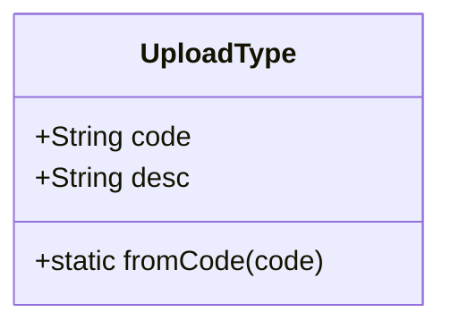
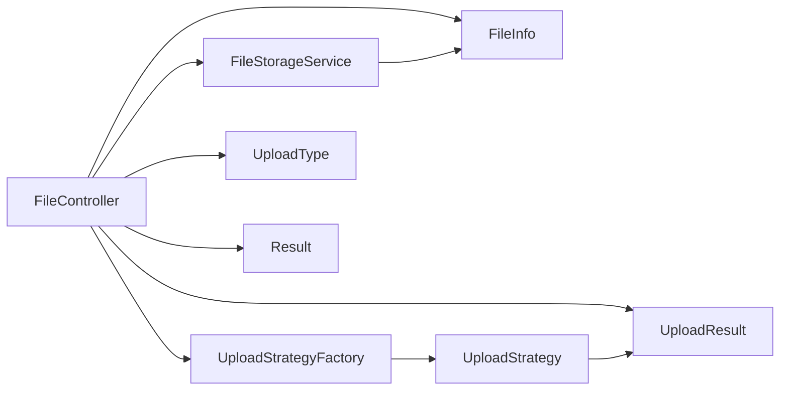
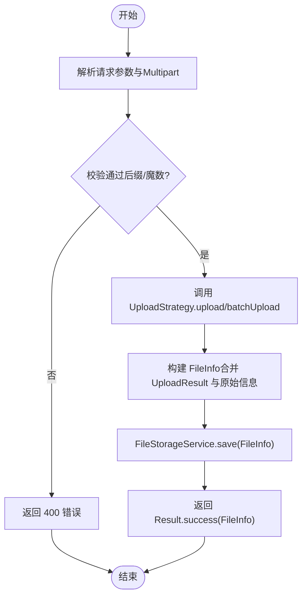

# 数据模型

<cite>
**本文引用的文件**
- [FileInfo.java](file://src/main/java/com/example/fileupload/model/FileInfo.java)
- [UploadResult.java](file://src/main/java/com/example/fileupload/model/UploadResult.java)
- [Result.java](file://src/main/java/com/example/fileupload/model/Result.java)
- [UploadType.java](file://src/main/java/com/example/fileupload/enums/UploadType.java)
- [FileController.java](file://src/main/java/com/example/fileupload/controller/FileController.java)
- [FileStorageService.java](file://src/main/java/com/example/fileupload/service/FileStorageService.java)
- [UploadStrategy.java](file://src/main/java/com/example/fileupload/strategy/UploadStrategy.java)
- [application.yml](file://src/main/resources/application.yml)
- [FileControllerIntegrationTest.java](file://src/test/java/com/example/fileupload/FileControllerIntegrationTest.java)
</cite>

## 目录
1. [简介](#简介)
2. [项目结构](#项目结构)
3. [核心组件](#核心组件)
4. [架构总览](#架构总览)
5. [详细组件分析](#详细组件分析)
6. [依赖关系分析](#依赖关系分析)
7. [性能考虑](#性能考虑)
8. [故障排查指南](#故障排查指南)
9. [结论](#结论)
10. [附录](#附录)

## 简介
本文件为 SpringBootFileUpload 项目的数据模型文档，聚焦以下目标：
- 完整说明核心数据实体定义、字段含义与数据类型
- 重点解释 FileInfo 文件信息模型的结构与约束
- 说明 UploadResult 上传结果模型的设计与用途
- 解释 Result 统一响应包装器的设计模式与标准化 API 响应格式
- 描述实体间关系与转换规则（含数据验证规则与业务约束）
- 提供 JSON 序列化示例与数据库映射建议
- 给出数据迁移策略与版本兼容性考虑

## 项目结构
本项目采用分层与策略模式组织代码：
- model：数据模型层，包含 FileInfo、UploadResult、Result
- enums：枚举类型，如 UploadType
- controller：REST 控制器，封装请求与响应
- service：服务层，当前使用内存存储模拟持久化
- strategy：上传策略接口与实现，支持本地、FTP、OSS
- util：工具类，如文件类型校验

图表来源
- [FileController.java:31-48](file://src/main/java/com/example/fileupload/controller/FileController.java#L31-L48)
- [FileStorageService.java:19-25](file://src/main/java/com/example/fileupload/service/FileStorageService.java#L19-L25)
- [UploadStrategy.java:10-74](file://src/main/java/com/example/fileupload/strategy/UploadStrategy.java#L10-L74)
- [FileInfo.java:5-75](file://src/main/java/com/example/fileupload/model/FileInfo.java#L5-L75)
- [UploadResult.java:3-38](file://src/main/java/com/example/fileupload/model/UploadResult.java#L3-L38)
- [Result.java:3-46](file://src/main/java/com/example/fileupload/model/Result.java#L3-L46)
- [UploadType.java:3-34](file://src/main/java/com/example/fileupload/enums/UploadType.java#L3-L34)

章节来源
- [FileController.java:31-48](file://src/main/java/com/example/fileupload/controller/FileController.java#L31-L48)
- [application.yml:4-28](file://src/main/resources/application.yml#L4-L28)

## 核心组件
- FileInfo：文件信息模型，封装上传前后完整信息，用于持久化与查询展示
- UploadResult：上传策略执行后返回的通用结果，供处理器组装 FileInfo
- Result<T>：统一响应包装器，标准化 API 返回格式
- UploadType：上传类型枚举，标识支持的存储方式（local/ftp/oss）

章节来源
- [FileInfo.java:5-75](file://src/main/java/com/example/fileupload/model/FileInfo.java#L5-L75)
- [UploadResult.java:3-38](file://src/main/java/com/example/fileupload/model/UploadResult.java#L3-L38)
- [Result.java:3-46](file://src/main/java/com/example/fileupload/model/Result.java#L3-L46)
- [UploadType.java:3-34](file://src/main/java/com/example/fileupload/enums/UploadType.java#L3-L34)

## 架构总览
下图展示了从请求到响应过程中数据模型的流转：

图表来源
- [FileController.java:50-84](file://src/main/java/com/example/fileupload/controller/FileController.java#L50-L84)
- [FileController.java:138-154](file://src/main/java/com/example/fileupload/controller/FileController.java#L138-L154)
- [UploadStrategy.java:10-74](file://src/main/java/com/example/fileupload/strategy/UploadStrategy.java#L10-L74)
- [FileStorageService.java:29-39](file://src/main/java/com/example/fileupload/service/FileStorageService.java#L29-L39)

## 详细组件分析

### FileInfo 文件信息模型
- 作用：封装上传前后的完整信息，作为系统内文件实体的核心载体
- 字段分组与含义：
  - 原始文件信息：originalFilename（原始文件名）、pureFilename（纯文件名不含后缀）、suffix（后缀）、originalSize（原始大小字节）、contentType（MIME类型）
  - 存储后文件信息：storageType（存储类型标识 local/ftp/oss）、fileKey（存储路径或唯一标识）、fullPath（完整路径，本地时含盘符绝对路径）、relativePath（相对路径）、storedSize（实际上传后大小）、md5（MD5校验值）
  - 元数据：id（系统主键）、uploadedBy（上传人）、uploadTime（上传时间）
- 数据类型与约束：
  - id：字符串，唯一主键；由控制器或服务生成（UUID去连字符）
  - originalFilename/pureFilename/suffix：字符串，非空；后缀需通过 FileTypeValidator 校验
  - originalSize/storedSize：长整型，非负
  - contentType：字符串，MIME类型
  - storageType：字符串，取值受 UploadType 限制（local/ftp/oss）
  - fileKey/fullPath/relativePath：字符串，fileKey 必填；fullPath 仅在本地存储有意义
  - md5：字符串，可选但推荐用于完整性校验
  - uploadedBy：字符串，默认 system
  - uploadTime：日期时间，记录上传时间
- 业务约束：
  - 上传流程中，FileTypeValidator 会校验后缀与魔数，非法将被拒绝
  - 存储类型必须来自 UploadType，否则抛出异常并返回错误码
  - 删除操作先删底层存储再清元数据，保证一致性

图表来源
- [FileInfo.java:5-75](file://src/main/java/com/example/fileupload/model/FileInfo.java#L5-L75)

章节来源
- [FileController.java:138-154](file://src/main/java/com/example/fileupload/controller/FileController.java#L138-L154)
- [FileControllerIntegrationTest.java:86-121](file://src/test/java/com/example/fileupload/FileControllerIntegrationTest.java#L86-L121)

### UploadResult 上传结果模型
- 作用：上传策略执行后返回的通用结果，供处理器组装 FileInfo
- 字段与含义：
  - storageType：存储类型标识
  - fileKey：存储路径或唯一标识
  - url：可访问 URL（FTP/OSS 有效）
  - fullPath：完整文件路径（本地时含盘符绝对路径）
  - relativePath：相对路径（不含盘符）
  - size：文件大小（字节）
  - md5：文件 MD5 校验值
- 使用场景：
  - FileController 在批量上传时调用 UploadStrategy.batchUpload()，得到 UploadResult[]，再转换为 FileInfo 列表进行持久化

图表来源
- [UploadResult.java:3-38](file://src/main/java/com/example/fileupload/model/UploadResult.java#L3-L38)

章节来源
- [FileController.java:112-154](file://src/main/java/com/example/fileupload/controller/FileController.java#L112-L154)
- [UploadStrategy.java:56-74](file://src/main/java/com/example/fileupload/strategy/UploadStrategy.java#L56-L74)

### Result 统一响应包装器
- 设计模式：泛型包装器，统一 API 返回结构
- 字段：
  - code：状态码（如 200 成功，500 失败，400 参数错误，404 未找到）
  - message：消息描述
  - data：业务数据（泛型 T）
- 工厂方法：
  - success() / success(data) / success(message, data)
  - error(message) / error(code, message)
- 使用范围：
  - 所有 REST 端点统一返回 Result<T>，便于前端统一处理

图表来源
- [Result.java:3-46](file://src/main/java/com/example/fileupload/model/Result.java#L3-L46)

章节来源
- [FileController.java:58-84](file://src/main/java/com/example/fileupload/controller/FileController.java#L58-L84)
- [FileController.java:203-227](file://src/main/java/com/example/fileupload/controller/FileController.java#L203-L227)
- [FileController.java:236-292](file://src/main/java/com/example/fileupload/controller/FileController.java#L236-L292)

### UploadType 枚举
- 作用：标识支持的存储方式，限制 storageType 取值
- 成员：
  - LOCAL("local", "本地磁盘存储")
  - FTP("ftp", "FTP服务器")
  - OSS("oss", "MinIO对象存储")
- 行为：fromCode 根据 code 查找枚举，找不到抛出异常

图表来源
- [UploadType.java:3-34](file://src/main/java/com/example/fileupload/enums/UploadType.java#L3-L34)

章节来源
- [FileController.java:58-84](file://src/main/java/com/example/fileupload/controller/FileController.java#L58-L84)
- [FileController.java:93-133](file://src/main/java/com/example/fileupload/controller/FileController.java#L93-L133)

## 依赖关系分析
- FileController 依赖：
  - RequestUploadProcessor（未在本文展开）
  - FileStorageService（当前内存存储）
  - UploadStrategyFactory（策略工厂）
  - 数据模型：FileInfo、UploadResult、Result
  - 枚举：UploadType
- FileStorageService 依赖：
  - FileInfo（CRUD 与 Mock 数据）
- UploadStrategy 依赖：
  - UploadResult（返回上传结果）

图表来源
- [FileController.java:31-48](file://src/main/java/com/example/fileupload/controller/FileController.java#L31-L48)
- [FileStorageService.java:19-25](file://src/main/java/com/example/fileupload/service/FileStorageService.java#L19-L25)
- [UploadStrategy.java:10-74](file://src/main/java/com/example/fileupload/strategy/UploadStrategy.java#L10-L74)

章节来源
- [FileController.java:31-48](file://src/main/java/com/example/fileupload/controller/FileController.java#L31-L48)
- [FileStorageService.java:19-25](file://src/main/java/com/example/fileupload/service/FileStorageService.java#L19-L25)
- [UploadStrategy.java:10-74](file://src/main/java/com/example/fileupload/strategy/UploadStrategy.java#L10-L74)

## 性能考虑
- 批量上传：UploadStrategy.batchUpload 默认逐个上传，FTP/OSS 可实现连接复用优化
- 内存存储：FileStorageService 使用 ConcurrentHashMap，适合演示与测试；生产应替换为数据库以支持高并发与持久化
- 大文件限制：application.yml 配置 max-file-size 与 max-request-size 为 50MB，避免过大请求影响性能
- 下载响应头：设置 Content-Disposition 与 Content-Length，提升浏览器下载体验

章节来源
- [UploadStrategy.java:56-74](file://src/main/java/com/example/fileupload/strategy/UploadStrategy.java#L56-L74)
- [FileStorageService.java:24-25](file://src/main/java/com/example/fileupload/service/FileStorageService.java#L24-L25)
- [application.yml:4-9](file://src/main/resources/application.yml#L4-L9)
- [FileController.java:184-189](file://src/main/java/com/example/fileupload/controller/FileController.java#L184-L189)

## 故障排查指南
- 非法后缀或魔数不匹配：
  - 现象：上传返回 400
  - 原因：FileTypeValidator 校验失败
  - 处理：检查文件后缀与实际内容是否一致
- 未知上传类型：
  - 现象：上传返回 400
  - 原因：UploadType.fromCode 找不到对应枚举
  - 处理：确保 uploadType 为 local/ftp/oss
- 下载不存在文件：
  - 现象：返回 404
  - 原因：fileKey 不存在于底层存储
  - 处理：确认 fileKey 与 uploadType 正确
- 删除失败：
  - 现象：返回 500
  - 原因：底层存储删除失败或权限不足
  - 处理：检查存储权限与网络连接

章节来源
- [FileControllerIntegrationTest.java:86-121](file://src/test/java/com/example/fileupload/FileControllerIntegrationTest.java#L86-L121)
- [FileController.java:163-194](file://src/main/java/com/example/fileupload/controller/FileController.java#L163-L194)
- [FileController.java:203-227](file://src/main/java/com/example/fileupload/controller/FileController.java#L203-L227)

## 结论
本项目通过清晰的数据模型与策略模式实现了多存储方式的文件上传、下载、删除与查询。FileInfo 作为核心实体承载完整文件信息，UploadResult 作为策略层与控制器间的桥梁，Result 统一了 API 响应格式。配合枚举 UploadType 与工具类 FileTypeValidator，保证了数据的一致性与安全性。生产环境建议将内存存储替换为数据库，并完善错误处理与监控。

## 附录

### 实体关系与转换规则
- 转换流程：
  - 控制器调用 UploadStrategy.upload/batchUpload，得到 UploadResult
  - 将 UploadResult 与 MultipartFile 信息合并，构建 FileInfo
  - 调用 FileStorageService.save 持久化
- 关系：
  - FileInfo 与 UploadResult 是一对一映射（一次上传产生一个结果）
  - FileInfo 与 UploadType 是多对一关系（每个 FileInfo 属于一种存储类型）

图表来源
- [FileController.java:58-84](file://src/main/java/com/example/fileupload/controller/FileController.java#L58-L84)
- [FileController.java:138-154](file://src/main/java/com/example/fileupload/controller/FileController.java#L138-L154)
- [FileStorageService.java:29-39](file://src/main/java/com/example/fileupload/service/FileStorageService.java#L29-L39)

### JSON 序列化示例
- 成功上传单个文件：
  - 响应体包含 code、message、data（FileInfo 对象）
  - data 字段包括 id、originalFilename、storageType、fileKey 等
- 批量上传：
  - 响应体 data 为 FileInfo 列表
- 查询分页：
  - 响应体 data 包含 total、page、size、list（FileInfo 列表）

注意：以上为基于 Result<T> 与 FileInfo 字段的序列化结构示意，具体字段名与顺序遵循 Java 属性命名与 Jackson 默认规则。

章节来源
- [FileController.java:58-84](file://src/main/java/com/example/fileupload/controller/FileController.java#L58-L84)
- [FileController.java:236-292](file://src/main/java/com/example/fileupload/controller/FileController.java#L236-L292)
- [FileInfo.java:5-75](file://src/main/java/com/example/fileupload/model/FileInfo.java#L5-L75)

### 数据库映射说明
- 表名建议：file_info
- 字段映射建议：
  - id -> VARCHAR(32) PK
  - original_filename -> VARCHAR(255)
  - pure_filename -> VARCHAR(255)
  - suffix -> VARCHAR(10)
  - original_size -> BIGINT
  - content_type -> VARCHAR(255)
  - storage_type -> VARCHAR(10)
  - file_key -> VARCHAR(255)
  - full_path -> VARCHAR(500)
  - relative_path -> VARCHAR(500)
  - stored_size -> BIGINT
  - md5 -> VARCHAR(32)
  - uploaded_by -> VARCHAR(50)
  - upload_time -> DATETIME
- 索引建议：
  - 对 file_key 建立唯一索引
  - 对 original_filename、pure_filename 建立全文或模糊搜索索引
  - 对 storage_type、suffix 建立普通索引以支持过滤

章节来源
- [FileInfo.java:5-75](file://src/main/java/com/example/fileupload/model/FileInfo.java#L5-L75)
- [FileStorageService.java:24-25](file://src/main/java/com/example/fileupload/service/FileStorageService.java#L24-L25)

### 数据迁移策略与版本兼容性
- 迁移策略：
  - 新增字段：保持向后兼容，允许旧客户端忽略新字段
  - 修改字段类型：分阶段迁移，先扩展再清理
  - 删除字段：标记废弃后再移除，提供过渡期
- 版本兼容性：
  - API 版本控制：通过 URL 前缀或请求头区分版本
  - 枚举扩展：UploadType 新增存储类型时，保持 fromCode 兼容旧值
  - 配置项：application.yml 新增配置项需提供默认值，避免启动失败

章节来源
- [UploadType.java:3-34](file://src/main/java/com/example/fileupload/enums/UploadType.java#L3-L34)
- [application.yml:12-28](file://src/main/resources/application.yml#L12-L28)