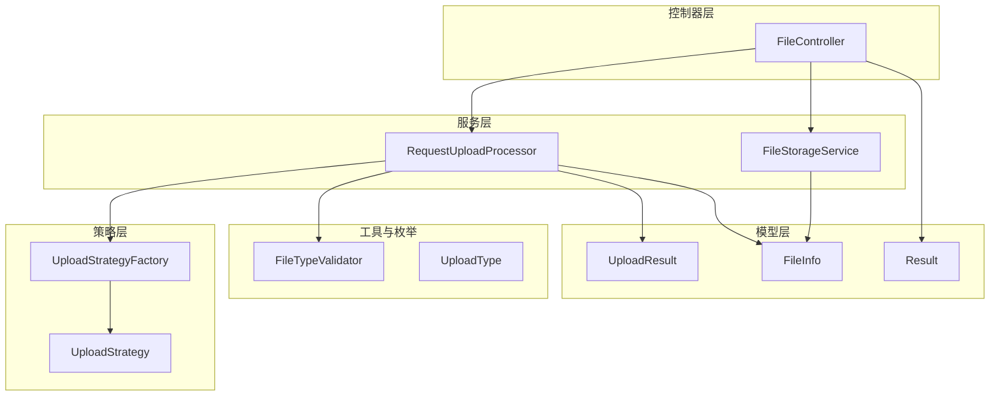
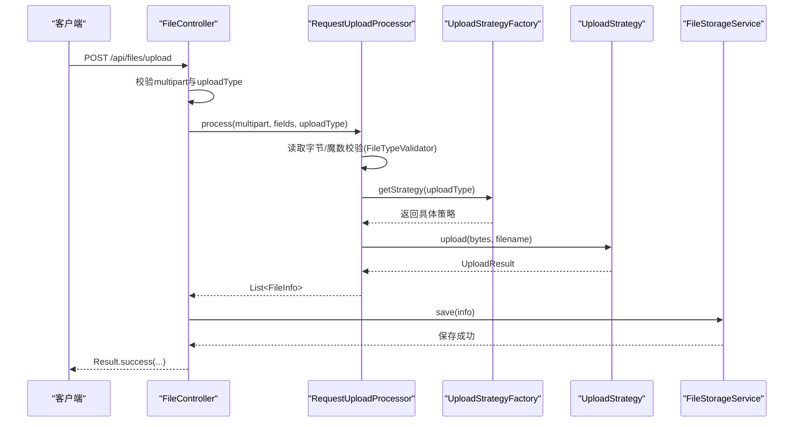
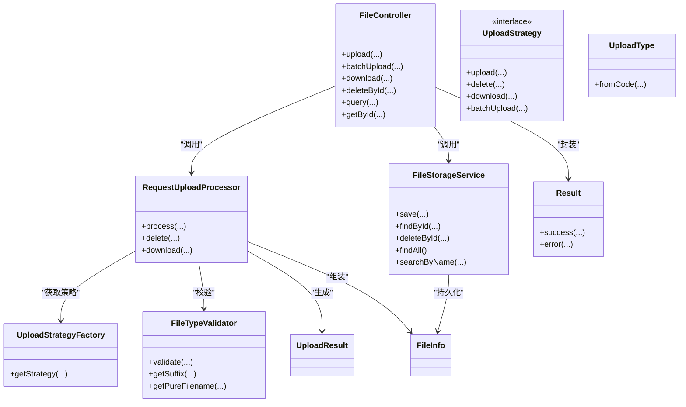
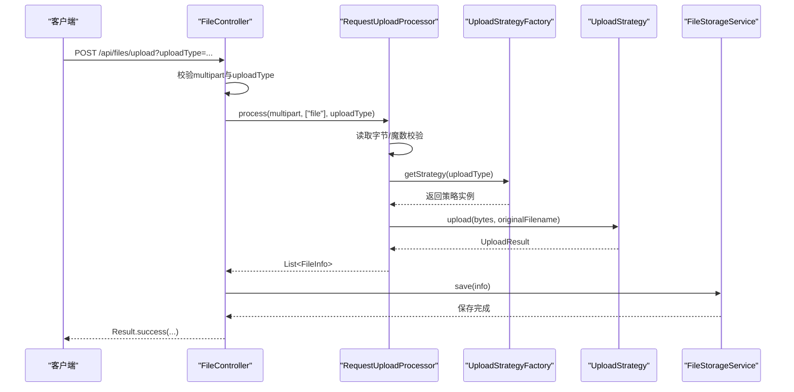
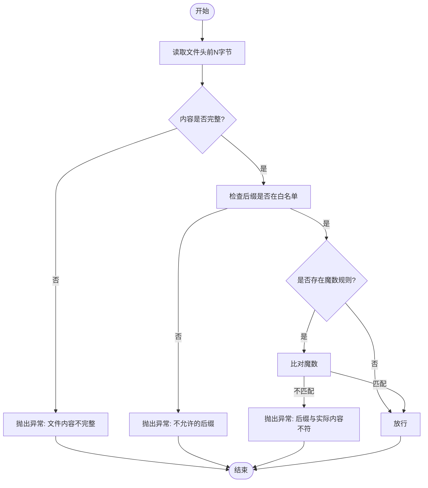

# MVC分层架构

<cite>
**本文引用的文件**
- [FileController.java](file://src/main/java/com/example/fileupload/controller/FileController.java)
- [RequestUploadProcessor.java](file://src/main/java/com/example/fileupload/service/RequestUploadProcessor.java)
- [FileStorageService.java](file://src/main/java/com/example/fileupload/service/FileStorageService.java)
- [Result.java](file://src/main/java/com/example/fileupload/model/Result.java)
- [FileInfo.java](file://src/main/java/com/example/fileupload/model/FileInfo.java)
- [UploadResult.java](file://src/main/java/com/example/fileupload/model/UploadResult.java)
- [UploadType.java](file://src/main/java/com/example/fileupload/enums/UploadType.java)
- [UploadStrategy.java](file://src/main/java/com/example/fileupload/strategy/UploadStrategy.java)
- [UploadStrategyFactory.java](file://src/main/java/com/example/fileupload/strategy/UploadStrategyFactory.java)
- [FileTypeValidator.java](file://src/main/java/com/example/fileupload/util/FileTypeValidator.java)
</cite>

## 目录
1. [简介](#简介)
2. [项目结构](#项目结构)
3. [核心组件](#核心组件)
4. [架构总览](#架构总览)
5. [详细组件分析](#详细组件分析)
6. [依赖关系分析](#依赖关系分析)
7. [性能考虑](#性能考虑)
8. [故障排查指南](#故障排查指南)
9. [结论](#结论)
10. [附录：调用序列与流程图](#附录调用序列与流程图)

## 简介
本项目采用清晰的MVC三层架构，结合策略模式实现多存储后端（本地、FTP、对象存储）的统一接入。Controller层负责HTTP请求解析与响应封装；Service层承担业务编排与数据持久化；Model层定义数据传输对象与统一返回包装。通过统一的上传处理器协调校验、路由与结果组装，确保各层职责清晰、耦合度低、扩展性强。

## 项目结构
- controller：对外暴露REST接口，处理参数校验、异常捕获与统一响应封装
- service：包含文件元数据存储（内存Mock）、上传统一处理器等
- model：定义FileInfo、UploadResult、Result等数据结构
- enums：上传类型枚举，用于策略路由
- strategy：策略接口与工厂，支持可扩展的存储实现
- util：通用工具类，如文件类型校验

图表来源
- [FileController.java:31-48](file://src/main/java/com/example/fileupload/controller/FileController.java#L31-L48)
- [RequestUploadProcessor.java:25-34](file://src/main/java/com/example/fileupload/service/RequestUploadProcessor.java#L25-L34)
- [FileStorageService.java:19-26](file://src/main/java/com/example/fileupload/service/FileStorageService.java#L19-L26)
- [UploadStrategyFactory.java:16-26](file://src/main/java/com/example/fileupload/strategy/UploadStrategyFactory.java#L16-L26)
- [UploadStrategy.java:13-73](file://src/main/java/com/example/fileupload/strategy/UploadStrategy.java#L13-L73)
- [FileTypeValidator.java:12-47](file://src/main/java/com/example/fileupload/util/FileTypeValidator.java#L12-L47)
- [UploadType.java:6-33](file://src/main/java/com/example/fileupload/enums/UploadType.java#L6-L33)

章节来源
- [FileController.java:31-48](file://src/main/java/com/example/fileupload/controller/FileController.java#L31-L48)
- [RequestUploadProcessor.java:25-34](file://src/main/java/com/example/fileupload/service/RequestUploadProcessor.java#L25-L34)
- [FileStorageService.java:19-26](file://src/main/java/com/example/fileupload/service/FileStorageService.java#L19-L26)
- [UploadStrategyFactory.java:16-26](file://src/main/java/com/example/fileupload/strategy/UploadStrategyFactory.java#L16-L26)
- [UploadStrategy.java:13-73](file://src/main/java/com/example/fileupload/strategy/UploadStrategy.java#L13-L73)
- [FileTypeValidator.java:12-47](file://src/main/java/com/example/fileupload/util/FileTypeValidator.java#L12-L47)
- [UploadType.java:6-33](file://src/main/java/com/example/fileupload/enums/UploadType.java#L6-L33)

## 核心组件
- FileController：接收并校验HTTP请求，调用处理器与服务，封装为Result返回
- RequestUploadProcessor：门面式处理器，串联“解析→校验→策略路由→结果组装”流程
- FileStorageService：文件元数据的CRUD与Mock数据初始化（内存实现）
- Result：统一响应包装，包含code、message、data
- UploadStrategy/UploadStrategyFactory：策略接口与自动注册工厂，按UploadType路由到具体实现
- FileTypeValidator：后缀白名单+魔数校验，保障上传安全
- UploadType：上传类型枚举，提供fromCode映射与错误提示
- FileInfo/UploadResult：传输与中间结果对象，承载文件信息与策略执行结果

章节来源
- [FileController.java:50-154](file://src/main/java/com/example/fileupload/controller/FileController.java#L50-L154)
- [RequestUploadProcessor.java:46-87](file://src/main/java/com/example/fileupload/service/RequestUploadProcessor.java#L46-L87)
- [FileStorageService.java:29-107](file://src/main/java/com/example/fileupload/service/FileStorageService.java#L29-L107)
- [Result.java:6-46](file://src/main/java/com/example/fileupload/model/Result.java#L6-L46)
- [UploadStrategy.java:13-73](file://src/main/java/com/example/fileupload/strategy/UploadStrategy.java#L13-L73)
- [UploadStrategyFactory.java:28-55](file://src/main/java/com/example/fileupload/strategy/UploadStrategyFactory.java#L28-L55)
- [FileTypeValidator.java:47-85](file://src/main/java/com/example/fileupload/util/FileTypeValidator.java#L47-L85)
- [UploadType.java:20-33](file://src/main/java/com/example/fileupload/enums/UploadType.java#L20-L33)
- [FileInfo.java:8-75](file://src/main/java/com/example/fileupload/model/FileInfo.java#L8-L75)
- [UploadResult.java:6-38](file://src/main/java/com/example/fileupload/model/UploadResult.java#L6-L38)

## 架构总览
本系统遵循MVC分层：
- Controller层：仅做入参校验、异常捕获与Result封装，不承载业务逻辑
- Service层：RequestUploadProcessor作为门面编排上传流程；FileStorageService负责元数据持久化
- Model层：Result统一响应；FileInfo/UploadResult承载数据流转
- 策略层：UploadStrategy抽象不同存储后端，UploadStrategyFactory根据UploadType动态选择实现

图表来源
- [FileController.java:58-84](file://src/main/java/com/example/fileupload/controller/FileController.java#L58-L84)
- [RequestUploadProcessor.java:46-87](file://src/main/java/com/example/fileupload/service/RequestUploadProcessor.java#L46-L87)
- [UploadStrategyFactory.java:48-55](file://src/main/java/com/example/fileupload/strategy/UploadStrategyFactory.java#L48-L55)
- [UploadStrategy.java:22-33](file://src/main/java/com/example/fileupload/strategy/UploadStrategy.java#L22-L33)
- [FileStorageService.java:32-39](file://src/main/java/com/example/fileupload/service/FileStorageService.java#L32-L39)

## 详细组件分析

### Controller层：FileController
- 职责：接收HTTP请求，进行基础校验（multipart、uploadType），调用处理器与服务，统一用Result封装响应
- 关键流程：
  - 单文件上传：解析multipart → 调用RequestUploadProcessor.process → 填充uploadedBy → 调用FileStorageService.save → 返回Result
  - 批量上传：直接走策略的batchUpload → 构建FileInfo列表 → 保存 → 返回Result
  - 下载：按策略download → 设置响应头 → 返回字节流
  - 删除：先调processor.delete → 成功后再删除元数据
  - 查询：组合过滤与分页，返回Result包裹的数据
- 异常处理：捕获IllegalArgumentException与通用Exception，记录日志并返回Result.error

章节来源
- [FileController.java:58-154](file://src/main/java/com/example/fileupload/controller/FileController.java#L58-L154)
- [FileController.java:163-194](file://src/main/java/com/example/fileupload/controller/FileController.java#L163-L194)
- [FileController.java:203-227](file://src/main/java/com/example/fileupload/controller/FileController.java#L203-L227)
- [FileController.java:236-280](file://src/main/java/com/example/fileupload/controller/FileController.java#L236-L280)
- [FileController.java:287-292](file://src/main/java/com/example/fileupload/controller/FileController.java#L287-L292)

### Service层：RequestUploadProcessor
- 职责：统一编排上传流程，屏蔽底层差异
- 核心步骤：
  - 遍历字段名，提取MultipartFile
  - 读取字节数组，避免临时文件锁定问题
  - 使用FileTypeValidator进行后缀白名单与魔数校验
  - 通过UploadStrategyFactory获取策略，调用upload(bytes, filename)
  - 将UploadResult转换为FileInfo并收集结果
- 其他能力：delete(fileKey)、download(fileKey)

章节来源
- [RequestUploadProcessor.java:46-87](file://src/main/java/com/example/fileupload/service/RequestUploadProcessor.java#L46-L87)
- [RequestUploadProcessor.java:111-130](file://src/main/java/com/example/fileupload/service/RequestUploadProcessor.java#L111-L130)
- [RequestUploadProcessor.java:134-152](file://src/main/java/com/example/fileupload/service/RequestUploadProcessor.java#L134-L152)

### Service层：FileStorageService
- 职责：文件元数据的内存存储与Mock数据初始化
- 能力：save、findById、deleteById、findAll、searchByName、findByStorageType、findBySuffix、clear、size
- Mock数据：启动时初始化若干示例记录，便于演示与测试

章节来源
- [FileStorageService.java:29-107](file://src/main/java/com/example/fileupload/service/FileStorageService.java#L29-L107)
- [FileStorageService.java:111-157](file://src/main/java/com/example/fileupload/service/FileStorageService.java#L111-L157)

### Model层：Result与数据对象
- Result：统一响应包装，包含code、message、data；提供success/error静态方法简化构造
- FileInfo：文件信息模型，包含原始信息、存储后信息、元数据
- UploadResult：策略执行后的通用结果，供处理器组装FileInfo

章节来源
- [Result.java:6-46](file://src/main/java/com/example/fileupload/model/Result.java#L6-L46)
- [FileInfo.java:8-75](file://src/main/java/com/example/fileupload/model/FileInfo.java#L8-L75)
- [UploadResult.java:6-38](file://src/main/java/com/example/fileupload/model/UploadResult.java#L6-L38)

### 策略层：UploadStrategy与UploadStrategyFactory
- UploadStrategy：定义upload、delete、download、batchUpload等方法，支持按字节数组上传
- UploadStrategyFactory：自动注入所有策略实现，构建Map以便按UploadType快速路由；重复类型会抛异常

章节来源
- [UploadStrategy.java:13-73](file://src/main/java/com/example/fileupload/strategy/UploadStrategy.java#L13-L73)
- [UploadStrategyFactory.java:28-55](file://src/main/java/com/example/fileupload/strategy/UploadStrategyFactory.java#L28-L55)

### 工具与枚举：FileTypeValidator与UploadType
- FileTypeValidator：后缀白名单 + 魔数校验，防止恶意文件上传
- UploadType：枚举local/ftp/oss，提供fromCode映射与错误提示

章节来源
- [FileTypeValidator.java:47-85](file://src/main/java/com/example/fileupload/util/FileTypeValidator.java#L47-L85)
- [UploadType.java:20-33](file://src/main/java/com/example/fileupload/enums/UploadType.java#L20-L33)

## 依赖关系分析
- Controller依赖Service（RequestUploadProcessor、FileStorageService）与策略工厂（间接通过处理器）
- RequestUploadProcessor依赖策略工厂与校验工具
- FileStorageService仅依赖模型对象
- 策略层通过工厂解耦具体实现，新增存储只需实现UploadStrategy并注册
- 枚举UploadType贯穿路由与校验

图表来源
- [FileController.java:31-48](file://src/main/java/com/example/fileupload/controller/FileController.java#L31-L48)
- [RequestUploadProcessor.java:25-34](file://src/main/java/com/example/fileupload/service/RequestUploadProcessor.java#L25-L34)
- [FileStorageService.java:19-26](file://src/main/java/com/example/fileupload/service/FileStorageService.java#L19-L26)
- [UploadStrategyFactory.java:16-26](file://src/main/java/com/example/fileupload/strategy/UploadStrategyFactory.java#L16-L26)
- [UploadStrategy.java:13-73](file://src/main/java/com/example/fileupload/strategy/UploadStrategy.java#L13-L73)
- [FileTypeValidator.java:12-47](file://src/main/java/com/example/fileupload/util/FileTypeValidator.java#L12-L47)
- [UploadType.java:6-33](file://src/main/java/com/example/fileupload/enums/UploadType.java#L6-L33)
- [Result.java:6-46](file://src/main/java/com/example/fileupload/model/Result.java#L6-L46)
- [FileInfo.java:8-75](file://src/main/java/com/example/fileupload/model/FileInfo.java#L8-L75)
- [UploadResult.java:6-38](file://src/main/java/com/example/fileupload/model/UploadResult.java#L6-L38)

章节来源
- [FileController.java:31-48](file://src/main/java/com/example/fileupload/controller/FileController.java#L31-L48)
- [RequestUploadProcessor.java:25-34](file://src/main/java/com/example/fileupload/service/RequestUploadProcessor.java#L25-L34)
- [FileStorageService.java:19-26](file://src/main/java/com/example/fileupload/service/FileStorageService.java#L19-L26)
- [UploadStrategyFactory.java:16-26](file://src/main/java/com/example/fileupload/strategy/UploadStrategyFactory.java#L16-L26)
- [UploadStrategy.java:13-73](file://src/main/java/com/example/fileupload/strategy/UploadStrategy.java#L13-L73)
- [FileTypeValidator.java:12-47](file://src/main/java/com/example/fileupload/util/FileTypeValidator.java#L12-L47)
- [UploadType.java:6-33](file://src/main/java/com/example/fileupload/enums/UploadType.java#L6-L33)
- [Result.java:6-46](file://src/main/java/com/example/fileupload/model/Result.java#L6-L46)
- [FileInfo.java:8-75](file://src/main/java/com/example/fileupload/model/FileInfo.java#L8-L75)
- [UploadResult.java:6-38](file://src/main/java/com/example/fileupload/model/UploadResult.java#L6-L38)

## 性能考虑
- 上传路径中优先使用字节数组上传，避免Tomcat临时文件被重复锁定导致删除失败
- 批量上传通过策略的batchUpload复用连接（例如FTP），减少网络开销
- 查询在内存中进行过滤与分页，适合小规模数据；生产环境建议替换为数据库查询
- 魔数校验仅读取前16字节，开销可控
- 使用ConcurrentHashMap保证并发安全的元数据存储

[本节为通用指导，不直接分析具体文件]

## 故障排查指南
- 非法上传类型：UploadType.fromCode找不到对应枚举时会抛出异常，Controller捕获并返回Result.error(400,...)
- 非multipart请求：Controller检测到非multipart时返回400错误
- 无有效文件：RequestUploadProcessor.process若无有效文件则抛出异常，Controller捕获并返回错误
- 文件类型不符：FileTypeValidator校验失败抛出异常，Controller捕获并返回错误
- 下载失败：若策略返回null或空字节，Controller返回404或500错误
- 删除失败：策略删除失败或权限不足时，Controller返回500错误并记录日志

章节来源
- [UploadType.java:26-33](file://src/main/java/com/example/fileupload/enums/UploadType.java#L26-L33)
- [FileController.java:62-84](file://src/main/java/com/example/fileupload/controller/FileController.java#L62-L84)
- [FileController.java:97-133](file://src/main/java/com/example/fileupload/controller/FileController.java#L97-L133)
- [RequestUploadProcessor.java:46-87](file://src/main/java/com/example/fileupload/service/RequestUploadProcessor.java#L46-L87)
- [FileTypeValidator.java:47-85](file://src/main/java/com/example/fileupload/util/FileTypeValidator.java#L47-L85)
- [FileController.java:163-194](file://src/main/java/com/example/fileupload/controller/FileController.java#L163-L194)
- [FileController.java:203-227](file://src/main/java/com/example/fileupload/controller/FileController.java#L203-L227)

## 结论
本项目以MVC分层为基础，结合策略模式实现了可插拔的多存储后端。Controller专注请求与响应，Service聚焦业务编排与数据管理，Model统一数据结构与响应格式。RequestUploadProcessor作为门面简化了复杂流程，Result提供了统一的API契约。该设计具备良好的扩展性与可维护性，便于后续接入更多存储方式与增强功能。

[本节为总结性内容，不直接分析具体文件]

## 附录：调用序列与流程图

### 上传完整链路（从FileController到FileStorageService）

图表来源
- [FileController.java:58-84](file://src/main/java/com/example/fileupload/controller/FileController.java#L58-L84)
- [RequestUploadProcessor.java:46-87](file://src/main/java/com/example/fileupload/service/RequestUploadProcessor.java#L46-L87)
- [UploadStrategyFactory.java:48-55](file://src/main/java/com/example/fileupload/strategy/UploadStrategyFactory.java#L48-L55)
- [UploadStrategy.java:22-33](file://src/main/java/com/example/fileupload/strategy/UploadStrategy.java#L22-L33)
- [FileStorageService.java:32-39](file://src/main/java/com/example/fileupload/service/FileStorageService.java#L32-L39)

### 文件类型校验流程

图表来源
- [FileTypeValidator.java:47-85](file://src/main/java/com/example/fileupload/util/FileTypeValidator.java#L47-L85)