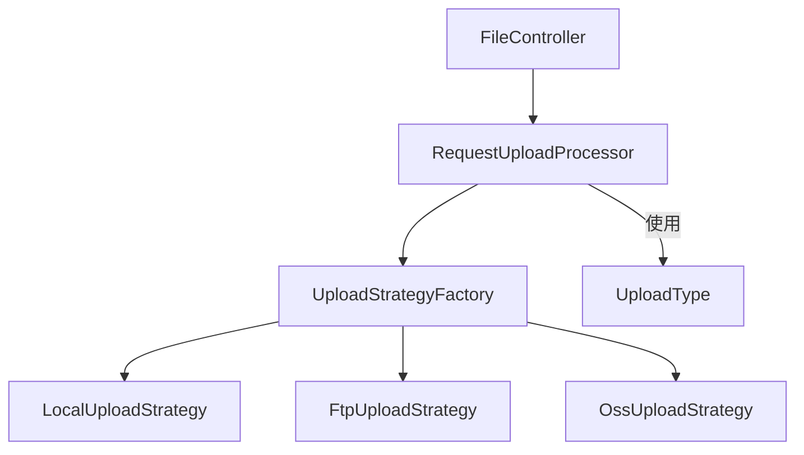
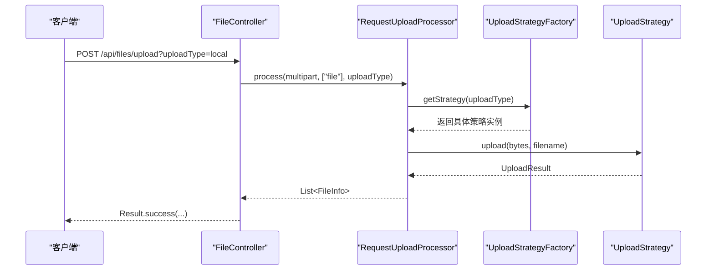
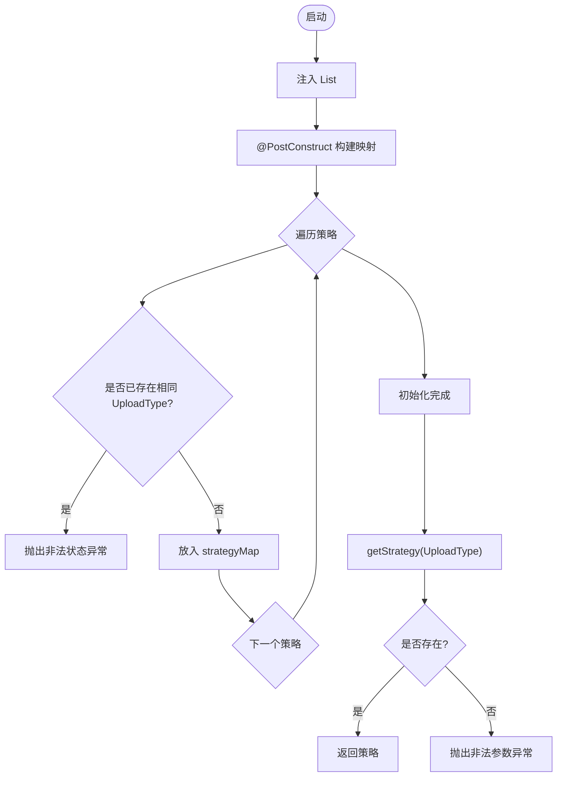
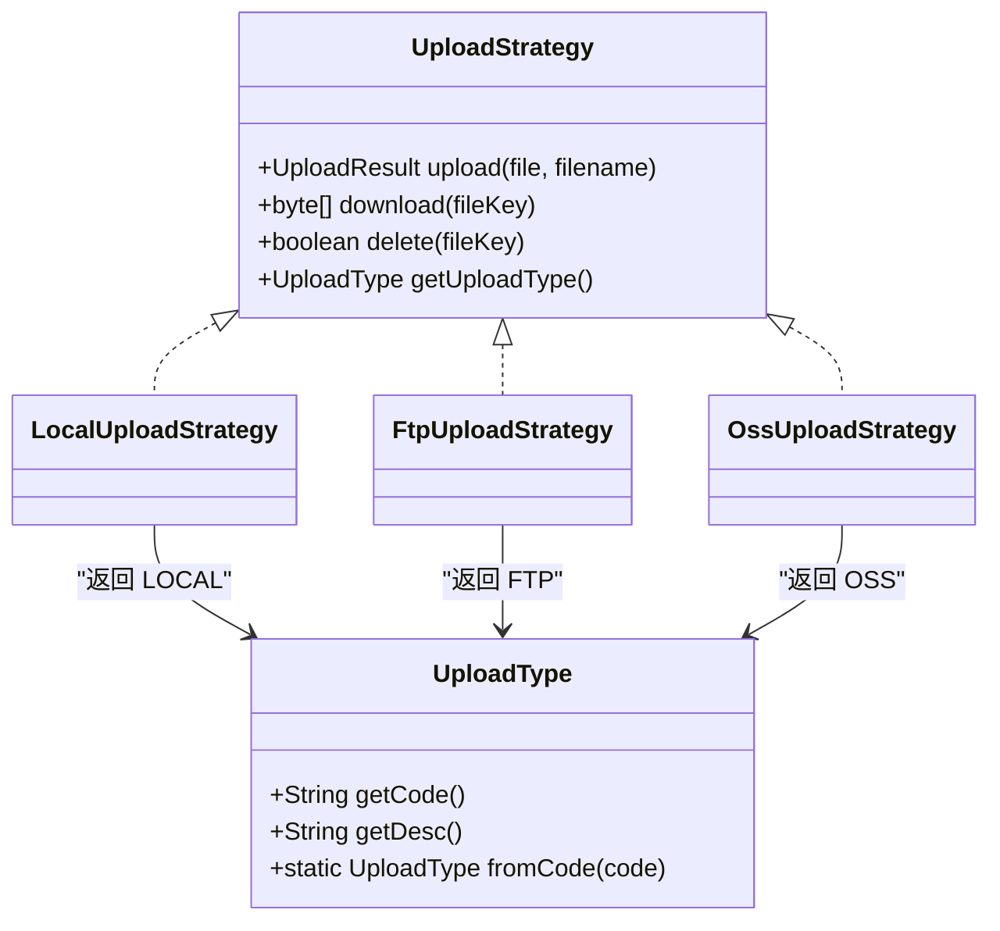
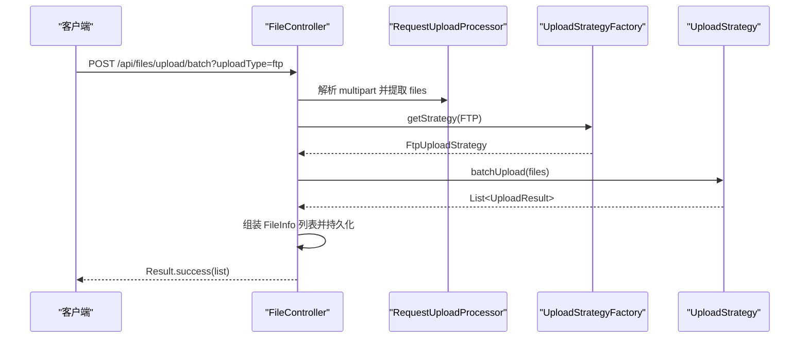
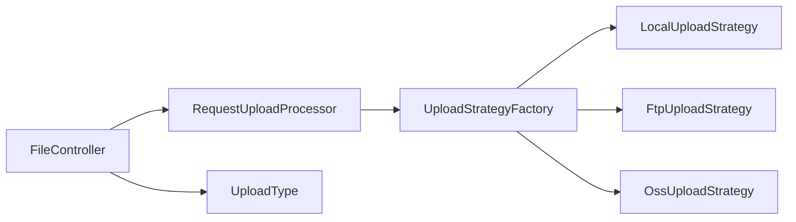

# 工厂模式设计

<cite>
**本文引用的文件**
- [UploadStrategyFactory.java](file://src/main/java/com/example/fileupload/strategy/UploadStrategyFactory.java)
- [UploadType.java](file://src/main/java/com/example/fileupload/enums/UploadType.java)
- [UploadStrategy.java](file://src/main/java/com/example/fileupload/strategy/UploadStrategy.java)
- [LocalUploadStrategy.java](file://src/main/java/com/example/fileupload/strategy/LocalUploadStrategy.java)
- [FtpUploadStrategy.java](file://src/main/java/com/example/fileupload/strategy/FtpUploadStrategy.java)
- [OssUploadStrategy.java](file://src/main/java/com/example/fileupload/strategy/OssUploadStrategy.java)
- [RequestUploadProcessor.java](file://src/main/java/com/example/fileupload/service/RequestUploadProcessor.java)
- [FileController.java](file://src/main/java/com/example/fileupload/controller/FileController.java)
- [application.yml](file://src/main/resources/application.yml)
- [StrategyIntegrationTest.java](file://src/test/java/com/example/fileupload/StrategyIntegrationTest.java)
</cite>

## 目录
1. [简介](#简介)
2. [项目结构](#项目结构)
3. [核心组件](#核心组件)
4. [架构总览](#架构总览)
5. [详细组件分析](#详细组件分析)
6. [依赖关系分析](#依赖关系分析)
7. [性能考量](#性能考量)
8. [故障排查指南](#故障排查指南)
9. [结论](#结论)
10. [附录：新增策略配置步骤与最佳实践](#附录新增策略配置步骤与最佳实践)

## 简介
本文件围绕“工厂模式”在文件上传模块中的设计与实现，系统性阐述 UploadStrategyFactory 如何通过 Spring IoC 容器自动发现并注册所有 UploadStrategy 实现，以及 UploadType 枚举如何作为策略路由键。文档涵盖工厂初始化、策略注册机制、获取策略实例的方法、添加新策略的配置步骤与最佳实践，并通过序列图、类图和流程图解释请求处理流程与错误处理方案。

## 项目结构
该模块采用分层与按功能域组织的方式：
- 控制器层：FileController 暴露 REST API，负责参数校验与结果封装
- 服务门面：RequestUploadProcessor 统一编排解析、校验、策略路由与结果组装
- 策略层：UploadStrategy 接口及多个具体实现（本地磁盘、FTP、对象存储）
- 工厂层：UploadStrategyFactory 基于 Spring 注入的 List<UploadStrategy> 构建映射表
- 枚举层：UploadType 定义支持的存储类型及编码
- 配置：application.yml 提供各存储后端连接参数

图表来源
- [FileController.java:37-48](file://src/main/java/com/example/fileupload/controller/FileController.java#L37-L48)
- [RequestUploadProcessor.java:30-34](file://src/main/java/com/example/fileupload/service/RequestUploadProcessor.java#L30-L34)
- [UploadStrategyFactory.java:16-26](file://src/main/java/com/example/fileupload/strategy/UploadStrategyFactory.java#L16-L26)
- [LocalUploadStrategy.java:26-27](file://src/main/java/com/example/fileupload/strategy/LocalUploadStrategy.java#L26-L27)
- [FtpUploadStrategy.java:36-37](file://src/main/java/com/example/fileupload/strategy/FtpUploadStrategy.java#L36-L37)
- [OssUploadStrategy.java:29-30](file://src/main/java/com/example/fileupload/strategy/OssUploadStrategy.java#L29-L30)

章节来源
- [FileController.java:31-48](file://src/main/java/com/example/fileupload/controller/FileController.java#L31-L48)
- [application.yml:1-33](file://src/main/resources/application.yml#L1-L33)

## 核心组件
- UploadStrategy：定义上传、下载、删除、批量上传等统一能力，并提供默认批量实现以优化不同后端的连接复用
- UploadStrategyFactory：Spring 组件，启动时通过 @PostConstruct 扫描所有 UploadStrategy 实现，构建 UploadType -> Strategy 的并发安全映射；提供 getStrategy(UploadType) 方法
- UploadType：枚举，包含 code/desc 字段，支持 fromCode 反向查找
- 具体策略：LocalUploadStrategy、FtpUploadStrategy、OssUploadStrategy，分别实现本地磁盘、FTP、MinIO 对象存储
- RequestUploadProcessor：门面服务，封装请求解析、类型校验、策略路由、结果组装
- FileController：REST 入口，调用处理器完成上传、下载、删除、查询等操作

章节来源
- [UploadStrategy.java:10-73](file://src/main/java/com/example/fileupload/strategy/UploadStrategy.java#L10-L73)
- [UploadStrategyFactory.java:13-56](file://src/main/java/com/example/fileupload/strategy/UploadStrategyFactory.java#L13-L56)
- [UploadType.java:3-34](file://src/main/java/com/example/fileupload/enums/UploadType.java#L3-L34)
- [LocalUploadStrategy.java:16-118](file://src/main/java/com/example/fileupload/strategy/LocalUploadStrategy.java#L16-L118)
- [FtpUploadStrategy.java:24-193](file://src/main/java/com/example/fileupload/strategy/FtpUploadStrategy.java#L24-L193)
- [OssUploadStrategy.java:20-159](file://src/main/java/com/example/fileupload/strategy/OssUploadStrategy.java#L20-L159)
- [RequestUploadProcessor.java:19-154](file://src/main/java/com/example/fileupload/service/RequestUploadProcessor.java#L19-L154)
- [FileController.java:26-133](file://src/main/java/com/example/fileupload/controller/FileController.java#L26-L133)

## 架构总览
工厂模式在此处的价值在于：
- 解耦客户端代码与具体存储实现：控制器与服务仅依赖抽象接口和工厂，不感知具体实现类
- 扩展性：新增存储后端只需实现 UploadStrategy 并标注为 Spring 组件，无需修改现有逻辑
- 可测试性：可通过替换策略实现进行单元测试或集成测试

图表来源
- [FileController.java:58-84](file://src/main/java/com/example/fileupload/controller/FileController.java#L58-L84)
- [RequestUploadProcessor.java:46-87](file://src/main/java/com/example/fileupload/service/RequestUploadProcessor.java#L46-L87)
- [UploadStrategyFactory.java:48-55](file://src/main/java/com/example/fileupload/strategy/UploadStrategyFactory.java#L48-L55)

## 详细组件分析

### UploadStrategyFactory：自动发现与注册
- 初始化过程：
  - 通过构造器注入 List<UploadStrategy> allStrategies（由 Spring 自动收集所有实现）
  - @PostConstruct 中遍历 allStrategies，调用每个实现的 getUploadType() 将策略注册到 ConcurrentHashMap
  - 检测重复注册：若同一 UploadType 对应多个策略，抛出异常阻止启动
- 获取策略：
  - getStrategy(UploadType) 从映射表中取策略，未找到则抛出 IllegalArgumentException，提示缺失策略

图表来源
- [UploadStrategyFactory.java:21-39](file://src/main/java/com/example/fileupload/strategy/UploadStrategyFactory.java#L21-L39)
- [UploadStrategyFactory.java:48-55](file://src/main/java/com/example/fileupload/strategy/UploadStrategyFactory.java#L48-L55)

章节来源
- [UploadStrategyFactory.java:13-56](file://src/main/java/com/example/fileupload/strategy/UploadStrategyFactory.java#L13-L56)

### UploadType：策略路由键
- 作用：定义支持的存储类型及其编码与描述，供工厂映射与前端传递
- 关键行为：
  - fromCode(String) 根据字符串编码查找枚举，找不到抛异常
  - 各策略通过 getUploadType() 返回自身对应的枚举值，用于注册到工厂

图表来源
- [UploadType.java:6-34](file://src/main/java/com/example/fileupload/enums/UploadType.java#L6-L34)
- [UploadStrategy.java:13-46](file://src/main/java/com/example/fileupload/strategy/UploadStrategy.java#L13-L46)
- [LocalUploadStrategy.java:116-118](file://src/main/java/com/example/fileupload/strategy/LocalUploadStrategy.java#L116-L118)
- [FtpUploadStrategy.java:190-193](file://src/main/java/com/example/fileupload/strategy/FtpUploadStrategy.java#L190-L193)
- [OssUploadStrategy.java:156-159](file://src/main/java/com/example/fileupload/strategy/OssUploadStrategy.java#L156-L159)

章节来源
- [UploadType.java:3-34](file://src/main/java/com/example/fileupload/enums/UploadType.java#L3-L34)
- [UploadStrategy.java:10-73](file://src/main/java/com/example/fileupload/strategy/UploadStrategy.java#L10-L73)

### 具体策略实现要点
- LocalUploadStrategy
  - 读取 file.upload.base-path 配置，解析为实际路径
  - 生成唯一文件名（UUID+原始名），写入磁盘，计算 MD5，返回 UploadResult
  - 支持下载与删除
- FtpUploadStrategy
  - 使用 Apache Commons Net 的 FTPClient，设置 UTF-8、被动模式、二进制传输
  - 单文件上传/下载/删除每次创建并关闭连接
  - 批量上传通过 FtpBatchUploader 复用同一连接，提升吞吐
- OssUploadStrategy
  - 使用 MinIO SDK，启动时确保 bucket 存在
  - 上传/下载/删除基于 objectKey，URL 前缀可配置
  - 未配置 access-key/secret-key 时跳过客户端初始化，避免启动失败

章节来源
- [LocalUploadStrategy.java:26-118](file://src/main/java/com/example/fileupload/strategy/LocalUploadStrategy.java#L26-L118)
- [FtpUploadStrategy.java:36-193](file://src/main/java/com/example/fileupload/strategy/FtpUploadStrategy.java#L36-L193)
- [OssUploadStrategy.java:29-159](file://src/main/java/com/example/fileupload/strategy/OssUploadStrategy.java#L29-L159)

### 请求处理流程（门面与工厂协作）

图表来源
- [FileController.java:93-133](file://src/main/java/com/example/fileupload/controller/FileController.java#L93-L133)
- [RequestUploadProcessor.java:46-87](file://src/main/java/com/example/fileupload/service/RequestUploadProcessor.java#L46-L87)
- [UploadStrategyFactory.java:48-55](file://src/main/java/com/example/fileupload/strategy/UploadStrategyFactory.java#L48-L55)

章节来源
- [FileController.java:86-133](file://src/main/java/com/example/fileupload/controller/FileController.java#L86-L133)
- [RequestUploadProcessor.java:19-154](file://src/main/java/com/example/fileupload/service/RequestUploadProcessor.java#L19-L154)

## 依赖关系分析
- 控制器依赖门面服务与工厂，不直接依赖具体策略
- 门面服务依赖工厂，通过 UploadType 路由到具体策略
- 工厂依赖所有 UploadStrategy 实现（由 Spring 自动装配）
- 各策略依赖各自的后端 SDK 与配置项

图表来源
- [FileController.java:37-48](file://src/main/java/com/example/fileupload/controller/FileController.java#L37-L48)
- [RequestUploadProcessor.java:30-34](file://src/main/java/com/example/fileupload/service/RequestUploadProcessor.java#L30-L34)
- [UploadStrategyFactory.java:21-26](file://src/main/java/com/example/fileupload/strategy/UploadStrategyFactory.java#L21-L26)

章节来源
- [FileController.java:31-48](file://src/main/java/com/example/fileupload/controller/FileController.java#L31-L48)
- [RequestUploadProcessor.java:19-34](file://src/main/java/com/example/fileupload/service/RequestUploadProcessor.java#L19-L34)
- [UploadStrategyFactory.java:16-26](file://src/main/java/com/example/fileupload/strategy/UploadStrategyFactory.java#L16-L26)

## 性能考量
- 批量上传连接复用：FtpUploadStrategy.batchUpload 在同一线程内复用 FTPClient 连接，减少握手开销
- 字节流处理：RequestUploadProcessor 一次性读取 MultipartFile 为字节数组，避免临时文件锁定问题
- 并发安全：工厂内部使用 ConcurrentHashMap 存储策略映射，保证高并发下读取安全
- 资源释放：FTP 与 MinIO 策略在适当时机断开连接或交由框架管理生命周期

[本节为通用指导，不直接分析具体文件]

## 故障排查指南
- 启动时报“重复策略”异常：检查是否有多个策略实现返回相同的 UploadType
- 运行时报“未找到策略”异常：确认前端传入的 uploadType 编码与 UploadType 一致，且策略已正确标注为 Spring 组件
- FTP 上传失败：检查 host/port/username/password/basePath 配置，关注被动模式与权限错误码
- MinIO 无法初始化：确保 access-key/secret-key 已配置，bucket 存在或允许自动创建
- 下载为空：确认 fileKey 有效且底层存储中存在对应文件

章节来源
- [UploadStrategyFactory.java:32-35](file://src/main/java/com/example/fileupload/strategy/UploadStrategyFactory.java#L32-L35)
- [UploadStrategyFactory.java:48-55](file://src/main/java/com/example/fileupload/strategy/UploadStrategyFactory.java#L48-L55)
- [FtpUploadStrategy.java:206-236](file://src/main/java/com/example/fileupload/strategy/FtpUploadStrategy.java#L206-L236)
- [OssUploadStrategy.java:54-70](file://src/main/java/com/example/fileupload/strategy/OssUploadStrategy.java#L54-L70)

## 结论
通过工厂模式与 Spring IoC 的自动装配，本项目实现了上传策略的可插拔与零侵入扩展。UploadType 作为路由键，配合工厂的映射表，使客户端代码完全与具体存储实现解耦。结合门面服务与统一的错误处理，系统具备良好的可维护性与可扩展性。

[本节为总结，不直接分析具体文件]

## 附录：新增策略配置步骤与最佳实践
- 步骤
  1. 新建类实现 UploadStrategy 接口，并在类上标注 @Component
  2. 在 getUploadType() 中返回新的 UploadType 枚举值（如需新增枚举，请在 UploadType 中添加 code/desc）
  3. 实现 upload、download、delete 等方法；如适用，重写 batchUpload 以优化连接复用
  4. 在 application.yml 中补充该策略所需的配置项（如 FTP/MinIO 的连接信息）
  5. 重启应用，观察日志输出确认策略已注册
- 最佳实践
  - 保持 UploadType 的唯一性，避免重复注册
  - 对网络 I/O 做好超时与重试控制，合理设置缓冲区大小
  - 对大文件上传考虑流式处理，避免一次性加载到内存
  - 对敏感配置使用环境变量或配置中心管理
  - 编写单元测试覆盖正常与异常路径，参考现有集成测试

章节来源
- [UploadStrategy.java:10-73](file://src/main/java/com/example/fileupload/strategy/UploadStrategy.java#L10-L73)
- [UploadType.java:6-34](file://src/main/java/com/example/fileupload/enums/UploadType.java#L6-L34)
- [application.yml:12-28](file://src/main/resources/application.yml#L12-L28)
- [StrategyIntegrationTest.java:23-37](file://src/test/java/com/example/fileupload/StrategyIntegrationTest.java#L23-L37)