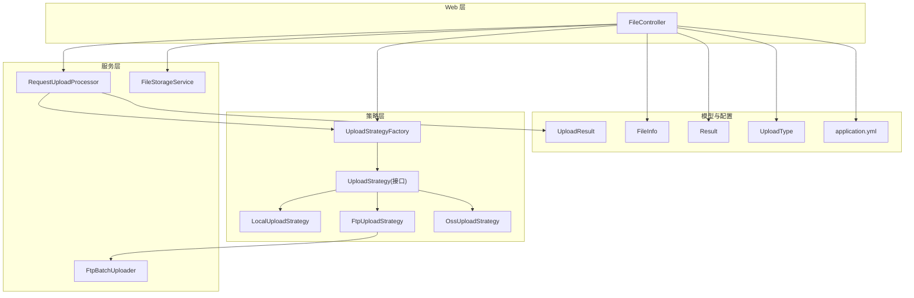
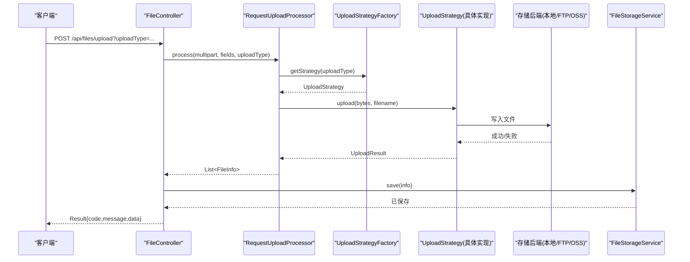
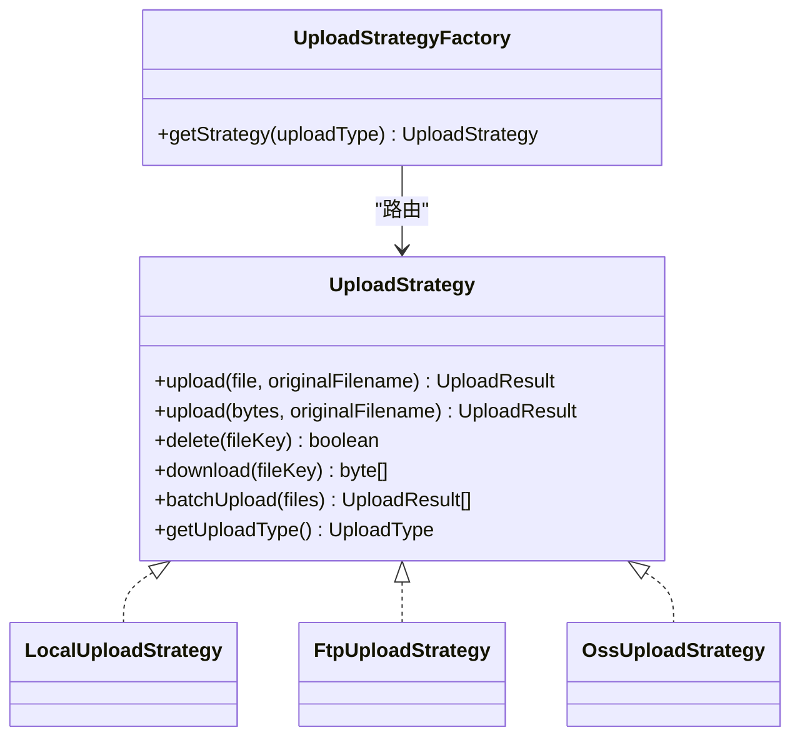
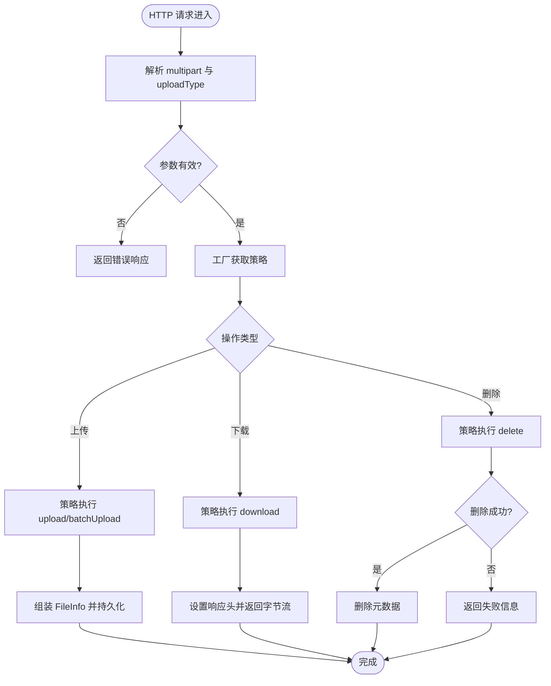
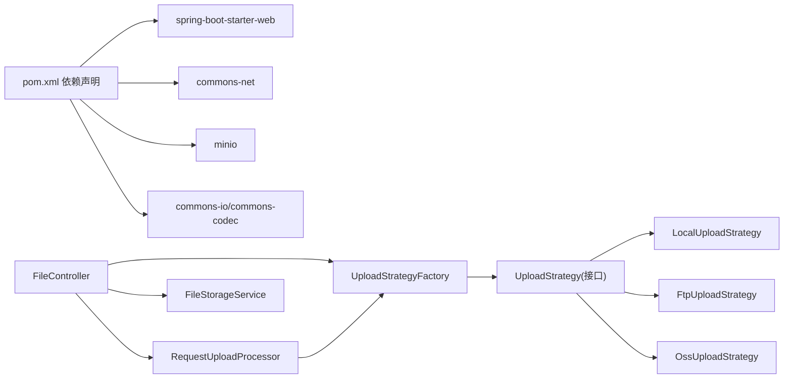
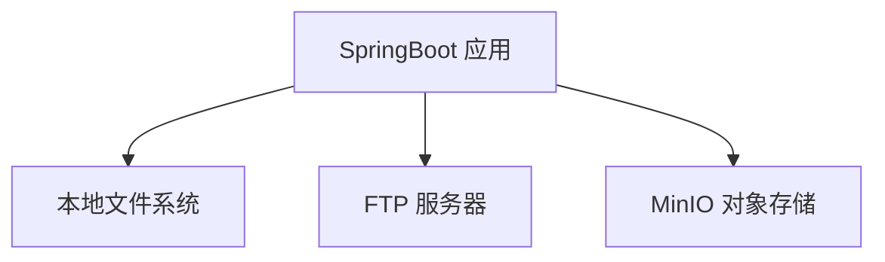
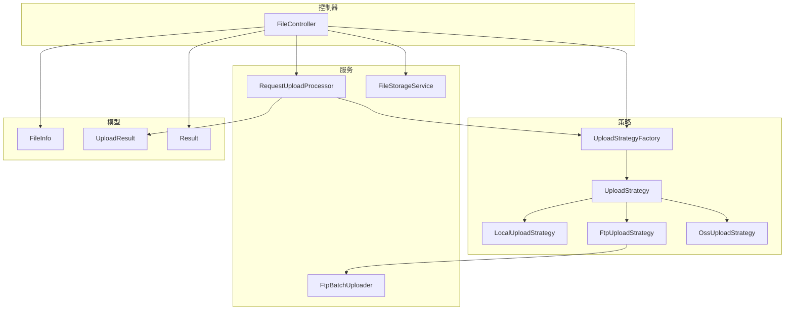

# 架构设计

<cite>
**本文引用的文件**
- [FileUploadApplication.java](file://src/main/java/com/example/fileupload/FileUploadApplication.java)
- [FileController.java](file://src/main/java/com/example/fileupload/controller/FileController.java)
- [RequestUploadProcessor.java](file://src/main/java/com/example/fileupload/service/RequestUploadProcessor.java)
- [FileStorageService.java](file://src/main/java/com/example/fileupload/service/FileStorageService.java)
- [FtpBatchUploader.java](file://src/main/java/com/example/fileupload/service/FtpBatchUploader.java)
- [UploadStrategy.java](file://src/main/java/com/example/fileupload/strategy/UploadStrategy.java)
- [LocalUploadStrategy.java](file://src/main/java/com/example/fileupload/strategy/LocalUploadStrategy.java)
- [FtpUploadStrategy.java](file://src/main/java/com/example/fileupload/strategy/FtpUploadStrategy.java)
- [OssUploadStrategy.java](file://src/main/java/com/example/fileupload/strategy/OssUploadStrategy.java)
- [UploadStrategyFactory.java](file://src/main/java/com/example/fileupload/strategy/UploadStrategyFactory.java)
- [UploadType.java](file://src/main/java/com/example/fileupload/enums/UploadType.java)
- [FileInfo.java](file://src/main/java/com/example/fileupload/model/FileInfo.java)
- [UploadResult.java](file://src/main/java/com/example/fileupload/model/UploadResult.java)
- [Result.java](file://src/main/java/com/example/fileupload/model/Result.java)
- [FileTypeValidator.java](file://src/main/java/com/example/fileupload/util/FileTypeValidator.java)
- [application.yml](file://src/main/resources/application.yml)
- [pom.xml](file://pom.xml)
</cite>

## 目录
1. [简介](#简介)
2. [项目结构](#项目结构)
3. [核心组件](#核心组件)
4. [架构总览](#架构总览)
5. [详细组件分析](#详细组件分析)
6. [依赖关系分析](#依赖关系分析)
7. [性能考量](#性能考量)
8. [故障排查指南](#故障排查指南)
9. [结论](#结论)
10. [附录](#附录)

## 简介
本架构设计文档面向 SpringBootFileUpload 项目，聚焦于系统的高层设计、架构模式与组件边界。重点阐述策略模式在“上传策略”中的实现：接口 UploadStrategy 的设计、三种具体策略（本地磁盘 LocalUploadStrategy、FTP FtpUploadStrategy、对象存储 OssUploadStrategy）以及通过 UploadStrategyFactory 进行运行时路由的机制。同时说明 MVC 分层职责（Controller、Service、Model），并描述从 HTTP 请求到存储后端的完整数据流。最后给出技术决策的原因与权衡，以及可扩展性与第三方依赖集成要点。

## 项目结构
项目采用典型的 Spring Boot Web 应用结构，按功能域划分包：
- controller：对外暴露 REST 接口，负责参数校验、统一响应封装与流程编排
- service：业务处理与编排，包含上传统一处理器 RequestUploadProcessor、元数据存储 FileStorageService、FTP 批量上传工具 FtpBatchUploader
- strategy：策略模式核心，定义 UploadStrategy 接口及多种后端存储的具体实现，并通过 UploadStrategyFactory 自动注册与路由
- model：领域模型与通用返回体，如 FileInfo、UploadResult、Result
- enums：上传类型枚举 UploadType，作为策略选择键
- util：通用工具类，如 FileTypeValidator 用于文件类型校验
- resources：应用配置 application.yml，集中管理端口、Multipart 限制与各存储后端连接参数
- 启动入口：FileUploadApplication

图表来源
- [FileController.java:31-48](file://src/main/java/com/example/fileupload/controller/FileController.java#L31-L48)
- [RequestUploadProcessor.java:25-34](file://src/main/java/com/example/fileupload/service/RequestUploadProcessor.java#L25-L34)
- [UploadStrategyFactory.java:16-26](file://src/main/java/com/example/fileupload/strategy/UploadStrategyFactory.java#L16-L26)
- [UploadStrategy.java:10-13](file://src/main/java/com/example/fileupload/strategy/UploadStrategy.java#L10-L13)
- [LocalUploadStrategy.java:26-27](file://src/main/java/com/example/fileupload/strategy/LocalUploadStrategy.java#L26-L27)
- [FtpUploadStrategy.java:36-37](file://src/main/java/com/example/fileupload/strategy/FtpUploadStrategy.java#L36-L37)
- [OssUploadStrategy.java:29-30](file://src/main/java/com/example/fileupload/strategy/OssUploadStrategy.java#L29-L30)
- [application.yml:1-33](file://src/main/resources/application.yml#L1-L33)

章节来源
- [FileUploadApplication.java:6-11](file://src/main/java/com/example/fileupload/FileUploadApplication.java#L6-L11)
- [application.yml:1-33](file://src/main/resources/application.yml#L1-L33)
- [pom.xml:24-71](file://pom.xml#L24-L71)

## 核心组件
- 控制器层（FileController）
  - 职责：接收 HTTP 请求、参数校验、调用服务层、统一返回 Result
  - 关键端点：单文件上传、批量上传、下载、删除、查询、Mock 初始化
- 服务层（RequestUploadProcessor、FileStorageService、FtpBatchUploader）
  - RequestUploadProcessor：上传统一入口，负责解析 multipart、类型校验、策略路由、结果组装
  - FileStorageService：内存式元数据存储（可替换为数据库），提供 CRUD 与简单搜索
  - FtpBatchUploader：FTP 批量上传工具，复用连接提升吞吐
- 策略层（UploadStrategy 及其实现、UploadStrategyFactory）
  - UploadStrategy：定义 upload/delete/download/batchUpload/getUploadType
  - 具体策略：LocalUploadStrategy（本地磁盘）、FtpUploadStrategy（FTP）、OssUploadStrategy（MinIO）
  - UploadStrategyFactory：自动收集所有策略实现，构建映射表，按 UploadType 路由
- 模型与配置
  - FileInfo：文件元数据持久化模型
  - UploadResult：策略执行后的通用结果
  - Result：统一 API 响应体
  - UploadType：策略选择键（local/ftp/oss）
  - application.yml：集中配置各存储后端参数

章节来源
- [FileController.java:50-133](file://src/main/java/com/example/fileupload/controller/FileController.java#L50-L133)
- [RequestUploadProcessor.java:46-87](file://src/main/java/com/example/fileupload/service/RequestUploadProcessor.java#L46-L87)
- [FileStorageService.java:19-107](file://src/main/java/com/example/fileupload/service/FileStorageService.java#L19-L107)
- [UploadStrategy.java:10-73](file://src/main/java/com/example/fileupload/strategy/UploadStrategy.java#L10-L73)
- [UploadStrategyFactory.java:16-55](file://src/main/java/com/example/fileupload/strategy/UploadStrategyFactory.java#L16-L55)
- [FileInfo.java:8-75](file://src/main/java/com/example/fileupload/model/FileInfo.java#L8-L75)
- [UploadResult.java:6-38](file://src/main/java/com/example/fileupload/model/UploadResult.java#L6-L38)
- [Result.java:6-46](file://src/main/java/com/example/fileupload/model/Result.java#L6-L46)
- [UploadType.java:6-34](file://src/main/java/com/example/fileupload/enums/UploadType.java#L6-L34)

## 架构总览
系统采用 MVC + 策略模式的组合架构：
- Controller 仅做请求编排与响应封装，不直接耦合存储细节
- Service 层抽象业务流程，RequestUploadProcessor 作为门面协调策略与模型
- Strategy 层以接口隔离不同存储后端，工厂类负责运行时选择
- 配置集中在 application.yml，便于多环境切换

图表来源
- [FileController.java:58-84](file://src/main/java/com/example/fileupload/controller/FileController.java#L58-L84)
- [RequestUploadProcessor.java:46-87](file://src/main/java/com/example/fileupload/service/RequestUploadProcessor.java#L46-L87)
- [UploadStrategyFactory.java:41-55](file://src/main/java/com/example/fileupload/strategy/UploadStrategyFactory.java#L41-L55)
- [LocalUploadStrategy.java:63-84](file://src/main/java/com/example/fileupload/strategy/LocalUploadStrategy.java#L63-L84)
- [FtpUploadStrategy.java:58-74](file://src/main/java/com/example/fileupload/strategy/FtpUploadStrategy.java#L58-L74)
- [OssUploadStrategy.java:78-110](file://src/main/java/com/example/fileupload/strategy/OssUploadStrategy.java#L78-L110)
- [FileStorageService.java:29-39](file://src/main/java/com/example/fileupload/service/FileStorageService.java#L29-L39)

## 详细组件分析

### 策略模式设计与实现
- 接口设计（UploadStrategy）
  - 定义统一的上传、删除、下载、批量上传与类型标识能力
  - 默认 batchUpload 基于单文件上传循环实现，允许具体策略覆盖优化（如 FTP 复用连接）
- 具体策略
  - LocalUploadStrategy：本地磁盘存储，支持唯一文件名生成、相对路径计算、MD5 计算
  - FtpUploadStrategy：使用 Apache Commons Net，解决乱码、被动模式、连接复用；提供批量上传优化
  - OssUploadStrategy：使用 MinIO SDK，自动创建 bucket，URL 前缀可配置，支持 put/get/remove
- 工厂类（UploadStrategyFactory）
  - 通过 Spring 注入所有 UploadStrategy 实现，@PostConstruct 构建 Map<UploadType, UploadStrategy>
  - getStrategy 根据 UploadType 快速路由，未找到时抛出明确异常

图表来源
- [UploadStrategy.java:10-73](file://src/main/java/com/example/fileupload/strategy/UploadStrategy.java#L10-L73)
- [LocalUploadStrategy.java:26-118](file://src/main/java/com/example/fileupload/strategy/LocalUploadStrategy.java#L26-L118)
- [FtpUploadStrategy.java:36-193](file://src/main/java/com/example/fileupload/strategy/FtpUploadStrategy.java#L36-L193)
- [OssUploadStrategy.java:29-159](file://src/main/java/com/example/fileupload/strategy/OssUploadStrategy.java#L29-L159)
- [UploadStrategyFactory.java:16-55](file://src/main/java/com/example/fileupload/strategy/UploadStrategyFactory.java#L16-L55)

章节来源
- [UploadStrategy.java:10-73](file://src/main/java/com/example/fileupload/strategy/UploadStrategy.java#L10-L73)
- [UploadStrategyFactory.java:16-55](file://src/main/java/com/example/fileupload/strategy/UploadStrategyFactory.java#L16-L55)
- [LocalUploadStrategy.java:63-188](file://src/main/java/com/example/fileupload/strategy/LocalUploadStrategy.java#L63-L188)
- [FtpUploadStrategy.java:58-186](file://src/main/java/com/example/fileupload/strategy/FtpUploadStrategy.java#L58-L186)
- [OssUploadStrategy.java:78-159](file://src/main/java/com/example/fileupload/strategy/OssUploadStrategy.java#L78-L159)

### MVC 分层职责
- Controller 层（FileController）
  - 接收并校验 multipart/form-data 请求
  - 解析 uploadType 并调用 RequestUploadProcessor
  - 将策略返回的 UploadResult 转换为 FileInfo，交由 FileStorageService 持久化
  - 统一返回 Result，处理异常与日志
- Service 层
  - RequestUploadProcessor：流程编排（解析→校验→策略路由→结果组装）
  - FileStorageService：元数据存取（当前为内存实现，可替换为数据库）
  - FtpBatchUploader：FTP 批量上传工具，复用连接减少握手开销
- Model 层
  - FileInfo：文件元数据实体
  - UploadResult：策略执行结果
  - Result：统一响应体

章节来源
- [FileController.java:50-154](file://src/main/java/com/example/fileupload/controller/FileController.java#L50-L154)
- [RequestUploadProcessor.java:46-152](file://src/main/java/com/example/fileupload/service/RequestUploadProcessor.java#L46-L152)
- [FileStorageService.java:19-107](file://src/main/java/com/example/fileupload/service/FileStorageService.java#L19-L107)
- [FileInfo.java:8-75](file://src/main/java/com/example/fileupload/model/FileInfo.java#L8-L75)
- [UploadResult.java:6-38](file://src/main/java/com/example/fileupload/model/UploadResult.java#L6-L38)
- [Result.java:6-46](file://src/main/java/com/example/fileupload/model/Result.java#L6-L46)

### 数据流与交互关系（从 HTTP 到存储）
- 单文件上传流程
  - Controller 解析 multipart → 调用 RequestUploadProcessor.process
  - Processor 读取字节、进行类型校验 → 通过工厂获取策略 → 调用策略 upload
  - 策略写入后端（本地/FTP/OSS） → 返回 UploadResult → Processor 组装 FileInfo → Controller 持久化元数据
- 批量上传流程（FTP/OSS）
  - Controller 取 files 字段列表 → 通过工厂获取策略 → 调用 batchUpload
  - 策略内部复用连接或并发优化 → 返回多个 UploadResult → Controller 逐个持久化元数据
- 下载流程
  - Controller 解析 fileKey 与 uploadType → 调用 processor.download → 策略 download → 设置响应头返回字节流
- 删除流程
  - Controller 先查元数据 → 调用 processor.delete → 策略删除底层文件 → 成功后删除元数据

图表来源
- [FileController.java:58-227](file://src/main/java/com/example/fileupload/controller/FileController.java#L58-L227)
- [RequestUploadProcessor.java:46-130](file://src/main/java/com/example/fileupload/service/RequestUploadProcessor.java#L46-L130)
- [UploadStrategyFactory.java:41-55](file://src/main/java/com/example/fileupload/strategy/UploadStrategyFactory.java#L41-L55)
- [LocalUploadStrategy.java:63-113](file://src/main/java/com/example/fileupload/strategy/LocalUploadStrategy.java#L63-L113)
- [FtpUploadStrategy.java:58-114](file://src/main/java/com/example/fileupload/strategy/FtpUploadStrategy.java#L58-L114)
- [OssUploadStrategy.java:78-154](file://src/main/java/com/example/fileupload/strategy/OssUploadStrategy.java#L78-L154)

章节来源
- [FileController.java:58-227](file://src/main/java/com/example/fileupload/controller/FileController.java#L58-L227)
- [RequestUploadProcessor.java:46-130](file://src/main/java/com/example/fileupload/service/RequestUploadProcessor.java#L46-L130)

### 技术决策与权衡
- 为什么选择策略模式
  - 扩展性：新增存储后端只需实现 UploadStrategy 并标注 @Component，无需修改现有流程
  - 解耦：Controller/Service 不感知具体存储实现，降低耦合度
  - 可测试：可针对接口进行单元测试与 Mock
  - 对比其他模式：
    - 条件分支（if/switch）：新增存储需改动多处，违反开闭原则
    - 模板方法：不适合差异较大的后端（FTP vs OSS 差异大）
    - 命令模式：更适合异步/撤销场景，此处更关注运行时选择算法
- 批量上传优化
  - FTP 通过 FtpBatchUploader 复用连接，减少 TCP/TLS 握手开销
  - 默认 batchUpload 基于单文件循环，具体策略可覆盖以提升性能
- 配置与外部依赖
  - application.yml 集中管理各后端参数，便于多环境切换
  - 依赖 commons-net（FTP）、minio（对象存储）、commons-io/commons-codec（文件与 MD5）

章节来源
- [UploadStrategyFactory.java:16-55](file://src/main/java/com/example/fileupload/strategy/UploadStrategyFactory.java#L16-L55)
- [FtpUploadStrategy.java:116-186](file://src/main/java/com/example/fileupload/strategy/FtpUploadStrategy.java#L116-L186)
- [application.yml:12-28](file://src/main/resources/application.yml#L12-L28)
- [pom.xml:44-71](file://pom.xml#L44-L71)

## 依赖关系分析
- 外部依赖
  - spring-boot-starter-web：Web 框架
  - commons-net：FTP 客户端
  - minio：S3 兼容对象存储客户端
  - commons-io/commons-codec：文件与摘要工具
- 内部依赖
  - Controller 依赖 Service 与 Strategy 工厂
  - Service 依赖 Strategy 工厂与模型
  - 策略实现依赖各自后端 SDK 与工具类

图表来源
- [pom.xml:24-71](file://pom.xml#L24-L71)
- [FileController.java:31-48](file://src/main/java/com/example/fileupload/controller/FileController.java#L31-L48)
- [RequestUploadProcessor.java:25-34](file://src/main/java/com/example/fileupload/service/RequestUploadProcessor.java#L25-L34)
- [UploadStrategyFactory.java:16-26](file://src/main/java/com/example/fileupload/strategy/UploadStrategyFactory.java#L16-L26)
- [UploadStrategy.java:10-13](file://src/main/java/com/example/fileupload/strategy/UploadStrategy.java#L10-L13)

章节来源
- [pom.xml:24-71](file://pom.xml#L24-L71)
- [FileController.java:31-48](file://src/main/java/com/example/fileupload/controller/FileController.java#L31-L48)
- [RequestUploadProcessor.java:25-34](file://src/main/java/com/example/fileupload/service/RequestUploadProcessor.java#L25-L34)
- [UploadStrategyFactory.java:16-26](file://src/main/java/com/example/fileupload/strategy/UploadStrategyFactory.java#L16-L26)

## 性能考量
- 内存占用
  - 单文件上传先将文件读入字节数组，避免临时文件锁定问题，但会增加堆内存压力；对大文件建议流式处理或分片上传
- I/O 与网络
  - FTP 批量上传复用连接，显著减少握手开销
  - MinIO 使用 SDK 内置连接池，注意合理配置超时与重试
- 存储路径与命名
  - 本地策略生成唯一文件名并处理碰撞，确保高可用
  - 相对路径计算保证跨平台一致性
- 配置调优
  - 调整 max-file-size/max-request-size 控制上传大小
  - 合理设置 FTP 缓冲区与 MinIO 并发参数

[本节为通用指导，不直接分析具体文件]

## 故障排查指南
- 上传失败
  - 检查 uploadType 是否合法（UploadType.fromCode）
  - 查看策略日志输出（LOCAL/FTP/OSS）定位具体失败点
  - FTP：确认主机、端口、用户名、密码、basePath 与防火墙/被动模式配置
  - OSS：确认 endpoint、access-key、secret-key、bucket-name 与 url-prefix
- 下载失败
  - 确认 fileKey 存在且与存储类型匹配
  - 检查策略 download 返回值是否为空
- 删除失败
  - 先确认底层存储是否存在与权限
  - 若删除成功但元数据未清理，检查 FileStorageService.deleteById
- 批量上传部分失败
  - 查看 FtpBatchUploader 返回的失败条目与错误消息
  - 根据错误码分类（权限不足、路径无效、空间不足等）

章节来源
- [FileController.java:78-83](file://src/main/java/com/example/fileupload/controller/FileController.java#L78-L83)
- [FileController.java:127-132](file://src/main/java/com/example/fileupload/controller/FileController.java#L127-L132)
- [FileController.java:190-193](file://src/main/java/com/example/fileupload/controller/FileController.java#L190-L193)
- [FileController.java:214-226](file://src/main/java/com/example/fileupload/controller/FileController.java#L214-L226)
- [FtpUploadStrategy.java:206-235](file://src/main/java/com/example/fileupload/strategy/FtpUploadStrategy.java#L206-L235)
- [FtpUploadStrategy.java:335-352](file://src/main/java/com/example/fileupload/strategy/FtpUploadStrategy.java#L335-L352)
- [OssUploadStrategy.java:163-167](file://src/main/java/com/example/fileupload/strategy/OssUploadStrategy.java#L163-L167)

## 结论
本项目通过 MVC 分层与策略模式实现了高内聚、低耦合的文件上传服务。策略模式使得新增存储后端成本低、风险小；工厂类简化了运行时路由；服务层统一编排流程，屏蔽存储细节。配合集中化的配置与完善的错误处理，系统在可扩展性、可维护性与可观测性方面表现良好。未来可将 FileStorageService 替换为持久化存储，并对大文件上传引入流式处理以提升性能。

[本节为总结，不直接分析具体文件]

## 附录
- 系统上下文图（展示系统与外部存储的关系）

- 组件分解图（代码级模块关系）

图表来源
- [FileController.java:31-48](file://src/main/java/com/example/fileupload/controller/FileController.java#L31-L48)
- [RequestUploadProcessor.java:25-34](file://src/main/java/com/example/fileupload/service/RequestUploadProcessor.java#L25-L34)
- [UploadStrategyFactory.java:16-26](file://src/main/java/com/example/fileupload/strategy/UploadStrategyFactory.java#L16-L26)
- [UploadStrategy.java:10-13](file://src/main/java/com/example/fileupload/strategy/UploadStrategy.java#L10-L13)
- [LocalUploadStrategy.java:26-27](file://src/main/java/com/example/fileupload/strategy/LocalUploadStrategy.java#L26-L27)
- [FtpUploadStrategy.java:36-37](file://src/main/java/com/example/fileupload/strategy/FtpUploadStrategy.java#L36-L37)
- [OssUploadStrategy.java:29-30](file://src/main/java/com/example/fileupload/strategy/OssUploadStrategy.java#L29-L30)
- [FileInfo.java:8-75](file://src/main/java/com/example/fileupload/model/FileInfo.java#L8-L75)
- [UploadResult.java:6-38](file://src/main/java/com/example/fileupload/model/UploadResult.java#L6-L38)
- [Result.java:6-46](file://src/main/java/com/example/fileupload/model/Result.java#L6-L46)