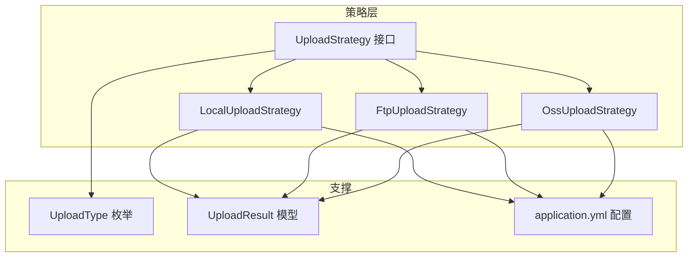
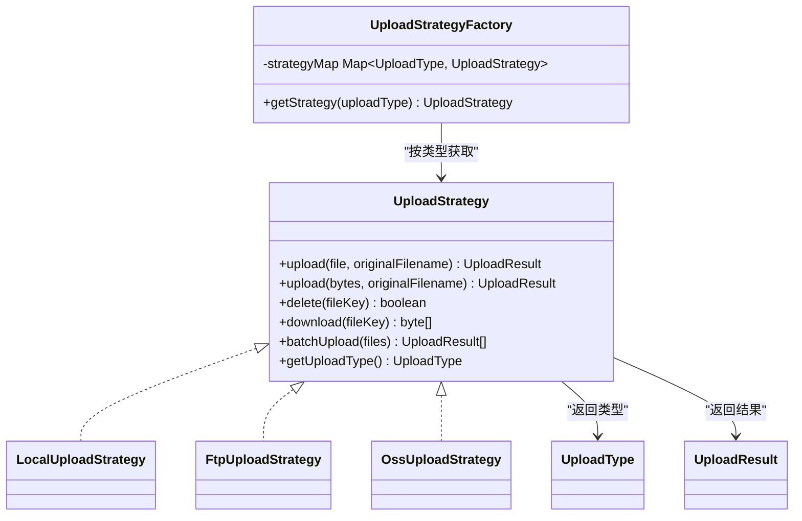
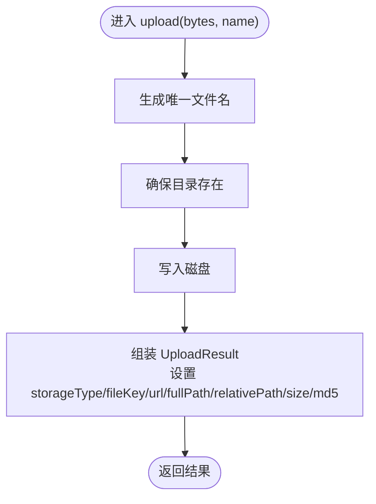
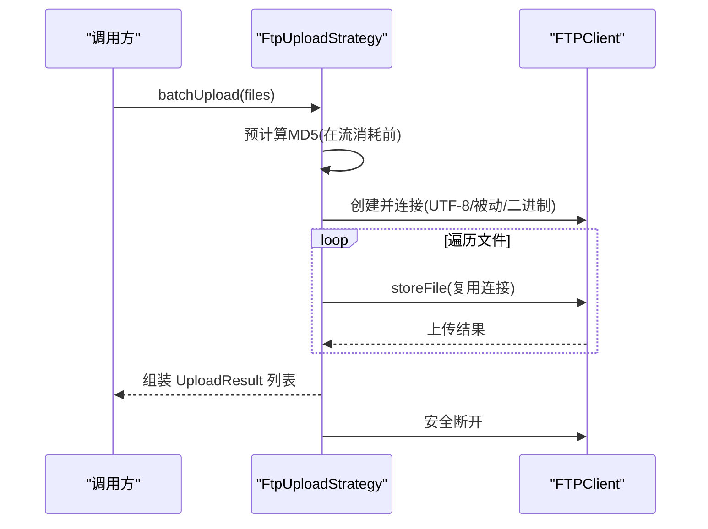
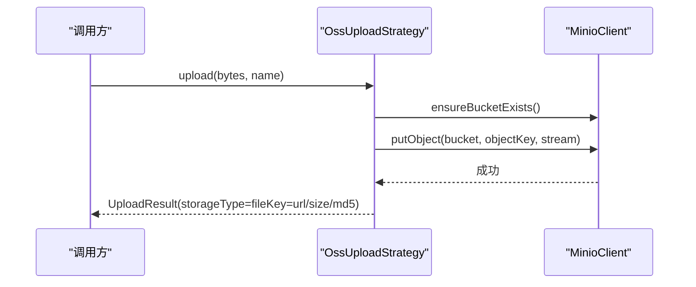
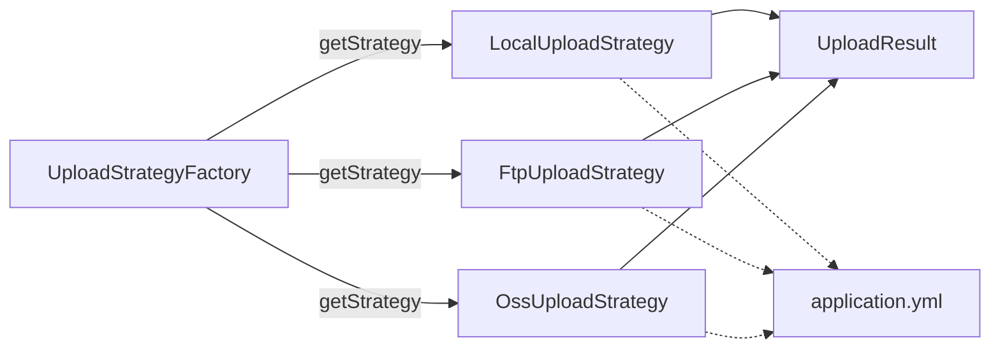

# 策略模式实现

<cite>
**本文引用的文件**
- [UploadStrategy.java](file://src/main/java/com/example/fileupload/strategy/UploadStrategy.java)
- [LocalUploadStrategy.java](file://src/main/java/com/example/fileupload/strategy/LocalUploadStrategy.java)
- [FtpUploadStrategy.java](file://src/main/java/com/example/fileupload/strategy/FtpUploadStrategy.java)
- [OssUploadStrategy.java](file://src/main/java/com/example/fileupload/strategy/OssUploadStrategy.java)
- [UploadStrategyFactory.java](file://src/main/java/com/example/fileupload/strategy/UploadStrategyFactory.java)
- [UploadType.java](file://src/main/java/com/example/fileupload/enums/UploadType.java)
- [UploadResult.java](file://src/main/java/com/example/fileupload/model/UploadResult.java)
- [application.yml](file://src/main/resources/application.yml)
</cite>

## 目录
1. [简介](#简介)
2. [项目结构](#项目结构)
3. [核心组件](#核心组件)
4. [架构总览](#架构总览)
5. [详细组件分析](#详细组件分析)
6. [依赖关系分析](#依赖关系分析)
7. [性能考量](#性能考量)
8. [故障排查指南](#故障排查指南)
9. [结论](#结论)
10. [附录：新增存储策略与切换机制](#附录新增存储策略与切换机制)

## 简介
本仓库以策略模式为核心，抽象出统一的文件上传、下载、删除能力，并通过工厂按“上传类型”动态选择具体实现。当前提供三种策略：本地磁盘（Local）、FTP 服务器（Ftp）、对象存储（MinIO/OSS）。通过枚举 UploadType 与工厂 UploadStrategyFactory 完成运行时路由，便于扩展新的存储后端。

## 项目结构
- 策略接口与实现位于 strategy 包，统一暴露 upload/delete/download/batchUpload/getUploadType 等能力。
- 枚举 UploadType 定义支持的存储类型；结果模型 UploadResult 承载上传后的元信息。
- 配置文件 application.yml 集中管理各存储后端的连接参数与路径前缀。

图表来源
- [UploadStrategy.java:10-73](file://src/main/java/com/example/fileupload/strategy/UploadStrategy.java#L10-L73)
- [LocalUploadStrategy.java:16-118](file://src/main/java/com/example/fileupload/strategy/LocalUploadStrategy.java#L16-L118)
- [FtpUploadStrategy.java:24-193](file://src/main/java/com/example/fileupload/strategy/FtpUploadStrategy.java#L24-L193)
- [OssUploadStrategy.java:20-159](file://src/main/java/com/example/fileupload/strategy/OssUploadStrategy.java#L20-L159)
- [UploadType.java:6-33](file://src/main/java/com/example/fileupload/enums/UploadType.java#L6-L33)
- [UploadResult.java:6-38](file://src/main/java/com/example/fileupload/model/UploadResult.java#L6-L38)
- [application.yml:13-28](file://src/main/resources/application.yml#L13-L28)

章节来源
- [UploadStrategy.java:10-73](file://src/main/java/com/example/fileupload/strategy/UploadStrategy.java#L10-L73)
- [UploadType.java:6-33](file://src/main/java/com/example/fileupload/enums/UploadType.java#L6-L33)
- [UploadResult.java:6-38](file://src/main/java/com/example/fileupload/model/UploadResult.java#L6-L38)
- [application.yml:13-28](file://src/main/resources/application.yml#L13-L28)

## 核心组件
- UploadStrategy：定义统一的上传、下载、删除、批量上传以及类型标识方法。默认 batchUpload 采用逐个调用单文件上传的通用实现，为特定后端提供优化点。
- LocalUploadStrategy：基于本地文件系统，生成唯一文件名并写入磁盘，支持读取/删除。
- FtpUploadStrategy：基于 Apache Commons Net 的 FTPClient，处理乱码、被动模式、二进制传输、连接复用与错误分类。
- OssUploadStrategy：基于 MinIO SDK，封装 put/get/remove 操作，自动创建 bucket，构建访问 URL。
- UploadStrategyFactory：自动收集所有 UploadStrategy 实现，按 UploadType 建立映射并提供 getStrategy 路由。
- UploadType：枚举 local/ftp/oss，提供 fromCode 查找。
- UploadResult：统一返回体，包含 storageType、fileKey、url、fullPath、relativePath、size、md5。

章节来源
- [UploadStrategy.java:10-73](file://src/main/java/com/example/fileupload/strategy/UploadStrategy.java#L10-L73)
- [LocalUploadStrategy.java:16-118](file://src/main/java/com/example/fileupload/strategy/LocalUploadStrategy.java#L16-L118)
- [FtpUploadStrategy.java:24-193](file://src/main/java/com/example/fileupload/strategy/FtpUploadStrategy.java#L24-L193)
- [OssUploadStrategy.java:20-159](file://src/main/java/com/example/fileupload/strategy/OssUploadStrategy.java#L20-L159)
- [UploadStrategyFactory.java:13-55](file://src/main/java/com/example/fileupload/strategy/UploadStrategyFactory.java#L13-L55)
- [UploadType.java:6-33](file://src/main/java/com/example/fileupload/enums/UploadType.java#L6-L33)
- [UploadResult.java:6-38](file://src/main/java/com/example/fileupload/model/UploadResult.java#L6-L38)

## 架构总览
策略模式将“如何上传/下载/删除”从业务中解耦，通过工厂根据 UploadType 选择具体实现。配置集中在 application.yml，便于环境隔离与热切换。

图表来源
- [UploadStrategy.java:10-73](file://src/main/java/com/example/fileupload/strategy/UploadStrategy.java#L10-L73)
- [LocalUploadStrategy.java:16-118](file://src/main/java/com/example/fileupload/strategy/LocalUploadStrategy.java#L16-L118)
- [FtpUploadStrategy.java:24-193](file://src/main/java/com/example/fileupload/strategy/FtpUploadStrategy.java#L24-L193)
- [OssUploadStrategy.java:20-159](file://src/main/java/com/example/fileupload/strategy/OssUploadStrategy.java#L20-L159)
- [UploadStrategyFactory.java:13-55](file://src/main/java/com/example/fileupload/strategy/UploadStrategyFactory.java#L13-L55)
- [UploadType.java:6-33](file://src/main/java/com/example/fileupload/enums/UploadType.java#L6-L33)
- [UploadResult.java:6-38](file://src/main/java/com/example/fileupload/model/UploadResult.java#L6-L38)

## 详细组件分析

### UploadStrategy 接口设计
- upload(MultipartFile, String)：接收浏览器上传的文件对象与原始文件名，返回统一结果。
- upload(byte[], String)：避免重复读取临时文件的字节流版本，默认未实现需子类覆盖。
- delete(String)：按 fileKey 删除目标文件，返回是否成功。
- download(String)：按 fileKey 下载文件字节数组，不存在返回 null。
- getUploadType()：声明该策略对应的 UploadType，用于工厂注册与路由。
- batchUpload(List<MultipartFile>)：默认逐个调用单文件上传；FTP 等可重写以复用连接提升吞吐。

章节来源
- [UploadStrategy.java:10-73](file://src/main/java/com/example/fileupload/strategy/UploadStrategy.java#L10-L73)

### LocalUploadStrategy（本地文件存储）
- 技术选型原因：开发调试与轻量部署首选，零外部依赖，读写延迟低，适合小文件或内网共享盘场景。
- 配置要求：file.upload.base-path 指定根目录，支持相对路径或带前导斜杠的绝对路径（解析到系统盘根）。
- 关键行为：
  - 生成不冲突文件名（UUID+序号），确保目录存在后写入。
  - 计算 relativePath 与 fullPath，便于后续展示与定位。
  - 下载时读取为字节数组，失败记录日志并返回 null。
- 性能特点：I/O 直接落盘，无网络开销；大文件受限于磁盘带宽与 JVM 堆内存（byte[] 方式）。

图表来源
- [LocalUploadStrategy.java:68-84](file://src/main/java/com/example/fileupload/strategy/LocalUploadStrategy.java#L68-L84)
- [LocalUploadStrategy.java:120-137](file://src/main/java/com/example/fileupload/strategy/LocalUploadStrategy.java#L120-L137)
- [LocalUploadStrategy.java:170-188](file://src/main/java/com/example/fileupload/strategy/LocalUploadStrategy.java#L170-L188)

章节来源
- [LocalUploadStrategy.java:16-118](file://src/main/java/com/example/fileupload/strategy/LocalUploadStrategy.java#L16-L118)
- [LocalUploadStrategy.java:120-188](file://src/main/java/com/example/fileupload/strategy/LocalUploadStrategy.java#L120-L188)
- [application.yml:13-15](file://src/main/resources/application.yml#L13-L15)

### FtpUploadStrategy（FTP 服务器存储）
- 技术选型原因：适用于已有 FTP 基础设施的场景；通过被动模式与 UTF-8 控制编码解决常见兼容性问题；批量上传复用连接降低握手成本。
- 配置要求：file.ftp.host/port/username/password/basePath。
- 关键行为：
  - 单文件上传/删除/下载均创建独立 FTPClient，finally 安全断开。
  - 批量上传使用 FtpBatchUploader 复用同一连接，预计算 MD5，失败抛异常并记录详情。
  - 自动创建远程目录（mkdir -p 语义），并对权限/路径/空间等错误进行分类提示。
- 性能特点：单次连接多次传输显著减少 TCP/TLS 握手；二进制模式避免文本转换开销；注意大文件内存占用（retrieveFile 到 ByteArrayOutputStream）。

图表来源
- [FtpUploadStrategy.java:116-186](file://src/main/java/com/example/fileupload/strategy/FtpUploadStrategy.java#L116-L186)
- [FtpUploadStrategy.java:202-236](file://src/main/java/com/example/fileupload/strategy/FtpUploadStrategy.java#L202-L236)
- [FtpUploadStrategy.java:238-263](file://src/main/java/com/example/fileupload/strategy/FtpUploadStrategy.java#L238-L263)

章节来源
- [FtpUploadStrategy.java:24-193](file://src/main/java/com/example/fileupload/strategy/FtpUploadStrategy.java#L24-L193)
- [FtpUploadStrategy.java:202-359](file://src/main/java/com/example/fileupload/strategy/FtpUploadStrategy.java#L202-L359)
- [application.yml:16-21](file://src/main/resources/application.yml#L16-L21)

### OssUploadStrategy（对象存储 MinIO）
- 技术选型原因：云原生对象存储，具备高可用、弹性扩展与多端直传潜力；MinIO 开源可私有化部署，API 简洁。
- 配置要求：file.oss.endpoint/access-key/secret-key/bucket-name/base-path/url-prefix。
- 关键行为：
  - 启动时初始化 MinioClient，若缺少凭据则跳过初始化并在调用时校验。
  - 自动检查并创建 bucket；上传使用流式 PutObject，下载循环读取至字节数组。
  - 构建不含 bucket 的访问 URL，可通过反向代理对外暴露。
- 性能特点：流式上传减少内存峰值；下载按块读取；URL 前缀可指向 CDN/网关以提升访问性能。

图表来源
- [OssUploadStrategy.java:54-70](file://src/main/java/com/example/fileupload/strategy/OssUploadStrategy.java#L54-L70)
- [OssUploadStrategy.java:83-110](file://src/main/java/com/example/fileupload/strategy/OssUploadStrategy.java#L83-L110)
- [OssUploadStrategy.java:191-215](file://src/main/java/com/example/fileupload/strategy/OssUploadStrategy.java#L191-L215)

章节来源
- [OssUploadStrategy.java:20-159](file://src/main/java/com/example/fileupload/strategy/OssUploadStrategy.java#L20-L159)
- [OssUploadStrategy.java:161-215](file://src/main/java/com/example/fileupload/strategy/OssUploadStrategy.java#L161-L215)
- [application.yml:22-28](file://src/main/resources/application.yml#L22-L28)

## 依赖关系分析
- 策略与枚举：每个策略通过 getUploadType() 返回对应 UploadType，工厂据此建立映射。
- 策略与结果：所有策略返回 UploadResult，屏蔽底层差异，上层统一消费。
- 配置注入：各策略通过 @Value 注入 application.yml 中的键值，便于环境隔离。
- 工厂装配：Spring 自动将所有 UploadStrategy 注入工厂构造函数，@PostConstruct 构建并发射日志。

图表来源
- [UploadStrategyFactory.java:13-55](file://src/main/java/com/example/fileupload/strategy/UploadStrategyFactory.java#L13-L55)
- [UploadResult.java:6-38](file://src/main/java/com/example/fileupload/model/UploadResult.java#L6-L38)
- [application.yml:13-28](file://src/main/resources/application.yml#L13-L28)

章节来源
- [UploadStrategyFactory.java:13-55](file://src/main/java/com/example/fileupload/strategy/UploadStrategyFactory.java#L13-L55)
- [UploadResult.java:6-38](file://src/main/java/com/example/fileupload/model/UploadResult.java#L6-L38)
- [application.yml:13-28](file://src/main/resources/application.yml#L13-L28)

## 性能考量
- 批量上传优化：默认 batchUpload 逐个调用，FTP 策略重写以复用连接，减少握手与认证开销。
- 内存占用：
  - 本地与 OSS 下载均读入字节数组，超大文件建议改为流式输出到响应或分片处理。
  - FTP 批量上传预计算 MD5 会复制一次字节，需注意内存峰值。
- I/O 路径：
  - 本地策略直接落盘，延迟低但受磁盘性能限制。
  - FTP 走网络，注意防火墙/被动模式与缓冲区大小。
  - OSS 走 HTTP(S)，可通过 url-prefix 接入 CDN/网关加速。
- 可靠性：
  - FTP 对错误码进行归类，便于快速定位权限、路径、空间等问题。
  - OSS 启动时自动创建 bucket，缺失凭据时给出明确异常。

[本节为通用性能讨论，不直接分析具体文件]

## 故障排查指南
- 本地存储
  - 现象：无法写入或找不到文件。
  - 排查：检查 file.upload.base-path 是否解析到有效盘符与目录；确认目录权限与磁盘空间。
  - 参考：路径解析与唯一名生成逻辑。
- FTP
  - 现象：上传/下载失败或乱码。
  - 排查：确认 host/port/用户名密码；启用被动模式；控制编码 UTF-8；检查服务端目录权限与空间；查看错误分类日志。
  - 参考：连接创建、目录创建、错误分类与安全断开。
- 对象存储
  - 现象：客户端未初始化或上传失败。
  - 排查：检查 access-key/secret-key 是否配置；endpoint 可达性；bucket 是否存在；url-prefix 是否正确。
  - 参考：客户端初始化、bucket 自检、put/get 异常处理。

章节来源
- [LocalUploadStrategy.java:40-61](file://src/main/java/com/example/fileupload/strategy/LocalUploadStrategy.java#L40-L61)
- [LocalUploadStrategy.java:170-188](file://src/main/java/com/example/fileupload/strategy/LocalUploadStrategy.java#L170-L188)
- [FtpUploadStrategy.java:202-236](file://src/main/java/com/example/fileupload/strategy/FtpUploadStrategy.java#L202-L236)
- [FtpUploadStrategy.java:287-325](file://src/main/java/com/example/fileupload/strategy/FtpUploadStrategy.java#L287-L325)
- [FtpUploadStrategy.java:327-352](file://src/main/java/com/example/fileupload/strategy/FtpUploadStrategy.java#L327-L352)
- [OssUploadStrategy.java:54-70](file://src/main/java/com/example/fileupload/strategy/OssUploadStrategy.java#L54-L70)
- [OssUploadStrategy.java:161-167](file://src/main/java/com/example/fileupload/strategy/OssUploadStrategy.java#L161-L167)

## 结论
通过策略模式，本项目实现了存储后端的统一抽象与灵活切换。接口清晰、职责单一，工厂负责路由，配置驱动行为。三种策略分别覆盖本地、传统 FTP 与云原生对象存储，满足多样化部署需求。批量上传与错误分类增强了实用性与可维护性。

[本节为总结性内容，不直接分析具体文件]

## 附录：新增存储策略与切换机制

### 新增存储策略步骤
- 新建类实现 UploadStrategy，覆盖必要方法：
  - upload(MultipartFile, String) 与 upload(byte[], String)
  - delete(String)
  - download(String)
  - getUploadType() 返回新类型（需在 UploadType 中补充）
  - 可选：重写 batchUpload(List<MultipartFile>) 以优化连接复用
- 在 UploadType 中增加新枚举项（如 NEW_STORE），提供 code 与 desc。
- 将该实现类标注为 Spring 组件（@Component），由工厂自动发现并注册。
- 在 application.yml 中添加相应配置项（如 file.newstore.*）。

章节来源
- [UploadStrategy.java:10-73](file://src/main/java/com/example/fileupload/strategy/UploadStrategy.java#L10-L73)
- [UploadType.java:6-33](file://src/main/java/com/example/fileupload/enums/UploadType.java#L6-L33)
- [UploadStrategyFactory.java:13-55](file://src/main/java/com/example/fileupload/strategy/UploadStrategyFactory.java#L13-L55)
- [application.yml:13-28](file://src/main/resources/application.yml#L13-L28)

### 策略切换机制
- 通过 UploadType 决定使用哪个策略：
  - 调用 UploadStrategyFactory.getStrategy(UploadType.XXX) 获取具体实现。
  - 不同环境通过 application.yml 配置不同的默认类型或上游服务传入类型即可切换。
- 工厂保证同类型唯一实现，重复注册会抛出异常，便于早期发现问题。

章节来源
- [UploadStrategyFactory.java:28-55](file://src/main/java/com/example/fileupload/strategy/UploadStrategyFactory.java#L28-L55)
- [UploadType.java:23-33](file://src/main/java/com/example/fileupload/enums/UploadType.java#L23-L33)

### 默认方法 batchUpload 的设计与扩展点
- 设计考虑：
  - 提供通用实现，避免重复代码；对不支持批处理的策略可直接沿用。
  - 为需要优化的策略（如 FTP）提供重写入口，以复用连接、减少握手与认证开销。
- 扩展点：
  - 在自定义策略中重写 batchUpload，结合底层 SDK 的批量 API 或连接池，提升吞吐与稳定性。
  - 可在批处理前后加入统计、重试、熔断等横切逻辑。

章节来源
- [UploadStrategy.java:56-72](file://src/main/java/com/example/fileupload/strategy/UploadStrategy.java#L56-L72)
- [FtpUploadStrategy.java:116-186](file://src/main/java/com/example/fileupload/strategy/FtpUploadStrategy.java#L116-L186)