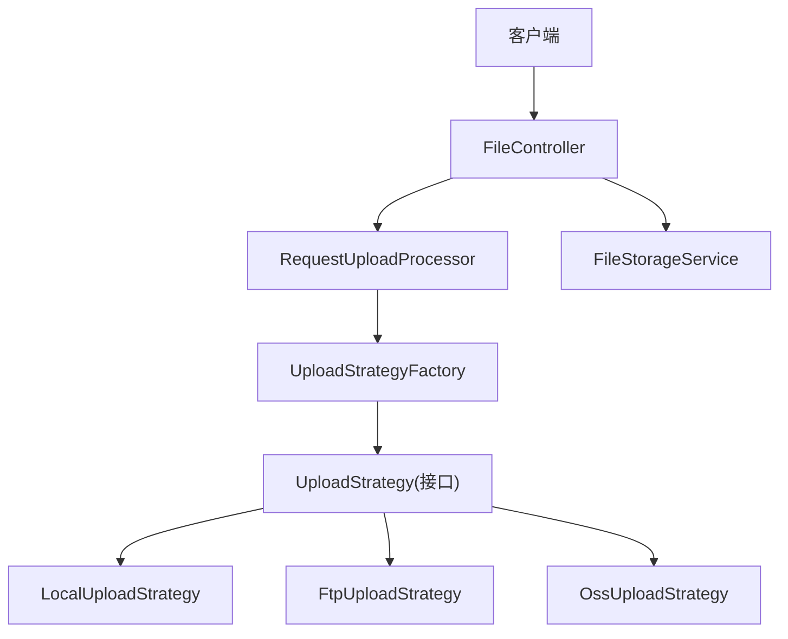
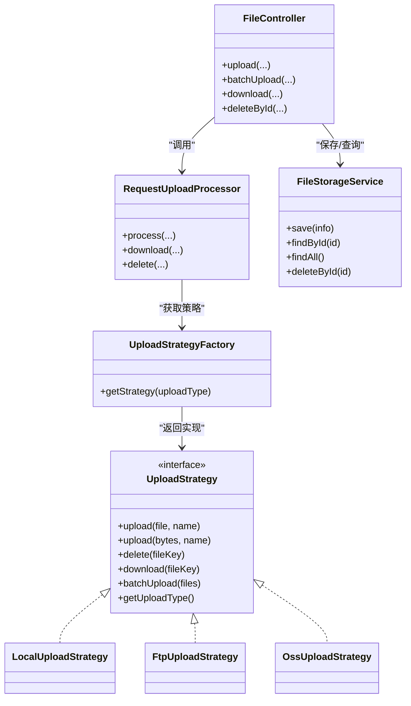
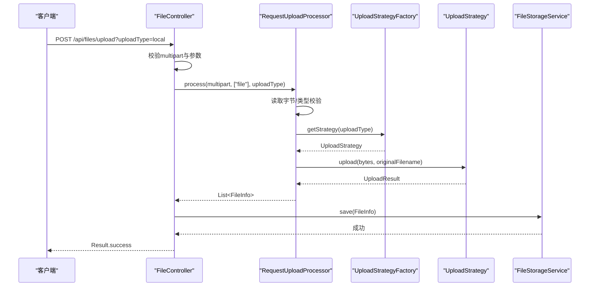
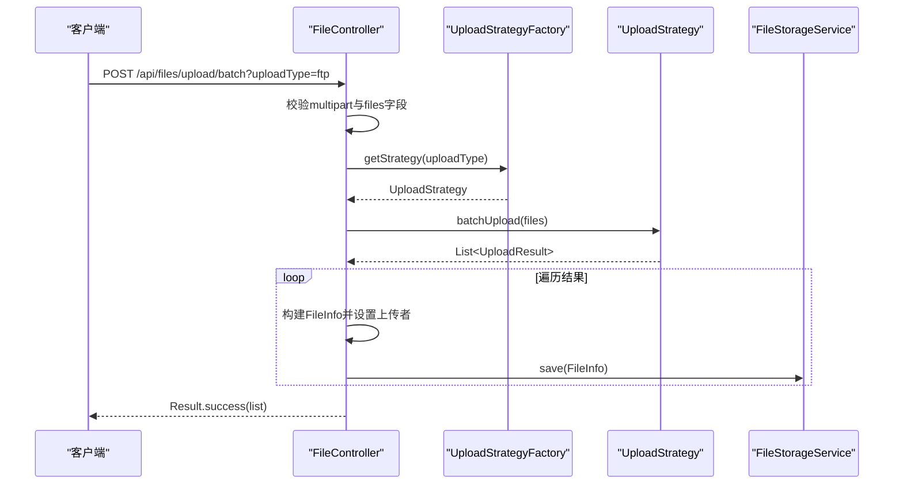
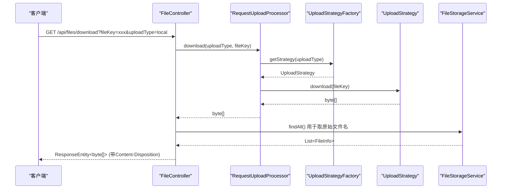
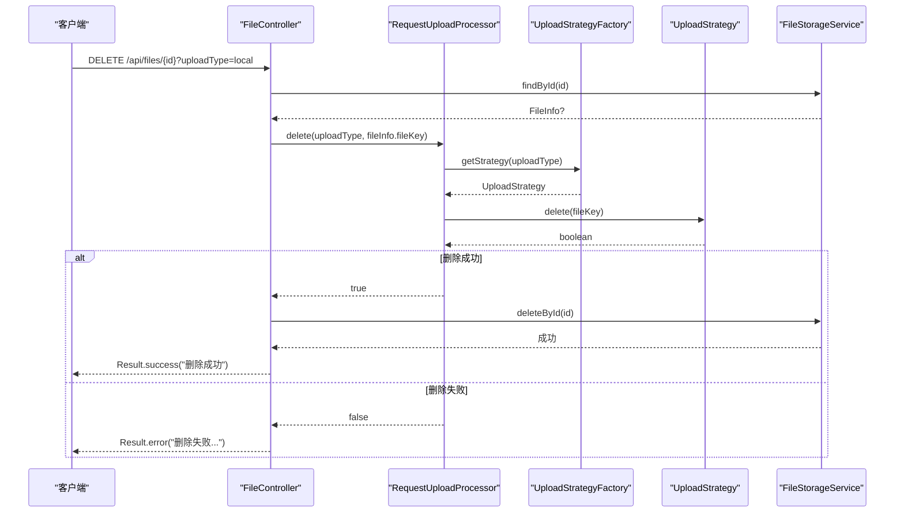
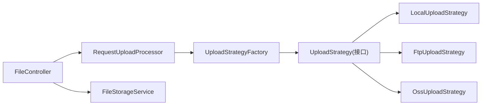
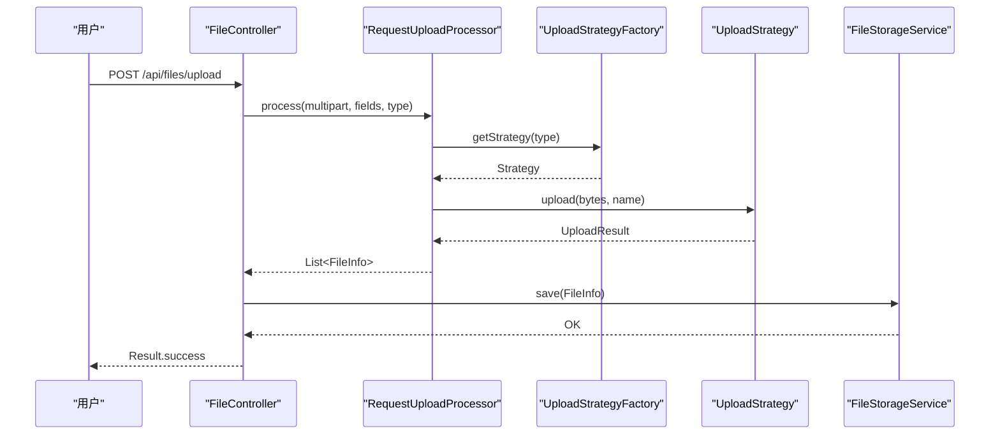
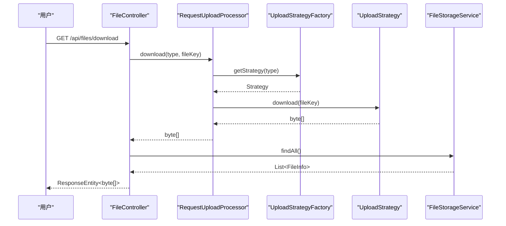
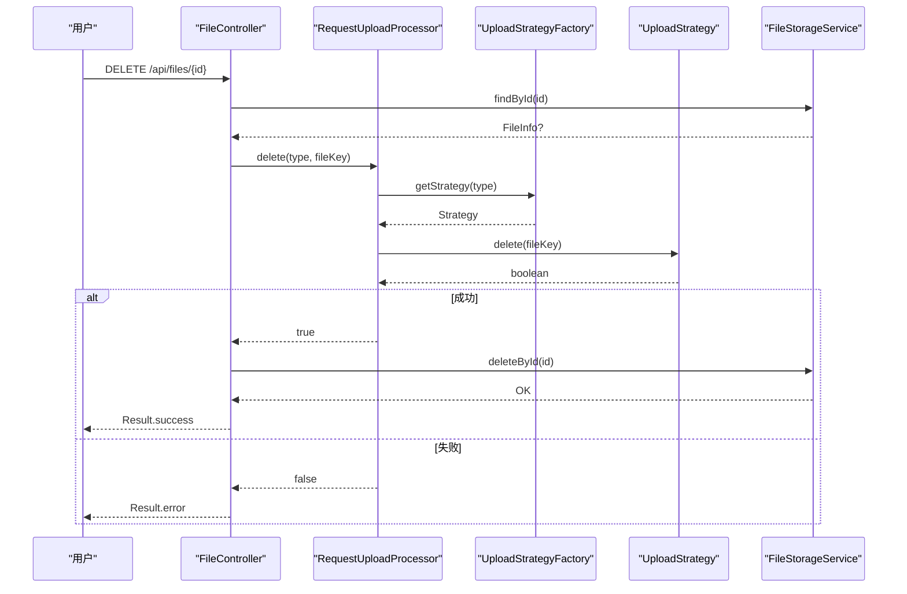

# 组件交互流程

<cite>
**本文引用的文件**
- [FileController.java](file://src/main/java/com/example/fileupload/controller/FileController.java)
- [RequestUploadProcessor.java](file://src/main/java/com/example/fileupload/service/RequestUploadProcessor.java)
- [UploadStrategyFactory.java](file://src/main/java/com/example/fileupload/strategy/UploadStrategyFactory.java)
- [UploadStrategy.java](file://src/main/java/com/example/fileupload/strategy/UploadStrategy.java)
- [LocalUploadStrategy.java](file://src/main/java/com/example/fileupload/strategy/LocalUploadStrategy.java)
- [FtpUploadStrategy.java](file://src/main/java/com/example/fileupload/strategy/FtpUploadStrategy.java)
- [OssUploadStrategy.java](file://src/main/java/com/example/fileupload/strategy/OssUploadStrategy.java)
- [FileInfo.java](file://src/main/java/com/example/fileupload/model/FileInfo.java)
- [UploadResult.java](file://src/main/java/com/example/fileupload/model/UploadResult.java)
- [UploadType.java](file://src/main/java/com/example/fileupload/enums/UploadType.java)
- [FileStorageService.java](file://src/main/java/com/example/fileupload/service/FileStorageService.java)
- [FileTypeValidator.java](file://src/main/java/com/example/fileupload/util/FileTypeValidator.java)
</cite>

## 目录
1. [简介](#简介)
2. [项目结构](#项目结构)
3. [核心组件](#核心组件)
4. [架构总览](#架构总览)
5. [详细组件分析](#详细组件分析)
6. [依赖关系分析](#依赖关系分析)
7. [性能与并发考虑](#性能与并发考虑)
8. [故障排查指南](#故障排查指南)
9. [结论](#结论)
10. [附录：时序图](#附录时序图)

## 简介
本文件面向“从HTTP请求接收到存储后端响应”的完整数据流，聚焦以下调用链的职责、输入输出、异常传播与并发安全：
- FileController → RequestUploadProcessor → UploadStrategyFactory → UploadStrategy（本地/FTP/OSS）
- 覆盖上传、下载、删除三类操作的组件交互时序
- 解释线程安全设计、锁机制与错误处理策略

## 项目结构
- 控制器层：接收HTTP请求，参数校验，编排业务流程
- 处理器层：统一封装解析、校验、策略路由、结果组装
- 策略层：按存储类型实现具体上传/下载/删除逻辑
- 工厂层：自动注册并路由到具体策略
- 模型层：统一的数据载体（FileInfo、UploadResult、Result）
- 服务层：内存Mock持久化（可替换为真实数据库）
- 工具层：文件类型校验等通用能力

图表来源
- [FileController.java:31-48](file://src/main/java/com/example/fileupload/controller/FileController.java#L31-L48)
- [RequestUploadProcessor.java:25-34](file://src/main/java/com/example/fileupload/service/RequestUploadProcessor.java#L25-L34)
- [UploadStrategyFactory.java:16-26](file://src/main/java/com/example/fileupload/strategy/UploadStrategyFactory.java#L16-L26)
- [UploadStrategy.java:13-73](file://src/main/java/com/example/fileupload/strategy/UploadStrategy.java#L13-L73)
- [LocalUploadStrategy.java:26-118](file://src/main/java/com/example/fileupload/strategy/LocalUploadStrategy.java#L26-L118)
- [FtpUploadStrategy.java:36-114](file://src/main/java/com/example/fileupload/strategy/FtpUploadStrategy.java#L36-L114)
- [OssUploadStrategy.java:29-159](file://src/main/java/com/example/fileupload/strategy/OssUploadStrategy.java#L29-L159)
- [FileStorageService.java:19-60](file://src/main/java/com/example/fileupload/service/FileStorageService.java#L19-L60)

章节来源
- [FileController.java:31-48](file://src/main/java/com/example/fileupload/controller/FileController.java#L31-L48)
- [RequestUploadProcessor.java:25-34](file://src/main/java/com/example/fileupload/service/RequestUploadProcessor.java#L25-L34)
- [UploadStrategyFactory.java:16-26](file://src/main/java/com/example/fileupload/strategy/UploadStrategyFactory.java#L16-L26)

## 核心组件
- FileController：REST端点入口，负责参数校验、调用处理器、落库元数据、返回统一结果
- RequestUploadProcessor：门面式处理器，完成请求解析、类型校验、策略路由、结果封装
- UploadStrategyFactory：基于Spring注入的策略集合，构建并发安全的映射表，按枚举路由
- UploadStrategy：定义上传/下载/删除/批量上传的统一契约
- 具体策略：LocalUploadStrategy（本地磁盘）、FtpUploadStrategy（FTP）、OssUploadStrategy（MinIO）
- FileStorageService：内存Map存储FileInfo，提供CRUD与查询过滤
- FileTypeValidator：后缀白名单+魔数校验，保障文件类型安全

章节来源
- [FileController.java:50-227](file://src/main/java/com/example/fileupload/controller/FileController.java#L50-L227)
- [RequestUploadProcessor.java:46-130](file://src/main/java/com/example/fileupload/service/RequestUploadProcessor.java#L46-L130)
- [UploadStrategyFactory.java:28-55](file://src/main/java/com/example/fileupload/strategy/UploadStrategyFactory.java#L28-L55)
- [UploadStrategy.java:13-73](file://src/main/java/com/example/fileupload/strategy/UploadStrategy.java#L13-L73)
- [LocalUploadStrategy.java:63-118](file://src/main/java/com/example/fileupload/strategy/LocalUploadStrategy.java#L63-L118)
- [FtpUploadStrategy.java:58-114](file://src/main/java/com/example/fileupload/strategy/FtpUploadStrategy.java#L58-L114)
- [OssUploadStrategy.java:78-159](file://src/main/java/com/example/fileupload/strategy/OssUploadStrategy.java#L78-L159)
- [FileStorageService.java:24-60](file://src/main/java/com/example/fileupload/service/FileStorageService.java#L24-L60)
- [FileTypeValidator.java:47-85](file://src/main/java/com/example/fileupload/util/FileTypeValidator.java#L47-L85)

## 架构总览
整体采用“控制器→处理器→工厂→策略”的分层与策略模式。控制器仅关注HTTP边界；处理器聚合业务编排；工厂负责策略装配；策略专注不同存储后端的细节。

图表来源
- [FileController.java:31-48](file://src/main/java/com/example/fileupload/controller/FileController.java#L31-L48)
- [RequestUploadProcessor.java:25-34](file://src/main/java/com/example/fileupload/service/RequestUploadProcessor.java#L25-L34)
- [UploadStrategyFactory.java:16-26](file://src/main/java/com/example/fileupload/strategy/UploadStrategyFactory.java#L16-L26)
- [UploadStrategy.java:13-73](file://src/main/java/com/example/fileupload/strategy/UploadStrategy.java#L13-L73)
- [LocalUploadStrategy.java:26-118](file://src/main/java/com/example/fileupload/strategy/LocalUploadStrategy.java#L26-L118)
- [FtpUploadStrategy.java:36-114](file://src/main/java/com/example/fileupload/strategy/FtpUploadStrategy.java#L36-L114)
- [OssUploadStrategy.java:29-159](file://src/main/java/com/example/fileupload/strategy/OssUploadStrategy.java#L29-L159)
- [FileStorageService.java:19-60](file://src/main/java/com/example/fileupload/service/FileStorageService.java#L19-L60)

## 详细组件分析

### 组件职责与数据流
- FileController
  - 输入：HTTP请求参数（uploadType、uploadedBy、MultipartFile或多文件files）
  - 输出：统一Result包装的响应体
  - 职责：参数校验、调用处理器、落库元数据、设置响应头（下载）
- RequestUploadProcessor
  - 输入：MultipartHttpServletRequest、字段名列表、UploadType
  - 输出：FileInfo列表（上传），或byte[]（下载），或boolean（删除）
  - 职责：读取字节、类型校验、策略路由、结果封装
- UploadStrategyFactory
  - 输入：UploadType
  - 输出：UploadStrategy实例
  - 职责：启动时扫描所有策略，构建并发安全映射，按类型路由
- UploadStrategy及实现
  - 输入：文件对象/字节数组/fileKey
  - 输出：UploadResult/byte[]/boolean
  - 职责：对接具体存储后端（本地磁盘/FTP/MinIO），实现上传/下载/删除/批量上传

章节来源
- [FileController.java:50-227](file://src/main/java/com/example/fileupload/controller/FileController.java#L50-L227)
- [RequestUploadProcessor.java:46-130](file://src/main/java/com/example/fileupload/service/RequestUploadProcessor.java#L46-L130)
- [UploadStrategyFactory.java:28-55](file://src/main/java/com/example/fileupload/strategy/UploadStrategyFactory.java#L28-L55)
- [UploadStrategy.java:13-73](file://src/main/java/com/example/fileupload/strategy/UploadStrategy.java#L13-L73)

### 上传流程（单文件）

图表来源
- [FileController.java:58-84](file://src/main/java/com/example/fileupload/controller/FileController.java#L58-L84)
- [RequestUploadProcessor.java:46-87](file://src/main/java/com/example/fileupload/service/RequestUploadProcessor.java#L46-L87)
- [UploadStrategyFactory.java:48-55](file://src/main/java/com/example/fileupload/strategy/UploadStrategyFactory.java#L48-L55)
- [UploadStrategy.java:22-33](file://src/main/java/com/example/fileupload/strategy/UploadStrategy.java#L22-L33)
- [FileStorageService.java:32-39](file://src/main/java/com/example/fileupload/service/FileStorageService.java#L32-L39)

章节来源
- [FileController.java:58-84](file://src/main/java/com/example/fileupload/controller/FileController.java#L58-L84)
- [RequestUploadProcessor.java:46-87](file://src/main/java/com/example/fileupload/service/RequestUploadProcessor.java#L46-L87)

### 批量上传流程（FTP/OSS）

图表来源
- [FileController.java:93-133](file://src/main/java/com/example/fileupload/controller/FileController.java#L93-L133)
- [UploadStrategyFactory.java:48-55](file://src/main/java/com/example/fileupload/strategy/UploadStrategyFactory.java#L48-L55)
- [UploadStrategy.java:64-72](file://src/main/java/com/example/fileupload/strategy/UploadStrategy.java#L64-L72)
- [FileStorageService.java:32-39](file://src/main/java/com/example/fileupload/service/FileStorageService.java#L32-L39)

章节来源
- [FileController.java:93-133](file://src/main/java/com/example/fileupload/controller/FileController.java#L93-L133)

### 下载流程

图表来源
- [FileController.java:163-194](file://src/main/java/com/example/fileupload/controller/FileController.java#L163-L194)
- [RequestUploadProcessor.java:123-130](file://src/main/java/com/example/fileupload/service/RequestUploadProcessor.java#L123-L130)
- [UploadStrategyFactory.java:48-55](file://src/main/java/com/example/fileupload/strategy/UploadStrategyFactory.java#L48-L55)
- [UploadStrategy.java:54-54](file://src/main/java/com/example/fileupload/strategy/UploadStrategy.java#L54-L54)
- [FileStorageService.java:58-60](file://src/main/java/com/example/fileupload/service/FileStorageService.java#L58-L60)

章节来源
- [FileController.java:163-194](file://src/main/java/com/example/fileupload/controller/FileController.java#L163-L194)
- [RequestUploadProcessor.java:123-130](file://src/main/java/com/example/fileupload/service/RequestUploadProcessor.java#L123-L130)

### 删除流程

图表来源
- [FileController.java:203-227](file://src/main/java/com/example/fileupload/controller/FileController.java#L203-L227)
- [RequestUploadProcessor.java:111-114](file://src/main/java/com/example/fileupload/service/RequestUploadProcessor.java#L111-L114)
- [UploadStrategyFactory.java:48-55](file://src/main/java/com/example/fileupload/strategy/UploadStrategyFactory.java#L48-L55)
- [UploadStrategy.java:41-41](file://src/main/java/com/example/fileupload/strategy/UploadStrategy.java#L41-L41)
- [FileStorageService.java:51-53](file://src/main/java/com/example/fileupload/service/FileStorageService.java#L51-L53)

章节来源
- [FileController.java:203-227](file://src/main/java/com/example/fileupload/controller/FileController.java#L203-L227)
- [RequestUploadProcessor.java:111-114](file://src/main/java/com/example/fileupload/service/RequestUploadProcessor.java#L111-L114)

## 依赖关系分析
- 控制器依赖处理器与服务，不直接感知存储细节
- 处理器依赖工厂与工具类，屏蔽策略差异
- 工厂在启动时收集所有策略实现，构建并发安全的映射表
- 策略实现各自管理外部资源（如FTP连接、MinIO客户端）

图表来源
- [FileController.java:31-48](file://src/main/java/com/example/fileupload/controller/FileController.java#L31-L48)
- [RequestUploadProcessor.java:25-34](file://src/main/java/com/example/fileupload/service/RequestUploadProcessor.java#L25-L34)
- [UploadStrategyFactory.java:16-26](file://src/main/java/com/example/fileupload/strategy/UploadStrategyFactory.java#L16-L26)
- [UploadStrategy.java:13-73](file://src/main/java/com/example/fileupload/strategy/UploadStrategy.java#L13-L73)
- [FileStorageService.java:19-60](file://src/main/java/com/example/fileupload/service/FileStorageService.java#L19-L60)

章节来源
- [UploadStrategyFactory.java:28-39](file://src/main/java/com/example/fileupload/strategy/UploadStrategyFactory.java#L28-L39)

## 性能与并发考虑
- 线程安全
  - UploadStrategyFactory使用ConcurrentHashMap维护策略映射，保证多线程下安全访问与无锁读路径
  - FileStorageService使用ConcurrentHashMap作为内存存储，支持并发读写
- I/O与临时文件
  - 处理器一次性读取MultipartFile为字节数组，避免Windows+Tomcat下临时文件锁定问题
  - FTP批量上传复用同一连接，减少握手开销
- 资源管理
  - FTP策略对每个操作创建独立FTPClient并在finally中安全断开
  - MinIO客户端由Spring生命周期管理，启动时初始化，销毁时释放
- 建议
  - 大文件下载建议使用流式传输而非全量加载到内存
  - 批量上传可在策略内部做分片与重试，提升鲁棒性

章节来源
- [UploadStrategyFactory.java:21-39](file://src/main/java/com/example/fileupload/strategy/UploadStrategyFactory.java#L21-L39)
- [FileStorageService.java:24-60](file://src/main/java/com/example/fileupload/service/FileStorageService.java#L24-L60)
- [RequestUploadProcessor.java:61-76](file://src/main/java/com/example/fileupload/service/RequestUploadProcessor.java#L61-L76)
- [FtpUploadStrategy.java:126-186](file://src/main/java/com/example/fileupload/strategy/FtpUploadStrategy.java#L126-L186)
- [FtpUploadStrategy.java:206-236](file://src/main/java/com/example/fileupload/strategy/FtpUploadStrategy.java#L206-L236)
- [OssUploadStrategy.java:54-76](file://src/main/java/com/example/fileupload/strategy/OssUploadStrategy.java#L54-L76)

## 故障排查指南
- 常见异常与处理
  - 非法参数：UploadType.fromCode找不到对应类型，抛出IllegalArgumentException，控制器捕获返回400
  - 未找到策略：工厂getStrategy返回null时抛异常，控制器捕获返回400
  - 文件为空或太小：处理器校验抛出异常，控制器捕获返回400
  - 底层存储错误：各策略抛出IOException或自定义信息，控制器记录日志并返回500
- 定位要点
  - 检查application.yml配置项（本地路径、FTP、OSS）
  - 查看日志中的策略前缀（LOCAL/FTP/MINIO）快速定位
  - 批量上传失败会记录具体失败条目，便于逐条排查

章节来源
- [UploadType.java:26-33](file://src/main/java/com/example/fileupload/enums/UploadType.java#L26-L33)
- [UploadStrategyFactory.java:48-55](file://src/main/java/com/example/fileupload/strategy/UploadStrategyFactory.java#L48-L55)
- [RequestUploadProcessor.java:68-85](file://src/main/java/com/example/fileupload/service/RequestUploadProcessor.java#L68-L85)
- [FileController.java:78-83](file://src/main/java/com/example/fileupload/controller/FileController.java#L78-L83)
- [FileController.java:127-132](file://src/main/java/com/example/fileupload/controller/FileController.java#L127-L132)
- [FileController.java:190-193](file://src/main/java/com/example/fileupload/controller/FileController.java#L190-L193)
- [FileController.java:221-226](file://src/main/java/com/example/fileupload/controller/FileController.java#L221-L226)

## 结论
该方案通过清晰的层次划分与策略模式，将HTTP边界、业务编排与存储细节解耦。工厂与并发容器保证了高并发下的稳定路由；处理器集中了校验与组装逻辑；各策略专注于后端适配。结合统一的异常与日志体系，便于在生产环境进行问题定位与优化。

## 附录：时序图
以下为三种操作的端到端时序图，展示组件间调用顺序与数据流向。

### 上传（单文件）

图表来源
- [FileController.java:58-84](file://src/main/java/com/example/fileupload/controller/FileController.java#L58-L84)
- [RequestUploadProcessor.java:46-87](file://src/main/java/com/example/fileupload/service/RequestUploadProcessor.java#L46-L87)
- [UploadStrategyFactory.java:48-55](file://src/main/java/com/example/fileupload/strategy/UploadStrategyFactory.java#L48-L55)
- [UploadStrategy.java:22-33](file://src/main/java/com/example/fileupload/strategy/UploadStrategy.java#L22-L33)
- [FileStorageService.java:32-39](file://src/main/java/com/example/fileupload/service/FileStorageService.java#L32-L39)

### 下载

图表来源
- [FileController.java:163-194](file://src/main/java/com/example/fileupload/controller/FileController.java#L163-L194)
- [RequestUploadProcessor.java:123-130](file://src/main/java/com/example/fileupload/service/RequestUploadProcessor.java#L123-L130)
- [UploadStrategyFactory.java:48-55](file://src/main/java/com/example/fileupload/strategy/UploadStrategyFactory.java#L48-L55)
- [UploadStrategy.java:54-54](file://src/main/java/com/example/fileupload/strategy/UploadStrategy.java#L54-L54)
- [FileStorageService.java:58-60](file://src/main/java/com/example/fileupload/service/FileStorageService.java#L58-L60)

### 删除

图表来源
- [FileController.java:203-227](file://src/main/java/com/example/fileupload/controller/FileController.java#L203-L227)
- [RequestUploadProcessor.java:111-114](file://src/main/java/com/example/fileupload/service/RequestUploadProcessor.java#L111-L114)
- [UploadStrategyFactory.java:48-55](file://src/main/java/com/example/fileupload/strategy/UploadStrategyFactory.java#L48-L55)
- [UploadStrategy.java:41-41](file://src/main/java/com/example/fileupload/strategy/UploadStrategy.java#L41-L41)
- [FileStorageService.java:51-53](file://src/main/java/com/example/fileupload/service/FileStorageService.java#L51-L53)