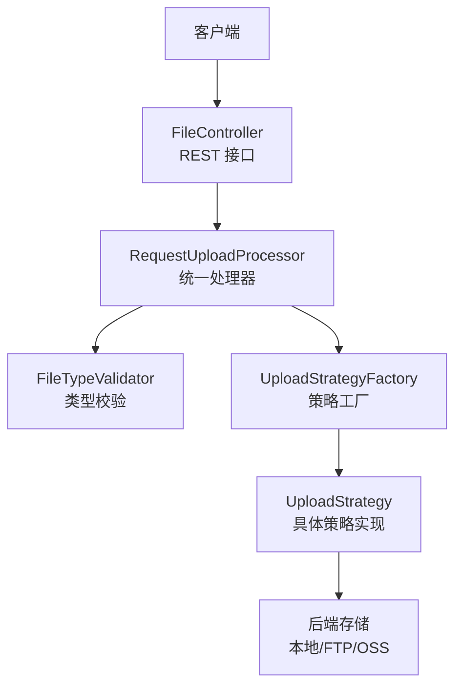
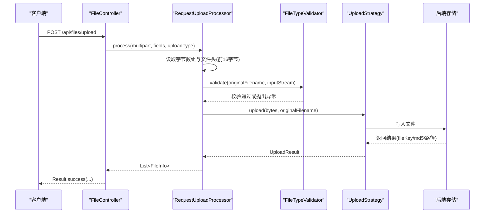
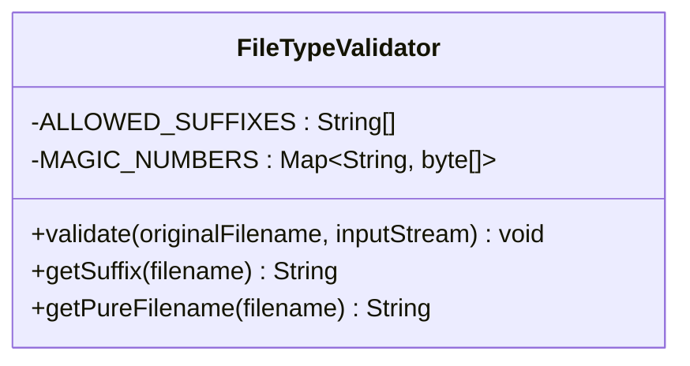
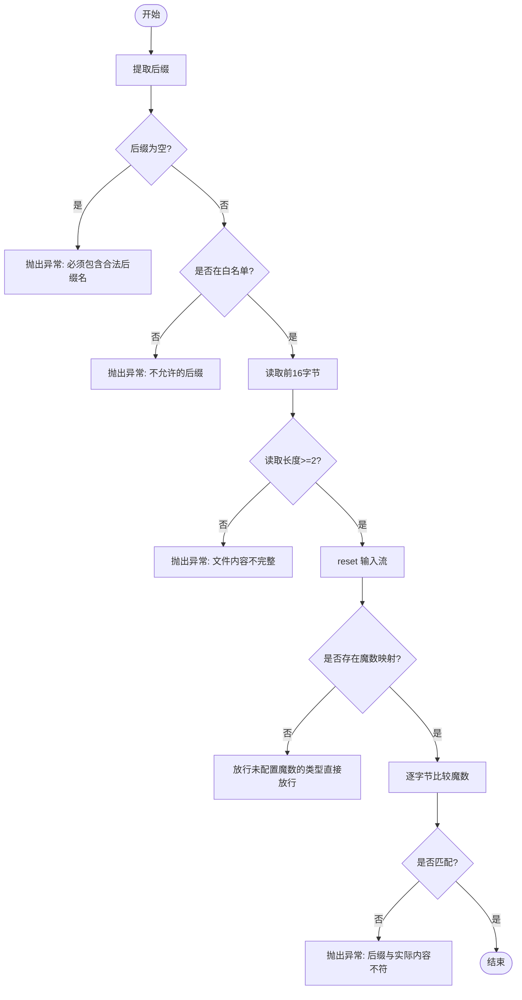
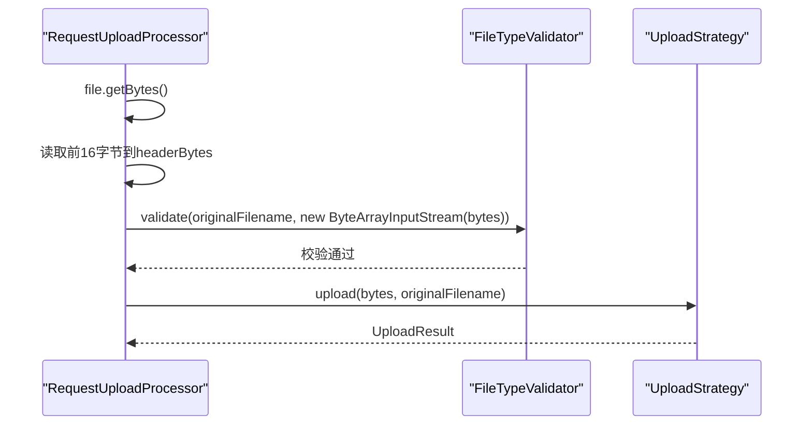
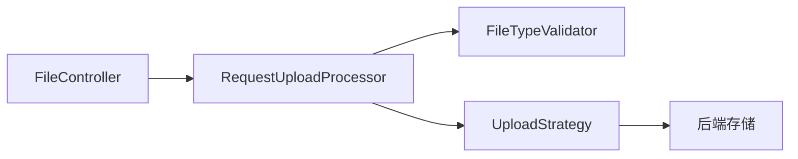

# 工具组件（Util）

<cite>
**本文引用的文件**
- [FileTypeValidator.java](file://src/main/java/com/example/fileupload/util/FileTypeValidator.java)
- [FileTypeValidatorTest.java](file://src/test/java/com/example/fileupload/FileTypeValidatorTest.java)
- [RequestUploadProcessor.java](file://src/main/java/com/example/fileupload/service/RequestUploadProcessor.java)
- [FileController.java](file://src/main/java/com/example/fileupload/controller/FileController.java)
- [FileInfo.java](file://src/main/java/com/example/fileupload/model/FileInfo.java)
- [UploadType.java](file://src/main/java/com/example/fileupload/enums/UploadType.java)
- [pom.xml](file://pom.xml)
</cite>

## 目录
1. [简介](#简介)
2. [项目结构](#项目结构)
3. [核心组件](#核心组件)
4. [架构总览](#架构总览)
5. [详细组件分析](#详细组件分析)
6. [依赖关系分析](#依赖关系分析)
7. [性能考虑](#性能考虑)
8. [故障排查指南](#故障排查指南)
9. [结论](#结论)
10. [附录](#附录)

## 简介
本文件围绕工具组件中的 FileTypeValidator 文件类型验证器，系统阐述其实现原理与使用方法。重点覆盖：
- 文件类型检测算法：后缀白名单 + 魔数（Magic Number）校验
- 支持的格式、验证规则与错误处理逻辑
- 在上传流程中的集成点与调用时序
- 自定义扩展方法与最佳实践
- 性能优化建议、安全注意事项与常见问题解决方案

该验证器通过“文件名后缀白名单”与“文件头魔数匹配”双重机制，有效防止恶意文件伪装与非法类型上传，为后续存储策略提供可信输入。

## 项目结构
本项目采用分层与策略模式组织代码：
- controller：REST API 入口
- service：请求处理与业务编排（含文件类型校验的集成）
- util：通用工具类（包含 FileTypeValidator）
- model：数据模型（如 FileInfo）
- enums：枚举（如 UploadType）
- strategy：不同存储后端的上传策略

图表来源
- [FileController.java:50-133](file://src/main/java/com/example/fileupload/controller/FileController.java#L50-L133)
- [RequestUploadProcessor.java:46-87](file://src/main/java/com/example/fileupload/service/RequestUploadProcessor.java#L46-L87)
- [FileTypeValidator.java:47-85](file://src/main/java/com/example/fileupload/util/FileTypeValidator.java#L47-L85)

章节来源
- [FileController.java:50-133](file://src/main/java/com/example/fileupload/controller/FileController.java#L50-L133)
- [RequestUploadProcessor.java:46-87](file://src/main/java/com/example/fileupload/service/RequestUploadProcessor.java#L46-L87)

## 核心组件
- FileTypeValidator：提供静态方法 validate(originalFilename, inputStream)，执行后缀白名单检查与魔数匹配；并提供 getSuffix、getPureFilename 等辅助方法。
- RequestUploadProcessor：在上传流程中读取文件前若干字节进行魔数校验，并调用 FileTypeValidator.validate 完成最终验证。
- FileController：对外暴露上传、下载、删除、查询等接口，内部委托给 RequestUploadProcessor 处理。
- FileInfo：封装文件元信息，包括原始文件名、后缀、大小、MIME、存储路径、MD5 等。
- UploadType：定义支持的存储类型（local、ftp、oss）。

章节来源
- [FileTypeValidator.java:16-107](file://src/main/java/com/example/fileupload/util/FileTypeValidator.java#L16-L107)
- [RequestUploadProcessor.java:61-87](file://src/main/java/com/example/fileupload/service/RequestUploadProcessor.java#L61-L87)
- [FileController.java:50-133](file://src/main/java/com/example/fileupload/controller/FileController.java#L50-L133)
- [FileInfo.java:10-28](file://src/main/java/com/example/fileupload/model/FileInfo.java#L10-L28)
- [UploadType.java:6-33](file://src/main/java/com/example/fileupload/enums/UploadType.java#L6-L33)

## 架构总览
FileTypeValidator 作为无状态工具类，被 RequestUploadProcessor 在上传链路中调用，确保进入存储前的文件类型安全。整体流程如下：

图表来源
- [FileController.java:58-84](file://src/main/java/com/example/fileupload/controller/FileController.java#L58-L84)
- [RequestUploadProcessor.java:61-87](file://src/main/java/com/example/fileupload/service/RequestUploadProcessor.java#L61-L87)
- [FileTypeValidator.java:47-85](file://src/main/java/com/example/fileupload/util/FileTypeValidator.java#L47-L85)

## 详细组件分析

### FileTypeValidator 组件分析
FileTypeValidator 是一个纯工具类，提供以下能力：
- 后缀白名单校验：仅允许预定义的后缀集合（图片、文档、压缩包等）
- 魔数校验：读取文件头前若干字节，与已知类型的魔数表比对，防止后缀伪造
- 流重置：校验完成后对输入流 reset，以便后续继续消费
- 辅助方法：提取后缀、提取纯文件名

图表来源
- [FileTypeValidator.java:16-107](file://src/main/java/com/example/fileupload/util/FileTypeValidator.java#L16-L107)

#### 验证算法与流程

图表来源
- [FileTypeValidator.java:47-85](file://src/main/java/com/example/fileupload/util/FileTypeValidator.java#L47-L85)

#### 支持的文件格式与魔数映射
- 图片：jpg/jpeg、png、gif、bmp、webp
- 文档：pdf、doc/docx、xls/xlsx
- 文本：txt、csv
- 压缩：zip、rar、7z
说明：
- 对于已配置魔数的类型（如 png、jpg、pdf、zip、rar），会进行严格的前 N 字节比对
- 对于未配置魔数的复杂二进制格式（如 docx、xlsx、doc），当前实现直接放行（基于后缀白名单）

章节来源
- [FileTypeValidator.java:16-39](file://src/main/java/com/example/fileupload/util/FileTypeValidator.java#L16-L39)
- [FileTypeValidator.java:47-85](file://src/main/java/com/example/fileupload/util/FileTypeValidator.java#L47-L85)

#### 错误处理与异常语义
- 缺少后缀：抛出非法参数异常，提示必须包含合法后缀名
- 不在白名单：抛出非法参数异常，提示不允许的后缀及允许列表
- 文件过小：抛出非法参数异常，提示无法校验真实格式
- 魔数不匹配：抛出非法参数异常，提示后缀与实际内容不符

章节来源
- [FileTypeValidator.java:47-85](file://src/main/java/com/example/fileupload/util/FileTypeValidator.java#L47-L85)

#### 单元测试覆盖要点
- 后缀提取与纯文件名提取的正确性
- 合法文件（png/jpg/gif/pdf/txt）通过校验
- 非法文件拒绝：后缀不在白名单、无后缀、魔数不匹配、文件过小

章节来源
- [FileTypeValidatorTest.java:19-123](file://src/test/java/com/example/fileupload/FileTypeValidatorTest.java#L19-L123)

### 在上传流程中的集成
RequestUploadProcessor 在接收 multipart 请求后：
- 将 MultipartFile 转为字节数组，避免临时文件锁定问题
- 读取前 16 字节用于魔数校验
- 构造 ByteArrayInputStream 并调用 FileTypeValidator.validate
- 校验通过后，交由具体 UploadStrategy 执行上传

图表来源
- [RequestUploadProcessor.java:61-87](file://src/main/java/com/example/fileupload/service/RequestUploadProcessor.java#L61-L87)
- [FileTypeValidator.java:47-85](file://src/main/java/com/example/fileupload/util/FileTypeValidator.java#L47-L85)

章节来源
- [RequestUploadProcessor.java:61-87](file://src/main/java/com/example/fileupload/service/RequestUploadProcessor.java#L61-L87)

### 使用示例与扩展方法
- 基本用法：在任意需要校验文件类型的地方，调用 validate(originalFilename, inputStream)
- 自定义白名单：可新增 ALLOWED_SUFFIXES 以支持更多后缀
- 新增魔数映射：在 MAGIC_NUMBERS 中添加新类型的魔数前缀，增强安全性
- 自定义校验规则：可在 validate 中增加额外逻辑（如最大尺寸、MIME 类型、内容扫描等）

注意：
- 若需支持新的二进制格式（如 docx/xlsx），建议补充魔数映射以提升安全性
- 若需限制文件大小，建议在调用方或策略层增加前置校验

章节来源
- [FileTypeValidator.java:16-39](file://src/main/java/com/example/fileupload/util/FileTypeValidator.java#L16-L39)
- [FileTypeValidator.java:47-85](file://src/main/java/com/example/fileupload/util/FileTypeValidator.java#L47-L85)

## 依赖关系分析
- FileTypeValidator 无外部依赖，仅使用 Java 标准库
- RequestUploadProcessor 依赖 FileTypeValidator 进行类型校验
- FileController 通过 RequestUploadProcessor 间接使用 FileTypeValidator
- 构建依赖（pom.xml）包含 Spring Boot Web、测试框架、IO 与网络库等

图表来源
- [FileController.java:50-133](file://src/main/java/com/example/fileupload/controller/FileController.java#L50-L133)
- [RequestUploadProcessor.java:46-87](file://src/main/java/com/example/fileupload/service/RequestUploadProcessor.java#L46-L87)
- [pom.xml:24-70](file://pom.xml#L24-L70)

章节来源
- [pom.xml:24-70](file://pom.xml#L24-L70)

## 性能考虑
- 魔数读取开销：每次校验仅读取前 16 字节，I/O 开销极低
- 内存占用：RequestUploadProcessor 将文件读入字节数组，适合中小文件；大文件场景建议改为流式处理以避免内存峰值
- 白名单与魔数查找：白名单为固定数组线性匹配，魔数为 HashMap O(1) 查找，整体复杂度低
- 流重置：校验后 reset 输入流，避免重复读取，提升复用效率

优化建议：
- 对超大文件，考虑分块读取与流式校验，减少内存压力
- 对高并发场景，可将白名单与魔数表缓存至线程安全的共享结构（当前已为静态常量）
- 结合业务需求增加文件大小上限校验，避免资源耗尽

[本节为通用性能讨论，不直接分析具体文件]

## 故障排查指南
常见错误与定位：
- “文件必须包含合法后缀名”：检查文件名是否包含有效后缀，且不在首字符位置
- “不允许上传的后缀”：确认后缀在白名单内，必要时扩展 ALLOWED_SUFFIXES
- “文件内容不完整，无法校验真实格式”：文件过小或读取失败，检查输入流与可用字节数
- “文件后缀与实际内容不符”：存在魔数映射但实际文件头不匹配，可能是伪造后缀或损坏文件

定位步骤：
- 查看调用栈，确认来自 FileTypeValidator.validate
- 检查传入的 originalFilename 与 inputStream 是否正确
- 核对目标类型的魔数映射是否完整
- 在 RequestUploadProcessor 中打印 headerBytes 与 readCount 辅助诊断

章节来源
- [FileTypeValidator.java:47-85](file://src/main/java/com/example/fileupload/util/FileTypeValidator.java#L47-L85)
- [RequestUploadProcessor.java:61-87](file://src/main/java/com/example/fileupload/service/RequestUploadProcessor.java#L61-L87)

## 结论
FileTypeValidator 通过“后缀白名单 + 魔数校验”的双重机制，提供了轻量而可靠的文件类型验证能力。其在 RequestUploadProcessor 中的集成确保了上传入口的安全性。开发者可通过扩展白名单与魔数映射来适配新格式，并结合业务需求增加更多校验维度（如大小、MIME、病毒扫描等）。在生产环境中，建议配合文件大小限制、流式处理与安全审计，进一步提升系统的健壮性与安全性。

[本节为总结性内容，不直接分析具体文件]

## 附录
- 支持的格式概览：图片（jpg/jpeg/png/gif/bmp/webp）、文档（pdf/doc/docx/xls/xlsx）、文本（txt/csv）、压缩（zip/rar/7z）
- 魔数映射范围：已覆盖常见图片与 PDF、压缩包；复杂二进制格式（docx/xlsx/doc）当前基于白名单放行
- 扩展方式：在 FileTypeValidator 中新增白名单与魔数映射，或在 validate 中追加自定义校验逻辑
- 相关模型与枚举：FileInfo 记录文件元数据；UploadType 标识存储后端类型

[本节为附加信息，不直接分析具体文件]