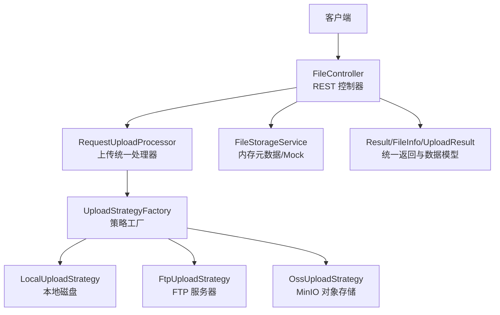
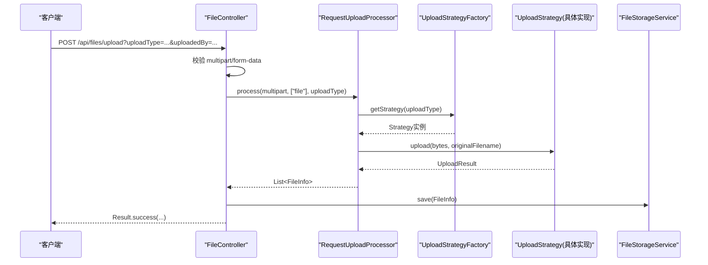
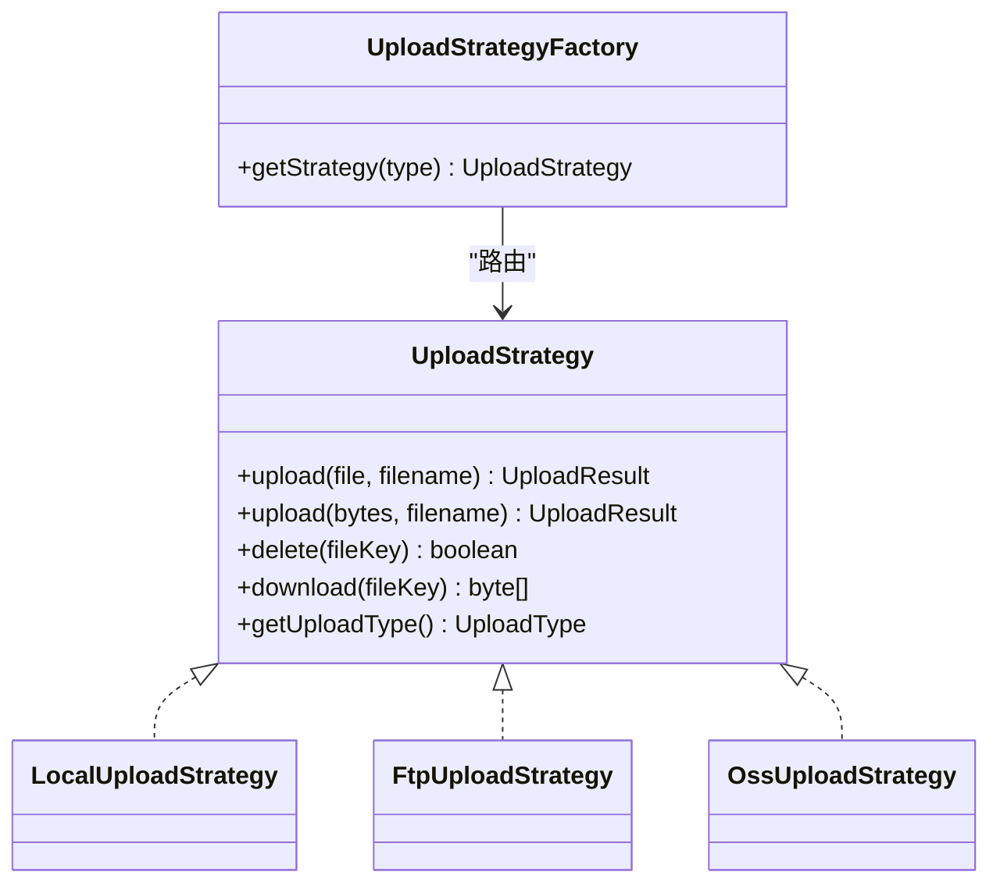
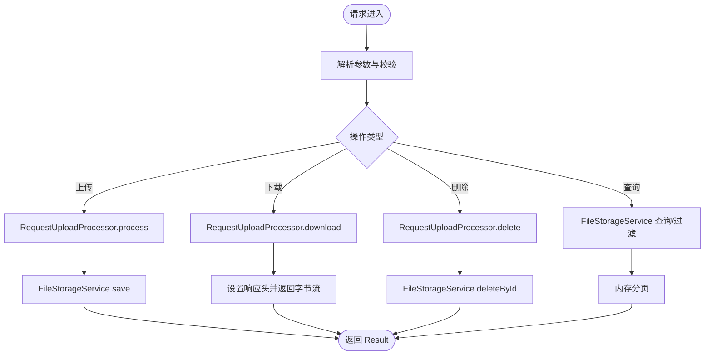
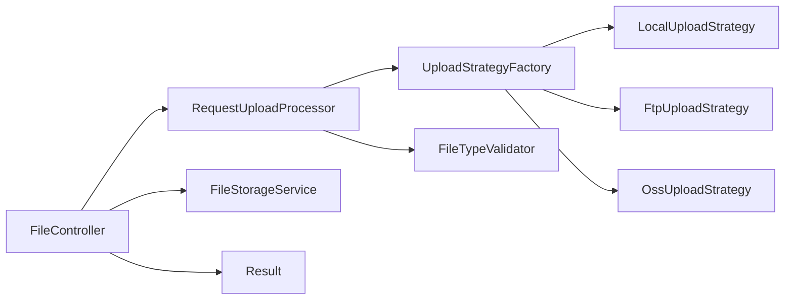

# 控制器层（FileController）

<cite>
**本文引用的文件**
- [FileController.java](file://src/main/java/com/example/fileupload/controller/FileController.java)
- [Result.java](file://src/main/java/com/example/fileupload/model/Result.java)
- [FileInfo.java](file://src/main/java/com/example/fileupload/model/FileInfo.java)
- [UploadResult.java](file://src/main/java/com/example/fileupload/model/UploadResult.java)
- [RequestUploadProcessor.java](file://src/main/java/com/example/fileupload/service/RequestUploadProcessor.java)
- [FileStorageService.java](file://src/main/java/com/example/fileupload/service/FileStorageService.java)
- [FileTypeValidator.java](file://src/main/java/com/example/fileupload/util/FileTypeValidator.java)
- [UploadType.java](file://src/main/java/com/example/fileupload/enums/UploadType.java)
- [UploadStrategyFactory.java](file://src/main/java/com/example/fileupload/strategy/UploadStrategyFactory.java)
- [LocalUploadStrategy.java](file://src/main/java/com/example/fileupload/strategy/LocalUploadStrategy.java)
- [FtpUploadStrategy.java](file://src/main/java/com/example/fileupload/strategy/FtpUploadStrategy.java)
- [OssUploadStrategy.java](file://src/main/java/com/example/fileupload/strategy/OssUploadStrategy.java)
- [application.yml](file://src/main/resources/application.yml)
</cite>

## 目录
1. [简介](#简介)
2. [项目结构](#项目结构)
3. [核心组件](#核心组件)
4. [架构总览](#架构总览)
5. [详细组件分析](#详细组件分析)
6. [依赖关系分析](#依赖关系分析)
7. [性能考量](#性能考量)
8. [故障排查指南](#故障排查指南)
9. [结论](#结论)
10. [附录：API 调用示例与错误模式](#附录api-调用示例与错误模式)

## 简介
本章节面向 FileController 控制器，系统性说明其 REST API 端点设计、请求参数校验、响应统一封装、异常处理与日志策略，以及与 Service 层和存储策略的协作流程。重点覆盖文件上传、下载、删除、查询与 Mock 数据管理等接口，并给出性能优化建议与最佳实践。

## 项目结构
- 控制器层：FileController 暴露 /api/files 下的 REST 接口
- 服务层：RequestUploadProcessor 负责上传统一编排；FileStorageService 提供内存元数据存储与 Mock 初始化
- 策略层：UploadStrategyFactory 自动注册并路由到 Local/Ftp/Oss 三种存储策略
- 工具与模型：FileTypeValidator 进行后缀白名单与魔数校验；Result/FileInfo/UploadResult 为统一返回与数据载体
- 配置：application.yml 定义端口、Multipart 限制、本地/FTP/OSS 连接参数与日志级别

图表来源
- [FileController.java:31-48](file://src/main/java/com/example/fileupload/controller/FileController.java#L31-L48)
- [RequestUploadProcessor.java:19-34](file://src/main/java/com/example/fileupload/service/RequestUploadProcessor.java#L19-L34)
- [UploadStrategyFactory.java:13-26](file://src/main/java/com/example/fileupload/strategy/UploadStrategyFactory.java#L13-L26)
- [LocalUploadStrategy.java:16-32](file://src/main/java/com/example/fileupload/strategy/LocalUploadStrategy.java#L16-L32)
- [FtpUploadStrategy.java:24-54](file://src/main/java/com/example/fileupload/strategy/FtpUploadStrategy.java#L24-L54)
- [OssUploadStrategy.java:20-50](file://src/main/java/com/example/fileupload/strategy/OssUploadStrategy.java#L20-L50)

章节来源
- [FileController.java:26-48](file://src/main/java/com/example/fileupload/controller/FileController.java#L26-L48)
- [application.yml:1-33](file://src/main/resources/application.yml#L1-L33)

## 核心组件
- FileController：对外暴露 REST 接口，负责参数解析、类型校验、异常捕获、日志记录与统一结果封装
- RequestUploadProcessor：封装“解析→校验→策略路由→结果组装”的上传统一流程，并提供 delete/download 能力
- FileStorageService：内存 Map 存储 FileInfo，支持增删查、模糊搜索、按类型/后缀过滤、Mock 数据初始化
- UploadStrategyFactory：基于 Spring 注入的 UploadStrategy 列表构建映射表，按 UploadType 路由具体实现
- FileTypeValidator：后缀白名单 + 魔数校验，防止伪装文件上传
- Result/FileInfo/UploadResult：统一返回体与上传前后信息载体

章节来源
- [FileController.java:31-48](file://src/main/java/com/example/fileupload/controller/FileController.java#L31-L48)
- [RequestUploadProcessor.java:19-34](file://src/main/java/com/example/fileupload/service/RequestUploadProcessor.java#L19-L34)
- [FileStorageService.java:13-25](file://src/main/java/com/example/fileupload/service/FileStorageService.java#L13-L25)
- [UploadStrategyFactory.java:13-26](file://src/main/java/com/example/fileupload/strategy/UploadStrategyFactory.java#L13-L26)
- [FileTypeValidator.java:8-12](file://src/main/java/com/example/fileupload/util/FileTypeValidator.java#L8-L12)
- [Result.java:3-10](file://src/main/java/com/example/fileupload/model/Result.java#L3-L10)
- [FileInfo.java:5-29](file://src/main/java/com/example/fileupload/model/FileInfo.java#L5-L29)
- [UploadResult.java:3-15](file://src/main/java/com/example/fileupload/model/UploadResult.java#L3-L15)

## 架构总览
FileController 作为入口，将业务编排委托给 RequestUploadProcessor 与 FileStorageService。上传路径通过 UploadStrategyFactory 动态路由至具体存储策略（本地/FTP/OSS）。下载与删除同样经由处理器路由到对应策略。所有返回统一封装为 Result，便于前端一致处理。

图表来源
- [FileController.java:50-84](file://src/main/java/com/example/fileupload/controller/FileController.java#L50-L84)
- [RequestUploadProcessor.java:36-87](file://src/main/java/com/example/fileupload/service/RequestUploadProcessor.java#L36-L87)
- [UploadStrategyFactory.java:41-55](file://src/main/java/com/example/fileupload/strategy/UploadStrategyFactory.java#L41-L55)
- [LocalUploadStrategy.java:63-84](file://src/main/java/com/example/fileupload/strategy/LocalUploadStrategy.java#L63-L84)
- [FtpUploadStrategy.java:58-74](file://src/main/java/com/example/fileupload/strategy/FtpUploadStrategy.java#L58-L74)
- [OssUploadStrategy.java:78-110](file://src/main/java/com/example/fileupload/strategy/OssUploadStrategy.java#L78-L110)
- [FileStorageService.java:29-39](file://src/main/java/com/example/fileupload/service/FileStorageService.java#L29-L39)

## 详细组件分析

### FileController 端点与处理逻辑
- 上传接口
  - POST /api/files/upload
  - 参数：uploadType（必填）、uploadedBy（可选，默认 system）
  - 校验：必须为 multipart/form-data；uploadType 需合法
  - 流程：通过 RequestUploadProcessor.process 解析并校验文件，再写入 FileStorageService
  - 返回：Result.success(单条 FileInfo 或 null)
- 批量上传接口（FTP/OSS）
  - POST /api/files/upload/batch
  - 参数：uploadType（必填）、uploadedBy（可选）
  - 字段名固定 files，可传多个文件
  - 流程：通过 UploadStrategyFactory 获取策略后调用 batchUpload，再持久化元数据
  - 返回：Result.success(List<FileInfo>)
- 下载接口
  - GET /api/files/download
  - 参数：fileKey、uploadType
  - 流程：通过 RequestUploadProcessor.download 获取字节流；从 FileStorageService 查找原始文件名设置响应头
  - 返回：ResponseEntity<byte[]>，未找到返回 404
- 删除接口
  - DELETE /api/files/{id}
  - 参数：id、uploadType
  - 流程：先根据 id 查元数据，再通过 RequestUploadProcessor.delete 删除底层存储，成功后删除元数据
  - 返回：Result.success("删除成功") 或错误码
- 查询接口
  - GET /api/files
  - 参数：page、size、keyword、storageType、suffix
  - 流程：优先 keyword 模糊匹配；否则全量加载后按 storageType/suffix 过滤；内存分页
  - 返回：Result.success({total, page, size, list})
- 单条查询
  - GET /api/files/{id}
  - 返回：Result.success(FileInfo) 或 404
- Mock 数据管理
  - POST /api/files/mock/init：清空并重新初始化内存 Mock 数据
  - GET /api/files/mock/count：返回当前 Mock 记录数

章节来源
- [FileController.java:50-84](file://src/main/java/com/example/fileupload/controller/FileController.java#L50-L84)
- [FileController.java:86-154](file://src/main/java/com/example/fileupload/controller/FileController.java#L86-L154)
- [FileController.java:156-194](file://src/main/java/com/example/fileupload/controller/FileController.java#L156-L194)
- [FileController.java:196-227](file://src/main/java/com/example/fileupload/controller/FileController.java#L196-L227)
- [FileController.java:229-292](file://src/main/java/com/example/fileupload/controller/FileController.java#L229-L292)
- [FileController.java:294-317](file://src/main/java/com/example/fileupload/controller/FileController.java#L294-L317)

### 请求参数验证与类型安全
- uploadType 合法性由 UploadType.fromCode 校验，非法值抛出 IllegalArgumentException，控制器捕获并返回 400
- 上传接口强制要求 multipart/form-data，非该类型直接返回 400
- 批量上传要求 files 字段存在且至少一个有效文件，否则返回 400
- 关键字段空值保护：download 时若 fileKey 为空或不存在返回 404；delete 时若 id 不存在返回 404

章节来源
- [UploadType.java:23-33](file://src/main/java/com/example/fileupload/enums/UploadType.java#L23-L33)
- [FileController.java:58-84](file://src/main/java/com/example/fileupload/controller/FileController.java#L58-L84)
- [FileController.java:93-133](file://src/main/java/com/example/fileupload/controller/FileController.java#L93-L133)
- [FileController.java:163-194](file://src/main/java/com/example/fileupload/controller/FileController.java#L163-L194)
- [FileController.java:203-227](file://src/main/java/com/example/fileupload/controller/FileController.java#L203-L227)

### 响应格式统一封装
- 使用 Result<T> 统一封装 code、message、data
- 成功：Result.success(data) 或 Result.success(message, data)
- 失败：Result.error(code, message)，常见 400/404/500
- 下载接口直接返回 ResponseEntity<byte[]>，并在未找到时返回 404

章节来源
- [Result.java:20-38](file://src/main/java/com/example/fileupload/model/Result.java#L20-L38)
- [FileController.java:163-194](file://src/main/java/com/example/fileupload/controller/FileController.java#L163-L194)

### 异常处理机制与日志记录策略
- 控制器层 try-catch 捕获业务异常与通用异常，记录错误日志并返回统一错误响应
- 关键日志点：
  - 上传失败、批量上传失败、下载失败、删除失败、查询失败等
  - 处理器内部对空字段、文件过小、策略未找到等进行警告或错误日志
- 策略层各自记录上传/下载/删除的详细日志，便于定位问题

章节来源
- [FileController.java:78-83](file://src/main/java/com/example/fileupload/controller/FileController.java#L78-L83)
- [FileController.java:127-132](file://src/main/java/com/example/fileupload/controller/FileController.java#L127-L132)
- [FileController.java:190-193](file://src/main/java/com/example/fileupload/controller/FileController.java#L190-L193)
- [FileController.java:221-226](file://src/main/java/com/example/fileupload/controller/FileController.java#L221-L226)
- [FileController.java:276-279](file://src/main/java/com/example/fileupload/controller/FileController.java#L276-L279)
- [RequestUploadProcessor.java:51-87](file://src/main/java/com/example/fileupload/service/RequestUploadProcessor.java#L51-L87)
- [LocalUploadStrategy.java:87-113](file://src/main/java/com/example/fileupload/strategy/LocalUploadStrategy.java#L87-L113)
- [FtpUploadStrategy.java:77-114](file://src/main/java/com/example/fileupload/strategy/FtpUploadStrategy.java#L77-L114)
- [OssUploadStrategy.java:113-154](file://src/main/java/com/example/fileupload/strategy/OssUploadStrategy.java#L113-L154)

### MultipartFile 处理与文件类型验证
- 控制器接收 HttpServletRequest，强制转换为 MultipartHttpServletRequest
- 处理器一次性读取字节数组避免临时文件锁定问题，并进行魔数校验
- FileTypeValidator 检查后缀白名单与文件头魔数，防止伪装文件
- 批量上传中预先计算 MD5，减少重复 IO

章节来源
- [FileController.java:58-84](file://src/main/java/com/example/fileupload/controller/FileController.java#L58-L84)
- [FileController.java:93-133](file://src/main/java/com/example/fileupload/controller/FileController.java#L93-L133)
- [RequestUploadProcessor.java:46-87](file://src/main/java/com/example/fileupload/service/RequestUploadProcessor.java#L46-L87)
- [FileTypeValidator.java:41-85](file://src/main/java/com/example/fileupload/util/FileTypeValidator.java#L41-L85)
- [FtpUploadStrategy.java:126-186](file://src/main/java/com/example/fileupload/strategy/FtpUploadStrategy.java#L126-L186)

### 存储策略路由与核心功能
- 路由：UploadStrategyFactory 在启动时扫描所有 UploadStrategy 实现并建立映射，getStrategy 按 UploadType 返回具体实现
- 本地策略：生成唯一文件名，确保目录存在，写入磁盘，计算相对路径与 MD5
- FTP 策略：创建并配置 FTPClient（UTF-8、被动模式、二进制），支持单文件与批量上传（复用连接），目录逐级创建与权限错误分类
- OSS 策略：初始化 MinioClient，自动创建 bucket，上传/下载/删除对象，构建不含 bucketName 的访问 URL

图表来源
- [UploadStrategyFactory.java:13-55](file://src/main/java/com/example/fileupload/strategy/UploadStrategyFactory.java#L13-L55)
- [LocalUploadStrategy.java:16-118](file://src/main/java/com/example/fileupload/strategy/LocalUploadStrategy.java#L16-L118)
- [FtpUploadStrategy.java:24-114](file://src/main/java/com/example/fileupload/strategy/FtpUploadStrategy.java#L24-L114)
- [OssUploadStrategy.java:20-159](file://src/main/java/com/example/fileupload/strategy/OssUploadStrategy.java#L20-L159)

章节来源
- [UploadStrategyFactory.java:28-55](file://src/main/java/com/example/fileupload/strategy/UploadStrategyFactory.java#L28-L55)
- [LocalUploadStrategy.java:63-118](file://src/main/java/com/example/fileupload/strategy/LocalUploadStrategy.java#L63-L118)
- [FtpUploadStrategy.java:58-114](file://src/main/java/com/example/fileupload/strategy/FtpUploadStrategy.java#L58-L114)
- [OssUploadStrategy.java:78-159](file://src/main/java/com/example/fileupload/strategy/OssUploadStrategy.java#L78-L159)

### 与 Service 层的协作关系与数据流转
- 上传：Controller → Processor → Strategy → 存储介质；结果封装为 FileInfo 后由 Controller 调用 FileStorageService.save 持久化元数据
- 下载：Controller → Processor → Strategy → 返回字节流；Controller 从 FileStorageService 查找原始文件名设置响应头
- 删除：Controller → Processor → Strategy 删除底层存储；成功后调用 FileStorageService.deleteById 清理元数据
- 查询：Controller → FileStorageService 内存检索与过滤；内存分页后返回

图表来源
- [FileController.java:50-84](file://src/main/java/com/example/fileupload/controller/FileController.java#L50-L84)
- [FileController.java:156-194](file://src/main/java/com/example/fileupload/controller/FileController.java#L156-L194)
- [FileController.java:196-227](file://src/main/java/com/example/fileupload/controller/FileController.java#L196-L227)
- [FileController.java:229-292](file://src/main/java/com/example/fileupload/controller/FileController.java#L229-L292)
- [RequestUploadProcessor.java:36-130](file://src/main/java/com/example/fileupload/service/RequestUploadProcessor.java#L36-L130)
- [FileStorageService.java:29-107](file://src/main/java/com/example/fileupload/service/FileStorageService.java#L29-L107)

## 依赖关系分析
- 控制器依赖处理器与服务层，降低耦合度
- 处理器依赖策略工厂，解耦具体存储实现
- 策略层各自独立，遵循统一接口，易于扩展新存储后端
- 模型与工具类被多处复用，保证数据一致性

图表来源
- [FileController.java:31-48](file://src/main/java/com/example/fileupload/controller/FileController.java#L31-L48)
- [RequestUploadProcessor.java:19-34](file://src/main/java/com/example/fileupload/service/RequestUploadProcessor.java#L19-L34)
- [UploadStrategyFactory.java:13-26](file://src/main/java/com/example/fileupload/strategy/UploadStrategyFactory.java#L13-L26)

章节来源
- [FileController.java:31-48](file://src/main/java/com/example/fileupload/controller/FileController.java#L31-L48)
- [RequestUploadProcessor.java:19-34](file://src/main/java/com/example/fileupload/service/RequestUploadProcessor.java#L19-L34)
- [UploadStrategyFactory.java:13-26](file://src/main/java/com/example/fileupload/strategy/UploadStrategyFactory.java#L13-L26)

## 性能考量
- 上传阶段避免多次 IO：处理器一次性读取字节数组，减少临时文件锁定与重复读取
- 批量上传复用连接：FTP 批量上传在同一连接内完成，降低握手开销
- 预计算 MD5：批量上传前计算 MD5，避免后续重复计算
- 内存分页：查询采用内存分页，适合小规模数据；生产环境应替换为数据库分页
- 大文件限制：application.yml 中 max-file-size 与 max-request-size 控制单次上传大小，避免内存溢出
- 日志级别：开发环境 DEBUG，生产建议调整为 INFO 或 WARN 以减少 I/O 开销

[本节为通用性能讨论，不直接分析具体文件]

## 故障排查指南
- 上传失败
  - 检查 uploadType 是否合法；确认 multipart/form-data 请求
  - 查看 FileTypeValidator 抛出的后缀与魔数校验错误
  - 查看策略层日志（LOCAL/FTP/MINIO）定位具体失败原因
- 下载失败
  - 确认 fileKey 与 uploadType 匹配；检查底层存储是否存在
  - 查看处理器与策略层日志中的“file not found”提示
- 删除失败
  - 检查 id 是否存在；确认底层存储权限与路径有效性
  - 查看 FTP 权限错误分类与 MinIO 删除异常日志
- 查询异常
  - 关注内存分页边界条件；keyword 为空时的全量加载可能影响性能
- 配置问题
  - 检查 application.yml 中 file.upload.base-path、ftp.*、oss.* 配置是否正确
  - 确认 MinIO 客户端初始化是否成功（access-key/secret-key）

章节来源
- [FileController.java:78-83](file://src/main/java/com/example/fileupload/controller/FileController.java#L78-L83)
- [FileController.java:127-132](file://src/main/java/com/example/fileupload/controller/FileController.java#L127-L132)
- [FileController.java:190-193](file://src/main/java/com/example/fileupload/controller/FileController.java#L190-L193)
- [FileController.java:221-226](file://src/main/java/com/example/fileupload/controller/FileController.java#L221-L226)
- [RequestUploadProcessor.java:51-87](file://src/main/java/com/example/fileupload/service/RequestUploadProcessor.java#L51-L87)
- [FtpUploadStrategy.java:327-352](file://src/main/java/com/example/fileupload/strategy/FtpUploadStrategy.java#L327-L352)
- [OssUploadStrategy.java:163-167](file://src/main/java/com/example/fileupload/strategy/OssUploadStrategy.java#L163-L167)
- [application.yml:1-33](file://src/main/resources/application.yml#L1-L33)

## 结论
FileController 以清晰的职责划分与统一的响应封装，提供了完整的文件管理能力。通过 RequestUploadProcessor 与 UploadStrategyFactory 的组合，实现了存储策略的可插拔与可扩展。结合严格的参数校验、完善的异常处理与日志记录，系统具备良好的可维护性与可观测性。在生产环境中，建议引入数据库持久化、流式传输与更细粒度的权限控制，以进一步提升性能与安全。

[本节为总结性内容，不直接分析具体文件]

## 附录：API 调用示例与错误模式

- 上传（本地）
  - 方法：POST
  - 路径：/api/files/upload
  - 参数：uploadType=local、uploadedBy=system、file（multipart）
  - 成功响应：Result.success(FileInfo)
  - 常见错误：400（非法 uploadType 或非 multipart）、500（上传失败）
- 批量上传（FTP）
  - 方法：POST
  - 路径：/api/files/upload/batch
  - 参数：uploadType=ftp、files（多文件）
  - 成功响应：Result.success(List<FileInfo>)
  - 常见错误：400（无有效文件）、500（FTP 上传失败）
- 下载
  - 方法：GET
  - 路径：/api/files/download
  - 参数：fileKey、uploadType
  - 成功响应：文件字节流，Content-Disposition 包含原始文件名
  - 常见错误：404（文件不存在）、500（下载失败）
- 删除
  - 方法：DELETE
  - 路径：/api/files/{id}
  - 参数：uploadType
  - 成功响应：Result.success("删除成功")
  - 常见错误：404（文件不存在）、500（底层删除失败）
- 查询
  - 方法：GET
  - 路径：/api/files
  - 参数：page、size、keyword、storageType、suffix
  - 成功响应：Result.success({total, page, size, list})
- Mock 数据
  - 初始化：POST /api/files/mock/init
  - 计数：GET /api/files/mock/count

[本节为概念性示例，不直接分析具体文件]