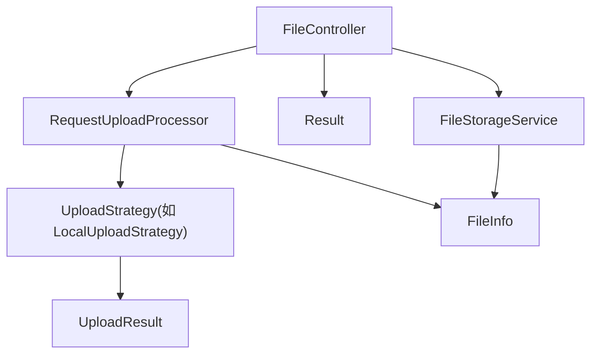
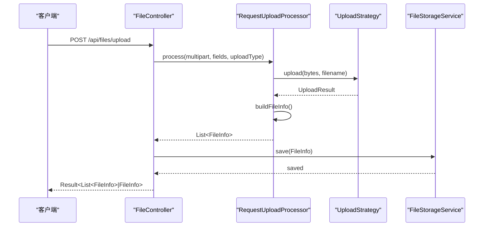
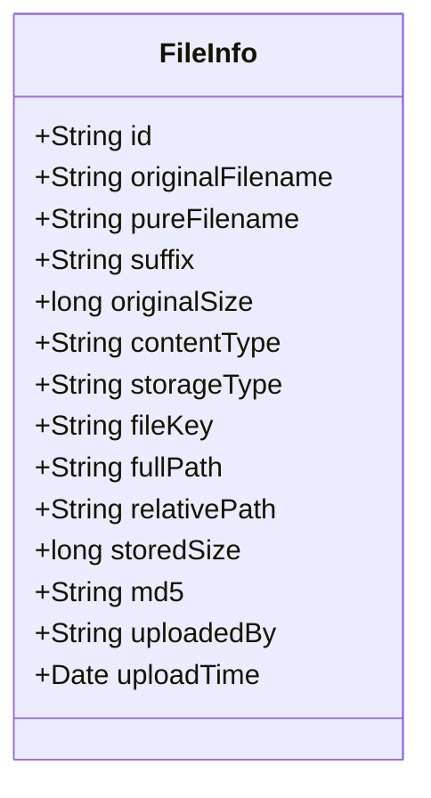
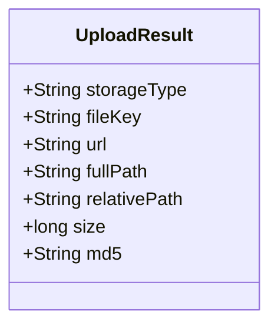
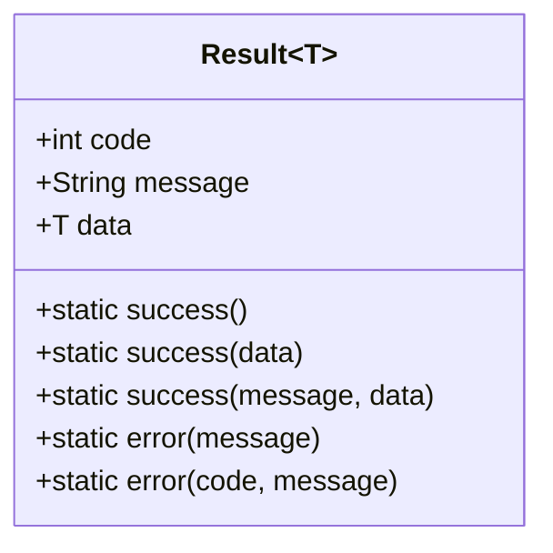
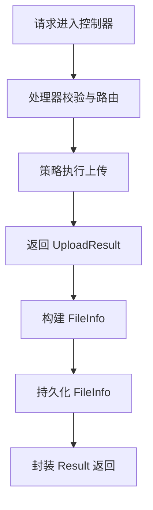
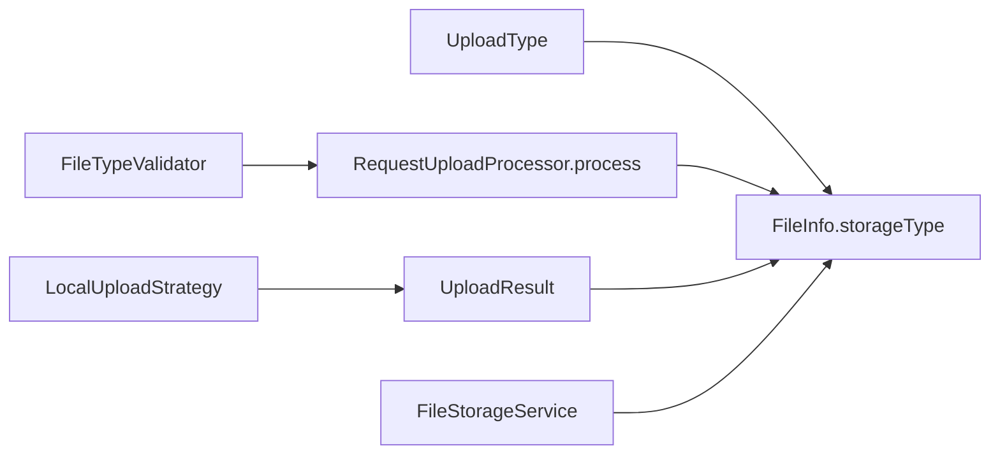

# 数据模型（Model）

<cite>
**本文引用的文件**
- [FileInfo.java](file://src/main/java/com/example/fileupload/model/FileInfo.java)
- [UploadResult.java](file://src/main/java/com/example/fileupload/model/UploadResult.java)
- [Result.java](file://src/main/java/com/example/fileupload/model/Result.java)
- [UploadType.java](file://src/main/java/com/example/fileupload/enums/UploadType.java)
- [FileController.java](file://src/main/java/com/example/fileupload/controller/FileController.java)
- [RequestUploadProcessor.java](file://src/main/java/com/example/fileupload/service/RequestUploadProcessor.java)
- [LocalUploadStrategy.java](file://src/main/java/com/example/fileupload/strategy/LocalUploadStrategy.java)
- [FileTypeValidator.java](file://src/main/java/com/example/fileupload/util/FileTypeValidator.java)
- [FileStorageService.java](file://src/main/java/com/example/fileupload/service/FileStorageService.java)
</cite>

## 目录
1. [简介](#简介)
2. [项目结构](#项目结构)
3. [核心组件](#核心组件)
4. [架构总览](#架构总览)
5. [详细组件分析](#详细组件分析)
6. [依赖关系分析](#依赖关系分析)
7. [性能考虑](#性能考虑)
8. [故障排查指南](#故障排查指南)
9. [结论](#结论)
10. [附录](#附录)

## 简介
本文件围绕文件上传场景中的三个核心数据实体进行系统化文档化：FileInfo、UploadResult 与 Result。内容涵盖设计理念、字段定义、模型间关系、数据流转过程、序列化规则、验证规则与业务约束，并提供迁移策略、版本兼容性与扩展性设计建议，帮助开发者快速理解并正确使用这些模型。

## 项目结构
- 模型层位于 model 包，包含 FileInfo、UploadResult、Result。
- 枚举 UploadType 用于标识存储类型（local、ftp、oss）。
- 控制器 FileController 暴露 REST API，统一封装返回为 Result。
- 处理器 RequestUploadProcessor 负责请求解析、校验、策略路由与结果组装。
- 策略 LocalUploadStrategy 等实现具体存储逻辑，返回 UploadResult。
- 工具 FileTypeValidator 提供后缀白名单与魔数校验。
- 服务 FileStorageService 以内存方式持久化 FileInfo（可替换为数据库）。

图表来源
- [FileController.java:50-154](file://src/main/java/com/example/fileupload/controller/FileController.java#L50-L154)
- [RequestUploadProcessor.java:46-152](file://src/main/java/com/example/fileupload/service/RequestUploadProcessor.java#L46-L152)
- [LocalUploadStrategy.java:63-137](file://src/main/java/com/example/fileupload/strategy/LocalUploadStrategy.java#L63-L137)
- [FileStorageService.java:32-60](file://src/main/java/com/example/fileupload/service/FileStorageService.java#L32-L60)

章节来源
- [FileController.java:50-154](file://src/main/java/com/example/fileupload/controller/FileController.java#L50-L154)
- [RequestUploadProcessor.java:46-152](file://src/main/java/com/example/fileupload/service/RequestUploadProcessor.java#L46-L152)
- [LocalUploadStrategy.java:63-137](file://src/main/java/com/example/fileupload/strategy/LocalUploadStrategy.java#L63-L137)
- [FileStorageService.java:32-60](file://src/main/java/com/example/fileupload/service/FileStorageService.java#L32-L60)

## 核心组件
- FileInfo：文件元数据模型，承载上传前后完整信息，包括原始文件名、纯文件名、后缀、大小、MIME、存储类型、文件键、路径、MD5、上传者与时间等。
- UploadResult：上传策略执行后的通用结果，包含存储类型、文件键、URL、路径、大小、MD5等，供处理器组装为 FileInfo。
- Result<T>：统一响应封装，包含状态码、消息与数据体，所有接口统一返回该结构。

章节来源
- [FileInfo.java:8-75](file://src/main/java/com/example/fileupload/model/FileInfo.java#L8-L75)
- [UploadResult.java:6-38](file://src/main/java/com/example/fileupload/model/UploadResult.java#L6-L38)
- [Result.java:6-46](file://src/main/java/com/example/fileupload/model/Result.java#L6-L46)

## 架构总览
下图展示一次典型上传流程中数据模型的流转：控制器接收请求，处理器校验并调用策略，策略返回 UploadResult，处理器将其转换为 FileInfo，控制器将 FileInfo 持久化后通过 Result 返回。

图表来源
- [FileController.java:58-84](file://src/main/java/com/example/fileupload/controller/FileController.java#L58-L84)
- [RequestUploadProcessor.java:46-87](file://src/main/java/com/example/fileupload/service/RequestUploadProcessor.java#L46-L87)
- [LocalUploadStrategy.java:63-84](file://src/main/java/com/example/fileupload/strategy/LocalUploadStrategy.java#L63-L84)
- [FileStorageService.java:32-39](file://src/main/java/com/example/fileupload/service/FileStorageService.java#L32-L39)

## 详细组件分析

### FileInfo：文件元数据模型
- 设计理念
  - 覆盖“上传前”和“存储后”两类信息，便于全链路追踪与审计。
  - 分离“存储类型标识”与“文件键/路径”，使不同后端（本地、FTP、OSS）的差异化信息得以统一表达。
  - 引入 MD5、上传者、上传时间等元数据，支持完整性校验与溯源。
- 关键字段说明
  - 原始信息：originalFilename、pureFilename、suffix、originalSize、contentType。
  - 存储信息：storageType、fileKey、fullPath、relativePath、storedSize、md5。
  - 元数据：id、uploadedBy、uploadTime。
- 数据流转
  - 由 RequestUploadProcessor.buildFileInfo 或 FileController.buildFileInfo 根据 MultipartFile 与 UploadResult 构造。
  - 由 FileStorageService.save 持久化（当前为内存 Map，可替换为数据库）。
- 验证与约束
  - 后缀与 MIME 来自 MultipartFile；实际格式由 FileTypeValidator.validate 在上传前校验。
  - storageType 必须为 UploadType 定义的合法值（local/ftp/oss）。
  - id 由系统生成（UUID），保证唯一性。
- 序列化规则
  - 作为 JSON 响应字段直接暴露；注意 Date 类型在不同框架下的序列化行为需统一配置。
  - 敏感字段（如 fullPath）可按需脱敏或按需返回。
- 复杂度与性能
  - 对象字段较多但均为轻量级基本类型与字符串，内存占用可控。
  - md5 计算在策略层完成，避免重复计算。

图表来源
- [FileInfo.java:8-75](file://src/main/java/com/example/fileupload/model/FileInfo.java#L8-L75)

章节来源
- [FileInfo.java:8-75](file://src/main/java/com/example/fileupload/model/FileInfo.java#L8-L75)
- [RequestUploadProcessor.java:134-152](file://src/main/java/com/example/fileupload/service/RequestUploadProcessor.java#L134-L152)
- [FileController.java:138-154](file://src/main/java/com/example/fileupload/controller/FileController.java#L138-L154)
- [FileStorageService.java:32-39](file://src/main/java/com/example/fileupload/service/FileStorageService.java#L32-L39)

### UploadResult：上传策略结果封装
- 设计理念
  - 抽象各存储策略的共性结果，屏蔽底层差异（本地路径、FTP/OSS URL 等）。
  - 提供 fileKey、路径、大小、MD5 等关键信息，便于上层统一组装 FileInfo。
- 关键字段说明
  - storageType：策略类型标识。
  - fileKey：存储路径或唯一标识。
  - url：可访问地址（FTP/OSS 有效）。
  - fullPath/relativePath：本地存储时提供绝对/相对路径。
  - size/md5：文件大小与校验值。
- 数据流转
  - 由具体策略（如 LocalUploadStrategy.upload）返回。
  - 被 RequestUploadProcessor 读取并映射到 FileInfo 对应字段。
- 验证与约束
  - size 非负；md5 应为十六进制字符串；url 仅在适用策略下填充。
- 序列化规则
  - 通常不直接对外暴露，仅用于内部流转；如需暴露，应过滤掉敏感字段。
- 复杂度与性能
  - 轻量对象，构造成本低；md5 计算开销在策略层控制。

图表来源
- [UploadResult.java:6-38](file://src/main/java/com/example/fileupload/model/UploadResult.java#L6-L38)

章节来源
- [UploadResult.java:6-38](file://src/main/java/com/example/fileupload/model/UploadResult.java#L6-L38)
- [LocalUploadStrategy.java:120-137](file://src/main/java/com/example/fileupload/strategy/LocalUploadStrategy.java#L120-L137)
- [RequestUploadProcessor.java:134-152](file://src/main/java/com/example/fileupload/service/RequestUploadProcessor.java#L134-L152)

### Result<T>：统一响应格式
- 设计理念
  - 统一 API 返回结构，便于前端统一处理成功/失败分支。
  - 使用泛型 data 承载任意业务数据，保持接口灵活性。
- 关键字段说明
  - code：业务状态码（如 200 成功、500 错误、自定义业务码）。
  - message：人类可读的消息。
  - data：业务数据体。
- 数据流转
  - 控制器在各端点返回 Result.success(...) 或 Result.error(...)。
  - 批量上传返回 Result<List<FileInfo>>，单条上传返回 Result<FileInfo>。
- 验证与约束
  - code 语义需在前端约定；message 应避免泄露敏感信息。
- 序列化规则
  - 标准 JSON 结构；注意日期与空值的序列化一致性。
- 复杂度与性能
  - 极轻量，无额外开销。

图表来源
- [Result.java:6-46](file://src/main/java/com/example/fileupload/model/Result.java#L6-L46)

章节来源
- [Result.java:6-46](file://src/main/java/com/example/fileupload/model/Result.java#L6-L46)
- [FileController.java:58-84](file://src/main/java/com/example/fileupload/controller/FileController.java#L58-L84)
- [FileController.java:93-133](file://src/main/java/com/example/fileupload/controller/FileController.java#L93-L133)

### 模型间关系与数据流转
- 关系
  - UploadResult 是中间结果，被 RequestUploadProcessor 转换为 FileInfo。
  - FileInfo 是最终持久化的元数据实体。
  - Result<T> 是对外统一响应包装，data 可为 FileInfo 或列表。
- 流转
  - 控制器 -> 处理器 -> 策略 -> UploadResult -> 处理器 -> FileInfo -> 存储服务 -> 控制器 -> Result。

图表来源
- [FileController.java:58-154](file://src/main/java/com/example/fileupload/controller/FileController.java#L58-L154)
- [RequestUploadProcessor.java:46-152](file://src/main/java/com/example/fileupload/service/RequestUploadProcessor.java#L46-L152)
- [LocalUploadStrategy.java:63-137](file://src/main/java/com/example/fileupload/strategy/LocalUploadStrategy.java#L63-L137)
- [FileStorageService.java:32-60](file://src/main/java/com/example/fileupload/service/FileStorageService.java#L32-L60)

章节来源
- [FileController.java:58-154](file://src/main/java/com/example/fileupload/controller/FileController.java#L58-L154)
- [RequestUploadProcessor.java:46-152](file://src/main/java/com/example/fileupload/service/RequestUploadProcessor.java#L46-L152)
- [LocalUploadStrategy.java:63-137](file://src/main/java/com/example/fileupload/strategy/LocalUploadStrategy.java#L63-L137)
- [FileStorageService.java:32-60](file://src/main/java/com/example/fileupload/service/FileStorageService.java#L32-L60)

## 依赖关系分析
- 模型依赖
  - FileInfo 依赖 UploadType 的 code 作为 storageType 的值域。
  - UploadResult 与 FileInfo 存在字段映射关系（fileKey、路径、大小、MD5）。
  - Result<T> 独立于业务模型，仅作为容器。
- 外部依赖
  - FileTypeValidator.validate 对文件后缀与魔数进行校验，影响 FileInfo.contentType/suffix 的合法性。
  - FileStorageService 当前使用内存存储，未来可替换为数据库，要求 FileInfo 具备可序列化为表结构的字段。

图表来源
- [UploadType.java:6-35](file://src/main/java/com/example/fileupload/enums/UploadType.java#L6-L35)
- [FileTypeValidator.java:47-85](file://src/main/java/com/example/fileupload/util/FileTypeValidator.java#L47-L85)
- [RequestUploadProcessor.java:46-87](file://src/main/java/com/example/fileupload/service/RequestUploadProcessor.java#L46-L87)
- [LocalUploadStrategy.java:63-137](file://src/main/java/com/example/fileupload/strategy/LocalUploadStrategy.java#L63-L137)
- [FileStorageService.java:32-60](file://src/main/java/com/example/fileupload/service/FileStorageService.java#L32-L60)

章节来源
- [UploadType.java:6-35](file://src/main/java/com/example/fileupload/enums/UploadType.java#L6-L35)
- [FileTypeValidator.java:47-85](file://src/main/java/com/example/fileupload/util/FileTypeValidator.java#L47-L85)
- [RequestUploadProcessor.java:46-87](file://src/main/java/com/example/fileupload/service/RequestUploadProcessor.java#L46-L87)
- [LocalUploadStrategy.java:63-137](file://src/main/java/com/example/fileupload/strategy/LocalUploadStrategy.java#L63-L137)
- [FileStorageService.java:32-60](file://src/main/java/com/example/fileupload/service/FileStorageService.java#L32-L60)

## 性能考虑
- 上传阶段
  - 处理器一次性读取字节数组，避免临时文件锁定问题，提升稳定性。
  - MD5 计算在策略层完成，减少重复计算；大文件场景可考虑分块校验或延迟计算。
- 存储阶段
  - 当前内存存储适合演示与测试；生产环境应替换为数据库，并对 FileInfo 建立索引（如 storageType、suffix、uploadTime）。
- 序列化
  - 统一返回 Result 可减少前端分支判断；注意大数据量列表的分页与懒加载。

[本节为通用性能讨论，无需特定文件引用]

## 故障排查指南
- 常见错误
  - 非法文件类型：FileTypeValidator.validate 抛出异常，提示不允许的后缀或内容与后缀不符。
  - 未接收到有效文件：处理器检测到空字段时抛出异常。
  - 删除失败：底层存储不存在或权限不足，控制器返回相应错误码。
- 定位方法
  - 检查日志输出（处理器与策略层的日志）。
  - 确认 UploadType 参数是否合法（fromCode 会抛异常）。
  - 检查 FileStorageService 中是否存在对应 id 的记录。

章节来源
- [FileTypeValidator.java:47-85](file://src/main/java/com/example/fileupload/util/FileTypeValidator.java#L47-L85)
- [RequestUploadProcessor.java:46-87](file://src/main/java/com/example/fileupload/service/RequestUploadProcessor.java#L46-L87)
- [FileController.java:203-227](file://src/main/java/com/example/fileupload/controller/FileController.java#L203-L227)

## 结论
- FileInfo、UploadResult、Result 构成了文件上传的核心数据模型体系：前者承载元数据，中者封装策略结果，后者统一响应。
- 通过处理器与策略模式，实现了上传流程的可扩展与解耦。
- 建议在后续演进中完善校验规则、增加分页与搜索能力、引入数据库持久化与索引优化，并制定统一的错误码与消息规范。

[本节为总结性内容，无需特定文件引用]

## 附录

### 数据结构示例（基于代码行为的描述）
- FileInfo 示例字段
  - id: 系统生成的唯一标识（UUID 去连字符）。
  - originalFilename: 原始文件名（含后缀）。
  - pureFilename: 纯文件名（不含路径与后缀）。
  - suffix: 后缀（如 ".jpg"）。
  - originalSize: 原始文件大小（字节）。
  - contentType: MIME 类型。
  - storageType: local/ftp/oss。
  - fileKey: 存储路径或唯一标识。
  - fullPath/relativePath: 本地存储时的绝对/相对路径。
  - storedSize: 实际上传后的大小。
  - md5: 文件校验值。
  - uploadedBy: 上传者（模拟字段）。
  - uploadTime: 上传时间。
- UploadResult 示例字段
  - storageType: 策略类型。
  - fileKey: 存储路径或唯一标识。
  - url: 可访问地址（FTP/OSS）。
  - fullPath/relativePath: 本地路径信息。
  - size: 文件大小。
  - md5: 校验值。
- Result 示例结构
  - code: 200 表示成功，其他为错误码。
  - message: 成功或错误消息。
  - data: FileInfo 或 List<FileInfo>。

[本节为概念性示例，无需特定文件引用]

### 验证规则与业务约束
- 文件类型
  - 后缀必须在白名单内；内容与后缀需匹配（魔数校验）。
- 存储类型
  - storageType 必须为 UploadType 定义的合法值。
- 唯一性
  - FileInfo.id 必须唯一；fileKey 在同一存储下应唯一。
- 完整性
  - md5 可用于完整性校验；上传与下载流程应保持一致。

章节来源
- [FileTypeValidator.java:47-85](file://src/main/java/com/example/fileupload/util/FileTypeValidator.java#L47-L85)
- [UploadType.java:20-33](file://src/main/java/com/example/fileupload/enums/UploadType.java#L20-L33)
- [FileStorageService.java:32-39](file://src/main/java/com/example/fileupload/service/FileStorageService.java#L32-L39)

### 数据迁移策略与版本兼容性
- 迁移策略
  - 从内存存储迁移至数据库时，将 FileInfo 映射为表结构；为常用查询字段建立索引（storageType、suffix、uploadTime）。
  - 保留历史字段以兼容旧版客户端，新增字段默认允许为空。
- 版本兼容
  - Result.code 与 message 语义保持稳定；新增业务码需向后兼容。
  - FileInfo 新增字段时，确保旧客户端忽略未知字段。
- 扩展性设计
  - 通过 UploadType 与策略模式扩展新存储后端。
  - 可在 Result.data 中扩展分页信息（total、page、size）以提升查询体验。

[本节为通用指导，无需特定文件引用]

### 使用指南（开发者）
- 上传流程
  - 调用 /api/files/upload，传入 uploadType 与文件字段；控制器将调用处理器与策略，返回 Result<FileInfo>。
  - 批量上传使用 /api/files/upload/batch，返回 Result<List<FileInfo>>。
- 查询与删除
  - 查询使用 /api/files 支持关键词、存储类型、后缀过滤与分页。
  - 删除使用 /api/files/{id}，先删除底层存储再清除元数据。
- 注意事项
  - 确保文件类型符合白名单与魔数校验。
  - 合理设置 storageType 与 fileKey，避免冲突。
  - 关注 Result.code 与 message 的处理逻辑。

章节来源
- [FileController.java:58-154](file://src/main/java/com/example/fileupload/controller/FileController.java#L58-L154)
- [FileController.java:236-292](file://src/main/java/com/example/fileupload/controller/FileController.java#L236-L292)
- [RequestUploadProcessor.java:46-152](file://src/main/java/com/example/fileupload/service/RequestUploadProcessor.java#L46-L152)