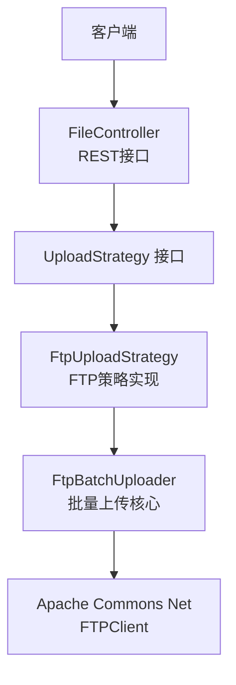
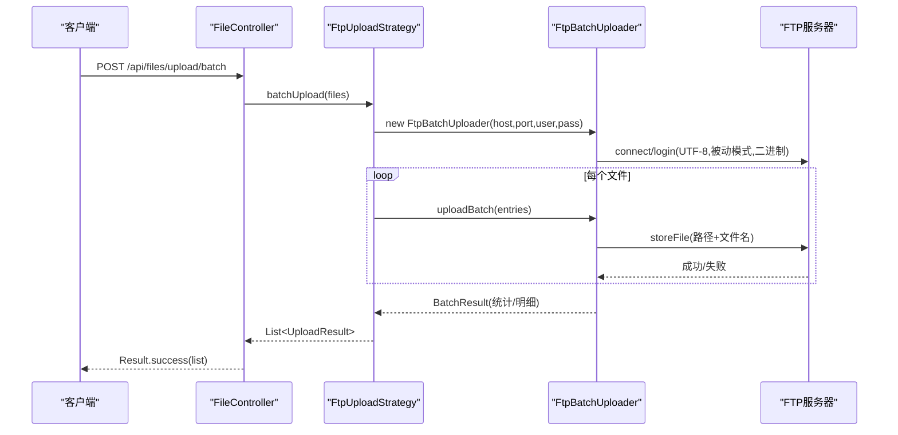
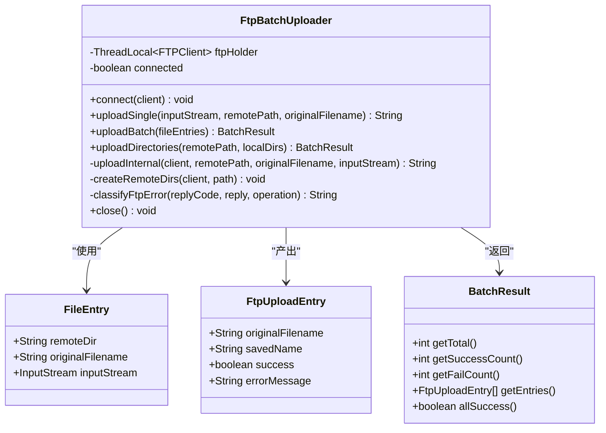
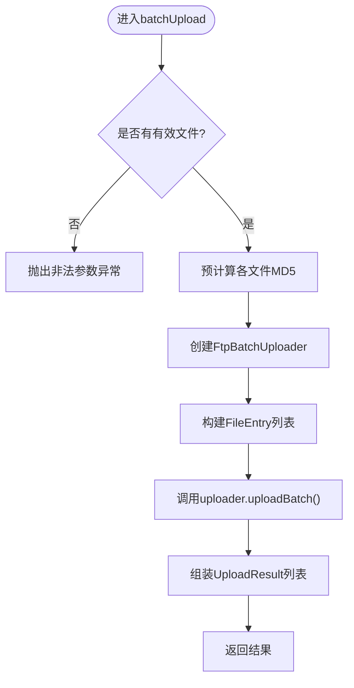
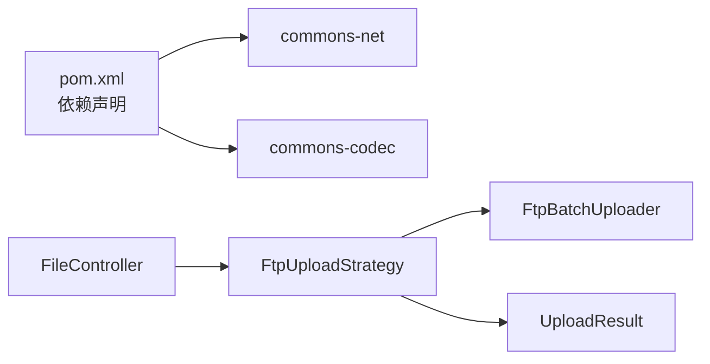

# FTP批处理上传器（FtpBatchUploader）

<cite>
**本文引用的文件**
- [FtpBatchUploader.java](file://src/main/java/com/example/fileupload/service/FtpBatchUploader.java)
- [FtpUploadStrategy.java](file://src/main/java/com/example/fileupload/strategy/FtpUploadStrategy.java)
- [UploadStrategy.java](file://src/main/java/com/example/fileupload/strategy/UploadStrategy.java)
- [FileController.java](file://src/main/java/com/example/fileupload/controller/FileController.java)
- [application.yml](file://src/main/resources/application.yml)
- [pom.xml](file://pom.xml)
- [FileInfo.java](file://src/main/java/com/example/fileupload/model/FileInfo.java)
- [UploadResult.java](file://src/main/java/com/example/fileupload/model/UploadResult.java)
- [Result.java](file://src/main/java/com/example/fileupload/model/Result.java)
</cite>

## 目录
1. [简介](#简介)
2. [项目结构](#项目结构)
3. [核心组件](#核心组件)
4. [架构总览](#架构总览)
5. [详细组件分析](#详细组件分析)
6. [依赖关系分析](#依赖关系分析)
7. [性能与并发特性](#性能与并发特性)
8. [配置与调优](#配置与调优)
9. [使用示例](#使用示例)
10. [故障诊断与排错](#故障诊断与排错)
11. [结论](#结论)
12. [附录：扩展开发指南](#附录：扩展开发指南)

## 简介
本文件围绕 FtpBatchUploader 的批量上传优化机制、连接管理、错误处理策略进行系统化说明，涵盖 FTP 连接的建立与维护、并发与重试、超时处理、批处理调度、进度跟踪、资源清理，以及与 Apache Commons Net 的集成方式。同时提供配置参数调优、性能监控建议、使用示例、最佳实践和扩展开发指南，帮助不同技术水平的开发者快速上手并安全高效地使用该能力。

## 项目结构
该工程采用 Spring Boot + 策略模式实现多存储后端（本地、FTP、对象存储）。FTP 相关能力集中在服务层与策略层：
- 服务层：FtpBatchUploader 负责基于 ThreadLocal 复用 FTPClient 的批量上传、目录创建、错误分类与生命周期管理。
- 策略层：FtpUploadStrategy 将 HTTP 请求接入到具体 FTP 实现，封装单文件/批量上传、下载、删除等能力。
- 控制器：FileController 暴露 REST API，统一路由到策略层执行。
- 模型：FileInfo、UploadResult、Result 用于数据承载与统一返回。
- 配置：application.yml 提供 FTP 连接参数；pom.xml 引入 commons-net 等依赖。

图表来源
- [FileController.java:58-133](file://src/main/java/com/example/fileupload/controller/FileController.java#L58-L133)
- [UploadStrategy.java:13-74](file://src/main/java/com/example/fileupload/strategy/UploadStrategy.java#L13-L74)
- [FtpUploadStrategy.java:36-186](file://src/main/java/com/example/fileupload/strategy/FtpUploadStrategy.java#L36-L186)
- [FtpBatchUploader.java:23-124](file://src/main/java/com/example/fileupload/service/FtpBatchUploader.java#L23-L124)

章节来源
- [FileController.java:58-133](file://src/main/java/com/example/fileupload/controller/FileController.java#L58-L133)
- [FtpUploadStrategy.java:36-186](file://src/main/java/com/example/fileupload/strategy/FtpUploadStrategy.java#L36-L186)
- [FtpBatchUploader.java:23-124](file://src/main/java/com/example/fileupload/service/FtpBatchUploader.java#L23-L124)
- [application.yml:16-21](file://src/main/resources/application.yml#L16-L21)
- [pom.xml:51-56](file://pom.xml#L51-L56)

## 核心组件
- FtpBatchUploader：基于 ThreadLocal 绑定当前线程的 FTPClient，避免重复握手；提供单文件上传、批量上传、目录扫描上传、远程目录创建、错误分类、资源关闭等能力。
- FtpUploadStrategy：Spring 组件，注入 FTP 配置，实现 UploadStrategy 接口，封装单文件/批量上传、下载、删除，并在批量场景下复用单个 FTP 连接。
- UploadStrategy：定义统一的上传/下载/删除/批量上传接口，便于扩展其他存储后端。
- FileController：REST 控制器，接收 multipart 请求，调用策略层完成上传，并将结果持久化到内存元数据存储。
- 模型类：FileInfo、UploadResult、Result 分别承载文件信息、上传结果与统一响应。

章节来源
- [FtpBatchUploader.java:23-372](file://src/main/java/com/example/fileupload/service/FtpBatchUploader.java#L23-L372)
- [FtpUploadStrategy.java:36-361](file://src/main/java/com/example/fileupload/strategy/FtpUploadStrategy.java#L36-L361)
- [UploadStrategy.java:13-74](file://src/main/java/com/example/fileupload/strategy/UploadStrategy.java#L13-L74)
- [FileController.java:58-133](file://src/main/java/com/example/fileupload/controller/FileController.java#L58-L133)
- [FileInfo.java:8-76](file://src/main/java/com/example/fileupload/model/FileInfo.java#L8-L76)
- [UploadResult.java:6-39](file://src/main/java/com/example/fileupload/model/UploadResult.java#L6-L39)
- [Result.java:6-47](file://src/main/java/com/example/fileupload/model/Result.java#L6-L47)

## 架构总览
整体流程如下：
- 客户端通过 /api/files/upload 或 /api/files/upload/batch 发起上传请求。
- FileController 解析请求并选择对应 UploadStrategy。
- FtpUploadStrategy 在批量模式下构造 FtpBatchUploader，复用单一 FTP 连接完成多个文件的上传。
- FtpBatchUploader 内部维护 ThreadLocal<FTPClient>，确保同线程内多次操作复用同一连接，减少握手开销。
- 上传成功后，控制器将结果转为 FileInfo 并保存到内存存储。

图表来源
- [FileController.java:93-133](file://src/main/java/com/example/fileupload/controller/FileController.java#L93-L133)
- [FtpUploadStrategy.java:126-186](file://src/main/java/com/example/fileupload/strategy/FtpUploadStrategy.java#L126-L186)
- [FtpBatchUploader.java:103-124](file://src/main/java/com/example/fileupload/service/FtpBatchUploader.java#L103-L124)

## 详细组件分析

### FtpBatchUploader：批量上传核心
- 连接管理
  - 使用 ThreadLocal<FTPClient> 保证同线程内复用连接，避免重复 TCP/TLS 握手。
  - getFtpClient() 懒加载连接，若未连接或断开则自动 connect()。
  - connect() 中设置控制编码 UTF-8、被动模式、二进制类型、禁用远程验证、缓冲区大小等关键配置。
- 上传逻辑
  - uploadSingle()：单文件上传，内部复用 ThreadLocal 连接。
  - uploadBatch()：批量上传，遍历 entries，逐个调用 uploadInternal()，捕获异常记录失败原因，finally 中安全关闭输入流。
  - uploadDirectories()：递归扫描本地目录，按相对路径映射到远程目录，逐文件上传。
- 目录创建
  - createRemoteDirs()：逐级创建远程目录，处理权限不足、路径无效等错误，最终回到根目录。
- 错误分类
  - classifyFtpError()：根据 FTP 回复码生成用户友好的错误消息（如 550/553/421/425/426/552）。
- 资源清理
  - close()：logout、disconnect、移除 ThreadLocal，防止连接泄漏。
- 数据结构
  - FileEntry：包含远程目录、原始文件名、输入流。
  - FtpUploadEntry：包含原始名、保存名、成功标志、错误信息。
  - BatchResult：汇总总数、成功数、失败数、条目列表。

图表来源
- [FtpBatchUploader.java:23-372](file://src/main/java/com/example/fileupload/service/FtpBatchUploader.java#L23-L372)

章节来源
- [FtpBatchUploader.java:23-372](file://src/main/java/com/example/fileupload/service/FtpBatchUploader.java#L23-L372)

### FtpUploadStrategy：FTP策略实现
- 配置注入：从 application.yml 读取 host、port、username、password、basePath。
- 单文件上传/下载/删除：每次操作创建独立 FTPClient，完成后安全断开。
- 批量上传：
  - 预计算 MD5（在流被消耗之前），提升后续校验效率。
  - 使用 try-with-resources 创建 FtpBatchUploader，确保连接释放。
  - 构建 FileEntry 列表，调用 uploader.uploadBatch() 一次性发送。
  - 组装 UploadResult 列表，失败时抛出异常以通知调用方。
- 目录创建：ensureRemoteDir() 实现 mkdir -p 语义，处理权限与路径错误。
- 错误分类：classifyFtpError() 统一错误提示。

图表来源
- [FtpUploadStrategy.java:126-186](file://src/main/java/com/example/fileupload/strategy/FtpUploadStrategy.java#L126-L186)

章节来源
- [FtpUploadStrategy.java:36-361](file://src/main/java/com/example/fileupload/strategy/FtpUploadStrategy.java#L36-L361)

### FileController：REST入口
- 单文件上传：/api/files/upload，支持 uploadType 参数选择策略。
- 批量上传：/api/files/upload/batch，字段名为 files，统一走策略层的 batchUpload。
- 下载/删除/查询：提供完整 CRUD 能力，结合内存存储进行演示。

章节来源
- [FileController.java:58-133](file://src/main/java/com/example/fileupload/controller/FileController.java#L58-L133)
- [FileController.java:156-227](file://src/main/java/com/example/fileupload/controller/FileController.java#L156-L227)
- [FileController.java:229-292](file://src/main/java/com/example/fileupload/controller/FileController.java#L229-L292)

## 依赖关系分析
- 外部库
  - Apache Commons Net (commons-net)：提供 FTPClient、FTP、FTPReply 等核心类。
  - Commons Codec：用于 MD5 计算。
  - MinIO SDK：用于对象存储（非本次重点）。
- 内部依赖
  - FtpUploadStrategy 依赖 FtpBatchUploader 与 UploadResult。
  - FileController 依赖 UploadStrategyFactory（未在本文展开）与 FileStorageService。
  - 模型类为跨层共享的数据载体。

图表来源
- [pom.xml:51-70](file://pom.xml#L51-L70)
- [FtpUploadStrategy.java:1-186](file://src/main/java/com/example/fileupload/strategy/FtpUploadStrategy.java#L1-L186)

章节来源
- [pom.xml:51-70](file://pom.xml#L51-L70)
- [FtpUploadStrategy.java:1-186](file://src/main/java/com/example/fileupload/strategy/FtpUploadStrategy.java#L1-L186)

## 性能与并发特性
- 连接复用
  - 通过 ThreadLocal<FTPClient> 在同线程内复用连接，显著减少 TCP/TLS 握手成本。
  - 批量上传在同一连接上顺序执行，避免频繁连接/断开的开销。
- 传输优化
  - 设置二进制类型与 UTF-8 控制编码，避免文本模式导致的字节转换问题与乱码。
  - 启用被动模式穿透 NAT/防火墙，提高连通性。
  - 调整缓冲区大小以提升大文件传输吞吐。
- 并发与重试
  - 当前实现为单线程顺序批量上传，未内置并发与重试机制。
  - 如需并发，可在上层对文件分片并行调用 uploadBatch（注意 FTP 服务端并发限制与带宽占用）。
  - 如需重试，可在调用方对特定错误码（如 421/425/426）实施指数退避重试。
- 超时处理
  - 当前未显式设置 Socket 超时与数据传输超时，建议在应用层或网络层配置合适的超时策略，避免长时间阻塞。
- 进度跟踪
  - 当前无内置进度回调，可在调用方统计已处理文件数量与总数量，实现简单进度展示。
- 资源清理
  - FtpBatchUploader.close() 确保 logout/disconnect 并移除 ThreadLocal，防止连接泄漏。
  - FtpUploadStrategy 的单文件方法使用 finally 安全断开。

[本节为通用性能讨论，不直接分析具体代码行]

## 配置与调优
- 配置文件位置：application.yml
- FTP 关键参数
  - file.ftp.host：FTP 主机地址
  - file.ftp.port：端口（默认 21）
  - file.ftp.username / password：认证凭据
  - file.ftp.basePath：远程存储根路径
- 上传限制
  - spring.servlet.multipart.max-file-size / max-request-size：控制单文件与请求大小限制
- 日志级别
  - com.example.fileupload: DEBUG：便于排查上传过程
- 调优建议
  - 根据网络与 FTP 服务器能力调整缓冲区大小（当前为 8192）。
  - 在高并发场景下，考虑连接池或分批并发策略，但需评估 FTP 服务端负载。
  - 针对大文件，可考虑分块上传与断点续传（需 FTP 服务端支持与额外实现）。

章节来源
- [application.yml:16-21](file://src/main/resources/application.yml#L16-L21)
- [application.yml:4-10](file://src/main/resources/application.yml#L4-L10)
- [application.yml:30-33](file://src/main/resources/application.yml#L30-L33)

## 使用示例
- 单文件上传
  - 端点：POST /api/files/upload?uploadType=ftp
  - 表单字段：file（multipart/form-data）
  - 行为：选择 FTP 策略，调用 FtpUploadStrategy.upload()
- 批量上传
  - 端点：POST /api/files/upload/batch?uploadType=ftp
  - 表单字段：files（多个文件）
  - 行为：选择 FTP 策略，调用 FtpUploadStrategy.batchUpload()，内部复用单一 FTP 连接
- 下载
  - 端点：GET /api/files/download?fileKey={fileKey}&uploadType=ftp
  - 行为：按 fileKey 下载文件
- 删除
  - 端点：DELETE /api/files/{id}?uploadType=ftp
  - 行为：先删除底层存储，再清除元数据
- 查询
  - 端点：GET /api/files?page=1&size=20&keyword=&storageType=&suffix=.png
  - 行为：分页与过滤查询

章节来源
- [FileController.java:58-133](file://src/main/java/com/example/fileupload/controller/FileController.java#L58-L133)
- [FileController.java:156-227](file://src/main/java/com/example/fileupload/controller/FileController.java#L156-L227)
- [FileController.java:229-292](file://src/main/java/com/example/fileupload/controller/FileController.java#L229-L292)

## 故障诊断与排错
- 常见错误与含义
  - 550：权限不足或文件不存在
  - 553：路径无效或文件名不允许
  - 421：服务不可用或连接超时
  - 425：数据连接建立失败（检查防火墙/被动模式）
  - 426：数据传输中断
  - 552：磁盘空间不足
- 定位步骤
  - 检查 application.yml 中的 FTP 配置是否正确
  - 查看日志中 “[FTP]” 前缀的输出，关注连接、目录创建、上传结果
  - 确认 FTP 服务器是否启用被动模式且允许相应 IP/端口
  - 对于大文件，检查网络稳定性与服务端磁盘空间
- 恢复建议
  - 对 421/425/426 等临时错误实施重试（指数退避）
  - 对 550/553 检查权限与路径命名规范
  - 对 552 清理服务端空间或扩容

章节来源
- [FtpBatchUploader.java:195-212](file://src/main/java/com/example/fileupload/service/FtpBatchUploader.java#L195-L212)
- [FtpUploadStrategy.java:335-352](file://src/main/java/com/example/fileupload/strategy/FtpUploadStrategy.java#L335-L352)

## 结论
FtpBatchUploader 通过 ThreadLocal 复用 FTPClient，显著降低批量上传的连接开销；配合 FtpUploadStrategy 的策略化设计与 FileController 的统一入口，提供了清晰可扩展的 FTP 上传能力。当前实现注重稳定性与兼容性（UTF-8、被动模式、二进制类型），并通过详细的错误分类提升可观测性。生产环境可根据业务需求引入并发、重试、超时与进度跟踪等增强能力。

[本节为总结性内容，不直接分析具体代码行]

## 附录：扩展开发指南
- 新增存储策略
  - 实现 UploadStrategy 接口，覆盖 upload/delete/download/batchUpload 等方法
  - 在工厂中注册新策略（参考现有策略模式）
- 增强并发与重试
  - 在 FtpUploadStrategy.batchUpload 中对文件分片并行调用 uploader.uploadBatch
  - 对特定错误码实现重试逻辑（如 421/425/426），并加入退避与熔断保护
- 完善超时与监控
  - 为 FTPClient 设置 Socket 超时与数据传输超时
  - 增加指标采集（连接数、成功率、耗时、失败原因分布）
- 进度与断点续传
  - 在上传过程中回调进度（当前未实现，可在调用方统计）
  - 对接支持断点续传的 FTP 服务器，实现分块上传与状态持久化

[本节为概念性指导，不直接分析具体代码行]