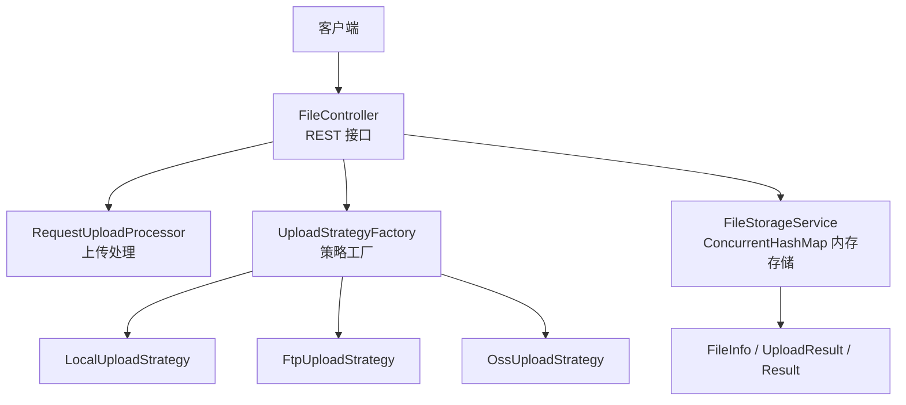
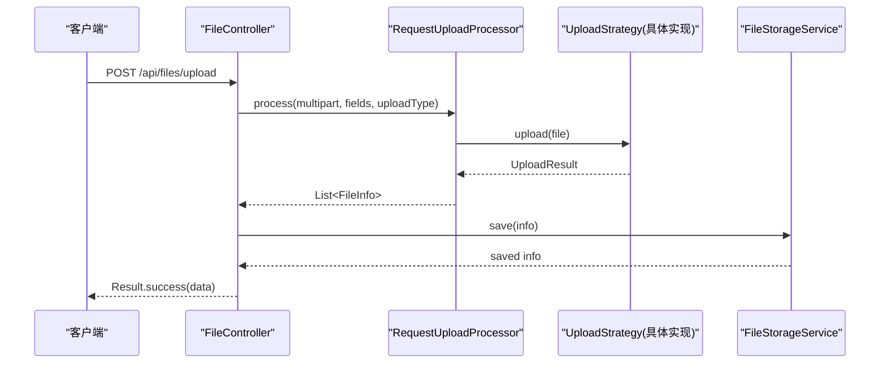
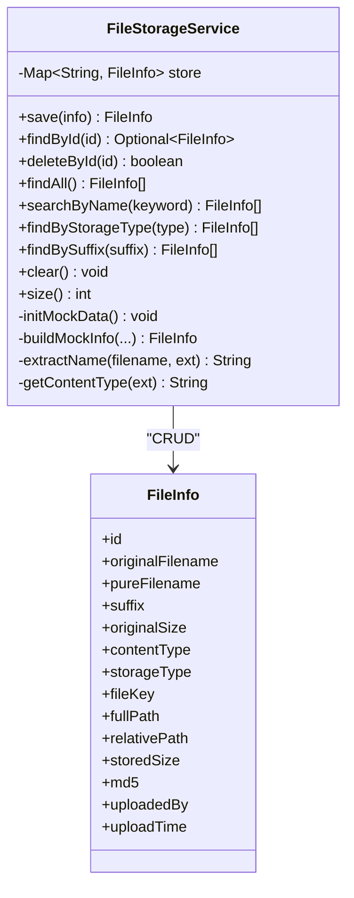
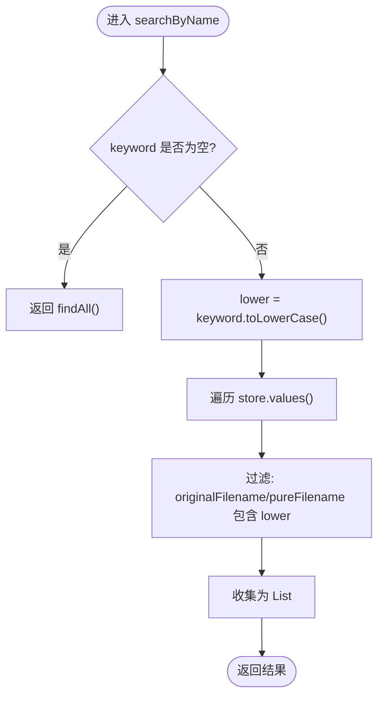
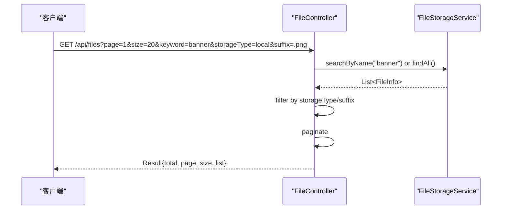
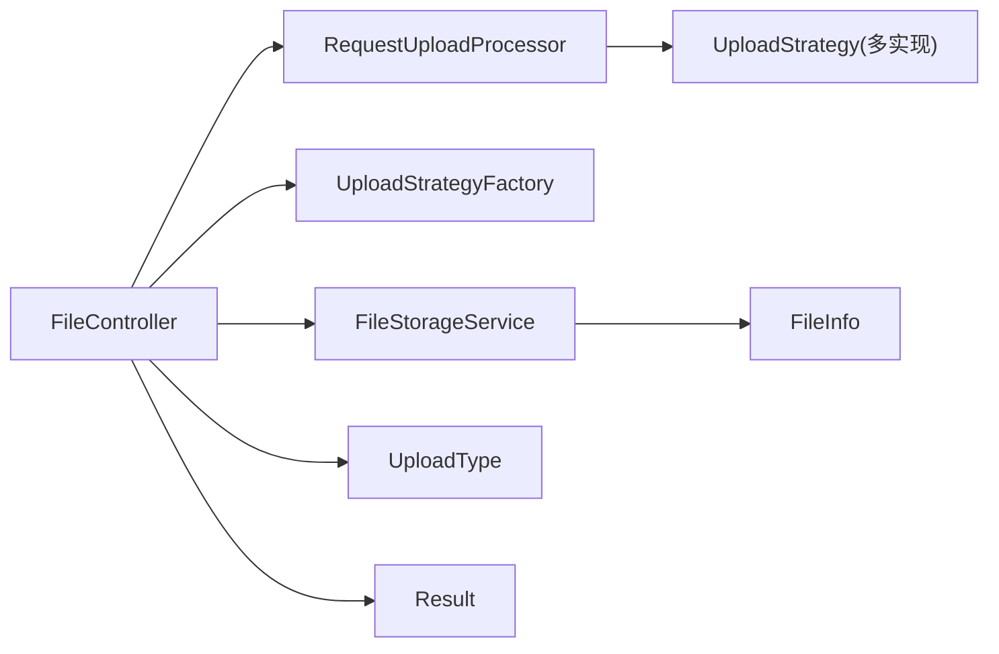

# 文件存储服务（FileStorageService）

<cite>
**本文引用的文件**
- [FileStorageService.java](file://src/main/java/com/example/fileupload/service/FileStorageService.java)
- [FileInfo.java](file://src/main/java/com/example/fileupload/model/FileInfo.java)
- [FileController.java](file://src/main/java/com/example/fileupload/controller/FileController.java)
- [UploadType.java](file://src/main/java/com/example/fileupload/enums/UploadType.java)
- [Result.java](file://src/main/java/com/example/fileupload/model/Result.java)
- [UploadResult.java](file://src/main/java/com/example/fileupload/model/UploadResult.java)
- [application.yml](file://src/main/resources/application.yml)
- [pom.xml](file://pom.xml)
- [FileStorageServiceTest.java](file://src/test/java/com/example/fileupload/FileStorageServiceTest.java)
</cite>

## 目录
1. [简介](#简介)
2. [项目结构](#项目结构)
3. [核心组件](#核心组件)
4. [架构总览](#架构总览)
5. [详细组件分析](#详细组件分析)
6. [依赖关系分析](#依赖关系分析)
7. [性能考量](#性能考量)
8. [故障排查指南](#故障排查指南)
9. [结论](#结论)
10. [附录：API 使用示例与配置](#附录api-使用示例与配置)

## 简介
本文件存储服务基于内存实现，提供文件元数据的增删改查、模糊搜索与过滤查询能力。服务通过线程安全的 ConcurrentHashMap 存储 FileInfo，保证并发安全；同时提供 Mock 数据初始化，便于演示与测试。上层控制器暴露 REST API，统一封装返回结果，支持上传、下载、删除、查询与 Mock 数据管理。

## 项目结构
- 控制器层：FileController 负责接收请求、路由到处理器与策略，并调用 FileStorageService 持久化元数据。
- 服务层：FileStorageService 提供内存级文件元数据存储与检索。
- 模型层：FileInfo、UploadResult、Result 用于数据传输与统一响应。
- 枚举层：UploadType 标识本地、FTP、OSS 三种存储类型。
- 配置：application.yml 定义端口、Multipart 限制、本地/FTP/OSS 连接参数等。
- 构建：pom.xml 声明 Spring Boot Web、MinIO、Commons IO/Net、Codec 等依赖。

图表来源
- [FileController.java:31-48](file://src/main/java/com/example/fileupload/controller/FileController.java#L31-L48)
- [FileStorageService.java:19-25](file://src/main/java/com/example/fileupload/service/FileStorageService.java#L19-L25)
- [UploadType.java:6-10](file://src/main/java/com/example/fileupload/enums/UploadType.java#L6-L10)

章节来源
- [FileController.java:31-48](file://src/main/java/com/example/fileupload/controller/FileController.java#L31-L48)
- [application.yml:1-33](file://src/main/resources/application.yml#L1-L33)
- [pom.xml:24-71](file://pom.xml#L24-L71)

## 核心组件
- FileStorageService：内存级文件元数据存储，提供 save/findById/deleteById/findAll/searchByName/findByStorageType/findBySuffix/clear/size 等方法，内部使用 ConcurrentHashMap 保证并发安全。
- FileInfo：文件信息模型，包含原始文件名、纯文件名、后缀、大小、MIME、存储类型、文件键、路径、MD5、上传者、上传时间等字段。
- FileController：REST 控制器，提供上传、批量上传、下载、删除、查询、Mock 数据初始化与计数接口。
- UploadType：枚举，表示 local/ftp/oss 三种存储类型，并提供 fromCode 解析。
- Result：统一返回结果封装，包含 code/message/data。
- UploadResult：上传策略执行后返回的通用结果，供控制器组装 FileInfo。

章节来源
- [FileStorageService.java:19-107](file://src/main/java/com/example/fileupload/service/FileStorageService.java#L19-L107)
- [FileInfo.java:8-75](file://src/main/java/com/example/fileupload/model/FileInfo.java#L8-L75)
- [FileController.java:31-319](file://src/main/java/com/example/fileupload/controller/FileController.java#L31-L319)
- [UploadType.java:6-34](file://src/main/java/com/example/fileupload/enums/UploadType.java#L6-L34)
- [Result.java:6-46](file://src/main/java/com/example/fileupload/model/Result.java#L6-L46)
- [UploadResult.java:6-38](file://src/main/java/com/example/fileupload/model/UploadResult.java#L6-L38)

## 架构总览
系统采用“控制器 + 处理器 + 策略”的分层设计：
- 控制器负责 HTTP 请求解析与响应封装。
- 处理器统一协调上传流程，按 UploadType 选择具体策略。
- 策略分别实现本地磁盘、FTP、对象存储的上传/下载/删除逻辑。
- 文件元数据由 FileStorageService 以内存方式保存，便于快速开发与测试。

图表来源
- [FileController.java:58-84](file://src/main/java/com/example/fileupload/controller/FileController.java#L58-L84)
- [FileStorageService.java:32-39](file://src/main/java/com/example/fileupload/service/FileStorageService.java#L32-L39)

## 详细组件分析

### FileStorageService 内存存储与并发安全
- 数据结构：使用 ConcurrentHashMap<String, FileInfo> 作为底层存储，key 为文件 id，value 为 FileInfo。
- 线程安全保障：ConcurrentHashMap 提供细粒度锁与无锁读，适合高并发读写场景；所有 put/get/remove 操作均为原子性，避免竞态条件。
- 性能优势：
  - O(1) 平均查找、插入、删除复杂度。
  - 并发写入不会阻塞读取，提升吞吐。
  - 流式过滤在内存中高效完成，适合中小规模数据集。
- 生命周期：@PostConstruct 初始化 Mock 数据，便于启动即有样例数据。

图表来源
- [FileStorageService.java:19-183](file://src/main/java/com/example/fileupload/service/FileStorageService.java#L19-L183)
- [FileInfo.java:8-75](file://src/main/java/com/example/fileupload/model/FileInfo.java#L8-L75)

章节来源
- [FileStorageService.java:24-107](file://src/main/java/com/example/fileupload/service/FileStorageService.java#L24-L107)
- [FileStorageService.java:111-157](file://src/main/java/com/example/fileupload/service/FileStorageService.java#L111-L157)

### 文件元数据的 CRUD 与搜索
- 新增：save 自动生成 id（若未设置），写入 store，记录日志。
- 查询：findById 返回 Optional；findAll 返回副本列表，避免外部修改。
- 删除：deleteById 移除条目并返回是否成功。
- 模糊搜索：searchByName 对 originalFilename 与 pureFilename 进行不区分大小写的 contains 匹配。
- 过滤：findByStorageType 与 findBySuffix 支持按存储类型与后缀筛选。
- 清空：clear 用于测试或重置。

图表来源
- [FileStorageService.java:65-74](file://src/main/java/com/example/fileupload/service/FileStorageService.java#L65-L74)

章节来源
- [FileStorageService.java:32-96](file://src/main/java/com/example/fileupload/service/FileStorageService.java#L32-L96)

### Mock 数据初始化与生成逻辑
- 触发时机：@PostConstruct initMockData，应用启动时自动执行。
- 数据内容：构造多种类型文件（pdf/png/jpg/xlsx/docx/zip/bmp），覆盖不同 storageType（local/ftp/oss）。
- 生成规则：
  - id：随机短 ID。
  - 文件名：originalFilename、pureFilename、suffix。
  - 大小：随机范围。
  - MIME：根据后缀映射。
  - 路径：仅 local 类型填充 fullPath 与 relativePath。
  - MD5：随机字符串。
  - 上传者：从固定集合中随机选取。
  - 上传时间：当前时间减去随机天数。
- 用途：便于演示、集成测试与功能验证。

章节来源
- [FileStorageService.java:111-157](file://src/main/java/com/example/fileupload/service/FileStorageService.java#L111-L157)
- [FileStorageService.java:159-182](file://src/main/java/com/example/fileupload/service/FileStorageService.java#L159-L182)

### 控制器 API 与调用链
- 上传：POST /api/files/upload，解析 multipart，调用 RequestUploadProcessor.process，将结果保存到 FileStorageService。
- 批量上传：POST /api/files/upload/batch，复用同一策略的 batchUpload，减少连接开销。
- 下载：GET /api/files/download，按策略下载字节流，设置响应头。
- 删除：DELETE /api/files/{id}，先删除底层存储，再清除元数据。
- 查询：GET /api/files，支持分页、关键词、存储类型、后缀组合过滤。
- Mock：POST /api/files/mock/init 重新初始化；GET /api/files/mock/count 查看数量。

图表来源
- [FileController.java:236-280](file://src/main/java/com/example/fileupload/controller/FileController.java#L236-L280)
- [FileStorageService.java:65-96](file://src/main/java/com/example/fileupload/service/FileStorageService.java#L65-L96)

章节来源
- [FileController.java:58-319](file://src/main/java/com/example/fileupload/controller/FileController.java#L58-L319)

## 依赖关系分析
- 控制器依赖：
  - RequestUploadProcessor：统一上传处理。
  - UploadStrategyFactory：按 UploadType 获取具体策略。
  - FileStorageService：元数据持久化。
- 模型依赖：
  - FileInfo：上传前后完整信息。
  - UploadResult：策略执行结果。
  - Result：统一响应。
- 配置依赖：
  - application.yml：端口、Multipart、本地/FTP/OSS 配置。
- 构建依赖：
  - pom.xml：Spring Boot Web、MinIO、Commons IO/Net、Codec。

图表来源
- [FileController.java:31-48](file://src/main/java/com/example/fileupload/controller/FileController.java#L31-L48)
- [UploadType.java:6-34](file://src/main/java/com/example/fileupload/enums/UploadType.java#L6-L34)
- [Result.java:6-46](file://src/main/java/com/example/fileupload/model/Result.java#L6-L46)

章节来源
- [pom.xml:24-71](file://pom.xml#L24-L71)
- [application.yml:1-33](file://src/main/resources/application.yml#L1-L33)

## 性能考量
- 并发安全与吞吐：
  - ConcurrentHashMap 提供高并发读写能力，适合高频上传与查询场景。
  - 流式过滤在内存中进行，避免额外 I/O 开销。
- 内存占用：
  - 所有元数据驻留内存，数据量增长会占用堆空间；生产环境建议替换为数据库持久化。
- 搜索优化：
  - 当前为全表扫描+contains 匹配；大数据集可引入倒排索引或搜索引擎。
- 分页与裁剪：
  - 控制器层进行子列表截取，减少网络传输体积。
- 监控指标建议：
  - 存储大小：store.size()
  - 查询耗时：接口响应时间分布
  - 错误率：异常日志统计
  - 资源使用：JVM 堆使用率、GC 频率

[本节为通用性能讨论，无需特定文件引用]

## 故障排查指南
- 上传失败：
  - 检查请求是否为 multipart/form-data。
  - 确认 UploadType 有效（fromCode 校验）。
  - 查看处理器与策略异常日志。
- 下载失败：
  - 确认 fileKey 与 uploadType 匹配。
  - 检查底层存储可达性与权限。
- 删除失败：
  - 确认元数据存在且底层文件可删除。
  - 关注权限与路径问题。
- 查询为空：
  - 检查 keyword/storageType/suffix 参数是否正确。
  - 确认已初始化 Mock 数据或已有上传记录。
- 内存溢出风险：
  - 监控 store.size() 与 JVM 堆使用。
  - 及时迁移至持久化存储。

章节来源
- [FileController.java:58-319](file://src/main/java/com/example/fileupload/controller/FileController.java#L58-L319)
- [FileStorageService.java:32-107](file://src/main/java/com/example/fileupload/service/FileStorageService.java#L32-L107)

## 结论
FileStorageService 以内存方式实现了高并发、易用的文件元数据管理，配合控制器提供的 REST API，覆盖了上传、下载、删除、查询与 Mock 数据管理等常见场景。其并发安全由 ConcurrentHashMap 保障，搜索与过滤通过流式处理实现。对于生产环境，建议将内存存储替换为数据库或对象存储的元数据表，并引入索引与监控机制以提升可扩展性与可观测性。

[本节为总结性内容，无需特定文件引用]

## 附录：API 使用示例与配置

- 上传接口
  - 方法：POST
  - 路径：/api/files/upload
  - 参数：uploadType(local/ftp/oss)、uploadedBy（可选）、multipart 字段 file
  - 行为：调用处理器与策略上传，保存元数据，返回 Result

- 批量上传接口
  - 方法：POST
  - 路径：/api/files/upload/batch
  - 参数：uploadType、uploadedBy（可选）、multipart 字段 files（多个文件）
  - 行为：复用策略批量上传，保存多条元数据

- 下载接口
  - 方法：GET
  - 路径：/api/files/download
  - 参数：fileKey、uploadType
  - 行为：按策略下载字节流，设置附件响应头

- 删除接口
  - 方法：DELETE
  - 路径：/api/files/{id}
  - 参数：uploadType
  - 行为：先删除底层存储，再清除元数据

- 查询接口
  - 方法：GET
  - 路径：/api/files
  - 参数：page、size、keyword、storageType、suffix
  - 行为：支持关键词模糊搜索与多维度过滤，返回分页结果

- Mock 数据接口
  - 初始化：POST /api/files/mock/init
  - 计数：GET /api/files/mock/count

- 配置项（application.yml）
  - server.port：服务端口
  - spring.servlet.multipart.*：Multipart 限制
  - file.upload.base-path：本地存储根路径
  - file.ftp.*：FTP 主机、端口、用户名、密码、basePath
  - file.oss.*：MinIO endpoint、access-key、secret-key、bucket-name、base-path、url-prefix
  - logging.level：日志级别

章节来源
- [FileController.java:58-319](file://src/main/java/com/example/fileupload/controller/FileController.java#L58-L319)
- [application.yml:1-33](file://src/main/resources/application.yml#L1-L33)