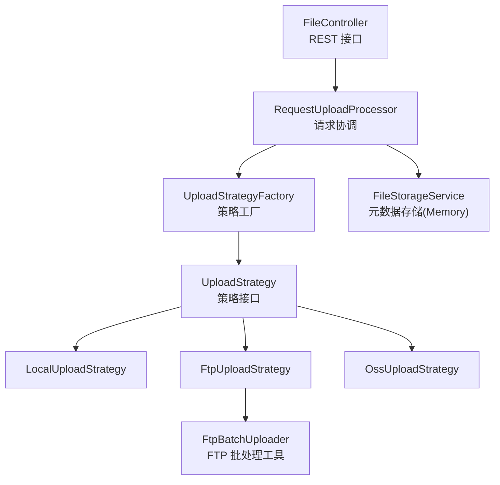
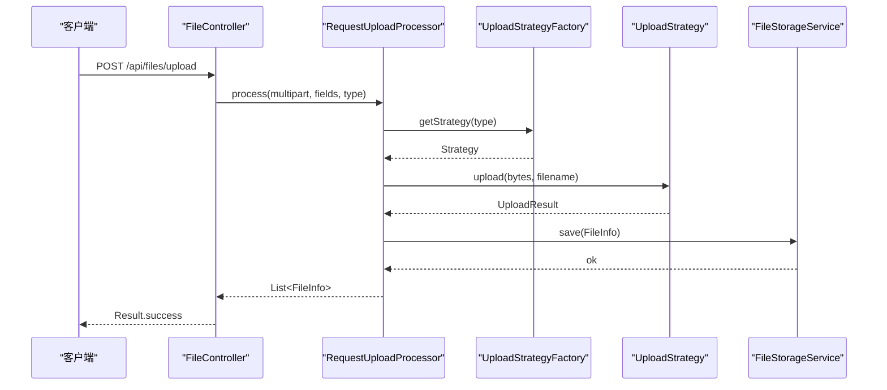
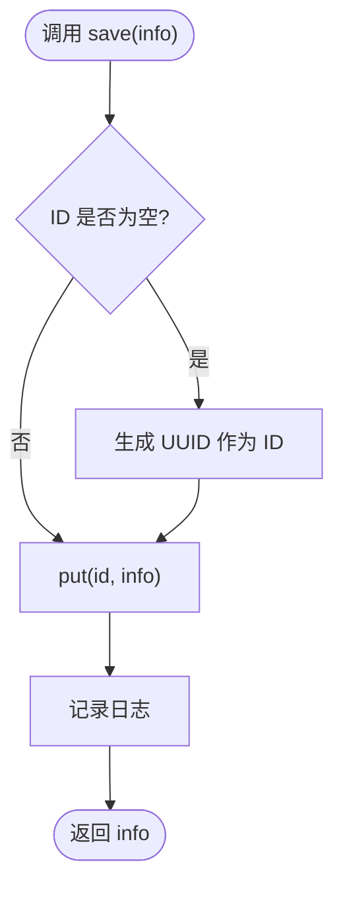
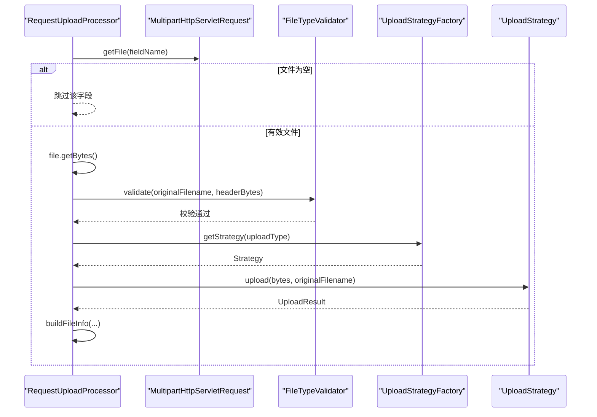
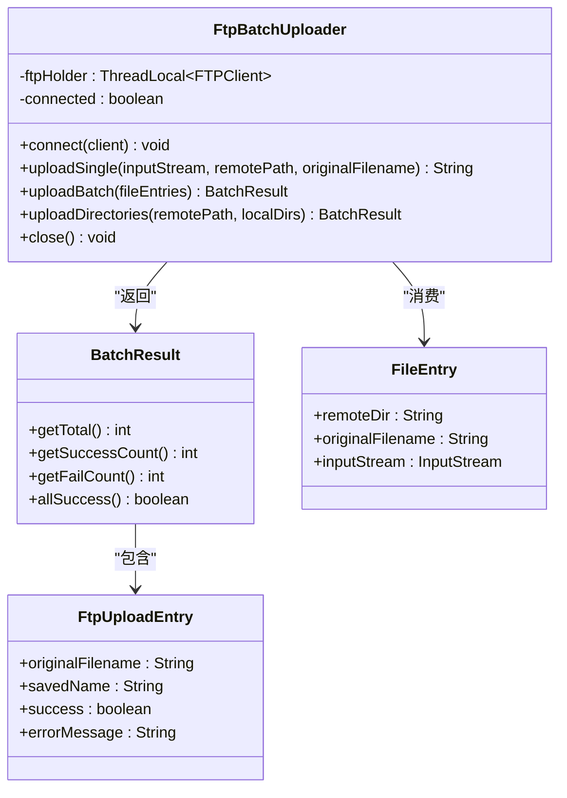
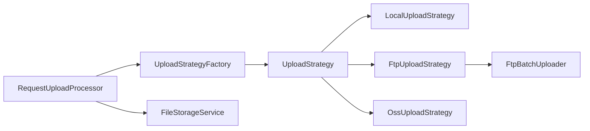

# 服务层（Service）

<cite>
**本文引用的文件**
- [FileStorageService.java](file://src/main/java/com/example/fileupload/service/FileStorageService.java)
- [RequestUploadProcessor.java](file://src/main/java/com/example/fileupload/service/RequestUploadProcessor.java)
- [FtpBatchUploader.java](file://src/main/java/com/example/fileupload/service/FtpBatchUploader.java)
- [UploadStrategy.java](file://src/main/java/com/example/fileupload/strategy/UploadStrategy.java)
- [UploadStrategyFactory.java](file://src/main/java/com/example/fileupload/strategy/UploadStrategyFactory.java)
- [FileInfo.java](file://src/main/java/com/example/fileupload/model/FileInfo.java)
- [UploadResult.java](file://src/main/java/com/example/fileupload/model/UploadResult.java)
- [UploadType.java](file://src/main/java/com/example/fileupload/enums/UploadType.java)
- [FileController.java](file://src/main/java/com/example/fileupload/controller/FileController.java)
- [application.yml](file://src/main/resources/application.yml)
</cite>

## 目录
1. [简介](#简介)
2. [项目结构](#项目结构)
3. [核心组件](#核心组件)
4. [架构总览](#架构总览)
5. [详细组件分析](#详细组件分析)
6. [依赖关系分析](#依赖关系分析)
7. [性能与并发特性](#性能与并发特性)
8. [配置说明](#配置说明)
9. [使用示例](#使用示例)
10. [监控指标](#监控指标)
11. [故障排查指南](#故障排查指南)
12. [结论](#结论)

## 简介
本文件面向服务层，聚焦以下三个关键组件：
- FileStorageService：内存中的文件元数据存储与检索（Mock），提供增删查改、模糊搜索与过滤能力。
- RequestUploadProcessor：请求协调门面，统一处理解析、校验、策略路由、结果组装等流程。
- FtpBatchUploader：FTP 批量上传工具，基于 ThreadLocal 复用连接，优化批处理性能与稳定性。

文档将深入解释各组件职责、协作模式、并发安全、异常恢复策略，并提供配置、使用示例、性能调优、监控与排障建议。

## 项目结构
服务层位于 service 包，配合 strategy 策略族与 model 数据模型，由 controller 暴露 REST API。配置文件在 application.yml 中集中管理。

图表来源
- [FileController.java:31-48](file://src/main/java/com/example/fileupload/controller/FileController.java#L31-L48)
- [RequestUploadProcessor.java:25-34](file://src/main/java/com/example/fileupload/service/RequestUploadProcessor.java#L25-L34)
- [UploadStrategyFactory.java:16-26](file://src/main/java/com/example/fileupload/strategy/UploadStrategyFactory.java#L16-L26)
- [UploadStrategy.java:10-73](file://src/main/java/com/example/fileupload/strategy/UploadStrategy.java#L10-L73)
- [FtpBatchUploader.java:17-23](file://src/main/java/com/example/fileupload/service/FtpBatchUploader.java#L17-L23)

章节来源
- [FileController.java:31-48](file://src/main/java/com/example/fileupload/controller/FileController.java#L31-L48)
- [application.yml:1-33](file://src/main/resources/application.yml#L1-L33)

## 核心组件
- FileStorageService：以 ConcurrentHashMap 为后端，提供线程安全的元数据存取；支持按名称模糊搜索、按存储类型或后缀过滤；启动时初始化 Mock 数据。
- RequestUploadProcessor：封装“读取字节 → 魔数校验 → 策略路由 → 结果封装”的完整流程；提供 upload/delete/download 的统一入口。
- FtpBatchUploader：通过 ThreadLocal 绑定 FTPClient，减少握手开销；提供单文件、批量、目录递归上传能力；内置错误分类与目录创建逻辑。

章节来源
- [FileStorageService.java:19-107](file://src/main/java/com/example/fileupload/service/FileStorageService.java#L19-L107)
- [RequestUploadProcessor.java:19-87](file://src/main/java/com/example/fileupload/service/RequestUploadProcessor.java#L19-L87)
- [FtpBatchUploader.java:17-124](file://src/main/java/com/example/fileupload/service/FtpBatchUploader.java#L17-L124)

## 架构总览
服务层采用“门面 + 策略 + 工具”的组合：
- 控制器仅关注 HTTP 输入输出，委托给 RequestUploadProcessor。
- 处理器根据 UploadType 经 UploadStrategyFactory 选择具体策略执行上传/下载/删除。
- FTP 场景下，策略内部可借助 FtpBatchUploader 复用连接进行批处理优化。
- 所有上传成功后，处理器构造 FileInfo 并交由 FileStorageService 持久化（当前为内存）。

图表来源
- [FileController.java:58-84](file://src/main/java/com/example/fileupload/controller/FileController.java#L58-L84)
- [RequestUploadProcessor.java:46-87](file://src/main/java/com/example/fileupload/service/RequestUploadProcessor.java#L46-L87)
- [UploadStrategyFactory.java:48-55](file://src/main/java/com/example/fileupload/strategy/UploadStrategyFactory.java#L48-L55)
- [UploadStrategy.java:15-33](file://src/main/java/com/example/fileupload/strategy/UploadStrategy.java#L15-L33)
- [FileStorageService.java:32-39](file://src/main/java/com/example/fileupload/service/FileStorageService.java#L32-L39)

## 详细组件分析

### FileStorageService：元数据存储管理
- 数据结构：ConcurrentHashMap<String, FileInfo>，保证多线程读写安全。
- 核心能力：
  - 保存：自动分配 ID（UUID 去横杠），记录 fileKey 等信息。
  - 查询：按 ID 查找、全量查询、模糊搜索文件名（originalFilename/pureFilename）、按 storageType/suffix 过滤。
  - 删除：按 ID 移除。
  - 初始化：@PostConstruct 注入 8 条 Mock 数据，便于演示与测试。
- 并发与事务：
  - 并发安全：ConcurrentHashMap 提供原子性 put/get/remove。
  - 事务：无跨操作事务；如需强一致，应替换为数据库并引入事务边界。
- 异常与恢复：
  - 正常路径不抛异常；清空用于测试。
- 复杂度：
  - 查找 O(1)，搜索 O(n)（内存遍历），适合中小规模数据。

图表来源
- [FileStorageService.java:32-39](file://src/main/java/com/example/fileupload/service/FileStorageService.java#L32-L39)

章节来源
- [FileStorageService.java:24-107](file://src/main/java/com/example/fileupload/service/FileStorageService.java#L24-L107)
- [FileStorageService.java:111-157](file://src/main/java/com/example/fileupload/service/FileStorageService.java#L111-L157)

### RequestUploadProcessor：请求协调流程
- 职责：
  - 解析 multipart 请求，跳过空字段。
  - 一次性读取字节，避免临时文件锁定问题。
  - 魔数校验：读取前若干字节进行类型验证。
  - 策略路由：通过 UploadStrategyFactory 获取对应策略执行上传。
  - 结果封装：构建 FileInfo 并返回。
  - 提供 delete/download 快捷方法。
- 并发与事务：
  - 无共享状态，线程安全。
  - 未包含跨步骤事务；若需“上传成功才落库”，应在上层（如 Controller）包裹事务。
- 异常与恢复：
  - 非法参数抛出 IllegalArgumentException。
  - IO 异常透传至调用方。

图表来源
- [RequestUploadProcessor.java:46-87](file://src/main/java/com/example/fileupload/service/RequestUploadProcessor.java#L46-L87)
- [UploadStrategyFactory.java:48-55](file://src/main/java/com/example/fileupload/strategy/UploadStrategyFactory.java#L48-L55)
- [UploadStrategy.java:15-33](file://src/main/java/com/example/fileupload/strategy/UploadStrategy.java#L15-L33)

章节来源
- [RequestUploadProcessor.java:19-152](file://src/main/java/com/example/fileupload/service/RequestUploadProcessor.java#L19-L152)

### FtpBatchUploader：批处理优化机制
- 设计要点：
  - ThreadLocal<FTPClient>：同线程内复用连接，减少 TCP/TLS 握手成本。
  - 连接管理：connect/getFtpClient 确保已连接；close 释放资源。
  - 上传能力：单文件、批量列表、目录递归扫描上传。
  - 健壮性：UTF-8 控制编码、被动模式、二进制传输、缓冲区优化、远程目录逐层创建、错误码分类。
- 并发与事务：
  - 线程隔离：ThreadLocal 保证每个线程独立连接，避免竞争。
  - 事务：无；失败条目不影响其他条目（批量中捕获异常继续）。
- 异常与恢复：
  - 连接/登录失败直接抛出异常。
  - 上传失败记录警告并收集错误信息，最终汇总 BatchResult。
  - 目录创建失败区分权限不足/路径无效等错误。

图表来源
- [FtpBatchUploader.java:23-31](file://src/main/java/com/example/fileupload/service/FtpBatchUploader.java#L23-L31)
- [FtpBatchUploader.java:92-124](file://src/main/java/com/example/fileupload/service/FtpBatchUploader.java#L92-L124)
- [FtpBatchUploader.java:272-313](file://src/main/java/com/example/fileupload/service/FtpBatchUploader.java#L272-L313)

章节来源
- [FtpBatchUploader.java:31-81](file://src/main/java/com/example/fileupload/service/FtpBatchUploader.java#L31-L81)
- [FtpBatchUploader.java:167-212](file://src/main/java/com/example/fileupload/service/FtpBatchUploader.java#L167-L212)
- [FtpBatchUploader.java:217-255](file://src/main/java/com/example/fileupload/service/FtpBatchUploader.java#L217-L255)
- [FtpBatchUploader.java:345-370](file://src/main/java/com/example/fileupload/service/FtpBatchUploader.java#L345-L370)

## 依赖关系分析
- RequestUploadProcessor 依赖 UploadStrategyFactory，后者维护 UploadType 到 UploadStrategy 的映射。
- UploadStrategy 定义统一接口，本地/FTP/OSS 分别实现；FTP 策略可组合 FtpBatchUploader 以获得批处理优化。
- FileStorageService 被 Controller 和 Processor 间接使用，负责元数据持久化（当前内存）。

图表来源
- [RequestUploadProcessor.java:25-34](file://src/main/java/com/example/fileupload/service/RequestUploadProcessor.java#L25-L34)
- [UploadStrategyFactory.java:16-26](file://src/main/java/com/example/fileupload/strategy/UploadStrategyFactory.java#L16-L26)
- [UploadStrategy.java:10-73](file://src/main/java/com/example/fileupload/strategy/UploadStrategy.java#L10-L73)
- [FtpBatchUploader.java:17-23](file://src/main/java/com/example/fileupload/service/FtpBatchUploader.java#L17-L23)

章节来源
- [UploadStrategyFactory.java:28-39](file://src/main/java/com/example/fileupload/strategy/UploadStrategyFactory.java#L28-L39)
- [UploadStrategy.java:57-73](file://src/main/java/com/example/fileupload/strategy/UploadStrategy.java#L57-L73)

## 性能与并发特性
- 内存存储（FileStorageService）
  - 读多写少场景下，ConcurrentHashMap 提供高并发访问；搜索为线性扫描，数据量大时应迁移至数据库并建立索引。
- 请求处理（RequestUploadProcessor）
  - 一次性读取字节避免临时文件锁；魔数校验提升安全性；策略解耦便于扩展。
- FTP 批处理（FtpBatchUploader）
  - ThreadLocal 复用连接显著降低握手开销；被动模式与 UTF-8 控制编码提升兼容性与中文支持；二进制模式避免文本/图片损坏；大缓冲提升吞吐。
- 并发安全
  - 无全局可变状态；FTP 连接按线程隔离；批量上传失败不中断整体流程。

[本节为通用性能讨论，无需特定文件引用]

## 配置说明
- Spring 多部分上传限制：max-file-size、max-request-size。
- 本地存储根路径：file.upload.base-path。
- FTP：host、port、username、password、basePath。
- OSS（MinIO）：endpoint、access-key、secret-key、bucket-name、base-path、url-prefix。
- 日志级别：com.example.fileupload 设为 DEBUG。

章节来源
- [application.yml:4-33](file://src/main/resources/application.yml#L4-L33)

## 使用示例
- 单文件上传
  - 端点：POST /api/files/upload?uploadType=local&uploadedBy=system
  - 表单字段：file（multipart/form-data）
  - 行为：处理器校验后走策略上传，再保存元数据。
- 批量上传（FTP/OSS）
  - 端点：POST /api/files/upload/batch?uploadType=ftp
  - 表单字段：files（多个文件）
  - 行为：策略 batchUpload 复用连接（FTP）或逐个上传（OSS）。
- 下载
  - 端点：GET /api/files/download?fileKey=xxx&uploadType=local
  - 行为：按策略下载并设置响应头。
- 删除
  - 端点：DELETE /api/files/{id}?uploadType=local
  - 行为：先删底层存储，再清元数据。
- 查询
  - 端点：GET /api/files?page=1&size=20&keyword=banner&storageType=local&suffix=.png
  - 行为：内存过滤+分页。
- Mock 数据
  - 端点：POST /api/files/mock/init
  - 行为：清空并重新初始化 8 条样例。

章节来源
- [FileController.java:58-133](file://src/main/java/com/example/fileupload/controller/FileController.java#L58-L133)
- [FileController.java:163-194](file://src/main/java/com/example/fileupload/controller/FileController.java#L163-L194)
- [FileController.java:203-227](file://src/main/java/com/example/fileupload/controller/FileController.java#L203-L227)
- [FileController.java:236-292](file://src/main/java/com/example/fileupload/controller/FileController.java#L236-L292)
- [FileController.java:302-317](file://src/main/java/com/example/fileupload/controller/FileController.java#L302-L317)

## 监控指标
建议在日志与外部监控系统采集以下指标：
- 上传成功率/失败率：按 uploadType 维度统计。
- 平均/分位耗时：process/upload/download 耗时分布。
- 文件大小分布：原始大小、存储后大小。
- FTP 连接状态：连接次数、断开次数、重试次数。
- 存储类型占比：local/ftp/oss 比例。
- 错误码分布：FTP 回复码分类计数。
- 内存占用：元数据条目数、堆使用趋势。

[本节为通用监控建议，无需特定文件引用]

## 故障排查指南
- 上传失败
  - 检查 multipart 配置与 max-file-size。
  - 查看处理器日志：是否跳过空字段、魔数校验失败。
  - 策略层异常：确认 UploadType 与策略实现匹配。
- FTP 连接/上传失败
  - 连接失败：检查 host/port/用户名密码；查看 connect 日志。
  - 权限/路径错误：留意 classifyFtpError 的分类提示（550/553/421/425/426/552）。
  - 中文乱码：确认 setControlEncoding("UTF-8") 生效。
  - 大数据传输：检查缓冲区与被动模式配置。
- 删除失败
  - 先确认底层存储是否存在；再检查权限与路径。
- 查询慢
  - 内存全表扫描在大数量下较慢，建议迁移数据库并加索引。

章节来源
- [FtpBatchUploader.java:47-81](file://src/main/java/com/example/fileupload/service/FtpBatchUploader.java#L47-L81)
- [FtpBatchUploader.java:195-212](file://src/main/java/com/example/fileupload/service/FtpBatchUploader.java#L195-L212)
- [FileController.java:203-227](file://src/main/java/com/example/fileupload/controller/FileController.java#L203-L227)

## 结论
- FileStorageService 提供了轻量、线程安全的内存元数据存储，适合演示与小型场景；生产环境建议替换为数据库并引入事务。
- RequestUploadProcessor 作为门面，屏蔽了复杂流程细节，使控制器保持简洁；通过策略模式轻松扩展新的存储后端。
- FtpBatchUploader 通过 ThreadLocal 复用连接、完善的错误分类与目录创建逻辑，显著提升 FTP 批处理的性能与鲁棒性。
- 结合合理的配置、监控与排障手段，可在不同规模下稳定运行。

[本节为总结性内容，无需特定文件引用]