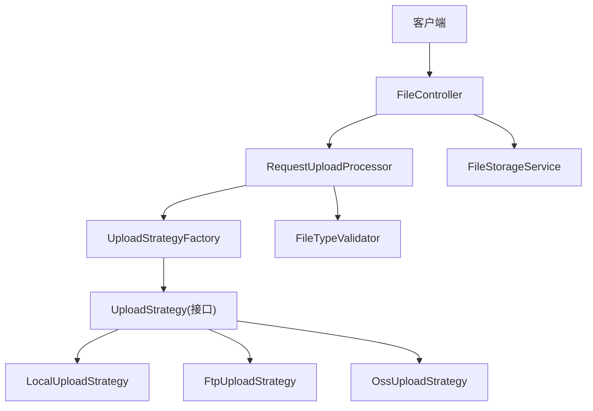
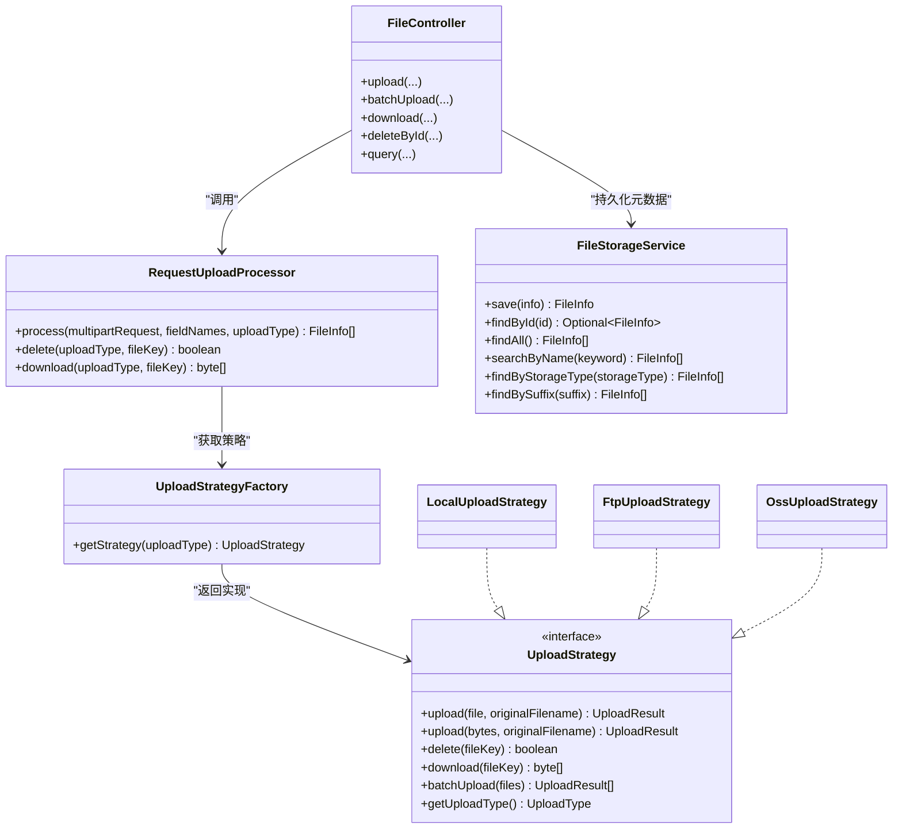
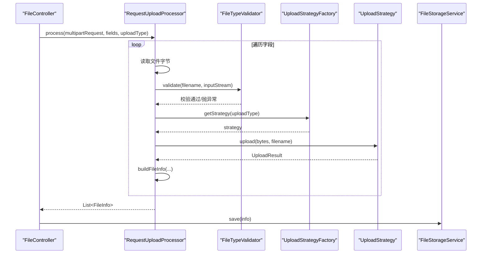
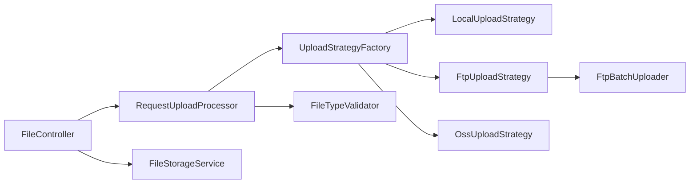

# 请求上传处理器（RequestUploadProcessor）

<cite>
**本文引用的文件列表**
- [RequestUploadProcessor.java](file://src/main/java/com/example/fileupload/service/RequestUploadProcessor.java)
- [UploadStrategyFactory.java](file://src/main/java/com/example/fileupload/strategy/UploadStrategyFactory.java)
- [FileStorageService.java](file://src/main/java/com/example/fileupload/service/FileStorageService.java)
- [FileController.java](file://src/main/java/com/example/fileupload/controller/FileController.java)
- [UploadStrategy.java](file://src/main/java/com/example/fileupload/strategy/UploadStrategy.java)
- [LocalUploadStrategy.java](file://src/main/java/com/example/fileupload/strategy/LocalUploadStrategy.java)
- [FtpUploadStrategy.java](file://src/main/java/com/example/fileupload/strategy/FtpUploadStrategy.java)
- [OssUploadStrategy.java](file://src/main/java/com/example/fileupload/strategy/OssUploadStrategy.java)
- [FileTypeValidator.java](file://src/main/java/com/example/fileupload/util/FileTypeValidator.java)
- [UploadType.java](file://src/main/java/com/example/fileupload/enums/UploadType.java)
- [FileInfo.java](file://src/main/java/com/example/fileupload/model/FileInfo.java)
- [UploadResult.java](file://src/main/java/com/example/fileupload/model/UploadResult.java)
- [FtpBatchUploader.java](file://src/main/java/com/example/fileupload/service/FtpBatchUploader.java)
- [application.yml](file://src/main/resources/application.yml)
</cite>

## 目录
1. [简介](#简介)
2. [项目结构](#项目结构)
3. [核心组件](#核心组件)
4. [架构总览](#架构总览)
5. [详细组件分析](#详细组件分析)
6. [依赖关系分析](#依赖关系分析)
7. [性能与优化](#性能与优化)
8. [故障排查指南](#故障排查指南)
9. [结论](#结论)
10. [附录：配置与使用示例](#附录配置与使用示例)

## 简介
本文件围绕 RequestUploadProcessor 展开，系统性说明其在“请求解析 → 类型校验 → 策略路由 → 结果组装”的完整处理链路。文档重点解释策略模式的应用、参数验证与类型检查、存储策略选择机制，以及与 FileStorageService、UploadStrategyFactory 的协作关系；同时覆盖批量上传、错误恢复、事务边界、监控调试与常见问题解决方案，并提供面向不同技术水平的实现细节与集成指导。

## 项目结构
- 控制器层：接收 HTTP 请求并委派给处理器
- 服务层：统一编排上传流程（RequestUploadProcessor）、元数据持久化（FileStorageService）
- 策略层：多存储后端抽象与实现（UploadStrategy 及 Local/Ftp/Oss 实现）
- 工具层：文件类型校验（FileTypeValidator）
- 枚举与模型：UploadType、FileInfo、UploadResult
- 配置：application.yml 定义本地路径、FTP、MinIO 等参数

图表来源
- [FileController.java:58-133](file://src/main/java/com/example/fileupload/controller/FileController.java#L58-L133)
- [RequestUploadProcessor.java:46-86](file://src/main/java/com/example/fileupload/service/RequestUploadProcessor.java#L46-L86)
- [UploadStrategyFactory.java:28-55](file://src/main/java/com/example/fileupload/strategy/UploadStrategyFactory.java#L28-L55)
- [UploadStrategy.java:13-73](file://src/main/java/com/example/fileupload/strategy/UploadStrategy.java#L13-L73)
- [LocalUploadStrategy.java:27-118](file://src/main/java/com/example/fileupload/strategy/LocalUploadStrategy.java#L27-L118)
- [FtpUploadStrategy.java:37-193](file://src/main/java/com/example/fileupload/strategy/FtpUploadStrategy.java#L37-L193)
- [OssUploadStrategy.java:30-159](file://src/main/java/com/example/fileupload/strategy/OssUploadStrategy.java#L30-L159)
- [FileStorageService.java:19-107](file://src/main/java/com/example/fileupload/service/FileStorageService.java#L19-L107)

章节来源
- [application.yml:1-33](file://src/main/resources/application.yml#L1-L33)

## 核心组件
- RequestUploadProcessor：门面式处理器，负责单/多文件上传的统一编排、类型校验、策略路由与结果封装。
- UploadStrategyFactory：自动注册所有 UploadStrategy 实现，按 UploadType 路由到具体策略。
- UploadStrategy：上传策略接口，定义 upload、delete、download、batchUpload 等能力。
- LocalUploadStrategy / FtpUploadStrategy / OssUploadStrategy：分别实现本地磁盘、FTP、对象存储的具体逻辑。
- FileTypeValidator：后缀白名单 + 魔数校验，确保上传文件类型安全。
- FileStorageService：内存 Mock 的文件元数据存储，提供保存、查询、过滤等功能。
- FileController：REST 接口入口，协调处理器与存储服务，暴露上传、下载、删除、查询等端点。

章节来源
- [RequestUploadProcessor.java:25-153](file://src/main/java/com/example/fileupload/service/RequestUploadProcessor.java#L25-L153)
- [UploadStrategyFactory.java:16-55](file://src/main/java/com/example/fileupload/strategy/UploadStrategyFactory.java#L16-L55)
- [UploadStrategy.java:13-73](file://src/main/java/com/example/fileupload/strategy/UploadStrategy.java#L13-L73)
- [LocalUploadStrategy.java:27-118](file://src/main/java/com/example/fileupload/strategy/LocalUploadStrategy.java#L27-L118)
- [FtpUploadStrategy.java:37-193](file://src/main/java/com/example/fileupload/strategy/FtpUploadStrategy.java#L37-L193)
- [OssUploadStrategy.java:30-159](file://src/main/java/com/example/fileupload/strategy/OssUploadStrategy.java#L30-L159)
- [FileTypeValidator.java:12-109](file://src/main/java/com/example/fileupload/util/FileTypeValidator.java#L12-L109)
- [FileStorageService.java:19-107](file://src/main/java/com/example/fileupload/service/FileStorageService.java#L19-L107)
- [FileController.java:31-319](file://src/main/java/com/example/fileupload/controller/FileController.java#L31-L319)

## 架构总览
系统采用“控制器 → 处理器 → 策略工厂 → 策略实现”的分层设计，结合“门面模式”将复杂流程收敛至 RequestUploadProcessor。通过策略模式解耦不同存储后端，便于扩展新的存储方式。

图表来源
- [RequestUploadProcessor.java:25-153](file://src/main/java/com/example/fileupload/service/RequestUploadProcessor.java#L25-L153)
- [UploadStrategyFactory.java:16-55](file://src/main/java/com/example/fileupload/strategy/UploadStrategyFactory.java#L16-L55)
- [UploadStrategy.java:13-73](file://src/main/java/com/example/fileupload/strategy/UploadStrategy.java#L13-L73)
- [LocalUploadStrategy.java:27-118](file://src/main/java/com/example/fileupload/strategy/LocalUploadStrategy.java#L27-L118)
- [FtpUploadStrategy.java:37-193](file://src/main/java/com/example/fileupload/strategy/FtpUploadStrategy.java#L37-L193)
- [OssUploadStrategy.java:30-159](file://src/main/java/com/example/fileupload/strategy/OssUploadStrategy.java#L30-L159)
- [FileStorageService.java:19-107](file://src/main/java/com/example/fileupload/service/FileStorageService.java#L19-L107)
- [FileController.java:31-319](file://src/main/java/com/example/fileupload/controller/FileController.java#L31-L319)

## 详细组件分析

### RequestUploadProcessor：请求协调与业务编排
- 职责
  - 解析 MultipartHttpServletRequest，遍历字段名提取文件
  - 读取字节内容，避免重复锁定临时文件
  - 执行 FileTypeValidator 进行后缀白名单与魔数校验
  - 通过 UploadStrategyFactory 获取对应策略执行上传
  - 将 UploadResult 封装为 FileInfo，记录元数据
  - 提供 delete/download 方法，委托策略实现
- 关键流程
  - process：循环处理每个字段，跳过空文件；校验通过后调用策略 upload(bytes, filename)
  - buildFileInfo：生成唯一 ID、纯文件名、后缀、大小、MIME、存储类型、fileKey、路径、MD5、上传者、时间等
- 异常处理
  - 空文件或无有效文件时抛出 IllegalArgumentException
  - 校验失败抛出不合法参数异常
  - 日志记录警告与调试信息

图表来源
- [RequestUploadProcessor.java:46-86](file://src/main/java/com/example/fileupload/service/RequestUploadProcessor.java#L46-L86)
- [FileTypeValidator.java:47-85](file://src/main/java/com/example/fileupload/util/FileTypeValidator.java#L47-L85)
- [UploadStrategyFactory.java:48-55](file://src/main/java/com/example/fileupload/strategy/UploadStrategyFactory.java#L48-L55)
- [UploadStrategy.java:22-33](file://src/main/java/com/example/fileupload/strategy/UploadStrategy.java#L22-L33)
- [FileController.java:58-84](file://src/main/java/com/example/fileupload/controller/FileController.java#L58-L84)

章节来源
- [RequestUploadProcessor.java:25-153](file://src/main/java/com/example/fileupload/service/RequestUploadProcessor.java#L25-L153)
- [FileTypeValidator.java:12-109](file://src/main/java/com/example/fileupload/util/FileTypeValidator.java#L12-L109)
- [UploadStrategyFactory.java:16-55](file://src/main/java/com/example/fileupload/strategy/UploadStrategyFactory.java#L16-L55)
- [UploadStrategy.java:13-73](file://src/main/java/com/example/fileupload/strategy/UploadStrategy.java#L13-L73)
- [FileController.java:58-84](file://src/main/java/com/example/fileupload/controller/FileController.java#L58-L84)

### UploadStrategyFactory：策略路由与注册
- 自动收集所有 UploadStrategy 实现，构建并发 Map
- PostConstruct 阶段完成注册，检测重复类型并抛出异常
- getStrategy 根据 UploadType 返回具体策略，未找到则抛出不合法参数异常

章节来源
- [UploadStrategyFactory.java:16-55](file://src/main/java/com/example/fileupload/strategy/UploadStrategyFactory.java#L16-L55)
- [UploadType.java:6-35](file://src/main/java/com/example/fileupload/enums/UploadType.java#L6-L35)

### 存储策略实现
- LocalUploadStrategy
  - 支持上传、下载、删除；生成不冲突文件名；计算相对路径；写入本地磁盘
  - 初始化时解析 basePath，兼容根目录与相对路径
- FtpUploadStrategy
  - 单文件上传走独立连接；批量上传复用同一 FTPClient 连接（通过 FtpBatchUploader）
  - 解决乱码、被动模式、二进制传输、目录创建、权限错误分类
- OssUploadStrategy
  - 基于 MinIO SDK；启动时确保 bucket 存在；支持上传、下载、删除
  - URL 前缀可配置，便于反向代理访问

章节来源
- [LocalUploadStrategy.java:27-189](file://src/main/java/com/example/fileupload/strategy/LocalUploadStrategy.java#L27-L189)
- [FtpUploadStrategy.java:37-361](file://src/main/java/com/example/fileupload/strategy/FtpUploadStrategy.java#L37-L361)
- [OssUploadStrategy.java:30-217](file://src/main/java/com/example/fileupload/strategy/OssUploadStrategy.java#L30-L217)
- [FtpBatchUploader.java:23-372](file://src/main/java/com/example/fileupload/service/FtpBatchUploader.java#L23-L372)

### FileStorageService：元数据持久化（Mock）
- 使用 ConcurrentHashMap 模拟数据库，提供保存、查找、删除、搜索、过滤
- 启动时初始化 Mock 数据，便于演示与测试
- 在真实项目中应替换为 MySQL/MongoDB 等持久化层

章节来源
- [FileStorageService.java:19-184](file://src/main/java/com/example/fileupload/service/FileStorageService.java#L19-L184)

### FileController：API 入口与事务边界
- 上传接口：校验 multipart 请求，调用 processor.process，保存元数据
- 批量上传接口：直接调用策略的 batchUpload，逐个保存元数据
- 下载接口：通过 processor.download 获取字节流，设置响应头
- 删除接口：先删除底层存储，再清除元数据
- 查询接口：支持分页、关键词、存储类型、后缀过滤

章节来源
- [FileController.java:31-319](file://src/main/java/com/example/fileupload/controller/FileController.java#L31-L319)

## 依赖关系分析
- RequestUploadProcessor 依赖 UploadStrategyFactory 与 FileTypeValidator
- UploadStrategyFactory 依赖所有 UploadStrategy 实现
- FileController 依赖 RequestUploadProcessor、FileStorageService、UploadStrategyFactory
- FtpUploadStrategy 依赖 FtpBatchUploader 进行批量上传优化

图表来源
- [FileController.java:31-319](file://src/main/java/com/example/fileupload/controller/FileController.java#L31-L319)
- [RequestUploadProcessor.java:25-153](file://src/main/java/com/example/fileupload/service/RequestUploadProcessor.java#L25-L153)
- [UploadStrategyFactory.java:16-55](file://src/main/java/com/example/fileupload/strategy/UploadStrategyFactory.java#L16-L55)
- [LocalUploadStrategy.java:27-189](file://src/main/java/com/example/fileupload/strategy/LocalUploadStrategy.java#L27-L189)
- [FtpUploadStrategy.java:37-361](file://src/main/java/com/example/fileupload/strategy/FtpUploadStrategy.java#L37-L361)
- [OssUploadStrategy.java:30-217](file://src/main/java/com/example/fileupload/strategy/OssUploadStrategy.java#L30-L217)
- [FtpBatchUploader.java:23-372](file://src/main/java/com/example/fileupload/service/FtpBatchUploader.java#L23-L372)

章节来源
- [application.yml:1-33](file://src/main/resources/application.yml#L1-L33)

## 性能与优化
- 避免重复读取临时文件：RequestUploadProcessor 一次性读取字节数组，减少 Windows+Tomcat 下临时文件锁定问题
- 批量上传优化：FtpUploadStrategy 的 batchUpload 复用同一 FTPClient 连接，降低 TCP/TLS 握手开销
- 预计算 MD5：批量上传前预先计算 MD5，避免重复计算
- 目录创建与权限处理：FTP 策略中逐级创建目录并分类错误码，提升健壮性
- 内存占用控制：下载与上传尽量使用流式处理，避免大文件全量驻留内存

[本节为通用性能讨论，无需特定文件引用]

## 故障排查指南
- 常见错误与定位
  - 非法参数：未找到策略或上传类型不支持，检查 UploadType.fromCode 与策略注册
  - 文件为空或太小：校验失败，检查前端传参与服务端 max-file-size 配置
  - FTP 连接失败：检查 host/port/username/password/basePath 配置与防火墙/被动模式
  - 权限不足：FTP 服务器目录权限或路径无效，查看错误码分类与日志
  - 对象存储不可用：MinIO 未运行或凭据错误，检查 endpoint/access-key/secret-key/bucket-name
- 日志与调试
  - 启用 DEBUG 级别日志，关注各策略的上传/下载/删除日志
  - 使用 application.yml 中的 logging.level 调整输出
  - 通过 FileStorageService 的 mock 接口快速验证查询与过滤功能

章节来源
- [application.yml:30-33](file://src/main/resources/application.yml#L30-L33)
- [FtpUploadStrategy.java:206-359](file://src/main/java/com/example/fileupload/strategy/FtpUploadStrategy.java#L206-L359)
- [OssUploadStrategy.java:54-76](file://src/main/java/com/example/fileupload/strategy/OssUploadStrategy.java#L54-L76)
- [FileController.java:78-83](file://src/main/java/com/example/fileupload/controller/FileController.java#L78-L83)

## 结论
RequestUploadProcessor 作为统一入口，将复杂的上传流程收敛为清晰的编排步骤：解析、校验、路由、执行、封装。配合策略模式与工厂类，系统具备良好的可扩展性与可维护性。通过批量上传优化、错误分类与日志记录，提升了稳定性与可观测性。建议在真实项目中将 FileStorageService 替换为持久化层，并根据业务需求扩展更多存储策略。

[本节为总结性内容，无需特定文件引用]

## 附录：配置与使用示例

### 配置选项（application.yml）
- 本地存储：file.upload.base-path
- FTP：file.ftp.host/port/username/password/basePath
- 对象存储：file.oss.endpoint/access-key/secret-key/bucket-name/base-path/url-prefix
- 文件大小限制：spring.servlet.multipart.max-file-size/max-request-size

章节来源
- [application.yml:1-33](file://src/main/resources/application.yml#L1-L33)

### 使用示例（API）
- 单文件上传：POST /api/files/upload?uploadType=local&uploadedBy=system，表单字段 file
- 批量上传：POST /api/files/upload/batch?uploadType=ftp&uploadedBy=system，表单字段 files（多个）
- 下载：GET /api/files/download?fileKey=xxx&uploadType=local
- 删除：DELETE /api/files/{id}?uploadType=local
- 查询：GET /api/files?page=1&size=20&keyword=banner&storageType=local&suffix=.png
- Mock 数据：POST /api/files/mock/init，GET /api/files/mock/count

章节来源
- [FileController.java:58-319](file://src/main/java/com/example/fileupload/controller/FileController.java#L58-L319)

### 集成指南
- 新增存储策略
  - 实现 UploadStrategy 接口，标注 @Component
  - 在 UploadStrategyFactory 自动注册后，可通过 UploadType 路由
- 替换元数据存储
  - 将 FileStorageService 的实现替换为数据库持久化层
- 监控与告警
  - 基于日志框架采集关键指标（上传成功/失败、耗时、错误码）
  - 对 FTP/MinIO 连接建立失败、权限错误等进行告警

章节来源
- [UploadStrategy.java:13-73](file://src/main/java/com/example/fileupload/strategy/UploadStrategy.java#L13-L73)
- [UploadStrategyFactory.java:28-55](file://src/main/java/com/example/fileupload/strategy/UploadStrategyFactory.java#L28-L55)
- [FileStorageService.java:19-184](file://src/main/java/com/example/fileupload/service/FileStorageService.java#L19-L184)