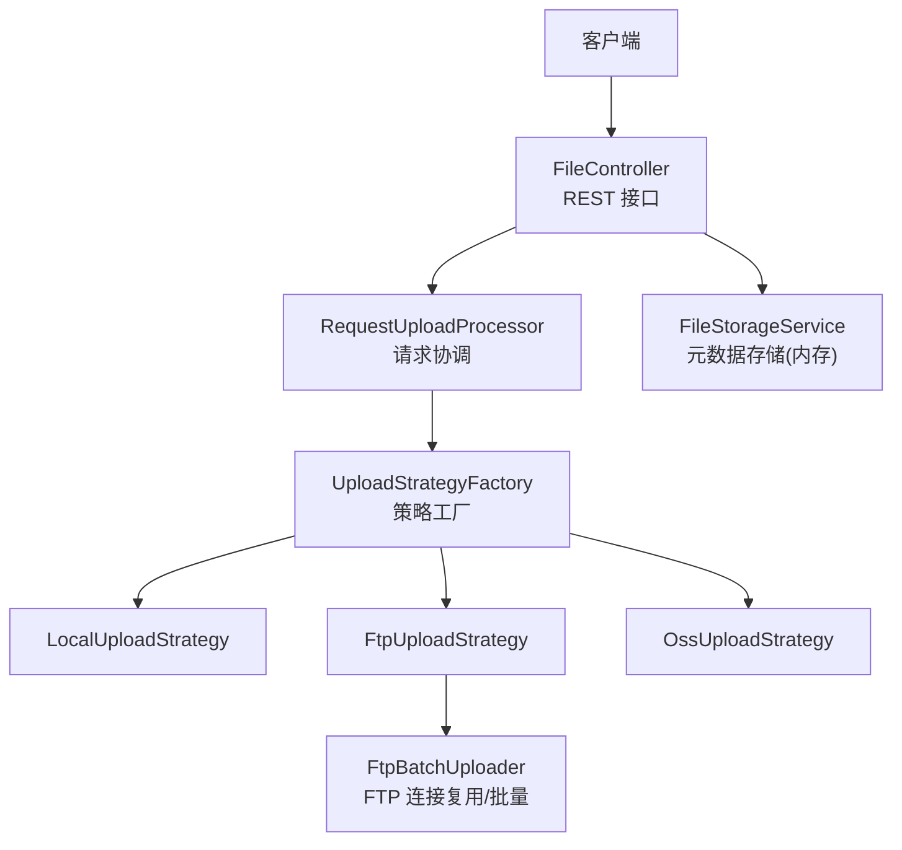
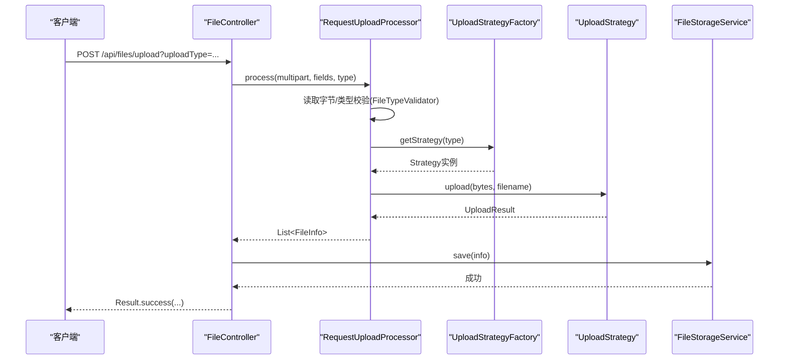
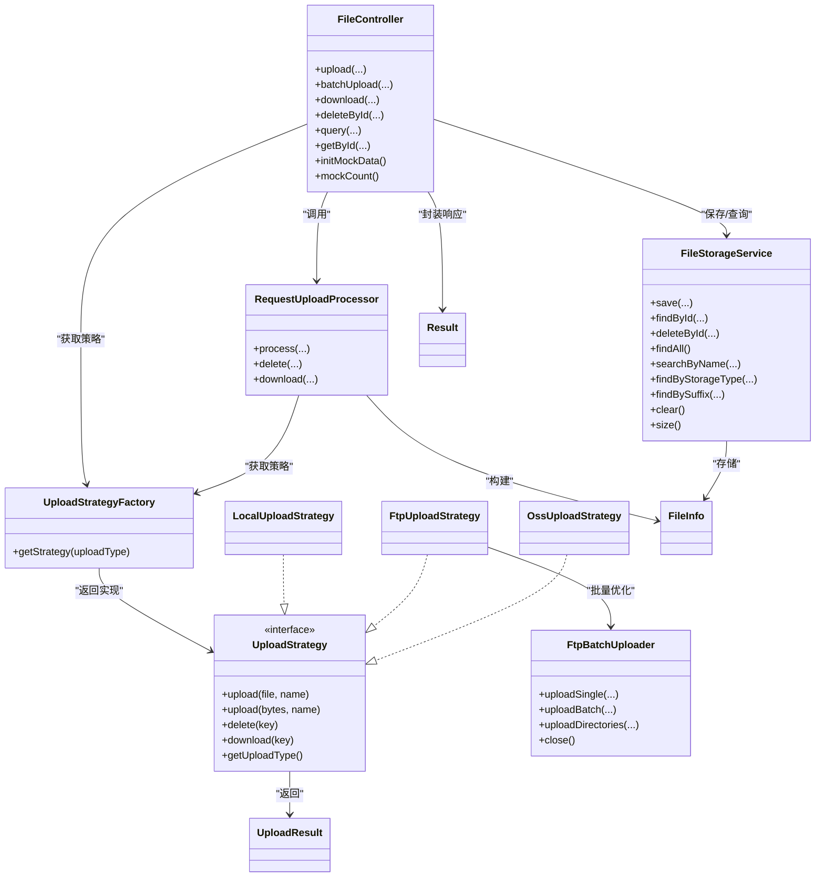
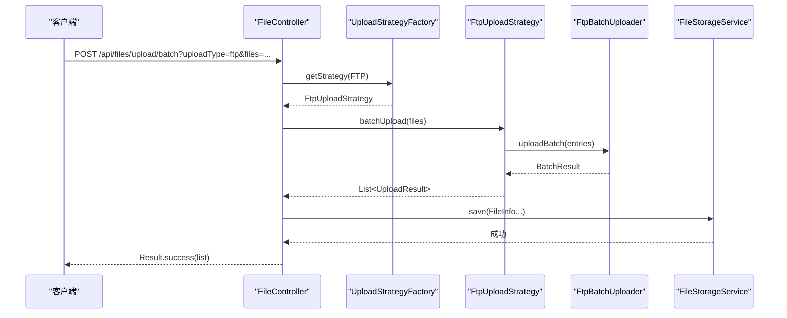

# 核心模块详解

<cite>
**本文引用的文件**
- [FileController.java](file://src/main/java/com/example/fileupload/controller/FileController.java)
- [RequestUploadProcessor.java](file://src/main/java/com/example/fileupload/service/RequestUploadProcessor.java)
- [FileStorageService.java](file://src/main/java/com/example/fileupload/service/FileStorageService.java)
- [FtpBatchUploader.java](file://src/main/java/com/example/fileupload/service/FtpBatchUploader.java)
- [UploadStrategyFactory.java](file://src/main/java/com/example/fileupload/strategy/UploadStrategyFactory.java)
- [FtpUploadStrategy.java](file://src/main/java/com/example/fileupload/strategy/FtpUploadStrategy.java)
- [LocalUploadStrategy.java](file://src/main/java/com/example/fileupload/strategy/LocalUploadStrategy.java)
- [OssUploadStrategy.java](file://src/main/java/com/example/fileupload/strategy/OssUploadStrategy.java)
- [FileTypeValidator.java](file://src/main/java/com/example/fileupload/util/FileTypeValidator.java)
- [FileInfo.java](file://src/main/java/com/example/fileupload/model/FileInfo.java)
- [UploadResult.java](file://src/main/java/com/example/fileupload/model/UploadResult.java)
- [Result.java](file://src/main/java/com/example/fileupload/model/Result.java)
- [UploadType.java](file://src/main/java/com/example/fileupload/enums/UploadType.java)
- [application.yml](file://src/main/resources/application.yml)
</cite>

## 目录
1. [简介](#简介)
2. [项目结构](#项目结构)
3. [核心组件](#核心组件)
4. [架构总览](#架构总览)
5. [详细组件分析](#详细组件分析)
6. [依赖关系分析](#依赖关系分析)
7. [性能与优化](#性能与优化)
8. [故障排查指南](#故障排查指南)
9. [结论](#结论)
10. [附录：配置与使用模式](#附录配置与使用模式)

## 简介
本仓库实现了一个基于 Spring Boot 的文件上传服务，支持本地磁盘、FTP、MinIO（对象存储）三种后端。通过策略模式将不同存储后端的实现解耦，由工厂根据请求中的 uploadType 动态路由到对应策略。控制器暴露统一的 REST API，负责参数校验、流程编排与结果封装；处理器协调类型校验、策略调用与结果组装；存储服务以内存方式维护元数据（可替换为数据库）。

## 项目结构
- controller：REST 接口层，统一入口
- service：业务处理与工具类（请求处理、FTP 批处理、元数据存储）
- strategy：策略接口与具体实现（local/ftp/oss）
- util：通用工具（文件类型校验）
- model：数据传输模型（FileInfo、UploadResult、Result）
- enums：枚举（UploadType）
- resources：应用配置（application.yml）

图表来源
- [FileController.java:31-48](file://src/main/java/com/example/fileupload/controller/FileController.java#L31-L48)
- [RequestUploadProcessor.java:25-34](file://src/main/java/com/example/fileupload/service/RequestUploadProcessor.java#L25-L34)
- [UploadStrategyFactory.java:16-26](file://src/main/java/com/example/fileupload/strategy/UploadStrategyFactory.java#L16-L26)
- [FtpUploadStrategy.java:36-55](file://src/main/java/com/example/fileupload/strategy/FtpUploadStrategy.java#L36-L55)
- [LocalUploadStrategy.java:26-35](file://src/main/java/com/example/fileupload/strategy/LocalUploadStrategy.java#L26-L35)
- [OssUploadStrategy.java:29-50](file://src/main/java/com/example/fileupload/strategy/OssUploadStrategy.java#L29-L50)
- [FtpBatchUploader.java:23-29](file://src/main/java/com/example/fileupload/service/FtpBatchUploader.java#L23-L29)
- [FileStorageService.java:19-25](file://src/main/java/com/example/fileupload/service/FileStorageService.java#L19-L25)

章节来源
- [FileController.java:31-48](file://src/main/java/com/example/fileupload/controller/FileController.java#L31-L48)
- [application.yml:1-33](file://src/main/resources/application.yml#L1-L33)

## 核心组件
- FileController：提供上传、下载、删除、查询、Mock 初始化等 REST 端点，负责参数校验、异常捕获与响应封装。
- RequestUploadProcessor：门面式处理器，封装“解析 → 校验 → 路由 → 组装”的完整流程。
- UploadStrategyFactory：自动注册并缓存策略，按 UploadType 返回具体实现。
- LocalUploadStrategy / FtpUploadStrategy / OssUploadStrategy：分别实现本地磁盘、FTP、MinIO 的上传/下载/删除。
- FtpBatchUploader：FTP 批处理工具，ThreadLocal 复用 FTPClient，减少握手开销。
- FileStorageService：内存 Map 存储 FileInfo，支持增删查改、模糊搜索、分页过滤。
- FileTypeValidator：后缀白名单 + 魔数校验，防止伪造文件类型。
- 模型：FileInfo（持久化元数据）、UploadResult（策略返回结果）、Result（统一响应体）。

章节来源
- [FileController.java:50-133](file://src/main/java/com/example/fileupload/controller/FileController.java#L50-L133)
- [RequestUploadProcessor.java:46-87](file://src/main/java/com/example/fileupload/service/RequestUploadProcessor.java#L46-L87)
- [UploadStrategyFactory.java:28-55](file://src/main/java/com/example/fileupload/strategy/UploadStrategyFactory.java#L28-L55)
- [LocalUploadStrategy.java:63-118](file://src/main/java/com/example/fileupload/strategy/LocalUploadStrategy.java#L63-L118)
- [FtpUploadStrategy.java:58-186](file://src/main/java/com/example/fileupload/strategy/FtpUploadStrategy.java#L58-L186)
- [OssUploadStrategy.java:78-159](file://src/main/java/com/example/fileupload/strategy/OssUploadStrategy.java#L78-L159)
- [FtpBatchUploader.java:92-163](file://src/main/java/com/example/fileupload/service/FtpBatchUploader.java#L92-L163)
- [FileStorageService.java:29-107](file://src/main/java/com/example/fileupload/service/FileStorageService.java#L29-L107)
- [FileTypeValidator.java:41-85](file://src/main/java/com/example/fileupload/util/FileTypeValidator.java#L41-L85)

## 架构总览
系统采用分层+策略模式：
- 控制层：接收 HTTP 请求，参数校验，调用处理器或策略。
- 处理层：统一编排流程，委托策略执行具体 IO。
- 存储层：多后端策略实现，屏蔽差异。
- 元数据层：内存存储（可扩展为数据库），记录文件元信息。

图表来源
- [FileController.java:58-84](file://src/main/java/com/example/fileupload/controller/FileController.java#L58-L84)
- [RequestUploadProcessor.java:46-87](file://src/main/java/com/example/fileupload/service/RequestUploadProcessor.java#L46-L87)
- [UploadStrategyFactory.java:48-55](file://src/main/java/com/example/fileupload/strategy/UploadStrategyFactory.java#L48-L55)
- [LocalUploadStrategy.java:63-84](file://src/main/java/com/example/fileupload/strategy/LocalUploadStrategy.java#L63-L84)
- [FtpUploadStrategy.java:58-74](file://src/main/java/com/example/fileupload/strategy/FtpUploadStrategy.java#L58-L74)
- [OssUploadStrategy.java:78-110](file://src/main/java/com/example/fileupload/strategy/OssUploadStrategy.java#L78-L110)
- [FileStorageService.java:29-39](file://src/main/java/com/example/fileupload/service/FileStorageService.java#L29-L39)

## 详细组件分析

### FileController 控制器
职责
- 接收 multipart/form-data 请求，解析 uploadType、uploadedBy 等参数。
- 单文件上传：调用 RequestUploadProcessor.process 获取 FileInfo 列表，写入 FileStorageService。
- 批量上传：直接走策略的 batchUpload，再落库元数据。
- 下载：按策略 download，设置响应头并返回字节流。
- 删除：先调策略 delete，成功后删除元数据。
- 查询：支持关键词、存储类型、后缀过滤与分页。
- Mock：初始化/统计内存数据。

关键流程
- 单文件上传：参数校验 → 处理器处理 → 保存元数据 → 返回首个结果。
- 批量上传：取 files 字段 → 策略批量上传 → 构建 FileInfo → 保存 → 返回列表。
- 下载：按 fileKey 和 uploadType 下载 → 查找原始文件名 → 设置 Content-Disposition。
- 删除：按 id 查元数据 → 调策略删除 → 成功后删除元数据。

异常与日志
- 非法参数抛出 IllegalArgumentException，控制器捕获返回 400。
- 其他异常记录错误日志并返回 500。

章节来源
- [FileController.java:58-133](file://src/main/java/com/example/fileupload/controller/FileController.java#L58-L133)
- [FileController.java:156-227](file://src/main/java/com/example/fileupload/controller/FileController.java#L156-L227)
- [FileController.java:229-292](file://src/main/java/com/example/fileupload/controller/FileController.java#L229-L292)
- [FileController.java:294-317](file://src/main/java/com/example/fileupload/controller/FileController.java#L294-L317)

### RequestUploadProcessor 请求协调器
职责
- 统一处理多文件上传：遍历字段名，跳过空文件，读取字节，进行类型校验，路由到策略执行上传，组装 FileInfo。
- 提供删除与下载的便捷方法，内部委托策略实现。

数据处理
- 一次性读取 MultipartFile 为 byte[]，避免临时文件锁定问题。
- 读取前 16 字节进行魔数校验，确保内容与后缀一致。
- 通过 UploadStrategyFactory 获取策略并执行 upload(byte[], filename)。
- 构建 FileInfo：包含 ID、文件名、后缀、大小、MIME、存储类型、fileKey、路径、MD5、上传者、时间。

复杂度与性能
- 单次请求内循环处理多个字段，I/O 集中在策略层。
- 类型校验在 CPU 侧完成，避免无效网络传输。

章节来源
- [RequestUploadProcessor.java:46-87](file://src/main/java/com/example/fileupload/service/RequestUploadProcessor.java#L46-L87)
- [RequestUploadProcessor.java:111-130](file://src/main/java/com/example/fileupload/service/RequestUploadProcessor.java#L111-L130)
- [RequestUploadProcessor.java:134-152](file://src/main/java/com/example/fileupload/service/RequestUploadProcessor.java#L134-L152)

### FileStorageService 元数据存储
职责
- 使用 ConcurrentHashMap 作为内存存储，提供 save/findById/deleteById/findAll/searchByName/findByStorageType/findBySuffix/clear/size 等方法。
- @PostConstruct 初始化 Mock 数据，便于演示与测试。

数据结构与复杂度
- 存储结构：Map<String, FileInfo>，键为主键 id。
- 查询：线性扫描过滤（searchByName/findBySuffix），适合小规模数据；生产环境建议替换为数据库并建立索引。

并发与一致性
- 使用并发容器保证线程安全。
- 无事务语义，适用于演示场景。

章节来源
- [FileStorageService.java:19-25](file://src/main/java/com/example/fileupload/service/FileStorageService.java#L19-L25)
- [FileStorageService.java:29-107](file://src/main/java/com/example/fileupload/service/FileStorageService.java#L29-L107)
- [FileStorageService.java:111-157](file://src/main/java/com/example/fileupload/service/FileStorageService.java#L111-L157)

### FtpBatchUploader FTP 批处理优化
职责
- 使用 ThreadLocal<FTPClient> 绑定当前线程的连接，避免重复握手。
- 提供单文件上传、批量上传、目录递归上传能力。
- 自动创建远程目录，规范化路径，处理 FTP 回复码并分类错误。

连接管理
- connect() 中设置 UTF-8 控制编码、被动模式、二进制类型、缓冲区大小等关键参数。
- close() 中 logout 并 disconnect，释放资源。

批量流程
- uploadBatch 遍历 FileEntry，逐个调用 uploadInternal，失败项记录错误并继续后续上传。
- 每个条目完成后关闭输入流，避免资源泄漏。

章节来源
- [FtpBatchUploader.java:23-81](file://src/main/java/com/example/fileupload/service/FtpBatchUploader.java#L23-L81)
- [FtpBatchUploader.java:92-163](file://src/main/java/com/example/fileupload/service/FtpBatchUploader.java#L92-L163)
- [FtpBatchUploader.java:167-255](file://src/main/java/com/example/fileupload/service/FtpBatchUploader.java#L167-L255)
- [FtpBatchUploader.java:345-370](file://src/main/java/com/example/fileupload/service/FtpBatchUploader.java#L345-L370)

### 策略族：Local / FTP / OSS
- LocalUploadStrategy：本地磁盘读写，生成唯一文件名，计算相对路径与 MD5。
- FtpUploadStrategy：真实 FTP 操作，支持单文件与批量（复用连接），路径规范化与目录创建。
- OssUploadStrategy：MinIO SDK 操作，自动创建 bucket，构造访问 URL。

共同点
- 实现 UploadStrategy 接口，提供 upload/delete/download/getUploadType。
- 通过 UploadStrategyFactory 自动注册并按 UploadType 路由。

差异点
- 本地：文件系统 I/O，路径含盘符。
- FTP：网络 I/O，需处理连接、权限、编码、被动模式。
- OSS：对象存储，URL 拼接与 bucket 管理。

章节来源
- [LocalUploadStrategy.java:63-188](file://src/main/java/com/example/fileupload/strategy/LocalUploadStrategy.java#L63-L188)
- [FtpUploadStrategy.java:58-186](file://src/main/java/com/example/fileupload/strategy/FtpUploadStrategy.java#L58-L186)
- [OssUploadStrategy.java:78-159](file://src/main/java/com/example/fileupload/strategy/OssUploadStrategy.java#L78-L159)
- [UploadStrategyFactory.java:28-55](file://src/main/java/com/example/fileupload/strategy/UploadStrategyFactory.java#L28-L55)

### 类型校验 FileTypeValidator
职责
- 后缀白名单检查，防止危险类型。
- 魔数校验：读取前若干字节与已知签名比对，防止后缀伪装。
- 提供 getSuffix/getPureFilename 工具方法。

注意
- 对未知格式（如 .docx/.xlsx/.doc）未配置魔数时放行，但后缀必须在白名单内。

章节来源
- [FileTypeValidator.java:41-85](file://src/main/java/com/example/fileupload/util/FileTypeValidator.java#L41-L85)
- [FileTypeValidator.java:87-107](file://src/main/java/com/example/fileupload/util/FileTypeValidator.java#L87-L107)

## 依赖关系分析
- FileController 依赖 RequestUploadProcessor、FileStorageService、UploadStrategyFactory。
- RequestUploadProcessor 依赖 UploadStrategyFactory、FileTypeValidator。
- 各策略实现 UploadStrategy 接口，由工厂统一管理。
- FtpUploadStrategy 依赖 FtpBatchUploader 进行批量优化。
- FileStorageService 依赖 FileInfo 模型。

图表来源
- [FileController.java:31-48](file://src/main/java/com/example/fileupload/controller/FileController.java#L31-L48)
- [RequestUploadProcessor.java:25-34](file://src/main/java/com/example/fileupload/service/RequestUploadProcessor.java#L25-L34)
- [UploadStrategyFactory.java:16-26](file://src/main/java/com/example/fileupload/strategy/UploadStrategyFactory.java#L16-L26)
- [LocalUploadStrategy.java:26-35](file://src/main/java/com/example/fileupload/strategy/LocalUploadStrategy.java#L26-L35)
- [FtpUploadStrategy.java:36-55](file://src/main/java/com/example/fileupload/strategy/FtpUploadStrategy.java#L36-L55)
- [OssUploadStrategy.java:29-50](file://src/main/java/com/example/fileupload/strategy/OssUploadStrategy.java#L29-L50)
- [FtpBatchUploader.java:23-29](file://src/main/java/com/example/fileupload/service/FtpBatchUploader.java#L23-L29)
- [FileStorageService.java:19-25](file://src/main/java/com/example/fileupload/service/FileStorageService.java#L19-L25)

章节来源
- [UploadType.java:6-33](file://src/main/java/com/example/fileupload/enums/UploadType.java#L6-L33)
- [FileInfo.java:8-75](file://src/main/java/com/example/fileupload/model/FileInfo.java#L8-L75)
- [UploadResult.java:6-38](file://src/main/java/com/example/fileupload/model/UploadResult.java#L6-L38)
- [Result.java:6-46](file://src/main/java/com/example/fileupload/model/Result.java#L6-L46)

## 性能与优化
- 连接复用：FTP 批量上传通过 ThreadLocal 复用 FTPClient，显著降低 TCP/TLS 握手成本。
- 内存读取：单文件上传先读取为 byte[]，避免 Tomcat 临时文件被锁导致无法删除的问题。
- 类型前置校验：在策略层之前进行后缀与魔数校验，减少无效网络传输。
- 路径与编码：FTP 设置 UTF-8 控制编码、被动模式、二进制类型，避免乱码与连接失败。
- 大文件缓冲：FTP 设置缓冲区大小提升吞吐。
- 元数据查询：当前内存扫描适合小数据量，生产建议引入数据库与索引以提升查询性能。

[本节为通用指导，不直接分析具体文件]

## 故障排查指南
常见问题与定位
- 上传失败（400/500）
  - 检查请求是否为 multipart/form-data。
  - 检查 uploadType 是否合法（LOCAL/FTP/OSS）。
  - 查看控制器日志与异常堆栈，确认是否类型校验失败或策略异常。
- FTP 连接/登录失败
  - 检查 application.yml 中 host/port/username/password/basePath。
  - 关注 FTP 回复码分类（421/425/426/550/552/553），根据提示调整防火墙/权限/空间。
- 文件乱码或损坏
  - 确认 FTP 已启用 UTF-8 控制编码与二进制类型。
  - 确认客户端与服务端编码一致。
- 下载为空或 404
  - 检查 fileKey 与 uploadType 是否正确。
  - 确认策略 download 实现返回 null 的情况。
- 删除失败
  - 检查底层存储权限与路径有效性。
  - 若底层不存在，仍会尝试删除，需结合日志判断。

日志定位要点
- FileController：记录上传/下载/删除异常。
- RequestUploadProcessor：记录处理中的文件名、大小、类型。
- FtpUploadStrategy/FtpBatchUploader：记录连接、目录创建、上传/下载/删除的回复码与消息。
- LocalUploadStrategy/OssUploadStrategy：记录路径、对象 Key、MD5、错误信息。

章节来源
- [FileController.java:78-83](file://src/main/java/com/example/fileupload/controller/FileController.java#L78-L83)
- [FileController.java:127-132](file://src/main/java/com/example/fileupload/controller/FileController.java#L127-L132)
- [FileController.java:190-193](file://src/main/java/com/example/fileupload/controller/FileController.java#L190-L193)
- [FileController.java:221-226](file://src/main/java/com/example/fileupload/controller/FileController.java#L221-L226)
- [FtpUploadStrategy.java:206-235](file://src/main/java/com/example/fileupload/strategy/FtpUploadStrategy.java#L206-L235)
- [FtpBatchUploader.java:195-212](file://src/main/java/com/example/fileupload/service/FtpBatchUploader.java#L195-L212)

## 结论
本项目通过清晰的层次划分与策略模式，实现了多后端文件上传的统一接入与扩展。控制器负责编排与异常处理，处理器协调校验与策略调用，FTP 批处理工具优化连接与吞吐，内存元数据存储便于快速验证。生产环境中可将 FileStorageService 替换为数据库，并结合缓存与分片策略进一步提升性能与可用性。

[本节为总结性内容，不直接分析具体文件]

## 附录：配置与使用模式

### 配置选项（application.yml）
- server.port：服务端口
- spring.servlet.multipart.*：最大文件大小与请求大小
- file.upload.base-path：本地存储根路径
- file.ftp.*：FTP 主机、端口、用户名、密码、基础路径
- file.oss.*：MinIO 端点、密钥、桶名、基础路径、URL 前缀
- logging.level：日志级别

章节来源
- [application.yml:1-33](file://src/main/resources/application.yml#L1-L33)

### 常用 API 与使用模式
- 单文件上传
  - 方法：POST /api/files/upload
  - 参数：uploadType（local/ftp/oss）、uploadedBy（可选）、multipart 字段 file
  - 流程：控制器 → 处理器 → 策略 → 元数据存储
- 批量上传（FTP/OSS）
  - 方法：POST /api/files/upload/batch
  - 参数：uploadType、uploadedBy、multipart 字段 files（多文件）
  - 流程：控制器 → 策略批量上传 → 元数据存储
- 下载
  - 方法：GET /api/files/download
  - 参数：fileKey、uploadType
  - 流程：控制器 → 处理器 → 策略下载 → 设置响应头返回
- 删除
  - 方法：DELETE /api/files/{id}
  - 参数：uploadType
  - 流程：控制器 → 策略删除 → 元数据删除
- 查询
  - 方法：GET /api/files
  - 参数：page、size、keyword、storageType、suffix
  - 流程：控制器 → 元数据查询 → 过滤与分页
- Mock 数据
  - 方法：POST /api/files/mock/init、GET /api/files/mock/count

章节来源
- [FileController.java:58-133](file://src/main/java/com/example/fileupload/controller/FileController.java#L58-L133)
- [FileController.java:156-227](file://src/main/java/com/example/fileupload/controller/FileController.java#L156-L227)
- [FileController.java:229-292](file://src/main/java/com/example/fileupload/controller/FileController.java#L229-L292)
- [FileController.java:294-317](file://src/main/java/com/example/fileupload/controller/FileController.java#L294-L317)

### 典型调用序列图（批量上传）

图表来源
- [FileController.java:93-133](file://src/main/java/com/example/fileupload/controller/FileController.java#L93-L133)
- [UploadStrategyFactory.java:48-55](file://src/main/java/com/example/fileupload/strategy/UploadStrategyFactory.java#L48-L55)
- [FtpUploadStrategy.java:126-186](file://src/main/java/com/example/fileupload/strategy/FtpUploadStrategy.java#L126-L186)
- [FtpBatchUploader.java:103-124](file://src/main/java/com/example/fileupload/service/FtpBatchUploader.java#L103-L124)
- [FileStorageService.java:29-39](file://src/main/java/com/example/fileupload/service/FileStorageService.java#L29-L39)