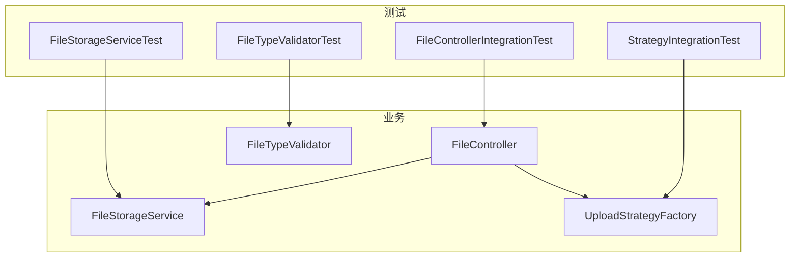
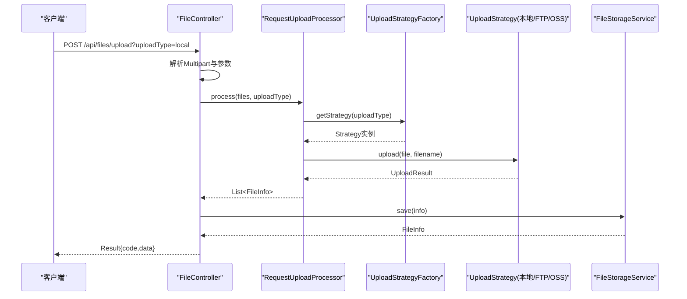
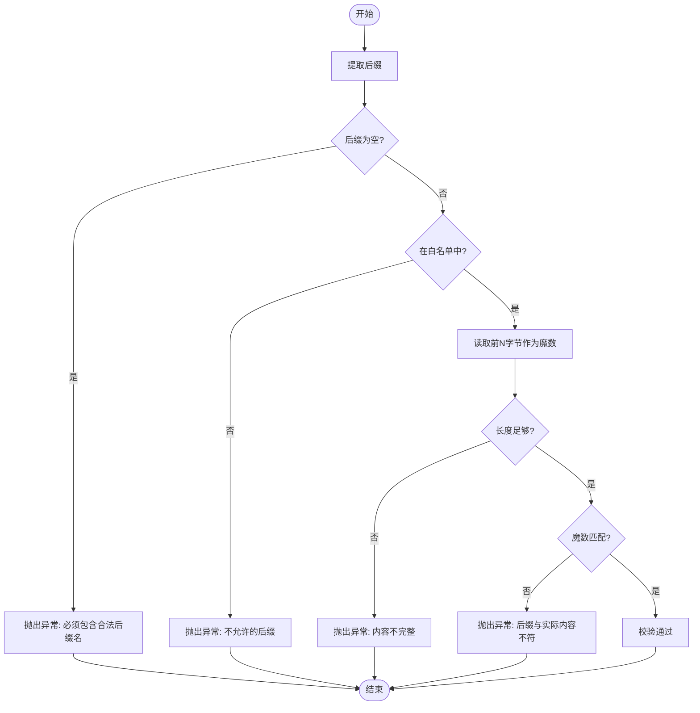
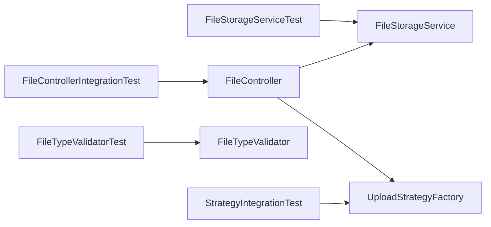

# 测试指南

<cite>
**本文引用的文件**
- [pom.xml](file://pom.xml)
- [FileController.java](file://src/main/java/com/example/fileupload/controller/FileController.java)
- [FileStorageService.java](file://src/main/java/com/example/fileupload/service/FileStorageService.java)
- [FileTypeValidator.java](file://src/main/java/com/example/fileupload/util/FileTypeValidator.java)
- [UploadStrategyFactory.java](file://src/main/java/com/example/fileupload/strategy/UploadStrategyFactory.java)
- [FileStorageServiceTest.java](file://src/test/java/com/example/fileupload/FileStorageServiceTest.java)
- [FileTypeValidatorTest.java](file://src/test/java/com/example/fileupload/FileTypeValidatorTest.java)
- [FileControllerIntegrationTest.java](file://src/test/java/com/example/fileupload/FileControllerIntegrationTest.java)
- [StrategyIntegrationTest.java](file://src/test/java/com/example/fileupload/StrategyIntegrationTest.java)
</cite>

## 目录
1. [简介](#简介)
2. [项目结构](#项目结构)
3. [核心组件](#核心组件)
4. [架构总览](#架构总览)
5. [详细组件分析](#详细组件分析)
6. [依赖关系分析](#依赖关系分析)
7. [性能考虑](#性能考虑)
8. [故障排查指南](#故障排查指南)
9. [结论](#结论)
10. [附录](#附录)

## 简介
本指南面向SpringBootFileUpload项目的测试工作，覆盖测试策略、框架选择、单元测试与集成测试的编写方法、Mock数据与环境搭建、覆盖率与持续集成建议，以及性能与压力测试方案。文档基于现有代码库中的测试用例与业务实现进行说明，确保读者能够按图索骥完成高质量测试落地。

## 项目结构
- 测试位于 src/test/java/com/example/fileupload 下，包含：
  - 单元测试：FileStorageServiceTest、FileTypeValidatorTest
  - 集成测试：FileControllerIntegrationTest（端到端）、StrategyIntegrationTest（策略模式）
- 业务核心位于 src/main/java/com/example/fileupload，包括控制器、服务、工具类与策略工厂等。

图表来源
- [FileControllerIntegrationTest.java:1-279](file://src/test/java/com/example/fileupload/FileControllerIntegrationTest.java#L1-L279)
- [FileStorageServiceTest.java:1-178](file://src/test/java/com/example/fileupload/FileStorageServiceTest.java#L1-L178)
- [FileTypeValidatorTest.java:1-125](file://src/test/java/com/example/fileupload/FileTypeValidatorTest.java#L1-L125)
- [StrategyIntegrationTest.java:1-168](file://src/test/java/com/example/fileupload/StrategyIntegrationTest.java#L1-L168)
- [FileController.java:1-319](file://src/main/java/com/example/fileupload/controller/FileController.java#L1-L319)
- [FileStorageService.java:1-184](file://src/main/java/com/example/fileupload/service/FileStorageService.java#L1-L184)
- [FileTypeValidator.java:1-109](file://src/main/java/com/example/fileupload/util/FileTypeValidator.java#L1-L109)
- [UploadStrategyFactory.java:1-57](file://src/main/java/com/example/fileupload/strategy/UploadStrategyFactory.java#L1-L57)

章节来源
- [pom.xml:1-82](file://pom.xml#L1-L82)

## 核心组件
- FileStorageService：内存存储元数据，提供CRUD与搜索能力，支持初始化Mock数据。
- FileTypeValidator：校验文件后缀白名单与魔数匹配，拒绝非法或伪装文件。
- FileController：REST API入口，封装上传、下载、删除、查询与Mock数据接口。
- UploadStrategyFactory：策略工厂，根据UploadType路由到具体策略实现。

章节来源
- [FileStorageService.java:1-184](file://src/main/java/com/example/fileupload/service/FileStorageService.java#L1-L184)
- [FileTypeValidator.java:1-109](file://src/main/java/com/example/fileupload/util/FileTypeValidator.java#L1-L109)
- [FileController.java:1-319](file://src/main/java/com/example/fileupload/controller/FileController.java#L1-L319)
- [UploadStrategyFactory.java:1-57](file://src/main/java/com/example/fileupload/strategy/UploadStrategyFactory.java#L1-L57)

## 架构总览
下图展示了从请求到策略执行与结果返回的整体流程，以及测试如何覆盖这些路径。

图表来源
- [FileController.java:50-84](file://src/main/java/com/example/fileupload/controller/FileController.java#L50-L84)
- [UploadStrategyFactory.java:28-55](file://src/main/java/com/example/fileupload/strategy/UploadStrategyFactory.java#L28-L55)
- [FileStorageService.java:29-39](file://src/main/java/com/example/fileupload/service/FileStorageService.java#L29-L39)

## 详细组件分析

### 单元测试：FileStorageServiceTest
- 目标：验证内存存储的CRUD、搜索、过滤与清理功能。
- 关键点：
  - 使用 @SpringBootTest 加载上下文，@BeforeEach 中调用 clear() 保证测试隔离。
  - 构造 FileInfo 样例数据，覆盖保存、查找、删除、全量查询、关键词搜索、按存储类型与后缀过滤、清空、初始化Mock数据等场景。
  - 通过 size()、findAll()、searchByName()、findByStorageType()、findBySuffix() 等方法断言行为。
- 建议扩展：
  - 增加并发写入与读取的健壮性测试（ConcurrentHashMap）。
  - 对边界条件（超长文件名、特殊字符）补充断言。

章节来源
- [FileStorageServiceTest.java:1-178](file://src/test/java/com/example/fileupload/FileStorageServiceTest.java#L1-L178)
- [FileStorageService.java:29-107](file://src/main/java/com/example/fileupload/service/FileStorageService.java#L29-L107)

### 单元测试：FileTypeValidatorTest
- 目标：验证后缀白名单与魔数匹配逻辑，确保非法文件被拒绝。
- 关键点：
  - 使用嵌套类组织测试组：后缀提取、合法文件通过、非法文件拒绝。
  - 通过 ByteArrayInputStream 模拟不同文件头（PNG/JPG/GIF/PDF/TXT），验证 validate() 的行为。
  - 覆盖无后缀、隐藏文件、魔数不匹配、内容过短等异常分支。
- 建议扩展：
  - 针对更多二进制格式（docx/xlsx/zip/rar/7z）补充魔数或放行策略的断言。
  - 增加流不可重置时的异常处理测试（若实现允许）。

章节来源
- [FileTypeValidatorTest.java:1-125](file://src/test/java/com/example/fileupload/FileTypeValidatorTest.java#L1-L125)
- [FileTypeValidator.java:41-85](file://src/main/java/com/example/fileupload/util/FileTypeValidator.java#L41-L85)

### 集成测试：FileControllerIntegrationTest
- 目标：端到端验证REST API的上传、下载、删除、查询与Mock数据初始化。
- 关键点：
  - 使用 @SpringBootTest + @AutoConfigureMockMvc 启动Web环境。
  - 通过 MockMultipartFile 构造不同文件类型与大小，覆盖成功与失败路径。
  - 使用 MvcResult 与 ObjectMapper 解析响应体，断言状态码、JSON字段与响应头。
  - 部分需要外部服务的用例（FTP/MinIO）已标注 @Disabled，便于在具备环境时启用。
- 建议扩展：
  - 增加大文件上传的性能与超时断言。
  - 增加并发上传与下载的稳定性测试。
  - 为FTP/MinIO场景准备容器化测试环境（如Testcontainers）以启用被禁用的用例。

章节来源
- [FileControllerIntegrationTest.java:1-279](file://src/test/java/com/example/fileupload/FileControllerIntegrationTest.java#L1-L279)
- [FileController.java:50-319](file://src/main/java/com/example/fileupload/controller/FileController.java#L50-L319)

### 集成测试：StrategyIntegrationTest
- 目标：验证三种策略（本地/FTP/OSS）的上传→下载→删除全链路。
- 关键点：
  - 注入 LocalUploadStrategy、FtpUploadStrategy、OssUploadStrategy，分别验证生命周期。
  - 本地策略可运行；FTP与OSS策略默认禁用，需真实服务或容器化环境。
  - 覆盖错误场景：不存在文件key、null key等。
- 建议扩展：
  - 使用 Testcontainers 启动FTP/MinIO容器，自动配置并启用被禁用的用例。
  - 增加批量上传与下载的策略回归测试。

章节来源
- [StrategyIntegrationTest.java:1-168](file://src/test/java/com/example/fileupload/StrategyIntegrationTest.java#L1-L168)
- [UploadStrategyFactory.java:28-55](file://src/main/java/com/example/fileupload/strategy/UploadStrategyFactory.java#L28-L55)

### 算法流程图：文件类型校验

图表来源
- [FileTypeValidator.java:41-85](file://src/main/java/com/example/fileupload/util/FileTypeValidator.java#L41-L85)

## 依赖关系分析
- 测试与业务模块的耦合点：
  - FileStorageServiceTest 直接依赖 FileStorageService 的内存存储能力。
  - FileTypeValidatorTest 仅依赖纯工具类 FileTypeValidator，易于隔离。
  - FileControllerIntegrationTest 依赖完整的Web上下文与控制器，验证端到端流程。
  - StrategyIntegrationTest 依赖策略工厂与各策略实现，验证策略路由与生命周期。
- 外部依赖：
  - FTP与MinIO相关用例需要真实服务或容器化环境，当前通过 @Disabled 控制。

图表来源
- [FileStorageServiceTest.java:1-178](file://src/test/java/com/example/fileupload/FileStorageServiceTest.java#L1-L178)
- [FileTypeValidatorTest.java:1-125](file://src/test/java/com/example/fileupload/FileTypeValidatorTest.java#L1-L125)
- [FileControllerIntegrationTest.java:1-279](file://src/test/java/com/example/fileupload/FileControllerIntegrationTest.java#L1-L279)
- [StrategyIntegrationTest.java:1-168](file://src/test/java/com/example/fileupload/StrategyIntegrationTest.java#L1-L168)
- [FileController.java:1-319](file://src/main/java/com/example/fileupload/controller/FileController.java#L1-L319)
- [UploadStrategyFactory.java:1-57](file://src/main/java/com/example/fileupload/strategy/UploadStrategyFactory.java#L1-L57)

章节来源
- [pom.xml:24-71](file://pom.xml#L24-L71)

## 性能考虑
- 单元测试：
  - 避免在单元测试中进行I/O操作；FileTypeValidatorTest 使用内存流，保持快速稳定。
  - FileStorageServiceTest 使用内存Map，适合高频断言与边界条件验证。
- 集成测试：
  - 对大文件上传/下载增加超时与内存占用监控，防止OOM。
  - 对FTP/MinIO用例建议使用容器化环境，减少网络抖动影响。
- 建议：
  - 引入 JMH 进行热点方法基准测试（如批量上传、搜索过滤）。
  - 使用 JMeter 或 Gatling 进行压测，评估高并发下的吞吐与延迟。

[本节为通用指导，不直接分析具体文件]

## 故障排查指南
- 常见错误与定位：
  - 上传失败：检查 FileTypeValidator 是否拒绝非法后缀或魔数不匹配。
  - 下载404：确认 fileKey 是否存在且与存储类型一致。
  - 删除失败：底层存储可能不存在或权限不足，查看控制器日志。
  - 未知上传类型：检查 UploadType.fromCode 与策略工厂注册情况。
- 调试建议：
  - 在控制器与服务层添加关键日志（已内置）。
  - 使用 @Disabled 标记的外部依赖用例，逐步启用并观察错误堆栈。
  - 对Mock数据初始化问题，调用 /api/files/mock/init 后验证数量。

章节来源
- [FileController.java:50-319](file://src/main/java/com/example/fileupload/controller/FileController.java#L50-L319)
- [FileTypeValidator.java:41-85](file://src/main/java/com/example/fileupload/util/FileTypeValidator.java#L41-L85)

## 结论
本项目测试体系覆盖了单元与集成两个层面：单元测试聚焦核心逻辑的正确性与边界条件；集成测试覆盖端到端API与策略模式的全链路。通过合理的Mock数据与环境配置，可在本地快速验证主要路径；借助容器化与CI，可进一步启用外部依赖用例，提升质量保障能力。

[本节为总结，不直接分析具体文件]

## 附录

### 测试策略与框架选择
- 单元测试：JUnit 5 + Spring Boot Test（轻量、快速、易隔离）。
- 集成测试：Spring Boot Test + MockMvc（无需启动真实服务器，模拟HTTP请求）。
- 策略模式测试：直接注入策略实现，验证生命周期与错误处理。

章节来源
- [pom.xml:31-42](file://pom.xml#L31-L42)
- [FileControllerIntegrationTest.java:1-279](file://src/test/java/com/example/fileupload/FileControllerIntegrationTest.java#L1-L279)
- [StrategyIntegrationTest.java:1-168](file://src/test/java/com/example/fileupload/StrategyIntegrationTest.java#L1-L168)

### Mock数据生成与环境搭建
- 内存Mock：FileStorageService 提供 initMockData() 与 clear()，用于快速构建测试数据。
- 文件Mock：使用 MockMultipartFile 构造不同MIME类型与魔数内容。
- 外部服务：FTP/MinIO可通过配置文件或容器化方式启用，对应用例已标注 @Disabled。

章节来源
- [FileStorageService.java:109-131](file://src/main/java/com/example/fileupload/service/FileStorageService.java#L109-L131)
- [FileControllerIntegrationTest.java:265-277](file://src/test/java/com/example/fileupload/FileControllerIntegrationTest.java#L265-L277)
- [StrategyIntegrationTest.java:69-117](file://src/test/java/com/example/fileupload/StrategyIntegrationTest.java#L69-L117)

### 测试覆盖率与持续集成
- 覆盖率：建议在CI中加入 JaCoCo 插件，设置行覆盖率阈值（如≥80%）。
- CI流程：
  - 编译与依赖安装
  - 单元测试执行
  - 集成测试执行（可选：启用容器化FTP/MinIO）
  - 覆盖率报告生成与归档
- 注意：外部依赖用例默认禁用，需在具备环境的阶段启用。

[本节为通用指导，不直接分析具体文件]

### 性能测试与压力测试建议
- 性能测试：
  - 使用 JMH 对关键路径（批量上传、搜索过滤）进行微基准测试。
  - 监控JVM内存与GC行为，避免大文件导致OOM。
- 压力测试：
  - 使用 JMeter/Gatling 模拟多用户并发上传与下载。
  - 关注TPS、P95/P99延迟、错误率与资源利用率。
  - 对FTP/MinIO场景，确保网络带宽与存储I/O满足预期。

[本节为通用指导，不直接分析具体文件]

### 最佳实践与常见陷阱
- 最佳实践：
  - 每个测试只验证一个职责，保持独立性与可重复性。
  - 使用 @BeforeEach/@AfterEach 管理测试环境与数据清理。
  - 对外部依赖使用容器化或Mock，避免不稳定因素。
- 常见陷阱：
  - 忘记重置输入流导致后续读取失败（FileTypeValidator 内部会reset，但自定义流需注意）。
  - 未清理内存数据导致测试间相互污染（已在 @BeforeEach 中clear）。
  - 忽略大小写与空值处理（FileTypeValidator 与 FileStorageService 已做兼容，测试应覆盖边界）。

章节来源
- [FileTypeValidator.java:66-85](file://src/main/java/com/example/fileupload/util/FileTypeValidator.java#L66-L85)
- [FileStorageServiceTest.java:26-30](file://src/test/java/com/example/fileupload/FileStorageServiceTest.java#L26-L30)