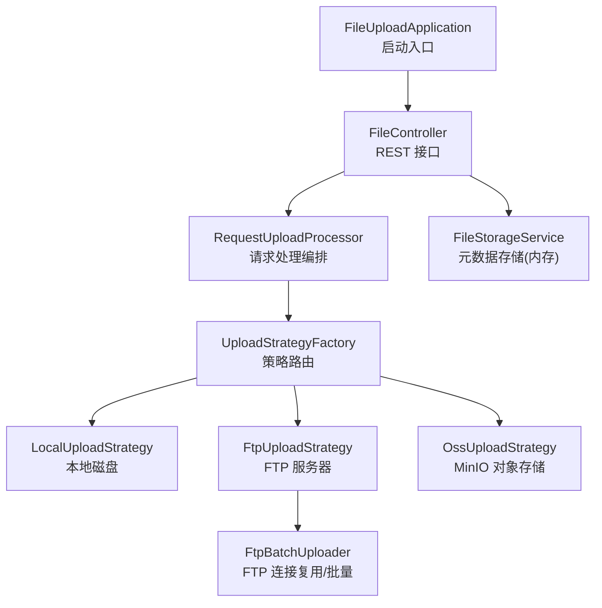
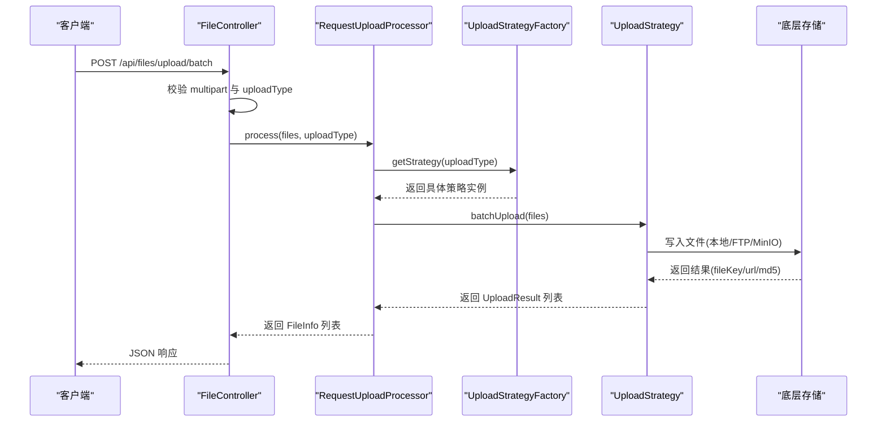
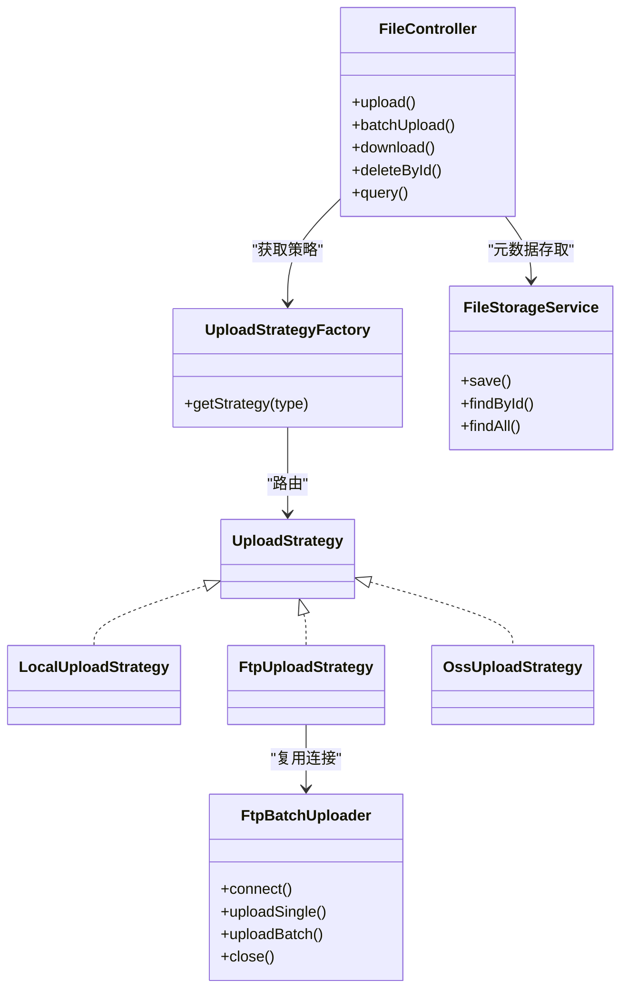

# 部署运维

<cite>
**本文引用的文件**
- [pom.xml](file://pom.xml)
- [application.yml](file://src/main/resources/application.yml)
- [FileUploadApplication.java](file://src/main/java/com/example/fileupload/FileUploadApplication.java)
- [FileController.java](file://src/main/java/com/example/fileupload/controller/FileController.java)
- [FileStorageService.java](file://src/main/java/com/example/fileupload/service/FileStorageService.java)
- [FtpBatchUploader.java](file://src/main/java/com/example/fileupload/service/FtpBatchUploader.java)
- [UploadStrategyFactory.java](file://src/main/java/com/example/fileupload/strategy/UploadStrategyFactory.java)
- [OssUploadStrategy.java](file://src/main/java/com/example/fileupload/strategy/OssUploadStrategy.java)
- [FileInfo.java](file://src/main/java/com/example/fileupload/model/FileInfo.java)
- [UploadType.java](file://src/main/java/com/example/fileupload/enums/UploadType.java)
- [FileControllerIntegrationTest.java](file://src/test/java/com/example/fileupload/FileControllerIntegrationTest.java)
</cite>

## 目录
1. [简介](#简介)
2. [项目结构](#项目结构)
3. [核心组件](#核心组件)
4. [架构总览](#架构总览)
5. [详细组件分析](#详细组件分析)
6. [依赖分析](#依赖分析)
7. [性能与容量规划](#性能与容量规划)
8. [监控与日志](#监控与日志)
9. [备份与恢复](#备份与恢复)
10. [安全加固](#安全加固)
11. [故障排查指南](#故障排查指南)
12. [结论](#结论)

## 简介
本指南面向生产环境，提供 SpringBootFileUpload 项目的完整部署与运维方案。内容涵盖 JDK 与 Maven 构建、JAR 包运行、Docker 容器化、云平台部署、监控与日志、备份恢复、安全加固、容量规划与性能调优，以及常见故障排查方法。

## 项目结构
- 应用入口：Spring Boot 启动类负责初始化 Web 容器并加载配置。
- API 层：REST 控制器暴露上传、下载、删除、查询等接口。
- 策略层：通过策略模式支持本地磁盘、FTP、MinIO（S3 兼容）三种存储后端。
- 服务层：文件元数据内存存储（可替换为数据库），FTP 批量上传工具封装连接复用与错误分类。
- 配置：统一在 application.yml 中管理端口、分片大小、存储路径、FTP/MinIO 连接参数与日志级别。

图表来源
- [FileUploadApplication.java:6-11](file://src/main/java/com/example/fileupload/FileUploadApplication.java#L6-L11)
- [FileController.java:31-48](file://src/main/java/com/example/fileupload/controller/FileController.java#L31-L48)
- [UploadStrategyFactory.java:16-39](file://src/main/java/com/example/fileupload/strategy/UploadStrategyFactory.java#L16-L39)
- [OssUploadStrategy.java:29-76](file://src/main/java/com/example/fileupload/strategy/OssUploadStrategy.java#L29-L76)
- [FtpBatchUploader.java:23-81](file://src/main/java/com/example/fileupload/service/FtpBatchUploader.java#L23-L81)

章节来源
- [pom.xml:1-82](file://pom.xml#L1-L82)
- [application.yml:1-33](file://src/main/resources/application.yml#L1-L33)
- [FileUploadApplication.java:1-13](file://src/main/java/com/example/fileupload/FileUploadApplication.java#L1-L13)

## 核心组件
- 启动器：基于 Spring Boot 2.7.x，Java 8 编译目标。
- 控制器：统一 REST 接口，包含单文件上传、批量上传、下载、删除、分页查询、Mock 数据初始化。
- 策略工厂：自动发现并注册所有 UploadStrategy，按枚举类型路由到具体实现。
- FTP 批量上传：使用 ThreadLocal 复用 FTPClient，减少握手开销；内置错误分类与目录创建。
- 元数据存储：当前为内存 Map，便于演示；生产建议替换为关系型或文档数据库。

章节来源
- [FileController.java:50-133](file://src/main/java/com/example/fileupload/controller/FileController.java#L50-L133)
- [UploadStrategyFactory.java:24-55](file://src/main/java/com/example/fileupload/strategy/UploadStrategyFactory.java#L24-L55)
- [FtpBatchUploader.java:83-163](file://src/main/java/com/example/fileupload/service/FtpBatchUploader.java#L83-L163)
- [FileStorageService.java:19-107](file://src/main/java/com/example/fileupload/service/FileStorageService.java#L19-L107)

## 架构总览
下图展示一次“批量上传”的调用链：客户端发起 multipart 请求，控制器解析后交由处理器与策略工厂选择具体存储策略，最终由对应策略完成写入并返回结果。

图表来源
- [FileController.java:86-133](file://src/main/java/com/example/fileupload/controller/FileController.java#L86-L133)
- [UploadStrategyFactory.java:41-55](file://src/main/java/com/example/fileupload/strategy/UploadStrategyFactory.java#L41-L55)
- [OssUploadStrategy.java:29-76](file://src/main/java/com/example/fileupload/strategy/OssUploadStrategy.java#L29-L76)

## 详细组件分析

### 构建与打包
- JDK 要求：JDK 8（项目属性指定 java.version=1.8）。
- 构建命令：使用 Maven 执行 clean package，生成可执行 JAR。
- 运行方式：java -jar 直接运行，或通过环境变量覆盖默认配置。

章节来源
- [pom.xml:20-22](file://pom.xml#L20-L22)
- [pom.xml:73-80](file://pom.xml#L73-L80)

### 传统 JAR 包部署
- 前置条件：安装 JDK 8，准备本地存储目录或外部存储（FTP/MinIO）。
- 配置文件：修改 application.yml 中的 server.port、file.upload.base-path、file.ftp.*、file.oss.*。
- 启动命令：java -jar file-upload-service-1.0.0-SNAPSHOT.jar
- 健康检查：访问 GET /api/files/mock/count 验证服务可用。

章节来源
- [application.yml:1-33](file://src/main/resources/application.yml#L1-L33)
- [FileController.java:294-317](file://src/main/java/com/example/fileupload/controller/FileController.java#L294-L317)

### Docker 容器化部署
- 镜像基础：选用 openjdk:8-jre-slim 或同等基础镜像。
- 复制产物：将打包后的 JAR 复制到镜像中。
- 暴露端口：映射 8080 端口。
- 挂载卷：将 file.upload.base-path 对应的宿主机目录挂载至容器，避免数据丢失。
- 环境变量：可通过环境变量注入 file.ftp.* 与 file.oss.* 敏感配置。
- 启动命令：docker run -p 8080:8080 -v /data/uploads:/file-upload-storage app-image

注意：若使用 MinIO，需确保网络可达且 bucket 存在或由应用自动创建。

章节来源
- [application.yml:13-28](file://src/main/resources/application.yml#L13-L28)
- [OssUploadStrategy.java:54-70](file://src/main/java/com/example/fileupload/strategy/OssUploadStrategy.java#L54-L70)

### 云平台部署
- 托管平台：可将 JAR 部署至云厂商的应用托管服务（如 ECS + 进程守护、Kubernetes Deployment、Serverless 容器等）。
- 配置管理：使用平台提供的配置中心或环境变量注入 file.ftp.*、file.oss.* 等敏感信息。
- 存储接入：
  - 本地存储：挂载持久卷到容器/Pod，路径与 base-path 一致。
  - FTP：确保网络安全组放行 21 端口及被动模式端口范围。
  - MinIO：通过内网 Endpoint 访问，或使用反向代理暴露 URL。
- 健康探针：配置 HTTP 探针探测 /api/files/mock/count 或自定义健康端点。

章节来源
- [application.yml:13-28](file://src/main/resources/application.yml#L13-L28)
- [FileController.java:294-317](file://src/main/java/com/example/fileupload/controller/FileController.java#L294-L317)

## 依赖分析
- 运行时依赖：Spring Boot Web、Commons IO、Apache Commons Net（FTP）、MinIO SDK、Commons Codec。
- 关键耦合点：
  - FileController 依赖 RequestUploadProcessor、FileStorageService、UploadStrategyFactory。
  - UploadStrategyFactory 依赖所有 UploadStrategy 实现并通过枚举路由。
  - FtpBatchUploader 被 FTP 策略使用，封装连接与批量逻辑。
  - OssUploadStrategy 依赖 MinIO SDK 进行对象存储操作。

图表来源
- [FileController.java:31-48](file://src/main/java/com/example/fileupload/controller/FileController.java#L31-L48)
- [UploadStrategyFactory.java:16-55](file://src/main/java/com/example/fileupload/strategy/UploadStrategyFactory.java#L16-L55)
- [FtpBatchUploader.java:23-81](file://src/main/java/com/example/fileupload/service/FtpBatchUploader.java#L23-L81)
- [OssUploadStrategy.java:29-76](file://src/main/java/com/example/fileupload/strategy/OssUploadStrategy.java#L29-L76)

章节来源
- [pom.xml:24-71](file://pom.xml#L24-L71)

## 性能与容量规划
- 并发与线程模型：
  - FTP 批量上传使用 ThreadLocal 复用连接，降低握手开销，适合高并发批量场景。
  - 策略工厂使用 ConcurrentHashMap 保证线程安全的策略查找。
- 内存与元数据：
  - 当前元数据存储在内存中，重启会丢失；生产应迁移至数据库以支撑持久化与扩展。
- 文件大小限制：
  - 默认最大单文件与请求大小为 50MB，可根据业务调整。
- 存储容量规划：
  - 本地存储：评估磁盘增长速率，预留至少 30% 冗余空间。
  - FTP：关注磁盘配额与权限，避免写入失败。
  - MinIO：根据对象数量与大小规划桶容量与副本策略。
- 网络与带宽：
  - FTP 被动模式需开放数据端口范围；MinIO 建议使用内网 Endpoint 以降低延迟。

章节来源
- [application.yml:4-10](file://src/main/resources/application.yml#L4-L10)
- [FtpBatchUploader.java:27-81](file://src/main/java/com/example/fileupload/service/FtpBatchUploader.java#L27-L81)
- [UploadStrategyFactory.java:21-39](file://src/main/java/com/example/fileupload/strategy/UploadStrategyFactory.java#L21-L39)

## 监控与日志
- 应用指标：
  - 建议在应用中引入 Micrometer 与 Prometheus，暴露 /actuator/prometheus 端点，配合 Grafana 可视化。
  - 针对上传成功率、失败率、平均耗时、吞吐等建立告警规则。
- 日志记录：
  - 当前日志级别为 DEBUG，生产建议调整为 INFO 或 WARN，并按模块拆分日志文件。
  - 对异常路径（上传失败、下载失败、删除失败）集中记录错误堆栈与上下文。
- 健康检查：
  - 增加 /actuator/health 或自定义健康端点，供负载均衡与健康探针使用。
- 审计与追踪：
  - 记录上传人、文件类型、大小、MD5、存储位置等关键信息，便于追溯。

章节来源
- [application.yml:30-33](file://src/main/resources/application.yml#L30-L33)
- [FileController.java:78-83](file://src/main/java/com/example/fileupload/controller/FileController.java#L78-L83)
- [FileController.java:190-193](file://src/main/java/com/example/fileupload/controller/FileController.java#L190-L193)
- [FileController.java:223-226](file://src/main/java/com/example/fileupload/controller/FileController.java#L223-L226)

## 备份与恢复
- 元数据备份：
  - 当前为内存存储，重启即丢失；生产应迁移至数据库并定期备份。
- 文件数据备份：
  - 本地存储：对 base-path 目录进行增量/全量备份，结合快照技术提升一致性。
  - FTP：定期同步远程目录至冷存储，注意权限与编码问题。
  - MinIO：启用版本控制与跨区域复制，制定保留策略。
- 恢复流程：
  - 停止写入或切换到只读模式。
  - 从备份恢复文件与元数据。
  - 校验 MD5 与完整性，逐步恢复服务并观察指标。
- 灾难恢复演练：
  - 定期演练 RTO/RPO 目标，验证恢复脚本与流程有效性。

章节来源
- [application.yml:13-28](file://src/main/resources/application.yml#L13-L28)
- [FileStorageService.java:13-18](file://src/main/java/com/example/fileupload/service/FileStorageService.java#L13-L18)

## 安全加固
- 访问控制：
  - 仅暴露必要端口（8080），通过防火墙或安全组限制来源 IP。
  - 在网关层实施鉴权与限流，避免滥用。
- 数据加密：
  - 传输层：使用 HTTPS 终止于网关或反向代理。
  - 存储层：MinIO 启用服务端加密；FTP 使用 FTPS/SFTP 替代明文协议。
- 网络安全：
  - FTP 被动模式需最小化开放端口范围，并限制来源。
  - MinIO 使用内网 Endpoint，避免公网暴露。
- 配置安全：
  - 敏感配置（用户名、密码、密钥）通过环境变量或密钥管理服务注入，不硬编码。
- 输入校验：
  - 已实现后缀与魔数校验，拒绝恶意文件类型；建议进一步限制 MIME 类型白名单。

章节来源
- [application.yml:13-28](file://src/main/resources/application.yml#L13-L28)
- [FileControllerIntegrationTest.java:86-121](file://src/test/java/com/example/fileupload/FileControllerIntegrationTest.java#L86-L121)

## 故障排查指南
- 上传失败：
  - 检查 multipart 配置与 max-file-size/max-request-size。
  - 查看策略日志，确认存储后端连通性与权限。
- FTP 连接/上传失败：
  - 核对 host/port/username/password/basePath。
  - 检查被动模式与防火墙设置；参考错误分类定位具体问题（权限不足、路径无效、磁盘空间不足等）。
- 下载失败：
  - 确认 fileKey 与 uploadType 匹配；检查底层存储是否可读取。
- 删除失败：
  - 确认底层存储权限；若无删除权限，策略会尽力删除并返回相应提示。
- 元数据不一致：
  - 当前为内存存储，重启后不可用；生产需迁移至数据库并实现幂等写入与补偿机制。

章节来源
- [application.yml:4-10](file://src/main/resources/application.yml#L4-L10)
- [FtpBatchUploader.java:192-212](file://src/main/java/com/example/fileupload/service/FtpBatchUploader.java#L192-L212)
- [FileController.java:156-193](file://src/main/java/com/example/fileupload/controller/FileController.java#L156-L193)
- [FileController.java:196-227](file://src/main/java/com/example/fileupload/controller/FileController.java#L196-L227)

## 结论
本指南提供了从构建、部署到监控、备份与安全的全链路运维方案。生产环境建议：
- 将元数据迁移至数据库，确保持久化与可扩展性。
- 使用 HTTPS 与最小权限原则配置存储后端。
- 完善监控与告警，建立备份与恢复演练机制。
- 持续优化容量与性能，结合业务峰值进行压测与调优。