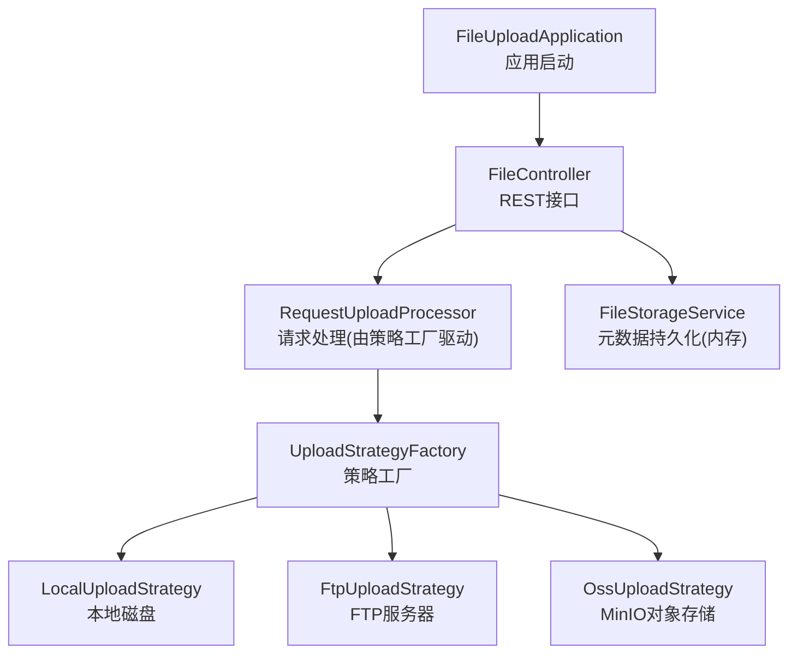
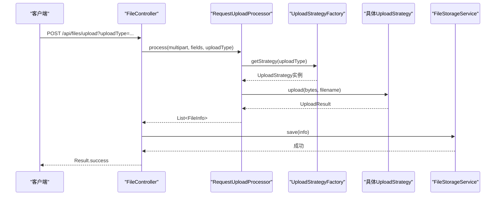

# 配置指南

<cite>
**本文引用的文件**
- [pom.xml](file://pom.xml)
- [application.yml](file://src/main/resources/application.yml)
- [FileUploadApplication.java](file://src/main/java/com/example/fileupload/FileUploadApplication.java)
- [FileController.java](file://src/main/java/com/example/fileupload/controller/FileController.java)
- [FileStorageService.java](file://src/main/java/com/example/fileupload/service/FileStorageService.java)
- [UploadStrategyFactory.java](file://src/main/java/com/example/fileupload/strategy/UploadStrategyFactory.java)
- [LocalUploadStrategy.java](file://src/main/java/com/example/fileupload/strategy/LocalUploadStrategy.java)
- [FtpUploadStrategy.java](file://src/main/java/com/example/fileupload/strategy/FtpUploadStrategy.java)
- [OssUploadStrategy.java](file://src/main/java/com/example/fileupload/strategy/OssUploadStrategy.java)
</cite>

## 目录
1. [简介](#简介)
2. [项目结构](#项目结构)
3. [核心组件](#核心组件)
4. [架构总览](#架构总览)
5. [详细组件分析](#详细组件分析)
6. [依赖与版本管理](#依赖与版本管理)
7. [性能与安全调优](#性能与安全调优)
8. [多环境配置模板](#多环境配置模板)
9. [环境变量与热重载](#环境变量与热重载)
10. [部署与容器化](#部署与容器化)
11. [故障排查](#故障排查)
12. [结论](#结论)

## 简介
本指南面向SpringBootFileUpload项目的配置与部署，覆盖以下主题：
- application.yml 所有选项详解（Spring Boot基础、文件存储、FTP、MinIO）
- 环境变量注入方式与生产环境安全建议
- Maven依赖管理与冲突解决
- 开发/测试/生产多环境配置模板（含安全、性能、监控）
- 配置热重载机制与校验规则
- 常见问题排查与最佳实践
- Docker容器化与云平台部署示例

## 项目结构
本项目采用分层+策略模式组织代码：
- 入口：应用启动类
- 控制器：REST API（上传、下载、删除、查询、Mock初始化）
- 服务：内存元数据存储（可替换为数据库）
- 策略：本地磁盘、FTP、MinIO三种上传实现
- 工厂：自动注册并路由策略
- 资源：application.yml 集中配置

图表来源
- [FileUploadApplication.java:6-11](file://src/main/java/com/example/fileupload/FileUploadApplication.java#L6-L11)
- [FileController.java:31-48](file://src/main/java/com/example/fileupload/controller/FileController.java#L31-L48)
- [UploadStrategyFactory.java:16-39](file://src/main/java/com/example/fileupload/strategy/UploadStrategyFactory.java#L16-L39)
- [LocalUploadStrategy.java:26-61](file://src/main/java/com/example/fileupload/strategy/LocalUploadStrategy.java#L26-L61)
- [FtpUploadStrategy.java:36-54](file://src/main/java/com/example/fileupload/strategy/FtpUploadStrategy.java#L36-L54)
- [OssUploadStrategy.java:29-70](file://src/main/java/com/example/fileupload/strategy/OssUploadStrategy.java#L29-L70)

章节来源
- [FileUploadApplication.java:6-11](file://src/main/java/com/example/fileupload/FileUploadApplication.java#L6-L11)
- [FileController.java:31-48](file://src/main/java/com/example/fileupload/controller/FileController.java#L31-L48)
- [UploadStrategyFactory.java:16-39](file://src/main/java/com/example/fileupload/strategy/UploadStrategyFactory.java#L16-L39)

## 核心组件
- 应用启动类：启用Spring Boot自动装配
- 控制器：统一暴露上传、下载、删除、查询等API
- 策略工厂：根据上传类型动态选择具体实现
- 存储策略：
  - 本地磁盘：基于文件系统读写
  - FTP：使用Apache Commons Net，支持批量复用连接
  - MinIO：S3兼容对象存储，自动创建桶
- 元数据存储：内存Map（可替换为MySQL/MongoDB）

章节来源
- [FileController.java:50-133](file://src/main/java/com/example/fileupload/controller/FileController.java#L50-L133)
- [UploadStrategyFactory.java:28-55](file://src/main/java/com/example/fileupload/strategy/UploadStrategyFactory.java#L28-L55)
- [LocalUploadStrategy.java:63-118](file://src/main/java/com/example/fileupload/strategy/LocalUploadStrategy.java#L63-L118)
- [FtpUploadStrategy.java:58-186](file://src/main/java/com/example/fileupload/strategy/FtpUploadStrategy.java#L58-L186)
- [OssUploadStrategy.java:78-167](file://src/main/java/com/example/fileupload/strategy/OssUploadStrategy.java#L78-L167)
- [FileStorageService.java:19-107](file://src/main/java/com/example/fileupload/service/FileStorageService.java#L19-L107)

## 架构总览
下图展示一次“上传”请求的调用链与配置读取路径。

图表来源
- [FileController.java:58-84](file://src/main/java/com/example/fileupload/controller/FileController.java#L58-L84)
- [UploadStrategyFactory.java:41-55](file://src/main/java/com/example/fileupload/strategy/UploadStrategyFactory.java#L41-L55)
- [LocalUploadStrategy.java:63-84](file://src/main/java/com/example/fileupload/strategy/LocalUploadStrategy.java#L63-L84)
- [FtpUploadStrategy.java:58-74](file://src/main/java/com/example/fileupload/strategy/FtpUploadStrategy.java#L58-L74)
- [OssUploadStrategy.java:78-109](file://src/main/java/com/example/fileupload/strategy/OssUploadStrategy.java#L78-L109)
- [FileStorageService.java:29-39](file://src/main/java/com/example/fileupload/service/FileStorageService.java#L29-L39)

## 详细组件分析

### 配置文件 application.yml 详解
- server.port：Web服务端口
- spring.servlet.multipart.enabled/max-file-size/max-request-size：Multipart上传开关与大小限制
- file.upload.base-path：本地存储根路径（支持相对当前盘符根目录或工作目录）
- file.ftp.*：FTP主机、端口、用户名、密码、远程基路径
- file.oss.*：MinIO端点、访问密钥、桶名、对象前缀、URL前缀
- logging.level：包级日志级别

说明
- 各策略通过 @Value("${...}") 读取上述配置项，未提供时存在默认值
- URL前缀用于生成对外可访问的文件链接，生产环境通常指向反向代理域名

章节来源
- [application.yml:1-33](file://src/main/resources/application.yml#L1-L33)
- [LocalUploadStrategy.java:31-61](file://src/main/java/com/example/fileupload/strategy/LocalUploadStrategy.java#L31-L61)
- [FtpUploadStrategy.java:41-54](file://src/main/java/com/example/fileupload/strategy/FtpUploadStrategy.java#L41-L54)
- [OssUploadStrategy.java:34-50](file://src/main/java/com/example/fileupload/strategy/OssUploadStrategy.java#L34-L50)

### 本地磁盘存储策略
- 解析base-path：支持以“/”开头的根目录相对路径、相对工作目录或绝对路径
- 唯一文件名：UUID + 原始文件名，碰撞时追加序号
- 路径计算：返回包含base-path名称的相对路径，便于前端拼接访问URL

章节来源
- [LocalUploadStrategy.java:40-61](file://src/main/java/com/example/fileupload/strategy/LocalUploadStrategy.java#L40-L61)
- [LocalUploadStrategy.java:170-188](file://src/main/java/com/example/fileupload/strategy/LocalUploadStrategy.java#L170-L188)

### FTP上传策略
- 连接与认证：connect/login，失败抛出明确异常
- 编码与模式：UTF-8控制编码、被动模式、二进制传输
- 批量上传：同一连接内多次上传，减少握手开销
- 错误分类：按FTP回复码给出用户友好提示（权限、路径、空间不足等）

章节来源
- [FtpUploadStrategy.java:206-236](file://src/main/java/com/example/fileupload/strategy/FtpUploadStrategy.java#L206-L236)
- [FtpUploadStrategy.java:126-186](file://src/main/java/com/example/fileupload/strategy/FtpUploadStrategy.java#L126-L186)
- [FtpUploadStrategy.java:327-352](file://src/main/java/com/example/fileupload/strategy/FtpUploadStrategy.java#L327-L352)

### MinIO对象存储策略
- 客户端初始化：endpoint/credentials构建MinioClient，启动时确保bucket存在
- 上传/下载/删除：基于SDK的put/get/removeObject
- URL生成：urlPrefix + objectKey，生产环境建议配置为CDN/反向代理地址

章节来源
- [OssUploadStrategy.java:54-70](file://src/main/java/com/example/fileupload/strategy/OssUploadStrategy.java#L54-L70)
- [OssUploadStrategy.java:78-109](file://src/main/java/com/example/fileupload/strategy/OssUploadStrategy.java#L78-L109)
- [OssUploadStrategy.java:132-154](file://src/main/java/com/example/fileupload/strategy/OssUploadStrategy.java#L132-L154)

### 策略工厂与路由
- 自动发现：注入所有UploadStrategy实现，构建映射表
- 路由：根据UploadType枚举获取对应策略，缺失则抛异常

章节来源
- [UploadStrategyFactory.java:24-39](file://src/main/java/com/example/fileupload/strategy/UploadStrategyFactory.java#L24-L39)
- [UploadStrategyFactory.java:41-55](file://src/main/java/com/example/fileupload/strategy/UploadStrategyFactory.java#L41-L55)

### 元数据存储（内存）
- 使用ConcurrentHashMap保存FileInfo
- 支持CRUD、模糊搜索、按类型/后缀过滤
- 启动时初始化Mock数据，便于演示

章节来源
- [FileStorageService.java:19-107](file://src/main/java/com/example/fileupload/service/FileStorageService.java#L19-L107)
- [FileStorageService.java:111-131](file://src/main/java/com/example/fileupload/service/FileStorageService.java#L111-L131)

## 依赖与版本管理
- Spring Boot Starter Parent：统一管理Spring生态版本
- spring-boot-starter-web：Web MVC、Tomcat内置
- spring-boot-starter-test：单元测试与集成测试
- commons-io：文件工具
- commons-net：FTP客户端
- minio：S3兼容对象存储客户端
- commons-codec：MD5摘要等编解码

版本管理要点
- 通过parent POM锁定Spring Boot版本，避免手动指定子依赖版本
- 第三方库（如commons-io、commons-net、minio、commons-codec）显式声明版本，便于审计与升级
- 若出现传递依赖冲突，可在父POM中使用dependencyManagement统一收敛版本

章节来源
- [pom.xml:7-12](file://pom.xml#L7-L12)
- [pom.xml:24-71](file://pom.xml#L24-L71)

## 性能与安全调优
- 上传大小限制：调整spring.servlet.multipart.max-file-size与max-request-size，防止过大请求导致OOM
- 本地存储：合理设置base-path到高性能磁盘；注意磁盘配额与备份策略
- FTP：
  - 使用批量上传复用连接，降低握手开销
  - 开启被动模式，穿透NAT/防火墙
  - 设置合适的缓冲区大小
- MinIO：
  - 合理配置url-prefix指向CDN/反向代理，提升静态资源访问速度
  - 启用对象生命周期策略（过期清理）
- 日志：生产环境降低日志级别，仅保留必要DEBUG信息
- 安全：
  - 敏感配置（FTP/MinIO凭据）通过环境变量注入，不写入仓库
  - 对上传类型进行白名单校验（通过枚举），拒绝非法类型
  - 限制允许的后缀与MIME类型（结合业务校验器）

[本节为通用指导，不直接分析具体文件]

## 多环境配置模板
以下为不同环境的配置要点与差异（以application.yml片段思路呈现，实际落地可按profile拆分）：

- 开发环境
  - 端口：8080
  - 日志级别：DEBUG
  - 本地存储：相对工作目录或根目录
  - FTP/MinIO：指向本地或开发集群
  - 关闭严格校验，便于联调

- 测试环境
  - 端口：独立端口
  - 日志级别：INFO
  - 本地存储：隔离目录
  - FTP/MinIO：测试专用账号与桶
  - 启用更严格的后缀与MIME校验

- 生产环境
  - 端口：由平台分配
  - 日志级别：WARN/ERROR
  - 本地存储：高可用磁盘或云盘
  - FTP/MinIO：生产凭据通过环境变量注入
  - 启用限流、熔断、监控与告警
  - 配置反向代理与HTTPS

章节来源
- [application.yml:1-33](file://src/main/resources/application.yml#L1-L33)
- [FileController.java:58-84](file://src/main/java/com/example/fileupload/controller/FileController.java#L58-L84)

## 环境变量与热重载
- 环境变量注入
  - 通过@Value("${...}")读取配置，支持从环境变量覆盖application.yml中的值
  - 建议在Docker/云平台中通过环境变量注入敏感配置（如FTP密码、MinIO密钥）

- 热重载
  - 开发期可使用Spring DevTools实现热重载
  - 生产环境不建议频繁热重载，应通过滚动发布更新配置

- 配置验证
  - 在@PostConstruct中对关键配置进行校验（如MinIO凭据为空时跳过初始化）
  - 对枚举型配置（如uploadType）进行白名单校验，避免非法值

章节来源
- [OssUploadStrategy.java:54-70](file://src/main/java/com/example/fileupload/strategy/OssUploadStrategy.java#L54-L70)
- [UploadType.java:23-33](file://src/main/java/com/example/fileupload/enums/UploadType.java#L23-L33)

## 部署与容器化
- Docker镜像
  - 基于JDK 8镜像，复制JAR包
  - 暴露端口（默认8080）
  - 通过环境变量注入敏感配置
  - 挂载本地存储卷（如需持久化本地文件）

- 云平台
  - 将application.yml中的敏感项替换为环境变量
  - 使用平台提供的密钥管理服务（如KMS/Secrets Manager）
  - 配置负载均衡与反向代理，启用HTTPS
  - 配置健康检查与探针

[本节为通用指导，不直接分析具体文件]

## 故障排查
- 上传失败
  - 检查multipart配置是否启用与大小限制
  - 查看日志定位具体策略（本地/FTP/MinIO）的错误信息
  - 本地：确认base-path存在且可写
  - FTP：检查主机、端口、用户名、密码、被动模式与防火墙
  - MinIO：检查endpoint、access-key、secret-key、bucket是否存在

- 下载失败
  - 确认fileKey与uploadType匹配
  - 检查底层存储是否可访问（本地文件、FTP路径、MinIO对象）

- 删除失败
  - 先删除底层存储再清除元数据，若底层不存在会返回失败
  - 检查权限与路径合法性

- 批量上传
  - 使用FTP批量接口可减少连接开销
  - 关注部分失败的错误日志，定位具体文件

章节来源
- [FileController.java:58-133](file://src/main/java/com/example/fileupload/controller/FileController.java#L58-L133)
- [FtpUploadStrategy.java:206-236](file://src/main/java/com/example/fileupload/strategy/FtpUploadStrategy.java#L206-L236)
- [OssUploadStrategy.java:54-70](file://src/main/java/com/example/fileupload/strategy/OssUploadStrategy.java#L54-L70)

## 结论
本项目通过策略模式实现了灵活的多种存储后端接入，配合清晰的application.yml配置与@Value注入，易于在不同环境中切换与扩展。生产部署时应重点关注：
- 敏感配置的环境变量化
- 合理的上传大小与并发限制
- 稳定的网络与存储可达性
- 完善的日志与监控
- 安全的反向代理与HTTPS