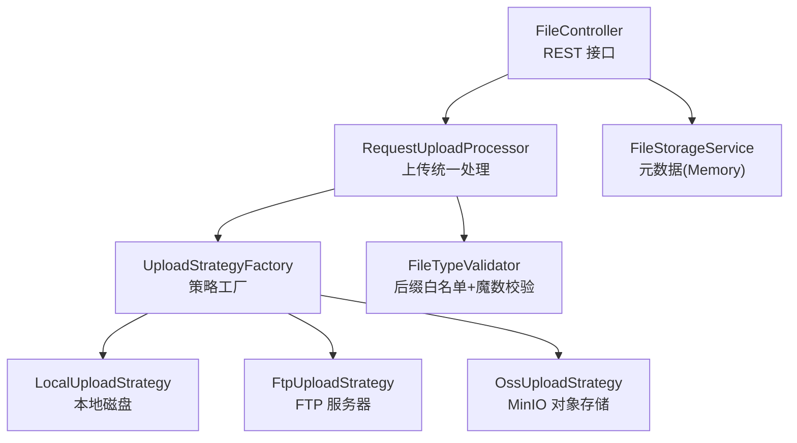
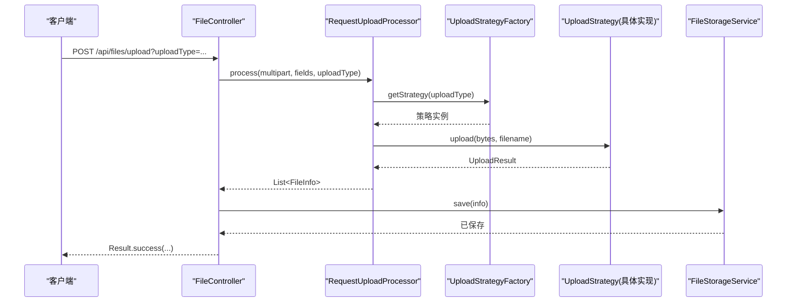
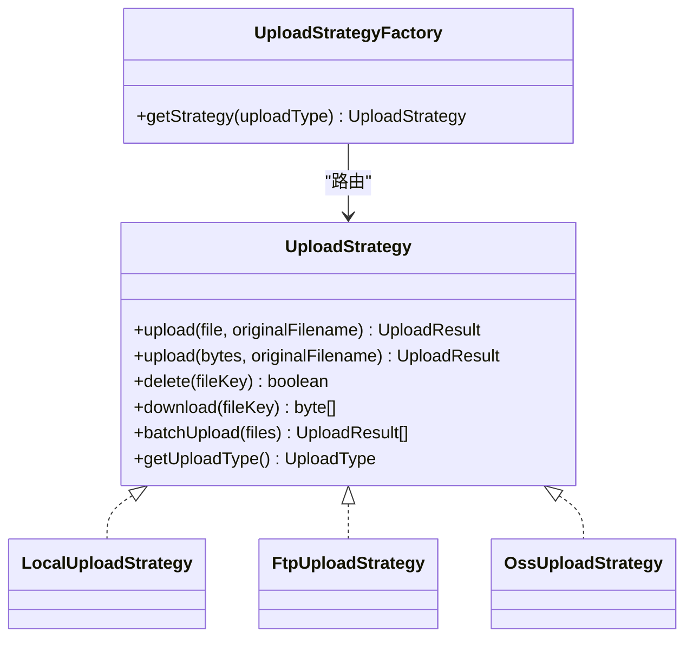
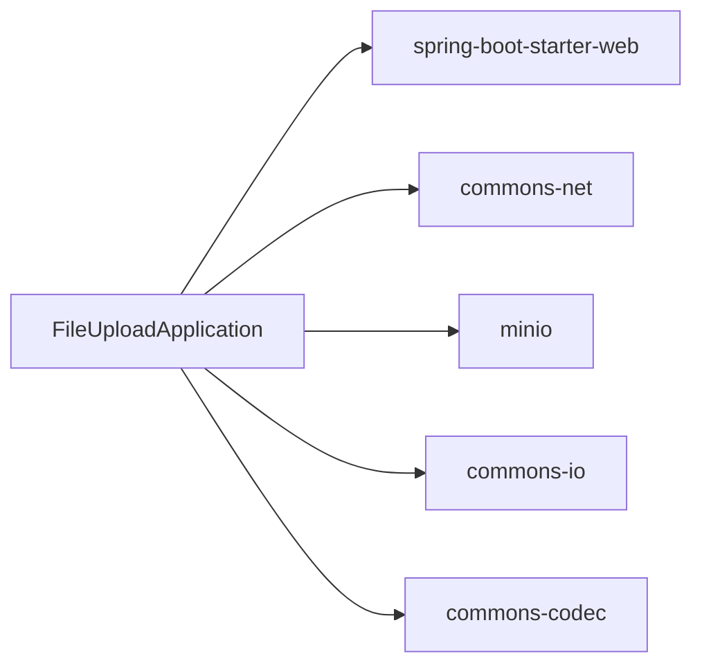

# 项目概述

<cite>
**本文引用的文件**
- [pom.xml](file://pom.xml)
- [FileUploadApplication.java](file://src/main/java/com/example/fileupload/FileUploadApplication.java)
- [application.yml](file://src/main/resources/application.yml)
- [FileController.java](file://src/main/java/com/example/fileupload/controller/FileController.java)
- [UploadStrategy.java](file://src/main/java/com/example/fileupload/strategy/UploadStrategy.java)
- [UploadStrategyFactory.java](file://src/main/java/com/example/fileupload/strategy/UploadStrategyFactory.java)
- [LocalUploadStrategy.java](file://src/main/java/com/example/fileupload/strategy/LocalUploadStrategy.java)
- [FtpUploadStrategy.java](file://src/main/java/com/example/fileupload/strategy/FtpUploadStrategy.java)
- [OssUploadStrategy.java](file://src/main/java/com/example/fileupload/strategy/OssUploadStrategy.java)
- [RequestUploadProcessor.java](file://src/main/java/com/example/fileupload/service/RequestUploadProcessor.java)
- [FileStorageService.java](file://src/main/java/com/example/fileupload/service/FileStorageService.java)
- [FileInfo.java](file://src/main/java/com/example/fileupload/model/FileInfo.java)
- [Result.java](file://src/main/java/com/example/fileupload/model/Result.java)
- [FileTypeValidator.java](file://src/main/java/com/example/fileupload/util/FileTypeValidator.java)
</cite>

## 目录
1. [简介](#简介)
2. [项目结构](#项目结构)
3. [核心组件](#核心组件)
4. [架构总览](#架构总览)
5. [详细组件分析](#详细组件分析)
6. [依赖关系分析](#依赖关系分析)
7. [性能与扩展性](#性能与扩展性)
8. [故障排查指南](#故障排查指南)
9. [结论](#结论)
10. [附录：快速开始](#附录：快速开始)

## 简介
本项目是一个基于 Spring Boot 的文件上传/下载/查询服务，采用策略模式实现多存储后端（本地磁盘、FTP 服务器、MinIO 对象存储）。通过统一的 REST API 暴露能力，屏蔽底层存储差异，便于横向扩展新的存储方式。项目使用 Maven 管理依赖，提供完整的控制器、服务层、策略实现与工具类，并内置内存式元数据存储用于演示与测试。

- 目标：以最小成本提供可插拔的多后端文件管理能力，兼顾易用性与可扩展性。
- 技术栈：Spring Boot 2.7.x、Maven、Apache Commons Net（FTP）、MinIO Java SDK、Commons IO/Codec。
- 设计原则：策略模式解耦存储实现；门面处理器统一流程；枚举+工厂路由；配置驱动；RESTful 接口规范。

**章节来源**
- [pom.xml:1-82](file://pom.xml#L1-L82)
- [FileUploadApplication.java:1-13](file://src/main/java/com/example/fileupload/FileUploadApplication.java#L1-L13)
- [application.yml:1-33](file://src/main/resources/application.yml#L1-L33)

## 项目结构
项目采用分层与按功能域组织相结合的目录结构：
- controller：REST 接口入口，负责参数校验、路由到处理器与组装响应。
- strategy：策略接口与具体实现（本地、FTP、OSS），通过工厂自动注册与路由。
- service：业务编排与元数据持久化（当前为内存 Mock）。
- model：领域模型与统一返回体。
- util：通用工具（如文件类型校验）。
- resources：应用配置（端口、分片大小、各存储后端连接信息）。

**图表来源**
- [FileController.java:1-319](file://src/main/java/com/example/fileupload/controller/FileController.java#L1-L319)
- [RequestUploadProcessor.java:1-154](file://src/main/java/com/example/fileupload/service/RequestUploadProcessor.java#L1-L154)
- [UploadStrategyFactory.java:1-57](file://src/main/java/com/example/fileupload/strategy/UploadStrategyFactory.java#L1-L57)
- [LocalUploadStrategy.java:1-190](file://src/main/java/com/example/fileupload/strategy/LocalUploadStrategy.java#L1-L190)
- [FtpUploadStrategy.java:1-361](file://src/main/java/com/example/fileupload/strategy/FtpUploadStrategy.java#L1-L361)
- [OssUploadStrategy.java:1-217](file://src/main/java/com/example/fileupload/strategy/OssUploadStrategy.java#L1-L217)
- [FileStorageService.java:1-184](file://src/main/java/com/example/fileupload/service/FileStorageService.java#L1-L184)
- [FileTypeValidator.java:1-109](file://src/main/java/com/example/fileupload/util/FileTypeValidator.java#L1-L109)

**章节来源**
- [FileController.java:1-319](file://src/main/java/com/example/fileupload/controller/FileController.java#L1-L319)
- [application.yml:1-33](file://src/main/resources/application.yml#L1-L33)

## 核心组件
- 控制器 FileController：定义上传、批量上传、下载、删除、查询、Mock 初始化等 REST 端点，统一封装 Result 返回体。
- 处理器 RequestUploadProcessor：封装“解析请求→类型校验→策略路由→结果组装”的完整流程，屏蔽 Controller 细节。
- 策略体系 UploadStrategy + 具体实现：
  - LocalUploadStrategy：本地磁盘读写、唯一文件名生成、相对路径计算。
  - FtpUploadStrategy：真实 FTP 客户端连接、被动模式、UTF-8 编码、批量复用连接。
  - OssUploadStrategy：MinIO 客户端生命周期管理、Bucket 自动创建、URL 前缀拼装。
- 工厂 UploadStrategyFactory：启动时扫描所有策略实现，构建映射表，按 UploadType 路由。
- 元数据 FileStorageService：内存 Map 模拟持久化，支持增删查改、模糊搜索、分页过滤。
- 模型 FileInfo/Result：文件信息与统一响应体。
- 工具 FileTypeValidator：后缀白名单 + 文件头魔数校验。

**章节来源**
- [FileController.java:1-319](file://src/main/java/com/example/fileupload/controller/FileController.java#L1-L319)
- [RequestUploadProcessor.java:1-154](file://src/main/java/com/example/fileupload/service/RequestUploadProcessor.java#L1-L154)
- [UploadStrategy.java:1-74](file://src/main/java/com/example/fileupload/strategy/UploadStrategy.java#L1-L74)
- [UploadStrategyFactory.java:1-57](file://src/main/java/com/example/fileupload/strategy/UploadStrategyFactory.java#L1-L57)
- [LocalUploadStrategy.java:1-190](file://src/main/java/com/example/fileupload/strategy/LocalUploadStrategy.java#L1-L190)
- [FtpUploadStrategy.java:1-361](file://src/main/java/com/example/fileupload/strategy/FtpUploadStrategy.java#L1-L361)
- [OssUploadStrategy.java:1-217](file://src/main/java/com/example/fileupload/strategy/OssUploadStrategy.java#L1-L217)
- [FileStorageService.java:1-184](file://src/main/java/com/example/fileupload/service/FileStorageService.java#L1-L184)
- [FileInfo.java:1-76](file://src/main/java/com/example/fileupload/model/FileInfo.java#L1-L76)
- [Result.java:1-47](file://src/main/java/com/example/fileupload/model/Result.java#L1-L47)
- [FileTypeValidator.java:1-109](file://src/main/java/com/example/fileupload/util/FileTypeValidator.java#L1-L109)

## 架构总览
系统采用“控制器 → 处理器 → 策略工厂 → 具体策略”的分层调用链，结合配置中心化的存储参数，实现高内聚、低耦合的扩展架构。

**图表来源**
- [FileController.java:50-84](file://src/main/java/com/example/fileupload/controller/FileController.java#L50-L84)
- [RequestUploadProcessor.java:46-87](file://src/main/java/com/example/fileupload/service/RequestUploadProcessor.java#L46-L87)
- [UploadStrategyFactory.java:28-55](file://src/main/java/com/example/fileupload/strategy/UploadStrategyFactory.java#L28-L55)
- [UploadStrategy.java:15-23](file://src/main/java/com/example/fileupload/strategy/UploadStrategy.java#L15-L23)
- [FileStorageService.java:29-39](file://src/main/java/com/example/fileupload/service/FileStorageService.java#L29-L39)

**章节来源**
- [FileController.java:1-319](file://src/main/java/com/example/fileupload/controller/FileController.java#L1-L319)
- [RequestUploadProcessor.java:1-154](file://src/main/java/com/example/fileupload/service/RequestUploadProcessor.java#L1-L154)
- [UploadStrategyFactory.java:1-57](file://src/main/java/com/example/fileupload/strategy/UploadStrategyFactory.java#L1-L57)

## 详细组件分析

### 策略模式与工厂
- 策略接口 UploadStrategy：定义 upload/delete/download/batchUpload/getUploadType 等统一契约，允许各存储按需优化（如 FTP 批量复用连接）。
- 工厂 UploadStrategyFactory：利用 Spring 注入所有策略实现，启动时构建并发安全的映射表，按 UploadType 获取策略，缺失时报错提示。
- 优势：新增存储只需实现接口并标注 @Component，无需修改现有流程代码。

**图表来源**
- [UploadStrategy.java:10-74](file://src/main/java/com/example/fileupload/strategy/UploadStrategy.java#L10-L74)
- [LocalUploadStrategy.java:26-118](file://src/main/java/com/example/fileupload/strategy/LocalUploadStrategy.java#L26-L118)
- [FtpUploadStrategy.java:36-193](file://src/main/java/com/example/fileupload/strategy/FtpUploadStrategy.java#L36-L193)
- [OssUploadStrategy.java:29-159](file://src/main/java/com/example/fileupload/strategy/OssUploadStrategy.java#L29-L159)
- [UploadStrategyFactory.java:13-55](file://src/main/java/com/example/fileupload/strategy/UploadStrategyFactory.java#L13-L55)

**章节来源**
- [UploadStrategy.java:1-74](file://src/main/java/com/example/fileupload/strategy/UploadStrategy.java#L1-L74)
- [UploadStrategyFactory.java:1-57](file://src/main/java/com/example/fileupload/strategy/UploadStrategyFactory.java#L1-L57)

### 本地磁盘策略（LocalUploadStrategy）
- 特性：
  - 支持根目录相对路径解析（Windows/Linux 兼容）。
  - 唯一文件名生成（UUID + 原始名，冲突时追加序号）。
  - 自动创建目录、写入字节数组、读取 MD5。
  - 计算 relativePath 以包含 base-path 目录名，便于展示与后续访问。
- 注意事项：
  - basePath 以斜杠开头表示盘符根目录下的子目录。
  - 大文件场景建议流式写入以降低内存占用。

**章节来源**
- [LocalUploadStrategy.java:1-190](file://src/main/java/com/example/fileupload/strategy/LocalUploadStrategy.java#L1-L190)

### FTP 策略（FtpUploadStrategy）
- 特性：
  - 使用 Apache Commons Net 的 FTPClient，设置 UTF-8 控制编码、被动模式、二进制传输。
  - 单文件上传/删除/下载均建立独立连接并在 finally 中安全断开。
  - 批量上传通过 FtpBatchUploader 复用同一连接，减少握手开销。
  - 错误码分类输出友好提示（权限、路径无效、空间不足等）。
- 注意事项：
  - 确保 FTP 服务器可达且具备相应目录写入权限。
  - 网络不稳定时需关注超时与重试策略。

**章节来源**
- [FtpUploadStrategy.java:1-361](file://src/main/java/com/example/fileupload/strategy/FtpUploadStrategy.java#L1-L361)

### MinIO 对象存储策略（OssUploadStrategy）
- 特性：
  - 使用 MinIO Java SDK，启动时检查并自动创建 Bucket。
  - 对象 Key 规范化 base-path，避免重复斜杠或缺失。
  - URL 由 urlPrefix + objectKey 组成，便于反向代理或 CDN 接入。
  - 支持上传/删除/下载，异常日志记录完善。
- 注意事项：
  - 未配置 access-key/secret-key 时将跳过客户端初始化，需显式配置。
  - 生产环境建议将 urlPrefix 指向对外域名或网关地址。

**章节来源**
- [OssUploadStrategy.java:1-217](file://src/main/java/com/example/fileupload/strategy/OssUploadStrategy.java#L1-L217)

### 上传统一处理器（RequestUploadProcessor）
- 职责：
  - 从 MultipartHttpServletRequest 提取文件字段，空字段跳过。
  - 读取文件头进行魔数校验，防止伪装文件。
  - 通过工厂获取策略执行上传，并将结果封装为 FileInfo。
  - 提供 delete/download 便捷方法，保持 Controller 简洁。
- 关键点：
  - 一次性读取字节避免 Windows/Tomcat 临时文件锁定问题。
  - 对无有效文件的情况抛出明确异常，便于上层捕获。

**章节来源**
- [RequestUploadProcessor.java:1-154](file://src/main/java/com/example/fileupload/service/RequestUploadProcessor.java#L1-L154)

### 元数据存储（FileStorageService）
- 当前实现：内存 ConcurrentHashMap，适合演示与测试。
- 能力：保存、查找、删除、全量查询、模糊搜索、按存储类型/后缀过滤、Mock 数据初始化。
- 演进建议：替换为 MySQL/MongoDB 等持久化层，增加索引与分页查询优化。

**章节来源**
- [FileStorageService.java:1-184](file://src/main/java/com/example/fileupload/service/FileStorageService.java#L1-L184)

### 模型与统一返回（FileInfo、Result）
- FileInfo：封装原始文件信息、存储后信息、元数据（上传者、时间、MD5 等）。
- Result：统一响应体，包含 code/message/data，便于前端一致化处理。

**章节来源**
- [FileInfo.java:1-76](file://src/main/java/com/example/fileupload/model/FileInfo.java#L1-L76)
- [Result.java:1-47](file://src/main/java/com/example/fileupload/model/Result.java#L1-L47)

### 文件类型校验（FileTypeValidator）
- 机制：后缀白名单 + 文件头魔数匹配，拒绝伪装文件。
- 扩展：可按需添加更多类型与魔数规则。

**章节来源**
- [FileTypeValidator.java:1-109](file://src/main/java/com/example/fileupload/util/FileTypeValidator.java#L1-L109)

## 依赖关系分析
- 运行时依赖：
  - spring-boot-starter-web：Web 容器与 MVC。
  - commons-net：FTP 客户端。
  - minio：对象存储客户端。
  - commons-io/commons-codec：文件与摘要工具。
- 构建与运行：
  - Spring Boot Maven Plugin 打包可执行 Jar。
  - application.yml 集中配置端口、分片限制与各存储后端参数。

**图表来源**
- [pom.xml:24-71](file://pom.xml#L24-L71)
- [FileUploadApplication.java:1-13](file://src/main/java/com/example/fileupload/FileUploadApplication.java#L1-L13)

**章节来源**
- [pom.xml:1-82](file://pom.xml#L1-L82)

## 性能与扩展性
- 批量上传优化：FTP 策略在 batchUpload 中复用单一连接，降低 TCP/TLS 握手成本。
- 内存与 I/O：
  - 本地与 OSS 策略在上传时优先使用字节数组/流，避免多次临时文件操作。
  - 大文件场景建议引入流式处理与分块上传（OSS 已支持流式 putObject）。
- 可扩展性：
  - 新增存储仅需实现 UploadStrategy 并标注 @Component，工厂自动发现。
  - 通过 UploadType 枚举与工厂路由，零侵入扩展。
- 配置化：
  - 所有后端连接参数集中在 application.yml，便于多环境切换。

[本节为通用指导，不直接分析具体文件]

## 故障排查指南
- 上传失败（本地）：
  - 检查 file.upload.base-path 是否可写，目录是否存在。
  - 确认磁盘空间与权限。
- 上传失败（FTP）：
  - 检查 host/port/username/password/basePath 配置。
  - 关注被动模式与防火墙/NAT 设置。
  - 根据错误码定位权限、路径、空间等问题。
- 上传失败（MinIO）：
  - 确认 endpoint/access-key/secret-key/bucket-name/url-prefix 配置正确。
  - 启动日志会提示 bucket 是否创建成功。
- 下载失败：
  - 确认 fileKey 与 uploadType 匹配，策略能正确解析路径。
- 类型校验失败：
  - 检查后缀是否在白名单，魔数是否与后缀匹配。

**章节来源**
- [FtpUploadStrategy.java:206-236](file://src/main/java/com/example/fileupload/strategy/FtpUploadStrategy.java#L206-L236)
- [FtpUploadStrategy.java:335-352](file://src/main/java/com/example/fileupload/strategy/FtpUploadStrategy.java#L335-L352)
- [OssUploadStrategy.java:54-70](file://src/main/java/com/example/fileupload/strategy/OssUploadStrategy.java#L54-L70)
- [FileTypeValidator.java:47-85](file://src/main/java/com/example/fileupload/util/FileTypeValidator.java#L47-L85)

## 结论
本项目以策略模式为核心，结合 Spring Boot 与 Maven，提供了开箱即用的多后端文件服务能力。通过清晰的层次划分与配置驱动，既满足初学者快速上手，也为有经验的开发者预留了充足的扩展点。建议在真实项目中将元数据存储替换为数据库，并对大文件场景进一步优化流式处理与缓存策略。

[本节为总结性内容，不直接分析具体文件]

## 附录：快速开始
- 环境要求
  - JDK 8+
  - Maven 3.x
  - 可选：FTP 服务器、MinIO 服务（用于端到端验证）
- 依赖安装
  - 项目已声明全部依赖，使用 Maven 构建即可自动下载。
- 基本启动步骤
  - 克隆仓库后，在项目根目录执行构建命令。
  - 启动主类 FileUploadApplication。
  - 默认监听 8080 端口，可通过 application.yml 调整。
- 关键配置项（application.yml）
  - server.port：服务端口。
  - spring.servlet.multipart.*：分片大小限制。
  - file.upload.base-path：本地存储根路径。
  - file.ftp.*：FTP 主机、端口、用户名、密码、基础路径。
  - file.oss.*：MinIO 端点、密钥、桶名、基础路径、URL 前缀。
- 常用接口
  - 上传：POST /api/files/upload?uploadType={local|ftp|oss}，字段 file。
  - 批量上传：POST /api/files/upload/batch?uploadType={ftp|oss}，字段 files。
  - 下载：GET /api/files/download?fileKey=xxx&uploadType=...
  - 删除：DELETE /api/files/{id}?uploadType=...
  - 查询：GET /api/files?page=&size=&keyword=&storageType=&suffix=
  - Mock 初始化：POST /api/files/mock/init
- 面向初学者的概念说明
  - 策略模式：将不同存储的实现抽象成统一接口，运行时选择具体实现，便于扩展与维护。
  - Spring Boot 注解：@RestController 暴露 REST 接口；@Value 注入配置；@Component/@PostConstruct/@PreDestroy 管理组件生命周期。
  - RESTful API 设计：资源命名清晰、HTTP 动词语义明确、统一返回体 Result 便于前端处理。

**章节来源**
- [application.yml:1-33](file://src/main/resources/application.yml#L1-L33)
- [FileUploadApplication.java:1-13](file://src/main/java/com/example/fileupload/FileUploadApplication.java#L1-L13)
- [FileController.java:50-317](file://src/main/java/com/example/fileupload/controller/FileController.java#L50-L317)